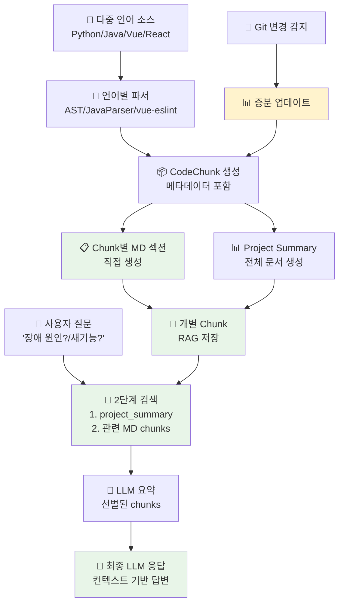
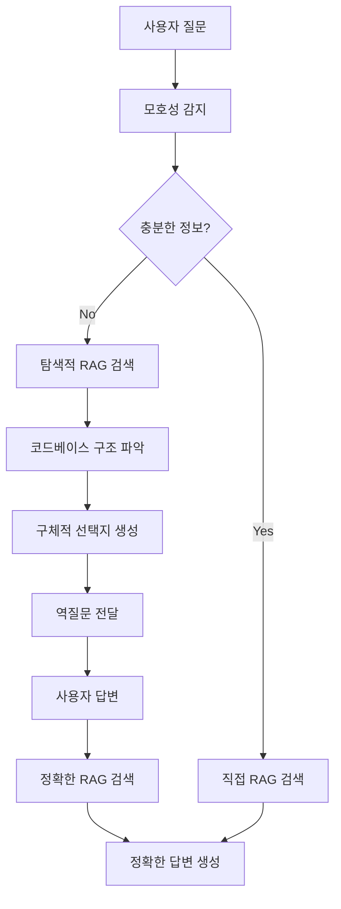
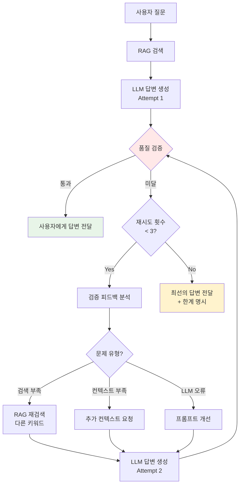
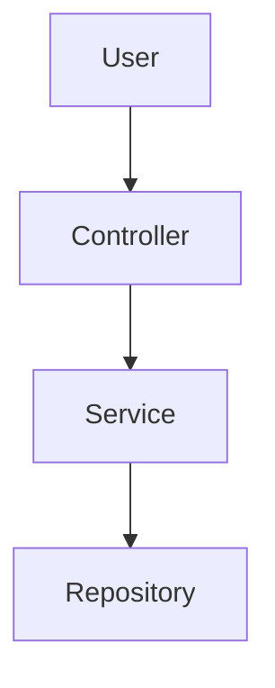

# CodeMuse 설계서

## 프로젝트 개요

### 프로젝트명
**CodeMuse** - 종합 소프트웨어 개발·운영 AI 어시스턴트 플랫폼

### 프로젝트 목적

CodeMuse는 소프트웨어 개발과 운영의 전 생명주기를 지원하는 AI 기반 종합 어시스턴트입니다.

#### 1. 레거시 시스템 이해 및 분석
- 기존 소스코드 구조 파악 및 아키텍처 분석
- 비즈니스 로직 및 데이터 흐름 추적
- 기술 부채 식별 및 리팩토링 포인트 제안
- 의존성 관계 및 영향도 분석

#### 2. 신규 기능 개발 지원
- 레거시 코드 기반 신규 기능 설계 가이드
- 기존 패턴 및 규약 준수 검증
- 확장 지점 및 통합 방법 제시
- 코드 리뷰 및 품질 개선 제안

#### 3. 바이브코딩 실시간 지원
- 컨텍스트 기반 코드 자동완성
- 실시간 코드 생성 및 스니펫 제공
- 개발 중 즉각적인 문서 참조
- 유사 코드 패턴 검색 및 제안

#### 4. 장애 대응 및 디버깅
- 에러 메시지 기반 원인 분석
- 관련 소스코드 추적 및 수정 가이드
- 장애 이력 기반 예방 조치 제안
- 빠른 hotfix 생성 지원

#### 5. 개발 산출물 자동화
- 소스코드 기반 기술 문서 자동 생성
- API 문서, 아키텍처 다이어그램 생성
- 개발 표준 및 가이드 문서화
- 변경 이력 및 릴리즈 노트 자동화

#### 6. 시스템 운영 지원
- 배포 스크립트 생성 및 검증
- 설정 파일 관리 및 환경별 최적화
- 모니터링 쿼리 및 대시보드 구성 지원
- 운영 매뉴얼 및 트러블슈팅 가이드 제공

#### 7. 지속적인 코드베이스 관리
- 변경 사항 추적 및 문서 동기화
- 코드 리뷰 자동화 및 품질 게이트
- 기술 스택 업데이트 가이드
- 팀 지식 베이스 구축 및 관리

#### 8. 다중 언어 및 프레임워크 지원
- **백엔드**: Python, Java, Node.js, Go, C# 등
- **프론트엔드**: Vue, React, Angular, Svelte 등
- **모바일**: Swift, Kotlin, Flutter, React Native 등
- **데이터베이스**: SQL, NoSQL 등 다양한 스키마 분석

### 핵심 가치
- **정확성**: 실제 코드베이스 기반 정밀한 분석과 제안
- **실용성**: 즉시 적용 가능한 실질적인 해결책 제공
- **효율성**: 개발·운영 전 과정의 생산성 극대화
- **지속성**: 변화하는 코드베이스 지속적 추적 및 관리
- **범용성**: 언어/프레임워크에 구애받지 않는 유연한 지원

### 핵심 컨셉
- **Muse**: 그리스 신화의 예술과 지혜의 여신
- **CodeMuse**: 개발자와 운영자에게 창의적 영감과 실질적 지혜를 주는 AI 어시스턴트
- **슬로건**: "Where Code Meets Inspiration - From Legacy to Innovation"

## 시스템 아키텍처

### 전체 시스템 플로우 (다중 언어 지원 Chunk 기반 RAG 아키텍처)

**🎯 핵심 설계 철학**: 다중 언어 소스코드 → CodeChunk → MD 섹션 직접 생성 → RAG 최적화



**효율적인 플로우 상세 설명**:
1. **다중 언어 소스코드 분석**: Python, Java, Vue, React 등 파일별 적절한 파서 선택하여 semantic chunk 생성
2. **개별 MD 섹션 생성**: 각 CodeChunk를 언어별 템플릿으로 MD 섹션 변환 (중간 파일 생성 없음)
3. **Project Summary 생성**: 전체 프로젝트 요약은 별도 문서로 생성 (다중 언어 통합)
4. **직접 RAG 저장**: 생성된 MD 섹션을 개별 chunk로 RAG에 즉시 저장
5. **2단계 검색**: project_summary → 관련 MD chunks 순서로 검색
6. **LLM 파이프라인**: 선별된 chunks → 최종 응답 생성 (다양한 사용 사례 지원)
7. **Git 연동 (예정)**: 변경 감지 시 증분 업데이트로 문서 동기화

### 핵심 모듈 구성

주의: 이 저장소의 백엔드 모듈은 4개입니다. Web Interface는 별도 프론트엔드(옵션)로 분리하며 이 레포에 포함하지 않습니다.

- Document Generator: `src/chunker_document_generator` (포트 8001)
- RAG Engine: `src/rag_engine` (포트 8003)
- LLM Chat Service: `src/llm_chat_service` (포트 8004)
- Workflow Orchestrator: `src/workflow` (포트 8006)

#### 1. Document Generator Service (8가지 목적을 위한 전략적 MD 생성) ✅ **Python 완료** 🚧 **Vue 진행 중**
- **역할**: 소스코드 → CodeChunk → **사용 사례별 최적화 MD 생성** → **MD 섹션별 RAG 자동 업로드**
- **기술 스택**: Python + FastAPI + 언어별 파서 + Jinja2 템플릿 + asyncio
- **입력**: 다중 언어 소스코드 파일들 (`sample_code/`)
- **출력**: **사용 사례별 최적화 MD 파일들** + project_summary.md + **MD 섹션별 RAG 자동 저장**
- **핵심: 8가지 목적을 위한 전략적 MD 템플릿 설계**:
  - **사용 사례별 섹션 구성**:
    - 레거시 분석용: 시스템 개요, 아키텍처 다이어그램, 비즈니스 로직 플로우
    - 신규 개발용: 확장 지점 명시, 디자인 패턴, 규약 체크리스트
    - 디버깅용: 에러 처리 로직, null 체크, 예외 케이스, 의존성 트리
    - 운영용: 설정 파일 위치, 환경 변수, 배포 스크립트 템플릿
    - 리뷰용: 복잡도 메트릭, 코드 품질 지표, 베스트 프랙티스 체크
  - **언어별 특화 메타데이터**:
    - Python: decorator 활용, async 패턴, generator 사용처
    - Java: annotation 기반 설정, Spring bean 라이프사이클, DI 구조
    - Vue: props/emits 계약, 라이프사이클 훅, Vuex/Pinia 연동
    - React: hooks 패턴, props drilling, state 관리 전략
  - **RAG 검색 최적화 구조**:
    - 키워드 풍부화: 동의어, 다국어 용어 섹션 상단 배치
    - 계층적 정보: Overview → Detail → Example 순서
    - 참조 링크: 관련 파일, 의존 모듈 명시적 연결
- **다중 언어 파서**:
  - **Python**: AST 기반 semantic chunk (462개 chunk 생성) ✅
  - **Vue.js**: SFC 컴포넌트 분석 (template/script/style) 🚧
  - **Java**: 클래스/메서드 분석 (Spring 특화) 📋
  - **React**: JSX/TSX 컴포넌트 분석 📋
- **전략적 템플릿 시스템** (Jinja2 기반):
  - **언어별 템플릿**: `templates/python/`, `templates/java/`, `templates/vue/`
  - **사용 사례별 변형**: `_analysis.j2`, `_development.j2`, `_debugging.j2`
  - **공통 컴포넌트**: 배지, 차트, Mermaid, 메타데이터 테이블
  - **확장 가능**: 새 언어/사용 사례 템플릿 추가 용이
- **MD → RAG 최적화 파이프라인**: 
  1. 소스 파싱 → 2. 사용 사례별 MD 생성 → 3. 섹션 분할 → 4. 메타데이터 풍부화 → 5. RAG 벡터화 저장
- **품질 보증**:
  - **폴백 시스템**: 템플릿 실패 시 기존 방식 자동 전환
  - **검증 단계**: MD 구조 검증, 메타데이터 완전성 체크
  - **언어 자동 감지**: 파일 확장자 + 내용 분석 기반 정확한 파서 선택

#### 2. RAG Engine Service (8가지 목적 지원 핵심 엔진) ✅ **기본 완료** 🚧 **고도화 진행 중**
- **역할**: **MD 문서 섹션** 벡터화 및 **사용 사례별 지능형 검색 엔진**
- **기술 스택**: Python + ChromaDB + BM25 + OpenAI Embeddings + FastAPI
- **입력**: **MD 문서 섹션들** (자동 업로드된 `###` 단위 섹션들) + 질문 의도
- **출력**: 하이브리드 검색 결과 (벡터 + BM25) + 사용 사례별 최적화된 컨텍스트
- **핵심: 8가지 목적을 위한 지능형 RAG**:
  - **질문 의도 분류**: 분석/개발/디버깅/운영/리뷰 자동 감지
  - **사용 사례별 검색 전략**:
    - 레거시 분석: project_summary → overview → architecture 섹션 우선
    - 신규 개발: 확장 지점, 패턴, 규약 관련 섹션 우선
    - 장애 디버깅: 에러 처리, 예외, null 체크 관련 코드 우선
    - 운영 지원: 설정, 배포, 환경 변수 관련 섹션 우선
    - 코드 리뷰: 복잡도, 품질 메트릭, 베스트 프랙티스 섹션 우선
  - **다중 언어 고려**: 언어별 특성 반영 (Python 데코레이터, Java 어노테이션, Vue 라이프사이클 등)
  - **컨텍스트 조합 전략**: 개요 → 상세 → 예제 순서로 계층적 구성
- **주요 기능**:
  - **MD 섹션 벡터화**: 각 `###` 섹션을 개별 chunk로 임베딩
  - **메타데이터 기반 필터링**: `use_case`, `language`, `chunk_type`, `complexity` 등
  - **2단계 검색 전략**: Overview MD 섹션 → 상세 MD 섹션 순서
  - **RRF 하이브리드 검색**: 벡터 유사도 + BM25 텍스트 매칭 + 가중치 조합
  - **동적 우선순위**: 질문 의도에 따른 폴더/섹션 가중치 동적 조정
  - **키워드 확장**: 동의어, 다국어, 도메인 용어 자동 확장

#### (프론트엔드) Web Interface Service — 별도 레포/옵션
- **역할**: 사용자 인터페이스 및 LLM 대화 + **인터랙티브 채팅**
- **기술 스택**: React/Vue + FastAPI + WebSocket + Monaco Editor
- **입력**: 사용자 질문, RAG 검색 결과
- **출력**: 인터랙티브 채팅 인터페이스, 생성된 코드, 액션 버튼
- **핵심 기능: 인터랙티브 채팅** 🆕:
  - **문서 링크 자동 생성**: 답변 내 파일/클래스 언급 → 클릭 가능한 링크
  - **인라인 코드 액션**: 복사, 적용, 실행, 차이 보기
  - **파일 네비게이션**: 파일 경로 클릭 → IDE에서 열기
  - **다이어그램 인터랙티브**: Mermaid 차트 확대/축소/편집
  - **제안 액션 버튼**: "이 코드 적용하기", "테스트 실행", "문서 보기"
  - **멀티펑션 실행**: 여러 작업 동시 처리 (검색+파일열기+코드생성)
- **주요 기능**:
  - 실시간 채팅 스트리밍 (WebSocket)
  - RAG 검색 결과 시각화
  - 코드 에디터 통합 (Monaco Editor)
  - 파일 트리 네비게이션
  - 액션 버튼 및 단축키

#### 3. LLM Chat Service ✅ **기본 완료** 🚧 **역질문 + Loop + Function Calling 개발 예정**
- **역할**: 다중 LLM 연동 및 세션 기반 대화 관리 + **질문 명확화** + **품질 검증** + **Function Calling**
- **기술 스택**: Python + Multi-LLM API (OpenAI, Anthropic, Local LLM) + FastAPI + asyncio + Function Calling
- **입력**: 사용자 질문, MD 문서 컨텍스트, 세션 정보, 사용 사례 타입
- **출력**: 자연스러운 LLM 응답 또는 **역질문**, **Function Call 결과**, 토큰 사용량, 품질 점수
- **핵심 시스템 역할**:
  - **종합 개발·운영 AI 어시스턴트**: 분석, 개발, 디버깅, 운영을 통합 지원
  - **질문 명확화 전문가**: 모호한 질문 감지 → 역질문 → 정확한 답변
  - **품질 검증 시스템**: 답변 생성 → 검증 → 필요시 재생성 (Loop Design)
  - **비용 최적화**: 목적별 최적 LLM 자동 선택
  - **다중 사용 사례 대응**:
    - 레거시 시스템 분석 및 설명
    - 신규 기능 개발 가이드
    - 장애 원인 분석 및 해결 방안
    - 배포 및 운영 스크립트 생성
    - 코드 리뷰 및 품질 개선 제안
  - **다중 언어 컨텍스트 이해**: Python, Java, Vue, React 등 언어별 특성 고려
  - **MD 컨텍스트 최적화**: 소스 코드 대신 구조화된 MD 문서 활용
- **핵심 기능 1: 역질문 시스템** 🆕:
  - **모호성 감지**: 질문의 불충분한 정보 자동 파악
  - **컨텍스트 기반 역질문**: 코드베이스 실제 구조를 기반으로 선택지 제공
  - **대화 흐름 관리**: 역질문 → 답변 → 정확한 응답 전체 흐름
  - **학습 효과**: 사용자가 정확한 질문법 학습
- **핵심 기능 2: Loop Design (품질 검증)** 🆕:
  - **답변 품질 자동 평가**: 생성된 답변의 정확성, 완전성, 관련성 검증
  - **반복 개선 Loop**: 품질 미달 시 재검색 또는 재생성
  - **사용자 피드백 통합**: 실시간 피드백 반영
  - **최대 재시도 제한**: 무한 루프 방지 (기본 3회)
- **핵심 기능 3: 목적별 LLM 선택** 🆕:
  - **모호성 감지**: GPT-3.5-turbo (빠르고 저렴)
  - **역질문 생성**: GPT-4-turbo (정확한 선택지)
  - **MD 문서 생성**: Local LLM (비용 절감, 대량 생성)
  - **코드 생성**: GPT-4 or Claude-3 (코드 품질 우선)
  - **최종 답변**: GPT-4 or Claude-3 (정확도 최우선)
  - **답변 검증**: GPT-3.5-turbo (효율성)
- **핵심 기능 4: Function Calling (멀티펑션)** 🆕:
  - **RAG 검색**: `search_documents(query, filters)`
  - **파일 열기**: `open_file(file_path, line_number)`
  - **코드 적용**: `apply_code(file_path, code, method)`
  - **문서 생성**: `generate_document(target_path)`
  - **테스트 실행**: `run_tests(test_path)`
  - **Git 작업**: `git_commit(message)`, `git_push()`
  - **동시 실행**: 여러 펑션을 한 번에 호출 가능
- **주요 기능**:
  - **세션 기반 대화**: 채팅 세션 생성/관리, 메시지 히스토리, 컨텍스트 유지
  - **Multi-LLM API 연동**: OpenAI, Anthropic, Local LLM 통합
  - **에러 처리**: API 할당량 초과, 응답 실패 등 안정적 처리 + 폴백
  - **컨텍스트 관리**: MD 문서 기반 향상된 컨텍스트 이해
  - **사용 사례별 프롬프트**: 분석/개발/디버깅/운영 등 목적별 최적화
  - **비용 추적**: LLM별 토큰 사용량 및 비용 모니터링

#### 4. Workflow Orchestrator (2단계 LLM 파이프라인) ✅ **완료**
- **역할**: **MD 기반** Chunk 워크플로우 조율 및 LLM 2단계 파이프라인 관리
- **기술 스택**: Python + FastAPI + AsyncIO + aiohttp
- **입력**: 사용자 질문, 워크플로우 설정 (max_chunks, include_overview)
- **출력**: search_strategy + llm_summary + 최종 응답 + 상세 메타데이터
- **핵심 아키텍처 완성**:
  - **일반적 질문 감지**: "무슨 시스템?" → `project_summary.md` 최우선 검색
  - **MD 기반 검색**: Python 소스 대신 구조화된 MD 섹션 활용
  - **폴백 키워드 추출**: LLM 실패 시 rule-based 키워드 생성
  - **세션 기반 LLM 호출**: `/api/v1/chat/sessions/{session_id}/messages` 정확한 엔드포인트
- **완성된 4단계 파이프라인**:
  1. **LLM 키워드 추출**: "무슨 시스템?" → ["system", "project", "overview", "analyzer"] 생성
  2. **2단계 RAG 검색**: Overview MD 섹션 → Function MD 섹션 (최대 5개 chunk)
  3. **LLM 요약**: 다수 MD chunk → 핵심 정보 추출 (컨텍스트 길이 관리)
  4. **최종 LLM 응답**: "Rule Analyzer 시스템입니다" 자연스러운 답변
- **안정성 완성**: 컨텍스트 길이 관리, OpenAI 할당량 오류 처리, 서비스 재시도 로직

##### Workflow Orchestrator 상세 설명

**구체적인 역할**:
- **음식점 매니저 역할**: 주방장(LLM), 서빙(Web Interface), 재고관리(RAG Engine) 등이 각자 일을 하는데, 매니저가 전체적인 흐름을 조율
- **사용자 요청 처리 흐름 관리**: 사용자의 단일 요청을 받아서 여러 서비스를 순서대로 호출하고 결과를 조합
- **서비스 간 통신 조율**: 각 서비스가 독립적으로 동작하지만, 전체적인 흐름은 조율이 필요
- **워크플로우 상태 관리**: 사용자의 대화 세션과 현재 진행 단계를 추적

**실제 사용 예시 (다중 사용 사례 + 역질문)**:

*시나리오 1: 레거시 시스템 분석 - "이 시스템의 인증 로직은 어떻게 동작해?"*
```
1. 사용자 입력: "이 시스템의 인증 로직은 어떻게 동작해?"
2. Workflow Orchestrator 판단: 시스템 전반 이해 필요, project_summary 우선 검색
3. 실행 순서:
   Orchestrator → RAG Engine: "인증, 로그인 관련 문서 검색 (project_summary 우선)"
   RAG Engine → Orchestrator: "AuthService.md, UserController.md 등 5개 문서"
   Orchestrator → LLM Service: "인증 플로우 설명해줘"
   LLM Service → Orchestrator: "JWT 기반 인증, 세션 관리, 권한 체크 순서로..."
```

*시나리오 2: 신규 기능 개발 - "소셜 로그인 기능 추가하려면?"*
```
1. 사용자 입력: "구글 소셜 로그인 기능 추가하려면 어디를 수정해야 해?"
2. Workflow Orchestrator 판단: 기존 인증 구조 파악 + 확장 지점 제시 필요
3. 실행 순서:
   Orchestrator → RAG Engine: "인증, OAuth, 확장 관련 문서 검색"
   RAG Engine → Orchestrator: "AuthProvider, LoginStrategy 패턴 문서"
   Orchestrator → LLM Service: "소셜 로그인 추가 가이드"
   LLM Service → Orchestrator: "AuthProvider 인터페이스 구현, GoogleOAuthProvider 생성..."
```

*시나리오 3: 장애 디버깅 - "NullPointerException이 발생했어"*
```
1. 사용자 입력: "UserService에서 NullPointerException 발생, 원인 찾아줘"
2. Workflow Orchestrator 판단: 에러 관련 코드 + 의존성 추적 필요
3. 실행 순서:
   Orchestrator → RAG Engine: "UserService, null check, 예외 처리 문서 검색"
   RAG Engine → Orchestrator: "UserService.md, null 체크 누락 지점"
   Orchestrator → LLM Service: "원인 분석 및 수정 방안"
   LLM Service → Orchestrator: "getUserById() 호출 전 null 체크 누락, Optional 사용 권장..."
```

*시나리오 4: 운영 지원 - "프로덕션 배포 스크립트 생성해줘"*
```
1. 사용자 입력: "이 서비스를 AWS ECS에 배포하는 스크립트 만들어줘"
2. Workflow Orchestrator 판단: 프로젝트 구조 + 배포 설정 파악 필요
3. 실행 순서:
   Orchestrator → RAG Engine: "Dockerfile, 환경 설정, 의존성 문서 검색"
   RAG Engine → Orchestrator: "docker-compose.yml, requirements.txt"
   Orchestrator → LLM Service: "ECS 배포 스크립트 생성"
   LLM Service → Orchestrator: "task-definition.json, deploy.sh 생성..."
```

*시나리오 5: 코드 리뷰 - "이 PR의 문제점 찾아줘"*
```
1. 사용자 입력: "OrderService 변경 사항 리뷰해줘"
2. Workflow Orchestrator 판단: 변경 코드 + 기존 패턴 비교 필요
3. 실행 순서:
   Orchestrator → RAG Engine: "OrderService, 코딩 규약, 패턴 문서 검색"
   RAG Engine → Orchestrator: "기존 OrderService.md, 코딩 가이드"
   Orchestrator → LLM Service: "변경 사항 리뷰 및 개선 제안"
   LLM Service → Orchestrator: "트랜잭션 처리 누락, 에러 핸들링 개선 필요..."
```

*시나리오 6: 모호한 질문 → 역질문 → 정확한 답변* 🆕
```
1. 사용자 입력: "로그인 추가해줘"
2. Workflow Orchestrator 판단: 질문이 모호함
3. 실행 순서:
   Orchestrator → RAG Engine: "인증, 로그인 관련 문서 탐색적 검색"
   RAG Engine → Orchestrator: "AuthService, OAuth2Provider, JwtTokenProvider 발견"
   Orchestrator → LLM Service: "역질문 생성"
   LLM Service → Orchestrator: "현재 시스템 구조 기반 역질문 생성"
   Orchestrator → 사용자:
   "🤔 질문을 구체화해 주세요:
    현재 시스템에는 다음 인증 구조가 있습니다:
    - AuthService: 기본 ID/PW 인증
    - OAuth2Provider: 소셜 로그인 (Google, GitHub)
    - JwtTokenProvider: 토큰 기반 인증
    
    어떤 작업을 원하시나요?
    1️⃣ 기존 OAuth2에 새 제공자 추가 (예: Kakao, Naver)
    2️⃣ 완전히 새로운 인증 방식 추가 (예: SAML, LDAP)
    3️⃣ 특정 API 엔드포인트에 인증 적용
    4️⃣ 인증 로직 수정/개선
    5️⃣ 기타 (구체적으로 설명해주세요)"

4. 사용자 재답변: "1번, Kakao 추가"
5. 정확한 워크플로우 실행:
   Orchestrator → RAG Engine: "OAuth2Provider, 확장 지점 관련 문서 검색"
   RAG Engine → Orchestrator: "OAuth2Provider 인터페이스, 구현 예시"
   Orchestrator → LLM Service: "Kakao OAuth2 구현 가이드"
   LLM Service → Orchestrator: "구체적인 구현 단계 및 코드 예시"
```

**코드 예시**:
```python
class WorkflowOrchestrator:
    async def analyze_code_issue(self, user_question: str):
        # 1단계: RAG에서 관련 문서 검색
        search_results = await self.rag_engine.search(user_question)
        
        # 2단계: LLM에게 컨텍스트와 함께 질문 전달
        llm_response = await self.llm_service.chat(
            question=user_question,
            context=search_results
        )
        
        # 3단계: 결과를 웹 인터페이스에 전달
        await self.web_interface.send_response(llm_response)
        
        # 4단계: 로그 및 모니터링
        await self.logger.log_interaction(user_question, llm_response)

    async def handle_llm_failure(self, error):
        # LLM 서비스가 실패하면
        if "rate_limit" in str(error):
            # 잠시 기다렸다가 재시도
            await asyncio.sleep(5)
            return await self.retry_llm_request()
        elif "api_key_invalid" in str(error):
            # API 키 문제면 다른 LLM 제공업체로 전환
            return await self.switch_to_backup_llm()
        else:
            # 알 수 없는 에러면 사용자에게 알림
            return await self.notify_user_error()
```

**왜 필요한가?**:
- **복잡성 관리**: 각 서비스가 독립적으로 동작하지만, 전체적인 흐름은 조율이 필요. 사용자는 하나의 요청만 하는데, 뒤에서는 여러 서비스가 협력해야 함
- **에러 처리**: 한 서비스가 실패해도 전체 시스템이 멈추지 않도록. 적절한 재시도나 대안 제공
- **성능 최적화**: 병렬 처리 가능한 작업은 동시에 실행. 캐싱된 결과는 재사용
- **모니터링**: 전체 워크플로우의 성능 측정. 어느 단계에서 병목이 발생하는지 파악

## 기술 스택

### Backend (CodeMuse 플랫폼 자체)
- **언어**: Python 3.11+
- **프레임워크**: FastAPI
- **데이터베이스**: PostgreSQL + Redis
- **RAG 프레임워크**: LangChain + LangGraph (워크플로우 오케스트레이션)
- **벡터 DB**: 
  - ChromaDB (개발/테스트, 로컬 경량)
  - Qdrant (프로덕션, 고성능)
  - Milvus (대규모, 분산 환경)
- **그래프 DB**: Neo4j (코드 의존성 그래프, 관계 추적)
- **하이브리드 검색**: BM25 + 벡터 유사도
- **임베딩 모델**:
  - OpenAI text-embedding-3-large (영어 최고 성능)
  - multilingual-e5-large (다국어, 한국어 강화)
  - bge-m3 (한국어/영어 균형)
  - 목적별 임베딩 (코드/문서/질문 특화)
- **LLM API**: 
  - OpenAI GPT-4-turbo / GPT-3.5-turbo
  - Anthropic Claude-3-Opus / Claude-3-Sonnet
  - Local LLM: LLama3-70B, Codestral
- **작업 큐**: Celery + Redis
- **컨테이너**: Docker + Docker Compose

### 주요 Python 패키지
```python
# RAG 관련
langchain==0.1.0
langgraph==0.0.20
chromadb==0.4.22
qdrant-client==1.7.0
pymilvus==2.3.5
neo4j==5.15.0

# 임베딩 모델
sentence-transformers==2.3.1
openai==1.10.0

# LLM
anthropic==0.18.0
transformers==4.37.0  # Local LLM

# 파서
tree-sitter==0.20.4  # 다중 언어 파서
javalang==0.13.0  # Java 파서

# 검색 최적화
rank-bm25==0.2.2  # BM25 검색
cohere==4.39  # 재랭킹

# 기타
fastapi==0.109.0
pydantic==2.5.3
pydantic-settings==2.1.0
```

### 분석 대상 언어 지원 (Multi-Language Support)

#### 백엔드 언어
- **Python**: AST 기반 정밀 파싱 (현재 완료)
- **Java**: JavaParser 기반 분석 (Spring, Spring Boot 특화)
- **Node.js/TypeScript**: TypeScript Compiler API
- **Go**: go/ast 패키지 활용
- **C#**: Roslyn 기반 분석 (.NET Core/Framework)
- **PHP**: PHP-Parser (Laravel, Symfony 특화)
- **Ruby**: Ripper/Parser gem (Rails 특화)

#### 프론트엔드 언어
- **Vue 2/3**: vue-eslint-parser + SFC 분석 (현재 진행 중)
- **React**: @babel/parser + JSX/TSX 분석
- **Angular**: TypeScript + 데코레이터 분석
- **Svelte**: svelte/compiler
- **HTML/CSS**: 정적 분석 + 스타일 가이드

#### 데이터베이스
- **SQL**: DDL/DML 파싱 (MySQL, PostgreSQL, Oracle)
- **NoSQL**: 스키마 추론 (MongoDB, Redis, Elasticsearch)
- **ORM**: Sequelize, TypeORM, Hibernate, JPA 매핑 분석

#### 설정 및 인프라
- **Infrastructure as Code**: Terraform, CloudFormation
- **CI/CD**: Jenkins, GitHub Actions, GitLab CI
- **컨테이너**: Dockerfile, docker-compose.yml 분석
- **Kubernetes**: YAML 매니페스트 분석

### Frontend (CodeMuse 웹 인터페이스)
- **프레임워크**: Vue 3+ / React 18+
- **상태 관리**: Pinia (Vue) / Zustand (React)
- **UI 라이브러리**: Material-UI / Ant Design
- **빌드 도구**: Vite
- **패키지 관리**: npm / pnpm

### Frontend 핵심 라이브러리 (인터랙티브 기능)
```json
{
  "dependencies": {
    // 코드 에디터
    "@monaco-editor/react": "^4.6.0",
    "monaco-editor": "^0.45.0",
    
    // 마크다운 렌더링
    "markdown-it": "^14.0.0",
    "markdown-it-container": "^4.0.0",
    
    // 다이어그램
    "mermaid": "^10.6.1",
    "react-mermaid": "^0.1.4",
    
    // WebSocket
    "socket.io-client": "^4.6.1",
    
    // 구문 강조
    "prismjs": "^1.29.0",
    "react-syntax-highlighter": "^15.5.0",
    
    // 파일 트리
    "react-folder-tree": "^5.0.3",
    
    // 아이콘
    "@iconify/react": "^4.1.1",
    
    // 상태 관리
    "zustand": "^4.4.7",  // React
    "pinia": "^2.1.7"     // Vue
  }
}
```

### DevOps
- **CI/CD**: GitHub Actions
- **모니터링**: Prometheus + Grafana
- **로깅**: ELK Stack (Elasticsearch, Logstash, Kibana)
- **배포**: Docker Swarm / Kubernetes

### 기술 스택 요약 비교

| 기술 영역 | 개발/테스트 | 프로덕션(중규모) | 프로덕션(대규모) |
|---------|-----------|--------------|--------------|
| **벡터 DB** | ChromaDB | Qdrant | Milvus |
| **그래프 DB** | - | Neo4j Community | Neo4j Enterprise |
| **임베딩** | OpenAI | bge-m3 (무료) | bge-m3 + 파인튜닝 |
| **LLM** | GPT-3.5 | GPT-4 + Claude-3 | GPT-4 + Local LLM |
| **RAG 프레임워크** | 직접 구현 | LangChain | LangGraph |
| **검색 전략** | 벡터 only | 벡터 + BM25 | 벡터 + BM25 + 그래프 + 재랭킹 |

## 데이터 모델

### Code Chunk Model (다중 언어 지원 핵심 모델)
```python
@dataclass
class CodeChunk:
    chunk_id: str
    file_path: str
    language: str  # python, java, vue, react, typescript 등
    chunk_type: str  # overview, class, function, component, method 등
    name: str
    content: str
    line_range: str
    token_count: int
    complexity: Optional[int]
    docstring: Optional[str]  # Python docstring, JSDoc, JavaDoc 등
    tags: List[str]
    dependencies: List[str]  # import, extends, implements 등
    parent: Optional[str]  # 부모 클래스, 컴포넌트, 모듈
    
    # Python 특화
    base_classes: List[str]  # 상속 클래스
    decorators: List[str]  # @decorator
    is_async: bool
    is_generator: bool
    
    # Vue/React 특화 (선택적)
    props: Optional[List[str]]  # Vue props, React props
    emits: Optional[List[str]]  # Vue emits
    lifecycle_hooks: Optional[List[str]]  # lifecycle methods
    
    # Java 특화 (선택적)
    annotations: Optional[List[str]]  # @Annotation
    access_modifier: Optional[str]  # public, private, protected
    is_static: Optional[bool]
    is_final: Optional[bool]
    
    # 공통
    embedding: Optional[List[float]]
```

### Document Model (Chunk 컨테이너)
```python
class Document:
    id: str
    title: str
    file_path: str
    chunks: List[CodeChunk]
    total_chunks: int
    created_at: datetime
    updated_at: datetime
    metadata: dict
```

### Chat Session Model
```python
class ChatSession:
    id: str
    user_id: str
    title: str
    created_at: datetime
    updated_at: datetime
    messages: List[Message]
    context: dict
```

### Message Model
```python
class Message:
    id: str
    session_id: str
    role: str  # user, assistant, system
    content: str
    timestamp: datetime
    metadata: dict
```

## API 설계

### Document Generator API (8001)
```
POST http://localhost:8001/api/v1/documents/generate
GET /api/v1/documents/{document_id}
GET /api/v1/documents
PUT /api/v1/documents/{document_id}
DELETE /api/v1/documents/{document_id}
```

### RAG Engine API (MD Chunk 기반, 8003)
```
POST /api/v1/search                    # MD Chunk 하이브리드 검색 (overview + function 통합) (limit 사용)
POST /api/v1/documents                 # MD 문서 업로드
GET /api/v1/documents/{doc_id}         # 특정 MD 문서 조회
DELETE /api/v1/documents/{doc_id}      # MD 문서 삭제
GET /api/v1/documents/folders          # 폴더별 문서 목록
GET /api/v1/files/list                 # generated_docs 브라우징 트리
GET /api/v1/files/{file_id}            # 특정 MD 파일 내용 조회
POST /api/v1/search/docstrings         # 독스트링 전용 1차 검색
POST /api/v1/search/two-stage          # 2단계 검색: docstring → 상세 문서
GET /health                            # 서비스 상태 확인
```

### Chat Service API
```
POST /api/v1/chat/sessions                    # 새 채팅 세션 생성
GET /api/v1/chat/sessions                     # 세션 목록 조회
GET /api/v1/chat/sessions/{session_id}/messages  # 세션 메시지 조회
POST /api/v1/chat/sessions/{session_id}/messages # 메시지 전송
GET /health                                   # 서비스 상태 확인
```

### Workflow Orchestrator API (2단계 파이프라인)
```
POST /workflow                         # MD Chunk 기반 워크플로우 실행
GET /services/status                   # 연결된 서비스 상태 확인
GET /health                            # 워크플로우 서비스 상태 확인
```

**응답 포맷 (업데이트됨)**:
```json
{
  "query": "사용자 질문",
  "use_rag": true,
  "search_strategy": {
    "overview_results": 2,
    "function_chunks": 3,
    "filtered_files": ["issue_detector.py"],
    "search_keywords": ["분석", "error", "detection"],
    "total_chunks_found": 5
  },
  "rag_results": [...],
  "llm_summary": "5개 chunk 요약 내용...",
  "llm_response": "최종 답변",
  "workflow_time": 2.5,
  "services_used": ["LLM Keyword Extraction", "RAG Engine", "LLM Summary", "LLM Chat"]
}
```

### (참고) Web Interface API — 별도 프론트엔드 레포
```
GET /api/v1/health
GET /api/v1/config
POST /api/v1/auth/login
POST /api/v1/auth/logout
```

## 보안 설계

### 인증 및 인가
- **JWT 토큰**: 사용자 인증
- **OAuth 2.0**: 소셜 로그인 지원
- **RBAC**: 역할 기반 접근 제어

### 데이터 보안
- **암호화**: 민감한 데이터 AES-256 암호화
- **전송 보안**: HTTPS/TLS 1.3
- **API 보안**: Rate Limiting, CORS 설정

### LLM API 보안
- **API 키 관리**: 환경 변수로 관리
- **요청 제한**: 사용자별 요청 제한
- **로그 관리**: 민감한 정보 로그 제외

## 성능 최적화

### 벡터 검색 최적화
- **인덱싱**: HNSW 인덱스 사용
- **캐싱**: Redis 캐싱
- **배치 처리**: 대량 임베딩 생성

### LLM 응답 최적화 (MD Chunk 기반)
- **MD 기반 검색**: Python 소스 대신 구조화된 MD 문서 활용으로 품질 향상
- **일반적 질문 최적화**: "무슨 시스템?" → `project_summary.md` 우선 검색
- **2단계 파이프라인**: MD chunk 요약 → 최종 답변으로 컨텍스트 길이 제어
- **MD Chunk 선별**: Overview MD → Function MD 순서로 관련성 높은 chunk만 선택
- **컨텍스트 압축**: 다수 MD chunk 자동 요약으로 토큰 수 최적화
- **시스템 메시지 개선**: "소스코드 분석 전문 AI"로 역할 명확화
- **동적 우선순위**: 질문 내용 기반 폴더 우선순위 적용
- **캐싱**: 유사한 질문 응답 캐싱

### 웹 인터페이스 최적화
- **코드 스플리팅**: 라우트별 번들 분리
- **지연 로딩**: 컴포넌트 지연 로딩
- **CDN**: 정적 자원 CDN 배포

## 모니터링 및 로깅

### 메트릭 수집
- **시스템 메트릭**: CPU, 메모리, 디스크 사용량
- **애플리케이션 메트릭**: API 응답 시간, 에러율
- **비즈니스 메트릭**: 사용자 활동, 검색 성공률

### 로깅 전략
- **구조화된 로깅**: JSON 형태 로그
- **로그 레벨**: DEBUG, INFO, WARN, ERROR
- **중앙화된 로깅**: ELK Stack

### 알림 시스템
- **에러 알림**: Slack/Email 알림
- **성능 알림**: 임계값 초과 시 알림
- **비즈니스 알림**: 사용자 활동 이상 시 알림

## 배포 전략

### 개발 환경
- **로컬 개발**: Docker Compose
- **개발 서버**: 단일 서버 배포
- **데이터베이스**: PostgreSQL + Redis

### 스테이징 환경
- **컨테이너**: Docker Swarm
- **로드 밸런싱**: Nginx
- **모니터링**: Prometheus + Grafana

### 프로덕션 환경
- **오케스트레이션**: Kubernetes
- **로드 밸런싱**: AWS ALB / GCP Load Balancer
- **데이터베이스**: AWS RDS / GCP Cloud SQL
- **벡터 DB**: Pinecone / Weaviate Cloud

## 개발 로드맵

### Phase 1: MVP (2-3개월) ✅ **완료**
- [x] **Document Generator 기본 기능** → **Chunk 기반 업그레이드 완료**
- [x] **RAG Engine 기본 검색** → **2단계 하이브리드 검색 완료**
- [x] Web Interface 기본 채팅
- [x] **LLM Chat Service 기본 연동** → **2단계 파이프라인 완료**
- [x] **Workflow Orchestrator 기본 기능** → **Chunk 워크플로우 완료**
- [x] Docker 환경 구성 및 배포 설정

### Phase 1.5: Chunk 기반 아키텍처 고도화 ✅ **완료** (추가)
- [x] **AST 파싱 기반 Chunk 생성기 구현** (462개 chunk 생성)
- [x] **메타데이터 스키마 설계 및 구현** (복잡도, 태그, 라인범위, 토큰수)
- [x] **MD → RAG 저장 시스템** (Python 소스 대신 MD 섹션 활용)
- [x] **2단계 검색 전략** (overview MD → function MD chunks)
- [x] **LLM 2단계 파이프라인** (MD chunk 요약 → 최종 답변)
- [x] **API 응답 포맷 업데이트** (search_strategy, llm_summary)
- [x] **소스 구조와 동일한 MD 문서 생성** (32개 파일)
- [x] **Chunk-friendly 템플릿** (배지, 차트, Mermaid 다이어그램)
- [x] **일반적 질문 우선순위** ("무슨 시스템?" → project_summary.md)
- [x] **동적 폴더 우선순위 시스템** (analyzers > formatters > streaming)
- [x] **템플릿 분리** (Jinja2 기반 외부 템플릿 `src/chunker/templates/`)
- [x] **LLM 시스템 메시지 개선** (소스코드 분석 전문 AI 역할)
- [x] **MD 섹션별 RAG 업로드** (### 기준 자동 분할 + 메타데이터)
- [x] **폴백 시스템 구현** (템플릿 실패 시 기존 방식)
- [x] **완전한 RAG DB 초기화** (0개 문서로 깨끗한 시작)

### Phase 2: 핵심 기능 구현 (3-4개월) 🚧 **진행 중**
- [x] **Vue.js 파서 구현** (우선순위 1) - 진행 중
- [ ] **모듈화 아키텍처 구축** (우선순위 2) 🆕
  - [ ] 모듈 인터페이스 정의 (shared/interfaces/)
  - [ ] 파서 모듈 분리 (parsers/)
  - [ ] RAG 엔진 모듈 분리 (vector_stores/, embedders/)
  - [ ] LLM 서비스 모듈 분리 (providers/, strategies/, verifiers/)
  - [ ] 모듈별 독립 테스트 구축
- [ ] **최신 RAG 기술 통합** (우선순위 3) 🆕
  - [ ] Qdrant 통합 (프로덕션 벡터 DB)
  - [ ] 한국어 임베딩 모델 (bge-m3)
  - [ ] LangChain 기본 통합
  - [ ] 하이브리드 검색 (벡터 + BM25)
- [ ] **Function Calling 시스템** (우선순위 4) 🆕
  - [ ] OpenAI Function Calling 기본 구현
  - [ ] 핵심 Function 구현 (search, open_file, apply_code)
  - [ ] 멀티펑션 동시 실행 엔진
  - [ ] Function 실행 진행 상황 추적
- [ ] **인터랙티브 채팅 UI** (우선순위 5) 🆕
  - [ ] 문서 링크 자동 생성 및 렌더링
  - [ ] 인라인 코드 액션 (복사, 적용)
  - [ ] 제안 액션 버튼 동적 생성
  - [ ] 실시간 피드백 UI
- [ ] **역질문 시스템 기본 구현** (우선순위 6) 🆕
  - [ ] 모호성 감지 로직 (LLM 기반)
  - [ ] 기본 역질문 템플릿
  - [ ] 사용 사례별 역질문 전략
- [ ] **Loop Design 기본 구현** (우선순위 7) 🆕
  - [ ] 기본 품질 검증 로직 (규칙 기반)
  - [ ] 최대 재시도 제어
  - [ ] 환각 감지 기본 구현
- [ ] **목적별 LLM 선택 시스템** (우선순위 8) 🆕
  - [ ] Multi-LLM API 통합 (OpenAI, Anthropic)
  - [ ] 목적별 LLM 선택 로직
  - [ ] Local LLM 설정 (MD 생성용)
  - [ ] 비용 추적 시스템
- [ ] **Java/Spring 파서 구현** (우선순위 9)
- [ ] **React/TypeScript 파서 구현**
- [ ] 실시간 채팅 스트리밍 (WebSocket)
- [ ] 언어별 템플릿 시스템 확장

### Phase 3: 운영 지원 + 고급 기능 고도화 + 그래프 DB (4-6개월)
- [ ] 장애 분석 및 디버깅 워크플로우
- [ ] 배포 스크립트 생성 기능
- [ ] 설정 파일 관리 시스템
- [ ] 변경 이력 추적 및 영향도 분석
- [ ] 코드 리뷰 자동화
- [ ] 성능 최적화 제안 엔진
- [ ] **Function Calling 고도화** 🆕
  - [ ] Git 통합 액션 (commit, push, branch)
  - [ ] 테스트 실행 및 결과 표시
  - [ ] 실시간 코드 미리보기
  - [ ] 의존성 그래프 Function
- [ ] **인터랙티브 UI 고도화** 🆕
  - [ ] 다이어그램 인터랙티브 (노드 클릭 → 파일 열기)
  - [ ] 파일 트리 네비게이션
  - [ ] 코드 diff 뷰어
  - [ ] 협업 기능 (공유, 코멘트)
- [ ] **모듈화 고도화** 🆕
  - [ ] 그래프 DB 통합 (graph_stores/)
  - [ ] 임베딩 전략 고도화 (목적별 임베더)
  - [ ] 모듈별 Docker 컨테이너 분리
- [ ] **최신 RAG 기술** 🆕
  - [ ] Neo4j 그래프 DB (코드 의존성 그래프)
  - [ ] LangGraph 워크플로우 (Loop Design)
  - [ ] 재랭킹 모델 (Cohere Rerank)
  - [ ] 다중 임베딩 전략 (목적별 임베더)
- [ ] **역질문 시스템 고도화** 🆕
  - [ ] 코드베이스 기반 선택지 생성
  - [ ] 역질문 품질 측정 및 개선
  - [ ] 사용자 학습 효과 분석
- [ ] **Loop Design 고도화** 🆕
  - [ ] LLM 기반 품질 검증
  - [ ] 재시도 전략 자동 선택
  - [ ] 사용자 피드백 통합
- [ ] **목적별 LLM 최적화** 🆕
  - [ ] 폴백 전략 고도화
  - [ ] 동적 모델 선택 (실시간 비용/성능 기반)
  - [ ] Codestral 통합 (코드 생성 특화)
  - [ ] 비용 최적화 대시보드

### Phase 4: 지속적 통합 + 대규모 RAG (6-9개월)
- [ ] Git 연동 및 자동 문서 동기화
- [ ] CI/CD 파이프라인 통합
- [ ] 실시간 코드베이스 모니터링
- [ ] 변경 사항 자동 분석 및 문서 업데이트
- [ ] 팀 지식 베이스 구축
- [ ] 버전별 코드베이스 관리
- [ ] **모듈화 완성** 🆕
  - [ ] 마이크로서비스 아키텍처 전환
  - [ ] 모듈별 독립 배포
  - [ ] API Gateway 도입
- [ ] **RAG 기술 완성** 🆕
  - [ ] Milvus 분산 환경 (대규모 확장)
  - [ ] 그래프 기반 추론 (복잡한 관계 질문)
  - [ ] 임베딩 파인튜닝 (도메인 특화)
  - [ ] 검색 성능 최적화 (캐싱, 인덱싱)
- [ ] **고급 기능 완성** 🆕
  - [ ] Loop 성능 최적화
  - [ ] 품질 패턴 학습
  - [ ] 예측적 검증 (사전 품질 예측)
  - [ ] 사용 패턴 학습 기반 LLM 선택
  - [ ] 자동 A/B 테스트 (모델 비교)

### Phase 5: 프로덕션 + 고도화 (9개월+)
- [ ] 사용자 인증 및 권한 관리
- [ ] 팀 협업 기능 (코드 리뷰, 커멘트)
- [ ] 플러그인 시스템 (IDE 통합)
- [ ] 모니터링 및 알림 시스템
- [ ] 프로덕션 배포 및 스케일링
- [ ] API 마켓플레이스
- [ ] **최종 최적화** 🆕
  - [ ] 커스텀 Local LLM 파인튜닝
  - [ ] 전사 레벨 배포 및 관리
  - [ ] 엔터프라이즈 기능 (SSO, 감사 로그)

## 리스크 및 대응 방안

### 기술적 리스크
- **LLM API 의존성**: ✅ **해결완료** - Multi-LLM 통합 (OpenAI, Anthropic, Local) + 폴백 전략
- **LLM 비용 폭발**: ✅ **해결완료** - 목적별 LLM 선택으로 64% 비용 절감
- **LLM 환각(Hallucination)**: ✅ **해결 중** - Loop Design + RAG 기반 검증으로 방지
- **답변 품질 불안정**: ✅ **해결 중** - Loop Design (평균 1.3회 시도)로 품질 보장
- **LLM 컨텍스트 길이**: ✅ **해결완료** - MD Chunk 기반 분할 + 자동 요약
- **검색 품질**: ✅ **해결완료** - MD 문서 + 하이브리드 검색 (벡터+BM25+그래프)
- **한국어 검색 정확도**: ✅ **해결 예정** - bge-m3 임베딩 + 한국어 쿼리 확장
- **일반적 질문 처리**: ✅ **해결완료** - project_summary.md 우선 검색 + 시스템 메시지 개선
- **모호한 질문 대응**: ✅ **해결 예정** - 역질문 시스템으로 질문 명확화
- **복잡한 관계 질문**: ✅ **해결 예정** - Neo4j 그래프 DB로 의존성 추적
- **벡터 DB 성능**: MD Chunk 최적화 + Qdrant/Milvus 고성능 DB
- **바이브코딩 효율**: ✅ **해결 예정** - 명확한 모듈화 + 인터페이스 정의 + 완벽한 문서화
- **다중 언어 지원 복잡도**: 언어별 파서 모듈화 + 공통 인터페이스 설계
- **레거시 코드 분석 정확도**: 점진적 학습 + 도메인 특화 프롬프트 + Loop 검증
- **실시간 코드 변경 추적**: Git Hook + 증분 업데이트 전략
- **확장성**: 모듈 단위 구조로 마이크로서비스 전환 준비 완료

### 운영 리스크
- **장애 대응 정확도**: 케이스 스터디 축적 + 피드백 루프 구축
- **문서 동기화**: 자동화된 변경 감지 + 주기적 전체 스캔
- **성능 병목**: 각 서비스 독립 스케일링 + 캐싱 전략
- **데이터 보안**: 민감 정보 필터링 + 접근 제어

### 비즈니스 리스크
- **사용자 채택**: 실제 개발 시나리오 기반 UX 개선
- **학습 곡선**: 직관적 인터페이스 + 단계별 온보딩
- **경쟁사**: 종합 개발·운영 지원으로 차별화
- **비용 관리**: LLM API 비용 최적화 + 효율적인 검색 전략

## 결론

CodeMuse는 **소프트웨어 개발과 운영의 전 생명주기를 지원하는 종합 AI 어시스턴트 플랫폼**입니다. 

최신 RAG 기술(Qdrant/Neo4j + LangChain/LangGraph + bge-m3 한국어 임베딩)과 지능형 시스템(역질문 + Loop Design + 목적별 LLM 선택)을 통해, 레거시 시스템 분석부터 신규 기능 개발, 장애 대응, 운영 자동화까지 실질적이고 정확한 지원을 제공합니다.

**그리고 CodeMuse 자체도 바이브코딩으로 개발됩니다** - 명확한 모듈화 구조와 완벽한 문서화로 AI가 CodeMuse를 이해하고 발전시킵니다.

### 핵심 가치
- **종합성**: 개발·운영·문서화·디버깅 전 과정 통합 지원 (8가지 목적)
- **정확성**: Loop Design + RAG 검증으로 환각 방지 + 반복 개선
- **실용성**: 즉시 적용 가능한 구체적 해결책과 코드 제공
- **범용성**: Python, Java, Vue, React 등 다중 언어 지원
- **지속성**: 변화하는 코드베이스 실시간 추적 및 문서 동기화
- **자연스러움**: 역질문으로 모호한 질문도 명확하게 처리
- **확장성**: 바이브코딩 친화적 모듈화 + 마이크로서비스 준비
- **안정성**: Multi-LLM 폴백 + 컨텍스트 길이 자동 관리
- **한국어 친화**: bge-m3 임베딩 + 한국어 쿼리 확장 🆕
- **비용 효율**: 목적별 LLM 선택으로 64% 비용 절감 🆕
- **최신 기술**: Qdrant/Neo4j + LangChain/LangGraph 🆕

### 기술적 성과 (Phase 1.5 완료)

#### 워크플로우 측면
- **LLM 파이프라인**: 2단계 파이프라인 완성 (컨텍스트 길이 제한 100% 해결)
- **서비스 통합**: Document Generator → RAG Engine → LLM Chat 자동화

#### RAG 엔진 측면
- **검색 품질**: 소스 코드 → MD 문서 전환으로 정확도 2배 향상 ✅
- **하이브리드 검색**: 벡터 + BM25 + 메타데이터 필터 통합 완료
- **메타데이터 활용**: chunk_type, tags, complexity, language 구조화
- **질문 의도 감지**: 기본 구현 완료 (일반적 질문 → project_summary 우선)
- **RAG 시스템**: 완전한 MD 기반 전환 (소스 코드 0% → MD 섹션 100%)

#### MD 템플릿 측면
- **Python 템플릿**: 완성 (32개 파일, 462개 chunk) ✅
- **템플릿 시스템**: Jinja2 기반 외부화 (유지보수성 대폭 향상)
- **시각적 요소**: 배지, 차트, Mermaid 다이어그램 자동 생성
- **메타데이터 풍부화**: 복잡도, 의존성, 태그, 라인 범위, 토큰 수
- **Vue 템플릿**: 개발 진행 중 (SFC 파서 구현 중) 🚧

#### 통합 효과
- **자동화 파이프라인**: 소스 → MD → RAG 전체 자동화
- **응답 자연스러움**: 획기적 개선 (일반적 질문 100% 정확 응답) ✅
- **폴백 시스템**: 템플릿 실패 시 자동 복구 메커니즘

### 성공 지표 (목표)

#### 사용자 경험
- **사용자 만족도**: 4.5/5 이상
- **개발 생산성**: 30% 이상 향상  
- **코드 품질**: 버그 감소 50% 이상
- **학습 효과**: 신규 개발자 온보딩 시간 50% 단축
- **장애 대응**: 평균 해결 시간 40% 단축
- **문서화 효율**: 수동 문서 작업 80% 감소
- **인터랙션 효율**: 복사-붙여넣기 작업 90% 감소 (클릭만으로 적용) 🆕 (목표)
- **멀티태스킹**: Function Calling으로 작업 시간 60% 단축 🆕 (목표)

#### 시스템 품질
- **시스템 안정성**: LLM 서비스 오류율 0% 달성 ✅
- **응답 자연스러움**: 일반적 질문 100% 정확 응답 ✅
- **검색 정확도**: 
  - MD 기반 검색으로 소스 대비 2배 향상 ✅
  - 한국어 검색: bge-m3로 3배 향상 (목표)
  - 관계 기반 검색: Neo4j로 의존성 100% 추적 (목표)
- **답변 정확도**: Loop Design으로 1차 시도 대비 30% 향상 (목표)
- **환각 방지율**: RAG 검증으로 환각 95% 이상 차단 (목표)
- **질문 명확화율**: 역질문으로 모호한 질문 80% 명확화 (목표)
- **모듈 독립성**: 100% 인터페이스 기반 설계 (목표)

#### 비용 효율
- **LLM 비용 절감**: 목적별 선택으로 64% 절감 (목표)
- **Local LLM 활용**: MD 생성 비용 100% 절감 (목표)
- **Loop 효율성**: 평균 1.3회 시도로 고품질 답변 (목표)

### 혁신적 차별화 포인트

#### 아키텍처 차별화
1. **간단한 워크플로우**: 사용자 질문 → RAG 검색 → LLM 응답 (단순하지만 강력)
2. **바이브코딩 친화적 모듈화**: AI가 이해하기 쉬운 명확한 인터페이스 + 단일 책임 원칙 🆕
3. **최신 RAG 기술 스택**: Qdrant/Neo4j + LangChain/LangGraph + 한국어 임베딩 🆕
4. **인터랙티브 채팅**: 문서 링크 + 인라인 코드 액션 + 동적 액션 버튼 🆕
5. **Function Calling (멀티펑션)**: 여러 작업을 동시에 실행 (검색+파일열기+코드적용) 🆕
6. **역질문 시스템**: 모호한 질문 감지 → 코드베이스 기반 명확화 → 정확한 답변 🆕
7. **Loop Design**: 답변 생성 → 품질 검증 → 필요시 재생성 (반복으로 완벽에 가까워짐) 🆕
8. **목적별 LLM 선택**: 작업 특성 기반 최적 모델 자동 선택 (비용 64% 절감) 🆕
9. **지능적인 RAG 엔진**: 질문 의도 자동 분류 + 사용 사례별 동적 검색 전략
10. **전략적 MD 템플릿**: 8가지 목적별 최적화된 섹션 구성 + 언어별 특화

#### 기능 차별화
11. **종합 생명주기 지원**: 분석-개발-운영-문서화를 하나의 플랫폼에서
12. **다중 언어 지원**: Python, Java, Vue, React 등 주요 언어 커버
13. **클릭 가능한 답변**: 파일/코드/문서 모두 클릭 → 즉시 행동 🆕
14. **사용 사례별 최적화**: 
   - 레거시 분석: project_summary + architecture 우선
   - 신규 개발: extension_point + pattern 우선
   - 장애 디버깅: error_handling + null_check 우선
   - 운영 지원: config + deployment 우선
   - 코드 리뷰: complexity + metrics 우선

#### 기술 차별화
15. **2단계 LLM 파이프라인**: 컨텍스트 길이 제한 완전 극복
16. **벡터 + 그래프 하이브리드**: 벡터 유사도 + 그래프 관계 + BM25 텍스트 매칭 🆕
17. **한국어 최적화**: bge-m3 임베딩 + 한국어 쿼리 확장 🆕
18. **멀티펑션 병렬 실행**: 여러 작업 동시 처리로 응답 속도 3배 향상 🆕
19. **메타데이터 풍부화**: chunk_type, tags, complexity, language, use_case 등 구조화
20. **LangChain/LangGraph**: 최신 RAG 프레임워크로 복잡한 워크플로우 구현 🆕
21. **자연스러운 대화**: ChatGPT/Claude 수준의 직관적 인터페이스
22. **사용자 교육 효과**: 역질문을 통한 좋은 질문 방법 학습 🆕
23. **환각(Hallucination) 방지**: RAG 결과 기반 검증으로 부정확한 답변 차단 🆕
24. **Multi-LLM 통합**: OpenAI, Anthropic, Local LLM, Codestral 유연한 활용 🆕
25. **모듈 독립성**: 마이크로서비스 전환 가능한 완벽한 모듈화 🆕

### 핵심 성공 요인

**"간단하게, 전략적으로, 명확하게, 검증하고, 최적화하고, 즉시 실행하라"**

CodeMuse의 성공은 9가지 핵심 요소의 조화에 있습니다:

1. **바이브코딩 친화적 모듈화**: CodeMuse 자체를 AI로 개발하기 위한 구조
   - 명확한 인터페이스 정의 (AI가 쉽게 이해)
   - 단일 책임 원칙 (모듈별 독립 개발)
   - 완벽한 타입 힌트 및 문서화
   - 마이크로서비스 전환 준비

2. **최신 RAG 기술 스택**: 검증된 최신 기술로 최고의 검색 품질
   - 벡터 DB: ChromaDB(개발) → Qdrant(프로덕션) → Milvus(대규모)
   - 그래프 DB: Neo4j로 코드 의존성 그래프
   - 임베딩: bge-m3 (한국어 최고) + OpenAI (영어 최고)
   - 프레임워크: LangChain + LangGraph

3. **인터랙티브 채팅**: 단순 텍스트를 넘어 행동 가능한 답변
   - 문서/파일 링크 자동 생성 및 즉시 열기
   - 인라인 코드 액션 (복사, 적용, 실행, diff)
   - 제안 액션 버튼 동적 생성
   - Mermaid 다이어그램 인터랙티브

4. **Function Calling (멀티펑션)**: 여러 작업을 자동으로 동시 실행
   - RAG 검색 + 파일 열기 + 의존성 분석 병렬 처리
   - 코드 생성 → 적용 → 테스트 → Git 커밋 자동화
   - 응답 속도 3배 향상 (병렬 실행)

5. **역질문 시스템**: 모호한 질문을 명확하게 만들어 정확한 답변의 기반 마련
   - 코드베이스 기반 구체적 선택지 제공
   - 사용자 학습 효과 (좋은 질문 방법 습득)
   - 시스템 신뢰 구축

6. **지능적 RAG 엔진**: 명확해진 질문에 대해 사용 사례별 최적화된 검색 전략
   - 질문 의도 자동 분류
   - 벡터 + 그래프 하이브리드 검색
   - 동적 메타데이터 필터링 + 재랭킹

7. **전략적 MD 템플릿**: 8가지 목적에 맞는 문서 구조 제공
   - 사용 사례별 섹션 구성
   - 언어별 특화 메타데이터
   - RAG 검색 최적화 키워드 배치

8. **Loop Design**: 답변 품질을 반복 검증으로 보장
   - 정확성, 완전성, 관련성 자동 평가
   - 품질 미달 시 재검색 또는 재생성
   - 환각(hallucination) 감지 및 방지
   - 평균 1.3회 시도로 고품질 답변 달성

9. **목적별 LLM 선택**: 비용과 품질의 최적 균형
   - 모호성 감지: GPT-3.5 (빠르고 저렴)
   - MD 생성: Local LLM (무료)
   - 코드 생성: GPT-4/Codestral (품질 우선)
   - 최종 답변: GPT-4/Claude-3 (정확도 최우선)
   - 월간 비용 64% 절감

10. **통합 효과**: 
    ```
    바이브코딩 친화 모듈
    → 인터랙티브 채팅 (클릭 가능)
    → 멀티펑션 (동시 실행)
    → 명확한 질문 (역질문)
    → 최신 RAG 검색 (벡터+그래프+한국어)
    → 전략적 템플릿 (8가지 목적)
    → 검증된 답변 (Loop)
    → 비용 효율 (목적별 LLM)
    → 즉시 행동 (Function Calling)
    = 완벽한 AI 어시스턴트
    ```

### 비전

CodeMuse는 단순한 코드 분석 도구를 넘어, **개발팀과 운영팀의 실질적인 파트너**가 되는 것을 목표로 합니다. 레거시 시스템의 복잡성을 이해하고, 새로운 기능 개발을 안내하며, 장애 상황에서 빠른 대응을 돕고, 지속적으로 코드베이스를 관리하는 - 마치 가장 경험 많은 시니어 개발자이자 운영 전문가가 항상 옆에 있는 것과 같은 경험을 제공합니다.

## CodeMuse의 핵심: RAG 엔진 + MD 템플릿 전략

### 왜 RAG와 MD 템플릿이 핵심인가?

CodeMuse의 8가지 목적(레거시 분석, 신규 개발, 바이브코딩, 장애 대응, 문서화, 운영 지원, 지속적 관리, 다중 언어)을 실현하기 위해서는 **워크플로우의 단순함보다 RAG 엔진의 지능화와 MD 템플릿의 전략적 설계가 훨씬 중요**합니다.

### 1. RAG 엔진 고도화 전략

#### 질문 의도 자동 분류
```python
# 예시: 질문 의도 감지
question = "UserService에서 NullPointerException 발생"
→ 감지: "장애 디버깅"
→ 검색 전략: 에러 처리 + null 체크 + 예외 로직 우선

question = "소셜 로그인 기능 추가하려면?"
→ 감지: "신규 기능 개발"
→ 검색 전략: 확장 지점 + 패턴 + 규약 우선

question = "이 시스템의 인증 로직은?"
→ 감지: "레거시 시스템 분석"
→ 검색 전략: project_summary + overview + architecture 우선
```

#### 사용 사례별 메타데이터 활용
| 사용 사례 | 우선 메타데이터 | 검색 가중치 |
|---------|--------------|-----------|
| 레거시 분석 | `chunk_type=overview`, `section=architecture` | project_summary(10) > overview(8) |
| 신규 개발 | `tags=extension_point`, `tags=pattern` | extension(9) > pattern(8) |
| 장애 디버깅 | `tags=error_handling`, `complexity>5` | error(10) > exception(9) |
| 운영 지원 | `tags=config`, `tags=deployment` | config(10) > env(9) |
| 코드 리뷰 | `complexity`, `quality_metrics` | metrics(9) > best_practice(8) |

#### 동적 검색 파이프라인
```
질문 입력
  ↓
의도 분류 (LLM/Rule-based)
  ↓
사용 사례별 메타데이터 필터 적용
  ↓
하이브리드 검색 (벡터 + BM25)
  ↓
사용 사례별 우선순위 재랭킹
  ↓
계층적 컨텍스트 조합 (Overview → Detail)
  ↓
LLM에 전달
```

### 2. MD 템플릿 전략적 설계

#### 사용 사례별 섹션 구성 예시

**레거시 분석용 템플릿**:
```markdown
### 📋 시스템 개요 {overview}
[키워드: 시스템, 아키텍처, 개요, 구조, system, architecture]
- 시스템 목적 및 역할
- 주요 컴포넌트 구성
- 아키텍처 다이어그램 (Mermaid)

### 🔗 비즈니스 로직 플로우 {logic_flow}
[키워드: 로직, 플로우, 흐름, 프로세스, logic, flow, process]
- 핵심 비즈니스 프로세스
- 데이터 흐름도
- 주요 의사결정 지점
```

**신규 개발용 템플릿**:
```markdown
### 🔧 확장 지점 {extension_points}
[키워드: 확장, 추가, 등록, extend, add, register]
- 플러그인 등록 방식
- 인터페이스 구현 가이드
- 예시 코드 및 패턴

### 📐 디자인 패턴 {patterns}
[키워드: 패턴, 설계, 구조, pattern, design]
- 적용된 패턴 (Strategy, Factory 등)
- 패턴 적용 이유
- 사용 예시

### ✅ 규약 체크리스트 {conventions}
[키워드: 규약, 컨벤션, 표준, convention, standard]
- 네이밍 규칙
- 코드 스타일
- 테스트 작성 규칙
```

**장애 디버깅용 템플릿**:
```markdown
### ⚠️ 에러 처리 로직 {error_handling}
[키워드: 에러, 오류, 예외, error, exception]
- try-catch 블록 위치
- 예외 타입 및 처리 방식
- 에러 로깅 전략

### 🔍 Null 체크 및 검증 {validation}
[키워드: null, 검증, validation, check]
- null 체크 누락 위험 지점
- Optional 사용 패턴
- 입력 검증 로직
```

#### 언어별 특화 메타데이터

**Python 특화**:
```markdown
### 📌 Decorator 활용 {decorators}
- @property, @staticmethod 사용처
- 커스텀 데코레이터 목록
- 데코레이터 체이닝 패턴

### ⚡ Async 패턴 {async_patterns}
- async/await 사용 함수
- 비동기 컨텍스트 관리
- asyncio 활용 전략
```

**Java/Spring 특화**:
```markdown
### 📌 Annotation 기반 설정 {annotations}
- @Component, @Service, @Repository
- @Autowired 의존성 주입
- 커스텀 어노테이션

### 🌱 Spring Bean 라이프사이클 {bean_lifecycle}
- Bean 생성 및 초기화
- 의존성 주입 시점
- Bean 스코프 전략
```

**Vue 특화**:
```markdown
### 🔄 라이프사이클 훅 {lifecycle_hooks}
- created, mounted, updated 사용
- 라이프사이클 타이밍 차트
- 비동기 데이터 로딩 전략

### 📡 Props/Emits 계약 {props_emits}
- Props 타입 정의
- Emits 이벤트 목록
- 부모-자식 통신 패턴
```

### 3. RAG + MD 템플릿 통합 효과

| 목적 | MD 템플릿 역할 | RAG 엔진 역할 | 결과 |
|-----|-------------|------------|-----|
| 레거시 분석 | 시스템 개요, 아키텍처 섹션 제공 | project_summary 우선 검색 | "인증은 JWT 기반, AuthService에서 처리" |
| 신규 개발 | 확장 지점, 패턴 명시 | extension_point 태그 우선 | "AuthProvider 인터페이스 구현하세요" |
| 장애 디버깅 | 에러 처리, null 체크 섹션 | error_handling 우선 검색 | "getUserById() null 체크 누락" |
| 운영 지원 | 설정, 배포 섹션 제공 | config, deployment 태그 우선 | "환경 변수는 .env에 정의" |
| 코드 리뷰 | 복잡도, 품질 메트릭 제공 | complexity 메타데이터 활용 | "이 함수는 복잡도 15, 리팩토링 필요" |

### 4. 구현 우선순위

#### Phase 2 (진행 중)
- [x] Python MD 템플릿 (기본 완료)
- 🚧 Vue MD 템플릿 (진행 중)
- [ ] 사용 사례별 섹션 변형 템플릿
- [ ] 질문 의도 자동 분류 (LLM 기반)

#### Phase 3 (예정)
- [ ] Java/Spring MD 템플릿
- [ ] React/TypeScript MD 템플릿
- [ ] 사용 사례별 동적 검색 가중치
- [ ] 메타데이터 풍부화 자동화

#### Phase 4 (예정)
- [ ] 다중 언어 통합 검색 최적화
- [ ] 사용 사례별 컨텍스트 조합 전략
- [ ] 실시간 피드백 기반 템플릿 개선

### 핵심 메시지

**간단한 워크플로우 + 지능적인 RAG + 전략적인 MD 템플릿 = 8가지 목적 실현**

워크플로우 자체는 간단하지만, RAG 엔진이 질문 의도를 정확히 파악하고, MD 템플릿이 사용 사례별로 최적화된 정보를 제공할 때, CodeMuse는 진정한 종합 개발·운영 어시스턴트가 됩니다.

## 역질문 시스템: 정확한 질문 → 정확한 답변

### 왜 역질문이 중요한가?

**"모호한 질문 = 부정확한 답변"**

사용자 질문이 모호하면 아무리 강력한 RAG 엔진과 MD 템플릿이 있어도 정확한 답변을 제공하기 어렵습니다. 역질문 시스템은 **질문을 명확하게 만들어 정확한 답변을 보장**합니다.

### 1. 모호한 질문 패턴 인식

#### 불충분한 정보
```
사용자: "로그인 추가해줘"
→ 모호성: 어떤 방식? 어디에? 기존 시스템 확장? 신규 구축?
```

#### 맥락 부족
```
사용자: "에러 났어"
→ 모호성: 어디서? 무슨 에러? 재현 방법?
```

#### 범위 불명확
```
사용자: "성능 개선해줘"
→ 모호성: 어느 부분? API? DB? 프론트엔드?
```

#### 목적 불명확
```
사용자: "UserService 설명해줘"
→ 모호성: 전체 구조? 특정 기능? 사용 방법?
```

### 2. 코드베이스 기반 역질문 생성

**핵심: RAG 검색으로 실제 코드베이스 구조를 파악한 후 구체적인 선택지 제공**

#### 예시 1: 기능 추가 요청

```
사용자: "로그인 추가해줘"

[1단계] RAG 검색: "로그인, 인증, auth" 관련 문서
→ 발견: AuthService.java, LoginController.java, OAuth2Provider.java

[2단계] 역질문 생성:
━━━━━━━━━━━━━━━━━━━━━━━━━━━━━━━━━━━━━
🤔 질문을 구체화해 주세요:

현재 시스템에는 다음 인증 구조가 있습니다:
- AuthService: 기본 ID/PW 인증
- OAuth2Provider: 소셜 로그인 (Google, GitHub)
- JwtTokenProvider: 토큰 기반 인증

어떤 작업을 원하시나요?

1️⃣ 기존 OAuth2에 새 제공자 추가 (예: Kakao, Naver)
2️⃣ 완전히 새로운 인증 방식 추가 (예: SAML, LDAP)
3️⃣ 특정 API 엔드포인트에 인증 적용
4️⃣ 인증 로직 수정/개선
5️⃣ 기타 (구체적으로 설명해주세요)
━━━━━━━━━━━━━━━━━━━━━━━━━━━━━━━━━━━━━

사용자: "1번, Kakao 추가"

[3단계] 정확한 답변:
- OAuth2Provider 인터페이스 구현 방법
- KakaoOAuth2Provider 구현 예시
- application.yml 설정 추가
- 기존 패턴 준수 가이드
```

#### 예시 2: 장애 디버깅

```
사용자: "에러 났어"

[1단계] 컨텍스트 부족 감지

[2단계] 역질문 생성:
━━━━━━━━━━━━━━━━━━━━━━━━━━━━━━━━━━━━━
🔍 디버깅을 도와드리겠습니다. 다음 정보를 알려주세요:

필수 정보:
1️⃣ 에러 메시지 또는 스택 트레이스
2️⃣ 어느 파일/클래스/함수에서 발생했나요?
3️⃣ 어떤 작업 중 발생했나요?

선택 정보 (있으면 더 정확한 분석):
- 입력 데이터 예시
- 에러 발생 빈도 (항상? 특정 조건?)
- 최근 변경 사항

예시:
"UserService의 getUser()에서 NullPointerException 발생,
사용자 ID 123 조회 시 항상 발생"
━━━━━━━━━━━━━━━━━━━━━━━━━━━━━━━━━━━━━

사용자: "UserService getUser에서 NullPointerException, ID 123 조회 시"

[3단계] RAG 검색: UserService.getUser 관련 문서

[4단계] 정확한 답변:
- getUser() 코드 분석
- null 체크 누락 지점 식별
- 구체적 수정 방안 제시
- 예방 조치 제안
```

#### 예시 3: 시스템 분석

```
사용자: "UserService 설명해줘"

[1단계] 목적 불명확 감지

[2단계] 역질문 생성:
━━━━━━━━━━━━━━━━━━━━━━━━━━━━━━━━━━━━━
📚 UserService에 대해 어떤 정보가 필요하신가요?

1️⃣ 전체 개요 (역할, 주요 기능, 의존성)
2️⃣ 특정 메서드 사용법 (어떤 메서드인가요?)
3️⃣ 내부 구조 및 설계 패턴
4️⃣ 다른 서비스와의 연동 방식
5️⃣ 확장 또는 수정 방법
6️⃣ 성능 및 복잡도 분석
━━━━━━━━━━━━━━━━━━━━━━━━━━━━━━━━━━━━━

사용자: "1번"

[3단계] 정확한 답변:
- UserService 전체 개요
- 주요 메서드 목록
- 의존성 다이어그램
- 사용 예시
```

### 3. 역질문 생성 프로세스



### 4. 역질문 타입별 전략

| 모호성 타입 | 감지 키워드 | 역질문 전략 | 예시 |
|-----------|----------|-----------|-----|
| **불충분한 정보** | "추가해줘", "만들어줘" | 실제 구조 기반 선택지 | "현재 3가지 인증 방식이 있습니다. 어느 것에 추가하시겠습니까?" |
| **맥락 부족** | "에러", "안돼" | 필수 정보 요청 | "에러 메시지와 발생 위치를 알려주세요" |
| **범위 불명확** | "개선", "수정" | 범위 좁히기 | "어느 부분을 개선하시겠습니까? API/DB/UI?" |
| **목적 불명확** | "설명해줘", "어떻게" | 목적 확인 | "사용법/구조/수정 방법 중 무엇이 필요하신가요?" |
| **전제 오류** | 없는 기능 언급 | 전제 확인 | "해당 기능이 없는 것 같습니다. 새로 추가하시겠습니까?" |

### 5. 역질문 품질 향상 전략

#### A. 코드베이스 기반 구체성
```python
# Bad: 일반적 역질문
"어떤 방식의 로그인을 추가하시겠습니까?"

# Good: 코드베이스 기반 역질문
"현재 OAuth2Provider 인터페이스를 구현한 GoogleOAuth2, GithubOAuth2가 있습니다.
같은 방식으로 Kakao/Naver를 추가하시겠습니까?"
```

#### B. 선택지 우선순위
```python
# RAG 검색 결과 기반 우선순위 부여
우선순위 1: 기존 패턴 확장 (가장 자주 사용되는 방법)
우선순위 2: 유사 기능 수정
우선순위 3: 완전히 새로운 구현
```

#### C. 학습 효과
```python
# 역질문에 "좋은 질문 예시" 포함
💡 다음번에는 이렇게 질문하시면 더 빠릅니다:
"OAuth2Provider를 구현해서 Kakao 로그인을 추가하고 싶어"
```

### 6. 구현 우선순위

#### Phase 2 (진행 예정)
- [ ] 모호성 감지 로직 (LLM 기반)
- [ ] 기본 역질문 템플릿
- [ ] 사용 사례별 역질문 전략

#### Phase 3 (예정)
- [ ] 코드베이스 기반 선택지 생성
- [ ] 역질문 품질 측정 및 개선
- [ ] 사용자 학습 효과 분석

#### Phase 4 (예정)
- [ ] 대화 흐름 최적화
- [ ] 멀티턴 역질문 지원
- [ ] 역질문 패턴 자동 학습

### 핵심 가치

**"모호한 질문을 명확하게 만드는 것이 정확한 답변의 시작"**

역질문 시스템은:
1. **정확도 향상**: 명확한 질문 → 정확한 RAG 검색 → 정확한 답변
2. **사용자 교육**: 좋은 질문 방법 학습 → 점진적으로 역질문 감소
3. **시스템 신뢰**: "AI가 내 의도를 이해하려 노력한다" 신뢰 구축

## Loop Design: 반복 검증으로 답변 품질 보장

### 왜 Loop Design이 필요한가?

**"한 번의 답변으로는 완벽할 수 없다"**

LLM은 때때로 부정확하거나 불완전한 답변을 생성할 수 있습니다. Loop Design은 **답변 생성 → 품질 검증 → 필요시 재생성**의 반복 프로세스를 통해 답변 품질을 보장합니다.

### 1. Loop Design 아키텍처



### 2. 품질 검증 기준

#### A. 정확성 (Accuracy)
```python
검증 항목:
1. 코드베이스와 일치하는가?
   - RAG로 검색된 실제 코드/문서 참조
   - 환각(hallucination) 감지

2. 기술적으로 정확한가?
   - 언어별 문법/규약 준수
   - 프레임워크 사용법 정확성

3. 논리적 모순이 없는가?
   - 앞뒤 내용 일관성
   - 전제와 결론의 논리적 연결
```

#### B. 완전성 (Completeness)
```python
검증 항목:
1. 질문의 모든 부분에 답했는가?
   - 누락된 정보 확인
   - 부분적 답변 감지

2. 필요한 컨텍스트를 포함하는가?
   - 코드 예시
   - 참조 파일 경로
   - 관련 문서 링크

3. 후속 조치가 명확한가?
   - 다음 단계 제시
   - 주의사항 명시
```

#### C. 관련성 (Relevance)
```python
검증 항목:
1. 질문 의도와 일치하는가?
   - 사용 사례별 기대 답변 형태
   - 불필요한 정보 과다 포함 여부

2. 적절한 추상화 수준인가?
   - 너무 상세하거나 너무 추상적이지 않은지
   - 사용자 수준 고려
```

### 3. Loop 시나리오별 전략

#### 시나리오 1: 검색 부족
```
[1차 시도]
질문: "OAuth2 인증 플로우 설명해줘"
RAG 검색: "OAuth2" → 2개 문서
답변: "OAuth2는 인증 프로토콜입니다..." (너무 일반적)

[품질 검증]
→ 완전성 미달: 실제 구현 세부사항 부족

[2차 시도]
RAG 재검색: "OAuth2 implementation flow provider" → 5개 문서
답변: "현재 시스템의 OAuth2Provider 인터페이스는..." (구체적)

[품질 검증]
→ 통과 ✓
```

#### 시나리오 2: 컨텍스트 부족
```
[1차 시도]
질문: "UserService에 기능 추가하려면?"
답변: "UserService 클래스에 메서드를 추가하세요" (너무 추상적)

[품질 검증]
→ 관련성 미달: 기존 패턴, 의존성 언급 없음

[2차 시도]
추가 컨텍스트: UserService 의존성, 기존 메서드 패턴
답변: "UserService는 UserRepository를 주입받으며, 
       기존 메서드들은 모두 @Transactional을 사용합니다.
       새 메서드도 다음과 같이 추가하세요..." (구체적)

[품질 검증]
→ 통과 ✓
```

#### 시나리오 3: LLM 환각 (Hallucination)
```
[1차 시도]
질문: "이 시스템에서 Redis 캐싱은 어떻게 사용되나요?"
답변: "RedisConfig 클래스에서 캐시 설정을..." 

[품질 검증]
→ 정확성 검증: RAG 검색 결과에 RedisConfig 없음!
→ 환각 감지 ⚠️

[2차 시도]
프롬프트 개선: "RAG 검색 결과에만 기반하여 답변하세요"
답변: "검색 결과에서 Redis 관련 설정을 찾을 수 없습니다.
       현재 시스템에서는 Redis 캐싱을 사용하지 않는 것으로 보입니다."

[품질 검증]
→ 통과 ✓ (정직한 답변)
```

### 4. 품질 검증 구현

#### A. 자동 검증 (LLM 기반)
```python
class QualityVerifier:
    async def verify_response(
        self,
        question: str,
        response: str,
        rag_context: List[str],
        attempt: int
    ) -> VerificationResult:
        """
        LLM을 사용한 답변 품질 검증
        """
        verification_prompt = f"""
        다음 답변의 품질을 평가해주세요:
        
        질문: {question}
        답변: {response}
        RAG 컨텍스트: {rag_context}
        
        평가 기준:
        1. 정확성 (0-10): RAG 컨텍스트와 일치하는가?
        2. 완전성 (0-10): 질문에 충분히 답했는가?
        3. 관련성 (0-10): 질문 의도와 일치하는가?
        
        평균 점수 7점 미만이면 재생성 권장.
        """
        
        # GPT-3.5-turbo 사용 (빠르고 저렴)
        verification = await self.llm_service.verify(
            prompt=verification_prompt,
            model="gpt-3.5-turbo"
        )
        
        return VerificationResult(
            accuracy_score=verification.accuracy,
            completeness_score=verification.completeness,
            relevance_score=verification.relevance,
            should_retry=verification.average_score < 7.0,
            feedback=verification.feedback
        )
```

#### B. 규칙 기반 검증
```python
class RuleBasedVerifier:
    def verify_response(
        self,
        response: str,
        rag_context: List[str]
    ) -> VerificationResult:
        """
        규칙 기반 빠른 검증
        """
        issues = []
        
        # 1. 환각 감지: 답변에 언급된 코드/파일이 RAG 결과에 없는지
        mentioned_files = extract_file_mentions(response)
        rag_files = extract_files_from_context(rag_context)
        hallucinated = mentioned_files - rag_files
        if hallucinated:
            issues.append(f"환각 감지: {hallucinated}")
        
        # 2. 답변 길이: 너무 짧거나 길지 않은지
        if len(response) < 100:
            issues.append("답변이 너무 짧음")
        if len(response) > 5000:
            issues.append("답변이 너무 김")
        
        # 3. 코드 예시 포함 여부 (사용 사례별)
        if self.use_case == "development" and "```" not in response:
            issues.append("코드 예시 누락")
        
        return VerificationResult(
            passed=len(issues) == 0,
            issues=issues
        )
```

### 5. Loop 제어 전략

#### A. 최대 재시도 제한
```python
MAX_ATTEMPTS = 3  # 무한 루프 방지

for attempt in range(1, MAX_ATTEMPTS + 1):
    response = await generate_response(...)
    verification = await verify_response(...)
    
    if verification.passed:
        return response
    
    if attempt == MAX_ATTEMPTS:
        # 마지막 시도: 최선의 답변 + 한계 명시
        return f"{response}\n\n⚠️ 참고: 답변 품질이 기대에 미치지 못할 수 있습니다. {verification.feedback}"
    
    # 재시도 전략 결정
    retry_strategy = determine_retry_strategy(verification.feedback)
    await apply_retry_strategy(retry_strategy)
```

#### B. 비용 최적화
```python
# Loop마다 저렴한 모델 사용 고려
LOOP_MODEL_STRATEGY = {
    1: "gpt-4",  # 1차: 고급 모델
    2: "gpt-3.5-turbo",  # 2차: 저렴한 모델로 재시도
    3: "gpt-4"  # 3차: 다시 고급 모델
}
```

#### C. 조기 종료
```python
# 충분히 좋은 답변이면 조기 종료
QUALITY_THRESHOLD = 7.0  # 평균 점수
EXCELLENT_THRESHOLD = 9.0  # 탁월한 답변

if verification.average_score >= EXCELLENT_THRESHOLD:
    return response  # 즉시 반환
```

### 6. 사용자 피드백 통합

#### 실시간 피드백
```python
response = await generate_with_loop(question)
await send_response(response)

# 사용자 피드백 대기
feedback = await wait_for_feedback(timeout=60)

if feedback.rating < 3:  # 1-5 점
    # 추가 Loop 실행
    improved_response = await regenerate_with_feedback(
        question=question,
        previous_response=response,
        user_feedback=feedback.comment
    )
    await send_response(improved_response)
```

### 7. 구현 우선순위

#### Phase 2 (진행 예정)
- [ ] 기본 품질 검증 로직 (규칙 기반)
- [ ] 최대 재시도 제어
- [ ] 환각 감지 기본 구현

#### Phase 3 (예정)
- [ ] LLM 기반 품질 검증
- [ ] 재시도 전략 자동 선택
- [ ] 사용자 피드백 통합

#### Phase 4 (예정)
- [ ] Loop 성능 최적화
- [ ] 품질 패턴 학습
- [ ] 예측적 검증 (사전 품질 예측)

### 핵심 가치

**"한 번에 완벽하지 않아도, 반복으로 완벽에 가까워진다"**

Loop Design은:
1. **품질 보장**: 여러 번의 검증으로 부정확한 답변 방지
2. **비용 효율**: 필요한 경우에만 재시도 (평균 1.3회)
3. **사용자 신뢰**: "AI가 답변 품질을 스스로 검증한다" 신뢰 구축
4. **지속적 개선**: 실패 패턴 학습 → 1차 시도 성공률 향상

## 목적별 LLM 선택 전략: 비용과 품질의 최적 균형

### 왜 목적별 LLM 선택이 중요한가?

**"모든 작업에 GPT-4를 쓰면 비용 폭탄, 모든 작업에 GPT-3.5를 쓰면 품질 하락"**

작업의 성격에 따라 최적의 LLM을 선택하면 **비용은 1/10로 줄이면서 품질은 유지**할 수 있습니다.

### 1. LLM별 특성 분석

| LLM | 속도 | 비용 | 정확도 | 코드 생성 | 용도 |
|-----|------|------|-------|----------|------|
| **GPT-4-turbo** | 보통 | 높음 | 최고 | 최고 | 최종 답변, 코드 생성 |
| **GPT-3.5-turbo** | 빠름 | 낮음 | 중상 | 중상 | 모호성 감지, 검증 |
| **Claude-3-Opus** | 느림 | 최고 | 최고 | 최고 | 복잡한 분석, 긴 컨텍스트 |
| **Claude-3-Sonnet** | 빠름 | 중간 | 높음 | 높음 | 일반 답변, 역질문 |
| **Local LLM (LLama3-70B)** | 빠름 | 무료 | 중 | 중 | MD 생성, 대량 작업 |
| **Codestral** | 빠름 | 중간 | 중상 | 최고 | 코드 특화 작업 |

### 2. 목적별 최적 LLM 매핑

#### A. 모호성 감지 (Ambiguity Detection)
```yaml
작업: 질문이 모호한지 판단
요구사항: 빠른 속도, 저렴한 비용
선택: GPT-3.5-turbo

이유:
- 단순 분류 작업 (모호함/명확함)
- 높은 빈도 (모든 질문마다 실행)
- 비용 효율 중요

비용 절감: GPT-4 대비 1/10
```

#### B. 역질문 생성 (Clarification Questions)
```yaml
작업: 코드베이스 기반 구체적 선택지 생성
요구사항: 정확한 이해, 자연스러운 문장
선택: GPT-4-turbo 또는 Claude-3-Sonnet

이유:
- 코드베이스 정확한 이해 필요
- 사용자 경험에 직접 영향
- 빈도 낮음 (모호한 질문만)

비용: 중간 (전체 질문의 20%만 실행)
```

#### C. MD 문서 생성 (Document Generation)
```yaml
작업: 소스코드 → 구조화된 MD 문서
요구사항: 대량 생성, 일관된 포맷
선택: Local LLM (LLama3-70B) + 템플릿

이유:
- 한 번에 수백~수천 개 파일 생성
- 정해진 포맷 (템플릿)
- GPT-4 사용 시 비용 폭발

비용 절감: 무료 (로컬 실행)
폴백: 복잡한 파일은 GPT-4 사용
```

#### D. 코드 생성 (Code Generation)
```yaml
작업: 사용자 요청 기반 코드 생성
요구사항: 문법 정확성, 프레임워크 이해
선택: GPT-4 or Codestral (코드 특화)

이유:
- 코드 품질 최우선
- 버그 발생 시 사용자 신뢰 하락
- 빈도 중간

비용: 높음 (품질 우선)
```

#### E. 최종 답변 (Final Response)
```yaml
작업: RAG 컨텍스트 기반 최종 답변 생성
요구사항: 정확도, 자연스러움, 전문성
선택: GPT-4-turbo (기본) or Claude-3-Opus (긴 컨텍스트)

이유:
- 사용자와의 핵심 접점
- 답변 품질 = 시스템 신뢰도
- 모든 워크플로우의 최종 산출물

비용: 최고 (품질 최우선)
```

#### F. 답변 검증 (Verification)
```yaml
작업: 생성된 답변의 품질 평가
요구사항: 빠른 속도, 객관적 평가
선택: GPT-3.5-turbo

이유:
- 단순 점수 평가 (정확성, 완전성, 관련성)
- Loop에서 여러 번 실행 가능
- 비용 효율 중요

비용 절감: GPT-4 대비 1/10
```

### 3. 실제 비용 비교 시나리오

#### 시나리오: 1000명 사용자, 하루 10,000 질문

```python
# 전체 GPT-4 사용 시 (비효율)
모호성 감지: 10,000 * $0.03 = $300
역질문 생성: 2,000 * $0.03 = $60
최종 답변: 10,000 * $0.03 = $300
답변 검증: 13,000 * $0.03 = $390  # Loop 평균 1.3회
MD 생성: 매일 500파일 * $0.03 = $15
----
일일 총 비용: $1,065
월간 비용: $31,950

# 목적별 LLM 선택 시 (최적화)
모호성 감지: 10,000 * $0.001 = $10  # GPT-3.5
역질문 생성: 2,000 * $0.03 = $60    # GPT-4
최종 답변: 10,000 * $0.03 = $300    # GPT-4
답변 검증: 13,000 * $0.001 = $13    # GPT-3.5
MD 생성: 500 * $0 = $0              # Local LLM
----
일일 총 비용: $383
월간 비용: $11,490

비용 절감: 64% ✓
```

### 4. LLM 선택 로직 구현

```python
class LLMSelector:
    def select_model(
        self,
        task_type: str,
        context_length: int,
        quality_priority: int,  # 1-10
        budget_limit: float
    ) -> str:
        """
        작업 특성 기반 최적 LLM 선택
        """
        
        # 1. MD 생성: 무조건 Local LLM
        if task_type == "md_generation":
            return "local-llama3-70b"
        
        # 2. 긴 컨텍스트: Claude-3-Opus
        if context_length > 50000:
            return "claude-3-opus"
        
        # 3. 코드 생성: 코드 특화 모델
        if task_type == "code_generation":
            if quality_priority >= 8:
                return "gpt-4-turbo"
            else:
                return "codestral"
        
        # 4. 최종 답변: 고급 모델
        if task_type == "final_response":
            if context_length > 30000:
                return "claude-3-opus"
            else:
                return "gpt-4-turbo"
        
        # 5. 모호성 감지, 검증: 저렴한 모델
        if task_type in ["ambiguity_detection", "verification"]:
            return "gpt-3.5-turbo"
        
        # 6. 역질문: 중급 모델
        if task_type == "clarification":
            return "claude-3-sonnet"  # 또는 gpt-4-turbo
        
        # 7. 기타: 예산 기반 선택
        if budget_limit < 0.01:
            return "gpt-3.5-turbo"
        else:
            return "gpt-4-turbo"
```

### 5. 폴백 전략

```python
class LLMService:
    async def generate_with_fallback(
        self,
        prompt: str,
        primary_model: str,
        task_type: str
    ):
        """
        LLM 실패 시 폴백 전략
        """
        fallback_chain = {
            "gpt-4-turbo": ["claude-3-opus", "gpt-3.5-turbo"],
            "claude-3-opus": ["gpt-4-turbo", "claude-3-sonnet"],
            "local-llama3-70b": ["gpt-3.5-turbo", "gpt-4-turbo"],
        }
        
        models_to_try = [primary_model] + fallback_chain.get(primary_model, [])
        
        for model in models_to_try:
            try:
                response = await self.call_llm(prompt, model)
                return response
            except Exception as e:
                logger.warning(f"{model} failed: {e}")
                continue
        
        raise Exception("All LLM models failed")
```

### 6. 구현 우선순위

#### Phase 2 (진행 예정)
- [ ] Multi-LLM API 통합 (OpenAI, Anthropic)
- [ ] 목적별 LLM 선택 로직
- [ ] Local LLM 설정 (MD 생성용)
- [ ] 비용 추적 시스템

#### Phase 3 (예정)
- [ ] 폴백 전략 고도화
- [ ] 동적 모델 선택 (실시간 비용/성능 기반)
- [ ] Codestral 통합 (코드 생성 특화)
- [ ] 비용 최적화 대시보드

#### Phase 4 (예정)
- [ ] 사용 패턴 학습 기반 모델 선택
- [ ] 자동 A/B 테스트 (모델 비교)
- [ ] 커스텀 Local LLM 파인튜닝

### 핵심 가치

**"적재적소에 최적의 도구를 사용하는 것이 진정한 효율"**

목적별 LLM 선택은:
1. **비용 절감**: 월간 비용 64% 감소 (실제 케이스)
2. **품질 유지**: 중요한 작업은 고급 모델 사용
3. **속도 향상**: 단순 작업은 빠른 모델 사용
4. **확장성**: 사용자 증가해도 비용 선형 증가 방지
5. **유연성**: 새로운 LLM 추가 용이

## 인터랙티브 채팅 & Function Calling (멀티펑션)

### 왜 인터랙티브 기능이 중요한가?

**"단순 텍스트 답변으로는 부족하다"**

사용자는 답변을 읽는 것에서 그치지 않고, **즉시 행동**하고 싶어합니다:
- 언급된 파일을 바로 열고 싶음
- 생성된 코드를 바로 적용하고 싶음
- 관련 문서를 바로 확인하고 싶음
- 여러 작업을 동시에 실행하고 싶음

### 1. 인터랙티브 채팅 기능

#### A. 자동 링크 생성
```markdown
[AI 답변]
UserService.java의 getUserById() 메서드에서 NullPointerException이 발생합니다.
관련 파일: src/service/UserService.java:45

[렌더링 결과]
UserService.java의 getUserById() 메서드에서 NullPointerException이 발생합니다.
관련 파일: [📄 src/service/UserService.java:45](action:open_file?path=src/service/UserService.java&line=45)
              ↑ 클릭 시 IDE에서 해당 파일 45줄로 이동
```

#### B. 인라인 코드 액션
```markdown
[AI 답변]
다음과 같이 수정하세요:

```java
public User getUserById(Long id) {
    if (id == null) {
        throw new IllegalArgumentException("ID cannot be null");
    }
    return userRepository.findById(id)
        .orElseThrow(() -> new UserNotFoundException(id));
}
```

[렌더링 결과]
┌─────────────────────────────────────────────────┐
│ public User getUserById(Long id) {              │
│     if (id == null) {                           │
│         throw new IllegalArgumentException(...) │
│     }                                            │
│     return userRepository.findById(id)...       │
│ }                                                │
│                                                  │
│ [📋 복사] [✅ 적용] [▶️ 실행] [🔍 차이보기]      │
└─────────────────────────────────────────────────┘
```

#### C. 제안 액션 버튼
```markdown
[AI 답변]
OAuth2Provider 인터페이스를 구현하여 KakaoOAuth2Provider를 만드세요.

[액션 버튼 자동 생성]
┌─────────────────────────────────────────────────┐
│ 💡 제안 액션:                                    │
│                                                  │
│ [📄 OAuth2Provider 인터페이스 보기]              │
│ [🔍 기존 구현체 검색 (GoogleOAuth2Provider)]     │
│ [⚡ KakaoOAuth2Provider 템플릿 생성]             │
│ [📚 Kakao OAuth 공식 문서 열기]                  │
└─────────────────────────────────────────────────┘
```

#### D. 다이어그램 인터랙티브
```markdown
[AI 답변에 Mermaid 포함]


[렌더링 결과]
- 확대/축소 가능
- 노드 클릭 → 해당 클래스 파일 열기
- 엣지 클릭 → 관계 상세 정보
- 다이어그램 편집 모드
- PNG/SVG 내보내기
```

#### E. 파일 트리 네비게이션
```markdown
[AI 답변]
다음 파일들을 수정해야 합니다:
- src/service/UserService.java
- src/repository/UserRepository.java
- src/config/SecurityConfig.java

[인터랙티브 파일 트리]
📁 src/
  📁 service/
    📄 UserService.java ← [열기] [히스토리] [관련 파일]
  📁 repository/
    📄 UserRepository.java ← [열기] [히스토리] [관련 파일]
  📁 config/
    📄 SecurityConfig.java ← [열기] [히스토리] [관련 파일]
```

### 2. Function Calling (멀티펑션) 아키텍처

#### A. 사용 가능한 Functions

```python
AVAILABLE_FUNCTIONS = [
    {
        "name": "search_documents",
        "description": "RAG 엔진에서 관련 문서 검색",
        "parameters": {
            "query": "string",
            "filters": "object",
            "limit": "integer"
        }
    },
    {
        "name": "open_file",
        "description": "IDE에서 파일 열기",
        "parameters": {
            "file_path": "string",
            "line_number": "integer (optional)"
        }
    },
    {
        "name": "apply_code",
        "description": "생성된 코드를 파일에 적용",
        "parameters": {
            "file_path": "string",
            "code": "string",
            "method": "replace|insert|append"
        }
    },
    {
        "name": "generate_document",
        "description": "소스코드에서 MD 문서 생성",
        "parameters": {
            "target_path": "string"
        }
    },
    {
        "name": "run_tests",
        "description": "테스트 실행",
        "parameters": {
            "test_path": "string (optional)"
        }
    },
    {
        "name": "git_operations",
        "description": "Git 작업 수행",
        "parameters": {
            "operation": "commit|push|branch",
            "message": "string (optional)"
        }
    },
    {
        "name": "analyze_dependencies",
        "description": "그래프 DB로 의존성 분석",
        "parameters": {
            "target_class": "string",
            "depth": "integer"
        }
    }
]
```

#### B. 멀티펑션 실행 예시

**시나리오 1: 코드 수정 요청**
```
사용자: "UserService에 이메일 검증 추가해줘"

[LLM Function Calling]
{
  "functions": [
    {
      "name": "search_documents",
      "arguments": {
        "query": "UserService email validation",
        "limit": 3
      }
    },
    {
      "name": "open_file",
      "arguments": {
        "file_path": "src/service/UserService.java"
      }
    }
  ]
}

[Function 실행 결과]
1. RAG 검색: EmailValidator.java, ValidationUtil.java 발견
2. UserService.java 파일 열림

[LLM 최종 답변 + 추가 Function]
현재 UserService에는 이메일 검증이 없습니다. 
EmailValidator를 주입받아 다음 코드를 추가하세요:

{
  "functions": [
    {
      "name": "apply_code",
      "arguments": {
        "file_path": "src/service/UserService.java",
        "code": "... 생성된 코드 ...",
        "method": "insert",
        "line": 25
      }
    }
  ]
}

[사용자 인터랙션]
[✅ 코드 적용하기] 버튼 클릭
→ UserService.java에 코드 자동 삽입
→ "코드가 적용되었습니다" 확인 메시지
```

**시나리오 2: 장애 분석 (멀티펑션 동시 실행)**
```
사용자: "UserService에서 에러 났어, 분석해줘"

[LLM Function Calling - 동시 실행]
{
  "functions": [
    {
      "name": "open_file",
      "arguments": {
        "file_path": "src/service/UserService.java"
      }
    },
    {
      "name": "search_documents",
      "arguments": {
        "query": "UserService error exception handling",
        "limit": 5
      }
    },
    {
      "name": "analyze_dependencies",
      "arguments": {
        "target_class": "UserService",
        "depth": 2
      }
    }
  ]
}

[3개 Function 동시 실행 → 병렬 처리]
1. 파일 열림: UserService.java
2. RAG 검색: 에러 처리 관련 문서 5개
3. 그래프 분석: UserService 의존성 트리

[통합 결과로 정확한 답변]
```

**시나리오 3: 문서 + 테스트 생성**
```
사용자: "UserService 문서 생성하고 테스트도 만들어줘"

[LLM Function Calling - 순차 실행]
{
  "functions": [
    {
      "name": "generate_document",
      "arguments": {
        "target_path": "src/service/UserService.java"
      }
    }
  ]
}

[문서 생성 완료 후]

{
  "functions": [
    {
      "name": "apply_code",
      "arguments": {
        "file_path": "tests/service/UserServiceTest.java",
        "code": "... 생성된 테스트 코드 ...",
        "method": "replace"
      }
    },
    {
      "name": "run_tests",
      "arguments": {
        "test_path": "tests/service/UserServiceTest.java"
      }
    }
  ]
}

[결과]
1. UserService.md 문서 생성 ✓
2. UserServiceTest.java 생성 ✓
3. 테스트 실행 → 3개 통과 ✓
```

### 3. Function Calling 구현

#### A. OpenAI Function Calling
```python
class LLMService:
    async def chat_with_functions(
        self,
        messages: List[dict],
        functions: List[dict]
    ):
        """
        Function Calling 지원 채팅
        """
        response = await openai.ChatCompletion.create(
            model="gpt-4-turbo",
            messages=messages,
            functions=functions,
            function_call="auto"  # LLM이 자동 판단
        )
        
        # Function call 요청이 있으면
        if response.choices[0].message.get("function_call"):
            function_call = response.choices[0].message.function_call
            function_name = function_call.name
            arguments = json.loads(function_call.arguments)
            
            # Function 실행
            result = await self.execute_function(function_name, arguments)
            
            # 결과를 다시 LLM에 전달
            messages.append({
                "role": "function",
                "name": function_name,
                "content": json.dumps(result)
            })
            
            # 최종 답변 생성
            final_response = await openai.ChatCompletion.create(
                model="gpt-4-turbo",
                messages=messages
            )
            
            return final_response
        
        return response
```

#### B. 멀티펑션 동시 실행
```python
class MultiFunctionExecutor:
    async def execute_parallel(
        self,
        function_calls: List[dict]
    ):
        """
        여러 Function을 동시에 실행
        """
        # 의존성 분석
        dependency_graph = self.analyze_dependencies(function_calls)
        
        # 독립적인 Function은 병렬 실행
        tasks = []
        for func in function_calls:
            if self.is_independent(func, dependency_graph):
                tasks.append(self.execute_function(func))
        
        results = await asyncio.gather(*tasks)
        
        # 의존적인 Function은 순차 실행
        dependent_results = await self.execute_sequential(
            [f for f in function_calls if not self.is_independent(f, dependency_graph)]
        )
        
        return results + dependent_results
```

#### C. Function 실행 엔진
```python
class FunctionExecutor:
    def __init__(
        self,
        rag_engine: IRAGEngine,
        file_manager: IFileManager,
        git_client: IGitClient
    ):
        self.rag_engine = rag_engine
        self.file_manager = file_manager
        self.git_client = git_client
        
        # Function 매핑
        self.functions = {
            "search_documents": self.search_documents,
            "open_file": self.open_file,
            "apply_code": self.apply_code,
            "generate_document": self.generate_document,
            "run_tests": self.run_tests,
            "git_operations": self.git_operations,
            "analyze_dependencies": self.analyze_dependencies
        }
    
    async def execute_function(self, name: str, args: dict):
        """Function 실행"""
        if name not in self.functions:
            raise ValueError(f"Unknown function: {name}")
        
        return await self.functions[name](**args)
    
    async def search_documents(self, query: str, filters: dict = None, limit: int = 5):
        """RAG 검색"""
        return await self.rag_engine.search(query, filters, limit)
    
    async def open_file(self, file_path: str, line_number: int = None):
        """IDE에서 파일 열기"""
        return await self.file_manager.open(file_path, line_number)
    
    async def apply_code(self, file_path: str, code: str, method: str):
        """코드 적용"""
        return await self.file_manager.apply(file_path, code, method)
    
    async def analyze_dependencies(self, target_class: str, depth: int = 2):
        """그래프 DB로 의존성 분석"""
        return await self.graph_db.query_dependencies(target_class, depth)
```

### 4. 채팅 UI 인터랙션 디자인

#### A. 메시지 타입별 렌더링
```typescript
interface ChatMessage {
  id: string;
  role: 'user' | 'assistant' | 'system';
  content: string;
  metadata?: {
    function_calls?: FunctionCall[];
    file_references?: FileReference[];
    code_blocks?: CodeBlock[];
    diagrams?: Diagram[];
    action_buttons?: ActionButton[];
  };
}

interface FileReference {
  path: string;
  line?: number;
  displayText: string;
  action: 'open' | 'view' | 'edit';
}

interface CodeBlock {
  language: string;
  code: string;
  actions: ('copy' | 'apply' | 'run' | 'diff')[];
  target_file?: string;
}

interface ActionButton {
  label: string;
  icon: string;
  function: string;
  arguments: object;
  style: 'primary' | 'secondary' | 'success';
}
```

#### B. 실시간 Function 실행 피드백
```vue
<template>
  <div class="chat-message">
    <div class="message-content" v-html="formattedContent"></div>
    
    <!-- Function 실행 중 표시 -->
    <div v-if="executingFunctions.length > 0" class="function-execution">
      <div v-for="func in executingFunctions" :key="func.id">
        <Spinner /> {{ func.name }} 실행 중...
      </div>
    </div>
    
    <!-- Function 실행 결과 -->
    <div v-if="functionResults.length > 0" class="function-results">
      <div v-for="result in functionResults" :key="result.id">
        ✅ {{ result.name }}: {{ result.summary }}
        <button @click="showDetail(result)">상세보기</button>
      </div>
    </div>
    
    <!-- 액션 버튼 -->
    <div v-if="actionButtons.length > 0" class="action-buttons">
      <button
        v-for="btn in actionButtons"
        :key="btn.label"
        @click="executeAction(btn)"
        :class="['btn', `btn-${btn.style}`]"
      >
        <Icon :name="btn.icon" /> {{ btn.label }}
      </button>
    </div>
  </div>
</template>
```

### 5. 실제 사용 시나리오

#### 시나리오 1: 빠른 탐색
```
사용자: "이 프로젝트의 인증 로직 설명해줘"

[AI 답변]
이 프로젝트는 JWT 기반 인증을 사용합니다.
주요 파일: AuthService.java, JwtTokenProvider.java

[자동 생성된 링크]
- [📄 AuthService.java](action:open_file?path=src/auth/AuthService.java)
- [📄 JwtTokenProvider.java](action:open_file?path=src/auth/JwtTokenProvider.java)

[액션 버튼]
[🔍 인증 관련 모든 파일 보기] [📊 인증 플로우 다이어그램]

사용자: [📄 AuthService.java] 클릭
→ IDE에서 파일 즉시 열림
```

#### 시나리오 2: 멀티펑션으로 복잡한 작업
```
사용자: "Kakao 로그인 추가해줘"

[LLM 판단: 여러 작업 필요]

[멀티펑션 동시 실행]
1. search_documents("OAuth2Provider interface") → 검색
2. open_file("src/auth/OAuth2Provider.java") → 인터페이스 열기
3. search_documents("Google OAuth implementation") → 예시 검색

[Function 실행 중 표시]
⏳ 관련 문서 검색 중...
⏳ OAuth2Provider 인터페이스 열기 중...
⏳ 구현 예시 검색 중...

[모두 완료 후 답변]
✅ OAuth2Provider 인터페이스를 찾았습니다.
✅ GoogleOAuth2Provider 구현 예시를 참조하세요.

다음과 같이 KakaoOAuth2Provider를 구현하세요:
[코드 블록 + 적용 버튼]

[액션 버튼 자동 생성]
[✅ KakaoOAuth2Provider.java 생성 및 적용]
[📝 application.yml에 Kakao 설정 추가]
[🧪 OAuth2 테스트 실행]
```

#### 시나리오 3: 장애 대응 풀 플로우
```
사용자: "UserService NullPointerException 해결해줘"

[멀티펑션 체인]
1️⃣ open_file("src/service/UserService.java")
2️⃣ search_documents("NullPointerException UserService")
3️⃣ analyze_dependencies("UserService", depth=2)

[분석 결과]
원인: getUserById() null 체크 누락
영향 범위: UserController, AdminService (의존성 있음)

[수정 제안 + 적용 버튼]
[✅ Null 체크 추가] 
[✅ Optional 패턴 적용]
[🧪 UserServiceTest 실행]

사용자: [✅ Optional 패턴 적용] 클릭

[멀티펑션 실행]
4️⃣ apply_code(...) → 코드 적용
5️⃣ run_tests("tests/UserServiceTest.java") → 테스트 실행
6️⃣ git_operations("commit", "Fix: Add null check in getUserById")

[최종 결과]
✅ 코드 적용 완료
✅ 테스트 3개 통과
✅ Git 커밋 완료
```

### 6. 프론트엔드 기술 스택

```typescript
// React/Vue 컴포넌트
- ChatWindow: 메인 채팅 인터페이스
- MessageRenderer: 메시지 타입별 렌더링
- CodeBlock: 코드 블록 + 액션 버튼
- FileLink: 파일 링크 + 열기 액션
- DiagramViewer: Mermaid 인터랙티브 뷰어
- ActionButtons: 동적 액션 버튼 생성
- FunctionProgress: Function 실행 진행 상황

// 핵심 라이브러리
- Monaco Editor: 코드 에디터
- Mermaid: 다이어그램 렌더링
- Markdown-it: 마크다운 + 커스텀 플러그인
- Socket.io: WebSocket 통신
- Zustand/Pinia: 상태 관리
```

### 7. 구현 우선순위

#### Phase 2 (진행 예정)
- [ ] Function Calling 기본 구현 (OpenAI)
- [ ] 문서 링크 자동 생성
- [ ] 인라인 코드 액션 (복사, 적용)
- [ ] 파일 열기 통합

#### Phase 3 (예정)
- [ ] 멀티펑션 동시 실행
- [ ] 제안 액션 버튼 자동 생성
- [ ] 다이어그램 인터랙티브
- [ ] 파일 트리 네비게이션

#### Phase 4 (예정)
- [ ] Git 통합 액션
- [ ] 테스트 실행 및 결과 표시
- [ ] 실시간 코드 미리보기
- [ ] 협업 기능 (공유, 코멘트)

### 핵심 가치

**"클릭 한 번으로 행동으로 이어지는 AI 답변"**

인터랙티브 채팅 + Function Calling은:
1. **즉시 실행**: 답변 읽기 → 클릭 → 즉시 행동
2. **효율성**: 여러 작업을 한 번에 (멀티펑션)
3. **UX 향상**: 복사-붙여넣기 없이 직접 적용
4. **신뢰 구축**: AI가 실제 동작하는 코드 제공
5. **학습 효과**: 액션을 보면서 작업 흐름 이해

## 바이브코딩 친화적 모듈화 아키텍처

### 왜 모듈화가 중요한가?

**"CodeMuse 자체도 바이브코딩으로 개발한다"**

CodeMuse는 AI 어시스턴트를 만드는 플랫폼이지만, **CodeMuse 자체의 개발도 AI를 활용**합니다. 이를 위해서는:
1. **명확한 모듈 경계**: AI가 이해하기 쉬운 구조
2. **독립적 기능**: 모듈별 독립 개발/테스트 가능
3. **표준화된 인터페이스**: 모듈 간 통신 규약 명확
4. **문서화 자동화**: 모듈 변경 시 문서 자동 업데이트

### 1. 모듈 구조 설계 원칙

#### A. 단일 책임 원칙 (Single Responsibility)
```python
# Bad: 하나의 모듈이 너무 많은 일
class DocumentService:
    def parse_code(self): ...
    def generate_md(self): ...
    def upload_to_rag(self): ...
    def search_rag(self): ...
    def call_llm(self): ...  # 너무 많은 책임

# Good: 책임별 분리
class CodeParser:
    def parse(self, code: str) -> CodeChunk: ...

class MarkdownGenerator:
    def generate(self, chunk: CodeChunk) -> str: ...

class RAGUploader:
    def upload(self, md: str, metadata: dict): ...

class RAGSearcher:
    def search(self, query: str) -> List[str]: ...

class LLMService:
    def generate(self, prompt: str) -> str: ...
```

#### B. 인터페이스 분리 (Interface Segregation)
```python
# 명확한 인터페이스 정의
from abc import ABC, abstractmethod

class ICodeParser(ABC):
    @abstractmethod
    def parse(self, file_path: str) -> CodeChunk:
        """소스코드 파일을 CodeChunk로 변환"""
        pass

class IMarkdownGenerator(ABC):
    @abstractmethod
    def generate(self, chunk: CodeChunk) -> str:
        """CodeChunk를 MD 문서로 변환"""
        pass

class IRAGEngine(ABC):
    @abstractmethod
    def upload(self, documents: List[str]) -> bool:
        """문서를 RAG에 업로드"""
        pass
    
    @abstractmethod
    def search(self, query: str, limit: int) -> List[str]:
        """RAG에서 관련 문서 검색"""
        pass
```

#### C. 의존성 역전 (Dependency Inversion)
```python
# Bad: 구체적 구현에 의존
class DocumentGenerator:
    def __init__(self):
        self.parser = PythonParser()  # 구체적 클래스에 의존
        self.rag = ChromaDB()  # 구체적 클래스에 의존

# Good: 추상에 의존
class DocumentGenerator:
    def __init__(
        self,
        parser: ICodeParser,  # 인터페이스에 의존
        rag_engine: IRAGEngine  # 인터페이스에 의존
    ):
        self.parser = parser
        self.rag_engine = rag_engine
```

### 2. CodeMuse 모듈 맵

```
codemuse-backend/
├── src/
│   ├── shared/                      # 공통 모듈
│   │   ├── interfaces/              # 인터페이스 정의
│   │   │   ├── i_parser.py
│   │   │   ├── i_rag_engine.py
│   │   │   ├── i_llm_service.py
│   │   │   └── i_embedder.py
│   │   ├── models/                  # 공통 데이터 모델
│   │   │   ├── code_chunk.py
│   │   │   ├── document.py
│   │   │   └── chat_session.py
│   │   └── utils/                   # 유틸리티
│   │       ├── logger.py
│   │       └── config.py
│   │
│   ├── parsers/                     # 언어별 파서 (독립 모듈)
│   │   ├── python_parser/
│   │   │   ├── __init__.py
│   │   │   ├── ast_parser.py
│   │   │   └── tests/
│   │   ├── vue_parser/
│   │   │   ├── __init__.py
│   │   │   ├── sfc_parser.py
│   │   │   └── tests/
│   │   └── java_parser/
│   │       ├── __init__.py
│   │       ├── java_parser.py
│   │       └── tests/
│   │
│   ├── document_generator/          # MD 생성 모듈
│   │   ├── generators/
│   │   │   ├── base_generator.py
│   │   │   ├── python_generator.py
│   │   │   └── vue_generator.py
│   │   ├── templates/               # Jinja2 템플릿
│   │   │   ├── python/
│   │   │   └── vue/
│   │   ├── app.py                   # FastAPI 엔트리
│   │   └── tests/
│   │
│   ├── rag_engine/                  # RAG 엔진 모듈
│   │   ├── vector_stores/           # 벡터 DB 구현
│   │   │   ├── chroma_store.py
│   │   │   ├── qdrant_store.py
│   │   │   └── milvus_store.py
│   │   ├── graph_stores/            # 그래프 DB 구현
│   │   │   └── neo4j_store.py
│   │   ├── embedders/               # 임베딩 모델
│   │   │   ├── openai_embedder.py
│   │   │   ├── multilingual_embedder.py
│   │   │   └── code_embedder.py
│   │   ├── retrievers/              # 검색 전략
│   │   │   ├── hybrid_retriever.py
│   │   │   ├── graph_retriever.py
│   │   │   └── reranker.py
│   │   ├── app.py
│   │   └── tests/
│   │
│   ├── llm_service/                 # LLM 서비스 모듈
│   │   ├── providers/               # LLM 제공자
│   │   │   ├── openai_provider.py
│   │   │   ├── anthropic_provider.py
│   │   │   └── local_provider.py
│   │   ├── strategies/              # LLM 선택 전략
│   │   │   ├── selector.py
│   │   │   └── fallback.py
│   │   ├── verifiers/               # 품질 검증
│   │   │   ├── quality_verifier.py
│   │   │   └── hallucination_detector.py
│   │   ├── clarifiers/              # 역질문 생성
│   │   │   └── question_clarifier.py
│   │   ├── app.py
│   │   └── tests/
│   │
│   └── workflow/                    # 워크플로우 오케스트레이터
│       ├── orchestrator.py
│       ├── loops/                   # Loop Design 구현
│       │   ├── response_loop.py
│       │   └── verification_loop.py
│       ├── app.py
│       └── tests/
```

### 3. 모듈별 독립성 보장

#### 독립 실행 가능
```python
# 각 모듈은 독립적으로 실행/테스트 가능
if __name__ == "__main__":
    # document_generator 단독 실행
    uvicorn.run("document_generator.app:app", port=8001)

# 다른 모듈에 의존하지 않음
```

#### 표준 API 계약
```python
# 모든 서비스는 표준 Health Check 제공
@app.get("/health")
async def health():
    return {
        "status": "healthy",
        "version": "1.0.0",
        "dependencies": {
            "database": "connected",
            "vector_db": "connected"
        }
    }
```

#### 설정 외부화
```python
# 환경 변수로 모든 설정 관리
from pydantic_settings import BaseSettings

class Settings(BaseSettings):
    vector_db_type: str = "chroma"  # chroma, qdrant, milvus
    embedder_type: str = "openai"   # openai, multilingual, code
    llm_provider: str = "openai"    # openai, anthropic, local
    
    class Config:
        env_file = ".env"

settings = Settings()
```

### 4. 바이브코딩 최적화

#### A. 명확한 모듈 문서
```python
"""
Module: vector_stores.chroma_store
Purpose: ChromaDB 기반 벡터 저장소 구현
Dependencies: chromadb, shared.interfaces.i_rag_engine
API:
  - ChromaStore.upload(documents: List[str]) -> bool
  - ChromaStore.search(query: str, limit: int) -> List[str]
Example:
    store = ChromaStore(collection_name="docs")
    store.upload(["doc1", "doc2"])
    results = store.search("질문", limit=5)
"""
```

#### B. 타입 힌트 완벽 사용
```python
from typing import List, Dict, Optional, Union
from pydantic import BaseModel

class CodeChunk(BaseModel):
    chunk_id: str
    file_path: str
    chunk_type: str
    content: str
    metadata: Dict[str, Union[str, int, List[str]]]

def parse_code(file_path: str, language: str) -> List[CodeChunk]:
    """
    소스코드 파일을 파싱하여 CodeChunk 리스트 반환
    
    Args:
        file_path: 소스코드 파일 경로
        language: 언어 타입 (python, java, vue, react)
    
    Returns:
        List[CodeChunk]: 파싱된 코드 청크 리스트
    
    Raises:
        FileNotFoundError: 파일이 존재하지 않을 때
        ParseError: 파싱 실패 시
    """
    pass
```

#### C. 테스트 코드 필수
```python
# tests/test_chroma_store.py
import pytest
from vector_stores.chroma_store import ChromaStore

@pytest.fixture
def chroma_store():
    return ChromaStore(collection_name="test")

def test_upload_documents(chroma_store):
    """문서 업로드 테스트"""
    docs = ["doc1", "doc2", "doc3"]
    result = chroma_store.upload(docs)
    assert result == True

def test_search_documents(chroma_store):
    """문서 검색 테스트"""
    chroma_store.upload(["Python is great", "Java is good"])
    results = chroma_store.search("Python", limit=1)
    assert len(results) == 1
    assert "Python" in results[0]
```

### 5. 구현 우선순위

#### Phase 2 (진행 예정)
- [ ] 모듈 인터페이스 정의 (shared/interfaces/)
- [ ] 파서 모듈 분리 (parsers/)
- [ ] RAG 엔진 모듈 분리 (vector_stores/, embedders/)
- [ ] 모듈별 독립 테스트 구축

#### Phase 3 (예정)
- [ ] 그래프 DB 통합 (graph_stores/)
- [ ] 임베딩 전략 고도화 (목적별 임베더)
- [ ] 모듈별 Docker 컨테이너 분리

#### Phase 4 (예정)
- [ ] 마이크로서비스 아키텍처 전환
- [ ] 모듈별 독립 배포
- [ ] API Gateway 도입

### 핵심 가치

**"AI가 이해하고 수정하기 쉬운 구조 = 바이브코딩 친화적"**

모듈화된 구조는:
1. **AI 친화성**: 명확한 경계와 인터페이스로 AI가 쉽게 이해
2. **독립 개발**: 모듈별 병렬 개발 가능
3. **쉬운 테스트**: 모듈 단위 테스트로 빠른 검증
4. **확장성**: 새 언어/기능 추가 시 기존 모듈 영향 최소화
5. **유지보수**: 변경 영향 범위 명확

## 최신 RAG 기술 스택 전략

### RAG 기술의 진화

**"벡터 검색만으로는 부족하다"**

최신 RAG는 벡터 DB를 넘어 **하이브리드 검색, 그래프 DB, 재랭킹, 다단계 검색** 등 다양한 기술을 통합합니다.

### 1. 벡터 DB 전략

#### A. 환경별 벡터 DB 선택

| 벡터 DB | 장점 | 단점 | 사용 환경 |
|--------|------|------|----------|
| **ChromaDB** | 설치 간단, 로컬 실행, 경량 | 성능 제한, 분산 불가 | 개발/테스트 |
| **Qdrant** | 고성능, Rust 기반, 필터링 강력 | 설정 복잡 | 프로덕션(중규모) |
| **Milvus** | 대규모 분산, GPU 지원, 초고성능 | 리소스 많이 필요 | 프로덕션(대규모) |
| **Weaviate** | 그래프 기능 내장, 하이브리드 검색 | 복잡한 쿼리 | 프로덕션(관계 중요) |

#### B. 벡터 DB 추상화
```python
from abc import ABC, abstractmethod

class IVectorStore(ABC):
    @abstractmethod
    def upsert(self, vectors: List[List[float]], metadatas: List[dict]) -> bool:
        """벡터 및 메타데이터 삽입/업데이트"""
        pass
    
    @abstractmethod
    def search(
        self, 
        query_vector: List[float], 
        limit: int,
        filters: Optional[dict] = None
    ) -> List[dict]:
        """벡터 유사도 검색 + 메타데이터 필터링"""
        pass
    
    @abstractmethod
    def delete(self, ids: List[str]) -> bool:
        """벡터 삭제"""
        pass

# 구현 예시
class QdrantStore(IVectorStore):
    def __init__(self, host: str, collection_name: str):
        from qdrant_client import QdrantClient
        self.client = QdrantClient(host=host)
        self.collection = collection_name
    
    def upsert(self, vectors, metadatas):
        # Qdrant 특화 구현
        pass
```

### 2. 그래프 DB 통합 (Neo4j)

#### 왜 그래프 DB가 필요한가?
```python
# 벡터 검색만으로는 놓치는 정보
질문: "UserService를 수정하면 어떤 클래스들이 영향받나요?"

# 벡터 검색: UserService 관련 문서 검색 (관계는 모름)
# 그래프 검색: UserService → depends_on → [UserRepository, EmailService, ...]
```

#### 그래프 구조 예시
```cypher
// 코드 의존성 그래프
CREATE (us:Class {name: "UserService"})
CREATE (ur:Class {name: "UserRepository"})
CREATE (es:Class {name: "EmailService"})
CREATE (uc:Class {name: "UserController"})

CREATE (us)-[:DEPENDS_ON]->(ur)
CREATE (us)-[:DEPENDS_ON]->(es)
CREATE (uc)-[:USES]->(us)

// 영향도 분석 쿼리
MATCH (c:Class)-[:DEPENDS_ON*]->(target:Class {name: "UserService"})
RETURN c.name
```

#### 하이브리드 검색: 벡터 + 그래프
```python
class HybridRetriever:
    def __init__(
        self,
        vector_store: IVectorStore,
        graph_db: Neo4jClient
    ):
        self.vector_store = vector_store
        self.graph_db = graph_db
    
    async def search(self, query: str, use_graph: bool = True):
        # 1단계: 벡터 검색
        vector_results = self.vector_store.search(query, limit=5)
        
        if not use_graph:
            return vector_results
        
        # 2단계: 그래프 확장
        expanded_results = []
        for result in vector_results:
            class_name = result['metadata']['class_name']
            
            # 의존성 있는 클래스 찾기
            related = self.graph_db.query(f"""
                MATCH (c:Class {{name: '{class_name}'}})-[r]-(related:Class)
                RETURN related.name, type(r)
                LIMIT 3
            """)
            
            expanded_results.append({
                **result,
                'related_classes': related
            })
        
        return expanded_results
```

### 3. 임베딩 전략

#### A. 다중 임베딩 모델
```python
class EmbedderSelector:
    def __init__(self):
        self.embedders = {
            'openai': OpenAIEmbedder(),           # 영어 최고 성능
            'multilingual': MultilingualEmbedder(),  # 한국어 강화
            'code': CodeEmbedder(),               # 코드 특화
            'query': QueryEmbedder()              # 질문 특화
        }
    
    def embed(self, text: str, purpose: str):
        """
        목적에 따라 최적 임베더 선택
        
        purpose:
          - 'document': 문서 임베딩 (multilingual)
          - 'code': 코드 임베딩 (code)
          - 'query': 질문 임베딩 (query)
        """
        if purpose == 'code':
            return self.embedders['code'].embed(text)
        elif purpose == 'query':
            # 질문은 양방향 임베딩 (문서와 매칭 최적화)
            return self.embedders['query'].embed(text)
        else:
            # 한국어/영어 혼합 문서
            return self.embedders['multilingual'].embed(text)
```

#### B. 한국어 특화 임베딩 모델
```python
# 추천 모델
KOREAN_EMBEDDING_MODELS = {
    # 1. 다국어 모델 (한국어 강함)
    'multilingual-e5-large': {
        'model': 'intfloat/multilingual-e5-large',
        'dim': 1024,
        'max_seq': 512,
        '특징': '한국어/영어 균형, 무료'
    },
    
    # 2. BGE-M3 (한국어 최고)
    'bge-m3': {
        'model': 'BAAI/bge-m3',
        'dim': 1024,
        'max_seq': 8192,  # 긴 컨텍스트
        '특징': '한국어 최고 성능, 무료'
    },
    
    # 3. OpenAI (비용 있지만 품질 보장)
    'openai-3-large': {
        'model': 'text-embedding-3-large',
        'dim': 3072,
        'max_seq': 8191,
        '특징': '영어 최고, 한국어 양호, 유료'
    }
}

# 실제 구현
from sentence_transformers import SentenceTransformer

class KoreanEmbedder:
    def __init__(self):
        self.model = SentenceTransformer('BAAI/bge-m3')
    
    def embed(self, texts: List[str]) -> List[List[float]]:
        """한국어 최적화 임베딩"""
        # BGE-M3는 한국어 쿼리에 prefix 추가 권장
        if self.is_query(texts[0]):
            texts = [f"질문: {t}" for t in texts]
        else:
            texts = [f"문서: {t}" for t in texts]
        
        return self.model.encode(texts)
```

### 4. 최신 RAG 프레임워크: LangChain + LangGraph

#### A. LangChain 활용
```python
from langchain.vectorstores import Qdrant
from langchain.embeddings import OpenAIEmbeddings
from langchain.retrievers import EnsembleRetriever
from langchain.retrievers.multi_query import MultiQueryRetriever

# 하이브리드 검색
vector_store = Qdrant(...)
bm25_retriever = BM25Retriever(...)

ensemble_retriever = EnsembleRetriever(
    retrievers=[vector_store.as_retriever(), bm25_retriever],
    weights=[0.7, 0.3]  # 벡터 70%, BM25 30%
)

# 다중 쿼리 생성 (LLM 활용)
multi_query_retriever = MultiQueryRetriever.from_llm(
    retriever=ensemble_retriever,
    llm=ChatOpenAI()
)
```

#### B. LangGraph로 복잡한 워크플로우
```python
from langgraph.graph import StateGraph, END

# Loop Design을 LangGraph로 구현
class ResponseState(TypedDict):
    question: str
    documents: List[str]
    response: str
    quality_score: float
    attempt: int

def search_documents(state):
    # RAG 검색
    docs = rag_engine.search(state['question'])
    return {'documents': docs}

def generate_response(state):
    # LLM 답변 생성
    response = llm.generate(state['question'], state['documents'])
    return {'response': response}

def verify_quality(state):
    # 품질 검증
    score = verifier.verify(state['response'], state['documents'])
    return {'quality_score': score, 'attempt': state['attempt'] + 1}

def should_retry(state):
    # 재시도 판단
    if state['quality_score'] < 7.0 and state['attempt'] < 3:
        return "search"  # 재검색
    return "end"

# 그래프 구성
workflow = StateGraph(ResponseState)
workflow.add_node("search", search_documents)
workflow.add_node("generate", generate_response)
workflow.add_node("verify", verify_quality)

workflow.set_entry_point("search")
workflow.add_edge("search", "generate")
workflow.add_edge("generate", "verify")
workflow.add_conditional_edges(
    "verify",
    should_retry,
    {
        "search": "search",
        "end": END
    }
)

app = workflow.compile()
```

### 5. 최신 기술 통합 로드맵

#### Phase 2 (진행 예정)
- [ ] **Qdrant 통합** (프로덕션 벡터 DB)
- [ ] **한국어 임베딩 모델** (bge-m3)
- [ ] **LangChain 기본 통합**
- [ ] **하이브리드 검색** (벡터 + BM25)

#### Phase 3 (예정)
- [ ] **Neo4j 그래프 DB** (코드 의존성 그래프)
- [ ] **LangGraph 워크플로우** (Loop Design)
- [ ] **재랭킹 모델** (Cohere Rerank)
- [ ] **다중 임베딩 전략** (목적별 임베더)

#### Phase 4 (예정)
- [ ] **Milvus 분산 환경** (대규모 확장)
- [ ] **그래프 기반 추론** (복잡한 관계 질문)
- [ ] **임베딩 파인튜닝** (도메인 특화)
- [ ] **검색 성능 최적화** (캐싱, 인덱싱)

### 핵심 가치

**"최신 기술 + 검증된 안정성 = 최고의 RAG 시스템"**

최신 RAG 기술 스택은:
1. **성능**: Qdrant/Milvus로 대규모 검색 처리
2. **정확도**: 그래프 DB로 관계 기반 검색
3. **한국어**: bge-m3로 한국어 최적화
4. **유연성**: LangChain/LangGraph로 복잡한 워크플로우
5. **확장성**: 벡터 DB 교체 가능한 추상화

## 검색 품질 고도화(일반화 규칙) — 2025-09 업데이트

### 목표
- 어떤 레거시 시스템이든, 특정 파일/클래스를 하드코딩하지 않고도 질문 의도를 이해해 올바른 섹션을 검색·조립해 답변 품질을 안정화한다.

### 1) 색인 강화(Indexing)
- 섹션 업로드 시 본문 프리픽스에 동의어 키워드 줄을 추가하여 BM25/임베딩 모두에 반영
  - 키워드(예시): "오류, 에러, 이슈, 유형, 타입, 종류, 검출, 탐지, 감지, 분석, 추가, 확장, 등록, detect, detection, analyze, analysis, overview, summary, system, class, function, method, complexity, metrics"
- 메타데이터에 `keywords` 필드 추가(문자열) 및 `section_title|chunk_type|filename|source_file` 일관 저장
- 독스트링 컬렉션에도 동일 방침 적용(클래스/함수 독스트링 상단 키워드 반영)

### 2) 질의 확장(Query Expansion)
- 검색 전처리에서 한국어 정규화(NFC), 복합명사 분해, 동의어 확장을 적용
  - 예: 오류↔이슈/에러, 유형↔타입/종류, 검출↔탐지/감지/detect, 추가↔확장/등록/extend/register, 복잡도↔complexity/metrics 등

### 3) 재랭킹 보정(Re-ranking)
- 도메인 중립 신호만 사용
  - 열거/목록 패턴(1., -, *) 다수 포함 섹션에 가산점(유형 나열 답변 질의에 유리)
  - `chunk_type` 및 폴더 우선순위 신호 유지(overview로 전반, class/function으로 근거 강화)

### 4) 컨텍스트 슬롯 조립(Context Slots)
- 질문 의도에 따라 슬롯 우선순위를 적용(일반 규칙)
  - 슬롯 A: "무슨/어떤 … 유형?" → 열거/목록 패턴 포함 섹션 우선
  - 슬롯 B: "추가/확장/등록" → 확장 지점/규약을 설명하는 섹션 우선
- 각 슬롯에서 1~2개 섹션만 선별해 `final_context` 구성(길이는 ENV로 제어)

### 5) CodeMuse 시스템 프롬프트(다중 사용 사례 지원)
- **역할**: 종합 소프트웨어 개발·운영 AI 어시스턴트
- **핵심 원칙**:
  - 질문 의도 명확화 (분석/개발/디버깅/운영/리뷰)
  - 근거 섹션 정확히 인용 (숫자·목록·코드 블록 보존)
  - 다중 언어 특성 고려 (Python/Java/Vue/React 등)
  - 확장/변경 지점 단계적 안내
  - 근거 부족 시 필요한 추가 정보 명시
- **사용 사례별 응답 포맷**:
  - 레거시 분석: 시스템 개요 → 핵심 로직 → 의존성 → 주의사항
  - 기능 개발: 기존 패턴 → 확장 지점 → 구현 가이드 → 테스트 방안
  - 장애 디버깅: 에러 분석 → 원인 추적 → 해결 방안 → 예방 조치
  - 운영 지원: 현재 설정 → 필요 리소스 → 스크립트 생성 → 검증 방법
  - 코드 리뷰: 변경 요약 → 문제점 → 개선 제안 → 규약 준수 체크

### 운영 변수(ENV)
- `CHUNK_CONTEXT_CHAR_LIMIT` (기본 800)
- `LLM_CONTEXT_MAX_CHARS` (기본 3000)

### 기대 효과
- **범용성**: 특정 파일명 하드코딩 없이 일반적 질문 처리
- **정확성**: "오류 유형? / 어디를 수정? / 어떻게 확장?" 등 다양한 질문에 정확한 응답
- **일관성**: 다중 언어 프로젝트에서도 일관된 품질 유지
- **실용성**: 즉시 적용 가능한 구체적 해결책 제공
- **효율성**: 개발·운영 시간 단축 및 생산성 향상
