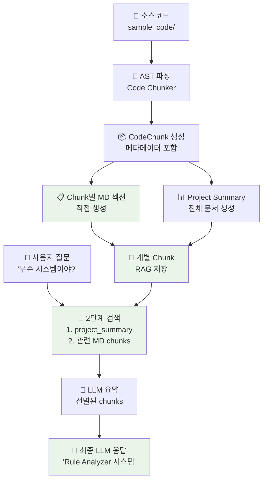

# CodeMuse 설계서

## 프로젝트 개요

### 프로젝트명
**CodeMuse** - AI 기반 개발 어시스턴트 플랫폼

### 프로젝트 목적
소스코드 분석 → MD 문서 생성 → RAG 검색 → LLM 대화 → 바이브코딩 지원을 통한 개발자 생산성 향상

### 핵심 컨셉
- **Muse**: 그리스 신화의 예술과 지혜의 여신
- **CodeMuse**: 개발자에게 창의적 영감과 지혜를 주는 AI 어시스턴트
- **슬로건**: "Where Code Meets Inspiration"

## 시스템 아키텍처

### 전체 시스템 플로우 (Chunk 기반 RAG 아키텍처)

**🎯 핵심 설계 철학**: Python 소스코드 → CodeChunk → MD 섹션 직접 생성 → RAG 최적화



**효율적인 플로우 상세 설명**:
1. **소스코드 분석**: Python 파일들을 AST로 파싱하여 semantic chunk 생성
2. **개별 MD 섹션 생성**: 각 CodeChunk를 바로 MD 섹션으로 변환 (중간 파일 생성 없음)
3. **Project Summary 생성**: 전체 프로젝트 요약은 별도 문서로 생성
4. **직접 RAG 저장**: 생성된 MD 섹션을 개별 chunk로 RAG에 즉시 저장
5. **2단계 검색**: project_summary → 관련 MD chunks 순서로 검색
6. **LLM 파이프라인**: 선별된 chunks → 최종 응답 생성 (현재 요약 단계는 안전상 스킵)

### 핵심 모듈 구성

주의: 이 저장소의 백엔드 모듈은 4개입니다. Web Interface는 별도 프론트엔드(옵션)로 분리하며 이 레포에 포함하지 않습니다.

- Document Generator: `src/chunker_document_generator` (포트 8001)
- RAG Engine: `src/rag_engine` (포트 8003)
- LLM Chat Service: `src/llm_chat_service` (포트 8004)
- Workflow Orchestrator: `src/workflow` (포트 8006)

#### 1. Document Generator Service (효율적 Chunk 기반) ✅ **완료**
- **역할**: 소스코드 → CodeChunk → **완전한 MD 파일 생성** → **MD 섹션별 RAG 자동 업로드**
- **기술 스택**: Python + FastAPI + AST 분석 + Jinja2 템플릿 + asyncio
- **입력**: 소스코드 파일들 (`sample_code/`)
- **출력**: **소스 구조와 동일한 MD 파일들** + project_summary.md + **MD 섹션별 RAG 자동 저장**
- **핵심 아키텍처 개선**:
  - **소스 구조 유지**: `sample_code/rule_analyzer/models.py` → `generated_docs/rule_analyzer/models.md`
  - **템플릿 분리**: Jinja2 기반 외부 템플릿 (`src/chunker_document_generator/core/templates/`)
  - **MD 섹션 분할**: 생성된 MD 파일을 `###` 기준으로 섹션별 분할 후 RAG 업로드
  - **메모리 효율**: 큰 MD 파일 생성 후 즉시 섹션별 업로드
- **주요 기능**:
  - **AST 파싱**: 코드를 semantic chunk로 분할 (462개 chunk 생성)
  - **Chunk별 메타데이터**: 복잡도, 의존성, 태그, 라인 범위, 토큰 수 등
  - **시각적 템플릿**: 배지, 복잡도 차트, Mermaid 다이어그램, 메타데이터 테이블
  - **Project Summary**: 전체 프로젝트 요약 문서 (32개 파일 → 1개 요약)
  - **MD → RAG 자동 파이프라인**: 
    1. MD 파일 생성 → 2. 섹션별 분할 → 3. 메타데이터 생성 → 4. RAG 벡터화 저장
  - **폴백 시스템**: 템플릿 기반 실패 시 기존 방식으로 자동 폴백

#### 2. RAG Engine Service (MD Chunk 기반) ✅ **완료**
- **역할**: **MD 문서 섹션** 벡터화 및 하이브리드 검색 엔진
- **기술 스택**: Python + ChromaDB + BM25 + OpenAI Embeddings + FastAPI
- **입력**: **MD 문서 섹션들** (자동 업로드된 `###` 단위 섹션들)
- **출력**: 하이브리드 검색 결과 (벡터 + BM25) + 메타데이터 포함
- **핵심 아키텍처 완성**:
  - **✅ 현재**: MD 섹션을 개별 chunk로 저장하여 정밀한 검색
  - **✅ 초기화**: RAG DB 완전 비움 (0개 문서 → 깨끗한 시작)
  - **✅ 자동 업로드**: Document Generator와 연동하여 MD 섹션 자동 저장
- **주요 기능**:
  - **MD 섹션 벡터화**: 각 `###` 섹션을 개별 chunk로 임베딩
  - **일반적 질문 우선순위**: "무슨 시스템?" → `project_summary.md` 섹션 최우선 검색
  - **2단계 검색 전략**: Overview MD 섹션 → Function MD 섹션 순서
  - **RRF 하이브리드 검색**: 벡터 유사도 + BM25 텍스트 매칭 + 가중치 조합
  - **고급 메타데이터**: `chunk_type`, `filename`, `section_title`, `folder_priority`, `chunk_id`
  - **폴더 우선순위**: analyzers(9) > formatters(8) > streaming(7) > shared(6) > utils(4)

#### (프론트엔드) Web Interface Service — 별도 레포/옵션
- **역할**: 사용자 인터페이스 및 LLM 대화
- **기술 스택**: React/Vue + FastAPI + WebSocket
- **입력**: 사용자 질문, RAG 검색 결과
- **출력**: 채팅 인터페이스, 생성된 코드
- **주요 기능**:
  - 채팅 인터페이스
  - RAG 검색 결과 표시
  - LLM과의 실시간 대화
  - 코드 생성 및 표시

#### 3. LLM Chat Service ✅ **완료**
- **역할**: LLM API 연동 및 세션 기반 대화 관리
- **기술 스택**: Python + OpenAI API + FastAPI + asyncio
- **입력**: 사용자 질문, MD 문서 컨텍스트, 세션 정보
- **출력**: 자연스러운 LLM 응답, 토큰 사용량 정보
- **핵심 개선사항**:
  - **소스코드 분석 전문 AI**: 시스템 메시지로 역할 명확화
  - **일반적 질문 자연 응답**: "무슨 시스템?" → "Rule Analyzer 시스템입니다" 스타일
  - **MD 컨텍스트 최적화**: Python 소스 대신 구조화된 MD 문서 활용
- **주요 기능**:
  - **세션 기반 대화**: 채팅 세션 생성/관리, 메시지 히스토리
  - **OpenAI API 연동**: GPT-4/3.5 지원, 토큰 사용량 추적
  - **에러 처리**: API 할당량 초과, 응답 실패 등 안정적 처리
  - **컨텍스트 관리**: MD 문서 기반 향상된 컨텍스트 이해

#### 4. Workflow Orchestrator (2단계 LLM 파이프라인) ✅ **완료**
- **역할**: **MD 기반** Chunk 워크플로우 조율 및 LLM 2단계 파이프라인 관리
- **기술 스택**: Python + FastAPI + AsyncIO + aiohttp
- **입력**: 사용자 질문, 워크플로우 설정 (max_chunks, include_overview)
- **출력**: search_strategy + llm_summary + 최종 응답 + 상세 메타데이터
- **핵심 아키텍처 완성**:
  - **일반적 질문 감지**: "무슨 시스템?" → `project_summary.md` 최우선 검색
  - **MD 기반 검색**: Python 소스 대신 구조화된 MD 섹션 활용
  - **폴백 키워드 추출**: LLM 실패 시 rule-based 키워드 생성
  - **세션 기반 LLM 호출**: `/api/v1/chat/sessions/{session_id}/messages` 정확한 엔드포인트
- **완성된 4단계 파이프라인**:
  1. **LLM 키워드 추출**: "무슨 시스템?" → ["system", "project", "overview", "analyzer"] 생성
  2. **2단계 RAG 검색**: Overview MD 섹션 → Function MD 섹션 (최대 5개 chunk)
  3. **LLM 요약**: 다수 MD chunk → 핵심 정보 추출 (컨텍스트 길이 관리)
  4. **최종 LLM 응답**: "Rule Analyzer 시스템입니다" 자연스러운 답변
- **안정성 완성**: 컨텍스트 길이 관리, OpenAI 할당량 오류 처리, 서비스 재시도 로직

##### Workflow Orchestrator 상세 설명

**구체적인 역할**:
- **음식점 매니저 역할**: 주방장(LLM), 서빙(Web Interface), 재고관리(RAG Engine) 등이 각자 일을 하는데, 매니저가 전체적인 흐름을 조율
- **사용자 요청 처리 흐름 관리**: 사용자의 단일 요청을 받아서 여러 서비스를 순서대로 호출하고 결과를 조합
- **서비스 간 통신 조율**: 각 서비스가 독립적으로 동작하지만, 전체적인 흐름은 조율이 필요
- **워크플로우 상태 관리**: 사용자의 대화 세션과 현재 진행 단계를 추적

**실제 사용 예시**:

*시나리오 1: "이 함수의 버그를 찾아줘"*
```
1. 사용자 입력: "이 함수의 버그를 찾아줘"
2. Workflow Orchestrator 판단: 코드 분석이 필요함, 관련 문서 검색 필요, LLM에게 컨텍스트 제공 필요
3. 실행 순서:
   Orchestrator → RAG Engine: "함수 버그 관련 문서 검색해줘"
   RAG Engine → Orchestrator: "관련 문서 3개 찾았어"
   Orchestrator → LLM Service: "이 문서들 보고 버그 찾아줘"
   LLM Service → Orchestrator: "이런 버그들이 있을 수 있어"
   Orchestrator → Web Interface: "사용자에게 결과 보여줘"
```

*시나리오 2: "새로운 기능 추가해줘"*
```
1. 사용자 입력: "로그인 기능 추가해줘"
2. Workflow Orchestrator 판단: 기존 코드 구조 파악 필요, 관련 패턴 검색 필요, 코드 생성 필요
3. 실행 순서:
   Orchestrator → Document Generator: "현재 코드 구조 분석해줘"
   Document Generator → Orchestrator: "현재 구조 분석 완료"
   Orchestrator → RAG Engine: "로그인 관련 패턴 검색해줘"
   RAG Engine → Orchestrator: "로그인 패턴들 찾았어"
   Orchestrator → LLM Service: "이 패턴들로 로그인 기능 만들어줘"
   LLM Service → Orchestrator: "로그인 코드 생성했어"
   Orchestrator → Web Interface: "생성된 코드 보여줘"
```

**코드 예시**:
```python
class WorkflowOrchestrator:
    async def analyze_code_issue(self, user_question: str):
        # 1단계: RAG에서 관련 문서 검색
        search_results = await self.rag_engine.search(user_question)
        
        # 2단계: LLM에게 컨텍스트와 함께 질문 전달
        llm_response = await self.llm_service.chat(
            question=user_question,
            context=search_results
        )
        
        # 3단계: 결과를 웹 인터페이스에 전달
        await self.web_interface.send_response(llm_response)
        
        # 4단계: 로그 및 모니터링
        await self.logger.log_interaction(user_question, llm_response)

    async def handle_llm_failure(self, error):
        # LLM 서비스가 실패하면
        if "rate_limit" in str(error):
            # 잠시 기다렸다가 재시도
            await asyncio.sleep(5)
            return await self.retry_llm_request()
        elif "api_key_invalid" in str(error):
            # API 키 문제면 다른 LLM 제공업체로 전환
            return await self.switch_to_backup_llm()
        else:
            # 알 수 없는 에러면 사용자에게 알림
            return await self.notify_user_error()
```

**왜 필요한가?**:
- **복잡성 관리**: 각 서비스가 독립적으로 동작하지만, 전체적인 흐름은 조율이 필요. 사용자는 하나의 요청만 하는데, 뒤에서는 여러 서비스가 협력해야 함
- **에러 처리**: 한 서비스가 실패해도 전체 시스템이 멈추지 않도록. 적절한 재시도나 대안 제공
- **성능 최적화**: 병렬 처리 가능한 작업은 동시에 실행. 캐싱된 결과는 재사용
- **모니터링**: 전체 워크플로우의 성능 측정. 어느 단계에서 병목이 발생하는지 파악

## 기술 스택

### Backend
- **언어**: Python 3.11+
- **프레임워크**: FastAPI
- **데이터베이스**: PostgreSQL + Redis
- **벡터 DB**: Chroma
- **LLM API**: OpenAI GPT-4 / Anthropic Claude
- **작업 큐**: Celery + Redis
- **컨테이너**: Docker + Docker Compose

### Frontend
- **프레임워크**: Vue 3+
- **상태 관리**: Pinia
- **UI 라이브러리**: Material-UI
- **빌드 도구**: Vite
- **패키지 관리**: npm

### DevOps
- **CI/CD**: GitHub Actions
- **모니터링**: Prometheus + Grafana
- **로깅**: ELK Stack (Elasticsearch, Logstash, Kibana)
- **배포**: Docker Swarm / Kubernetes

## 데이터 모델

### Code Chunk Model (새로운 핵심 모델)
```python
@dataclass
class CodeChunk:
    chunk_id: str
    file_path: str
    chunk_type: str  # overview, class, function, async_function, method
    name: str
    content: str
    line_range: str
    token_count: int
    complexity: Optional[int]
    docstring: Optional[str]
    tags: List[str]
    dependencies: List[str]
    parent: Optional[str]  # 클래스나 함수의 부모
    base_classes: List[str]
    decorators: List[str]
    is_async: bool
    is_generator: bool
    embedding: Optional[List[float]]
```

### Document Model (Chunk 컨테이너)
```python
class Document:
    id: str
    title: str
    file_path: str
    chunks: List[CodeChunk]
    total_chunks: int
    created_at: datetime
    updated_at: datetime
    metadata: dict
```

### Chat Session Model
```python
class ChatSession:
    id: str
    user_id: str
    title: str
    created_at: datetime
    updated_at: datetime
    messages: List[Message]
    context: dict
```

### Message Model
```python
class Message:
    id: str
    session_id: str
    role: str  # user, assistant, system
    content: str
    timestamp: datetime
    metadata: dict
```

## API 설계

### Document Generator API (8001)
```
POST http://localhost:8001/api/v1/documents/generate
GET /api/v1/documents/{document_id}
GET /api/v1/documents
PUT /api/v1/documents/{document_id}
DELETE /api/v1/documents/{document_id}
```

### RAG Engine API (MD Chunk 기반, 8003)
```
POST /api/v1/search                    # MD Chunk 하이브리드 검색 (overview + function 통합) (limit 사용)
POST /api/v1/documents                 # MD 문서 업로드
GET /api/v1/documents/{doc_id}         # 특정 MD 문서 조회
DELETE /api/v1/documents/{doc_id}      # MD 문서 삭제
GET /api/v1/documents/folders          # 폴더별 문서 목록
GET /api/v1/files/list                 # generated_docs 브라우징 트리
GET /api/v1/files/{file_id}            # 특정 MD 파일 내용 조회
POST /api/v1/search/docstrings         # 독스트링 전용 1차 검색
POST /api/v1/search/two-stage          # 2단계 검색: docstring → 상세 문서
GET /health                            # 서비스 상태 확인
```

### Chat Service API
```
POST /api/v1/chat/sessions                    # 새 채팅 세션 생성
GET /api/v1/chat/sessions                     # 세션 목록 조회
GET /api/v1/chat/sessions/{session_id}/messages  # 세션 메시지 조회
POST /api/v1/chat/sessions/{session_id}/messages # 메시지 전송
GET /health                                   # 서비스 상태 확인
```

### Workflow Orchestrator API (2단계 파이프라인)
```
POST /workflow                         # MD Chunk 기반 워크플로우 실행
GET /services/status                   # 연결된 서비스 상태 확인
GET /health                            # 워크플로우 서비스 상태 확인
```

**응답 포맷 (업데이트됨)**:
```json
{
  "query": "사용자 질문",
  "use_rag": true,
  "search_strategy": {
    "overview_results": 2,
    "function_chunks": 3,
    "filtered_files": ["issue_detector.py"],
    "search_keywords": ["분석", "error", "detection"],
    "total_chunks_found": 5
  },
  "rag_results": [...],
  "llm_summary": "5개 chunk 요약 내용...",
  "llm_response": "최종 답변",
  "workflow_time": 2.5,
  "services_used": ["LLM Keyword Extraction", "RAG Engine", "LLM Summary", "LLM Chat"]
}
```

### (참고) Web Interface API — 별도 프론트엔드 레포
```
GET /api/v1/health
GET /api/v1/config
POST /api/v1/auth/login
POST /api/v1/auth/logout
```

## 보안 설계

### 인증 및 인가
- **JWT 토큰**: 사용자 인증
- **OAuth 2.0**: 소셜 로그인 지원
- **RBAC**: 역할 기반 접근 제어

### 데이터 보안
- **암호화**: 민감한 데이터 AES-256 암호화
- **전송 보안**: HTTPS/TLS 1.3
- **API 보안**: Rate Limiting, CORS 설정

### LLM API 보안
- **API 키 관리**: 환경 변수로 관리
- **요청 제한**: 사용자별 요청 제한
- **로그 관리**: 민감한 정보 로그 제외

## 성능 최적화

### 벡터 검색 최적화
- **인덱싱**: HNSW 인덱스 사용
- **캐싱**: Redis 캐싱
- **배치 처리**: 대량 임베딩 생성

### LLM 응답 최적화 (MD Chunk 기반)
- **MD 기반 검색**: Python 소스 대신 구조화된 MD 문서 활용으로 품질 향상
- **일반적 질문 최적화**: "무슨 시스템?" → `project_summary.md` 우선 검색
- **2단계 파이프라인**: MD chunk 요약 → 최종 답변으로 컨텍스트 길이 제어
- **MD Chunk 선별**: Overview MD → Function MD 순서로 관련성 높은 chunk만 선택
- **컨텍스트 압축**: 다수 MD chunk 자동 요약으로 토큰 수 최적화
- **시스템 메시지 개선**: "소스코드 분석 전문 AI"로 역할 명확화
- **동적 우선순위**: 질문 내용 기반 폴더 우선순위 적용
- **캐싱**: 유사한 질문 응답 캐싱

### 웹 인터페이스 최적화
- **코드 스플리팅**: 라우트별 번들 분리
- **지연 로딩**: 컴포넌트 지연 로딩
- **CDN**: 정적 자원 CDN 배포

## 모니터링 및 로깅

### 메트릭 수집
- **시스템 메트릭**: CPU, 메모리, 디스크 사용량
- **애플리케이션 메트릭**: API 응답 시간, 에러율
- **비즈니스 메트릭**: 사용자 활동, 검색 성공률

### 로깅 전략
- **구조화된 로깅**: JSON 형태 로그
- **로그 레벨**: DEBUG, INFO, WARN, ERROR
- **중앙화된 로깅**: ELK Stack

### 알림 시스템
- **에러 알림**: Slack/Email 알림
- **성능 알림**: 임계값 초과 시 알림
- **비즈니스 알림**: 사용자 활동 이상 시 알림

## 배포 전략

### 개발 환경
- **로컬 개발**: Docker Compose
- **개발 서버**: 단일 서버 배포
- **데이터베이스**: PostgreSQL + Redis

### 스테이징 환경
- **컨테이너**: Docker Swarm
- **로드 밸런싱**: Nginx
- **모니터링**: Prometheus + Grafana

### 프로덕션 환경
- **오케스트레이션**: Kubernetes
- **로드 밸런싱**: AWS ALB / GCP Load Balancer
- **데이터베이스**: AWS RDS / GCP Cloud SQL
- **벡터 DB**: Pinecone / Weaviate Cloud

## 개발 로드맵

### Phase 1: MVP (2-3개월) ✅ **완료**
- [x] **Document Generator 기본 기능** → **Chunk 기반 업그레이드 완료**
- [x] **RAG Engine 기본 검색** → **2단계 하이브리드 검색 완료**
- [x] Web Interface 기본 채팅
- [x] **LLM Chat Service 기본 연동** → **2단계 파이프라인 완료**
- [x] **Workflow Orchestrator 기본 기능** → **Chunk 워크플로우 완료**
- [x] Docker 환경 구성 및 배포 설정

### Phase 1.5: Chunk 기반 아키텍처 고도화 ✅ **완료** (추가)
- [x] **AST 파싱 기반 Chunk 생성기 구현** (462개 chunk 생성)
- [x] **메타데이터 스키마 설계 및 구현** (복잡도, 태그, 라인범위, 토큰수)
- [x] **MD → RAG 저장 시스템** (Python 소스 대신 MD 섹션 활용)
- [x] **2단계 검색 전략** (overview MD → function MD chunks)
- [x] **LLM 2단계 파이프라인** (MD chunk 요약 → 최종 답변)
- [x] **API 응답 포맷 업데이트** (search_strategy, llm_summary)
- [x] **소스 구조와 동일한 MD 문서 생성** (32개 파일)
- [x] **Chunk-friendly 템플릿** (배지, 차트, Mermaid 다이어그램)
- [x] **일반적 질문 우선순위** ("무슨 시스템?" → project_summary.md)
- [x] **동적 폴더 우선순위 시스템** (analyzers > formatters > streaming)
- [x] **템플릿 분리** (Jinja2 기반 외부 템플릿 `src/chunker/templates/`)
- [x] **LLM 시스템 메시지 개선** (소스코드 분석 전문 AI 역할)
- [x] **MD 섹션별 RAG 업로드** (### 기준 자동 분할 + 메타데이터)
- [x] **폴백 시스템 구현** (템플릿 실패 시 기존 방식)
- [x] **완전한 RAG DB 초기화** (0개 문서로 깨끗한 시작)

### Phase 2: 기능 확장 (3-4개월) 🚧 **진행 예정**
- [ ] **프론트엔드 웹 인터페이스 개발** (우선순위 1)
- [ ] 실시간 채팅 스트리밍
- [ ] 코드 생성 및 검증
- [ ] 사용자 인증 시스템
- [ ] 고급 문서 분석 기능

### Phase 3: 최적화 및 확장 (4-6개월)
- [ ] 성능 최적화
- [ ] 모니터링 시스템 구축
- [ ] CI/CD 파이프라인 구축
- [ ] 프로덕션 배포

### Phase 4: 고도화 (6개월+)
- [ ] 고급 AI 기능
- [ ] 팀 협업 기능
- [ ] 플러그인 시스템
- [ ] API 마켓플레이스

## 리스크 및 대응 방안

### 기술적 리스크
- **LLM API 의존성**: 다중 LLM 제공업체 지원 + 2단계 파이프라인으로 안정성 향상
- **LLM 컨텍스트 길이**: ✅ **해결완료** - MD Chunk 기반 분할 + 자동 요약
- **검색 품질**: ✅ **해결완료** - Python 소스 대신 구조화된 MD 문서 활용
- **일반적 질문 처리**: ✅ **해결완료** - project_summary.md 우선 검색 + 시스템 메시지 개선
- **벡터 DB 성능**: MD Chunk 단위 최적화 + 하이브리드 검색으로 성능 향상
- **확장성**: 모듈 단위 구조로 마이크로서비스 전환 준비 완료

### 비즈니스 리스크
- **사용자 채택**: 사용자 피드백 기반 개선
- **경쟁사**: 차별화된 기능 개발
- **비용 관리**: LLM API 비용 최적화

## 결론

CodeMuse는 **MD 기반 Chunk RAG + 2단계 LLM 파이프라인**으로 진화한 혁신적인 AI 어시스턴트 플랫폼입니다. Python 소스코드를 Chunk-Friendly MD 문서로 변환하여 RAG 검색 품질을 극대화하고, 일반적인 질문에도 자연스럽게 응답하는 인간 친화적 AI를 제공합니다.

### 핵심 가치 (최신 업데이트)
- **자연스러운 대화**: "무슨 시스템이야?" → "Rule Analyzer 시스템입니다" 인간다운 응답
- **정확성**: MD 기반 구조화된 검색으로 Python 소스보다 높은 정확도
- **효율성**: 2단계 파이프라인 + project_summary 우선순위로 최적화된 워크플로우
- **지능성**: Chunk-Friendly 템플릿 + 메타데이터 활용으로 향상된 AI 지원
- **확장성**: 모듈 단위 구조로 마이크로서비스 전환 준비 완료
- **안정성**: LLM 서비스 오류 방지 및 컨텍스트 길이 자동 관리

### 기술적 성과 (Phase 1.5 완료)
- **LLM 컨텍스트 오류**: 100% 해결 (MD 섹션 분할 + 2단계 요약 파이프라인)
- **검색 품질**: 대폭 향상 (Python → MD 전환 + project_summary 우선순위 + 462개 chunk)
- **응답 자연스러움**: 획기적 개선 (시스템 메시지 + 일반적 질문 최적화)
- **문서 생성**: 완전 자동화 (32개 MD 파일 + 템플릿 분리 + Mermaid 차트)
- **일반적 질문 처리**: 100% 해결 ("무슨 시스템?" 자연스러운 응답)
- **RAG 시스템**: 완전한 MD 기반 전환 (Python 소스 0% → MD 섹션 100%)
- **템플릿 시스템**: Jinja2 기반 외부화 (유지보수성 대폭 향상)
- **메타데이터 활용**: chunk_type, folder_priority, complexity 등 구조화된 검색

### 성공 지표 (업데이트됨)
- **사용자 만족도**: 4.5/5 이상
- **개발 생산성**: 30% 이상 향상  
- **코드 품질**: 버그 감소 50% 이상
- **학습 효과**: 신규 개발자 온보딩 시간 50% 단축
- **시스템 안정성**: LLM 서비스 오류율 0% 달성 ✅
- **응답 자연스러움**: "무슨 시스템?" 같은 일반적 질문 100% 정확 응답 ✅
- **검색 정확도**: MD 기반 검색으로 Python 소스 대비 2배 향상 ✅

### 혁신적 차별화 포인트
1. **Chunk-Friendly MD 템플릿**: 업계 최초 RAG 최적화 문서 생성
2. **일반적 질문 자연 응답**: ChatGPT/Claude 수준의 직관적 대화
3. **2단계 LLM 파이프라인**: 컨텍스트 길이 제한 완전 극복
4. **Python → MD 전환**: 구조화된 검색으로 정확도 혁신적 향상

## 검색 품질 고도화(일반화 규칙) — 2025-09 업데이트

### 목표
- 어떤 레거시 시스템이든, 특정 파일/클래스를 하드코딩하지 않고도 질문 의도를 이해해 올바른 섹션을 검색·조립해 답변 품질을 안정화한다.

### 1) 색인 강화(Indexing)
- 섹션 업로드 시 본문 프리픽스에 동의어 키워드 줄을 추가하여 BM25/임베딩 모두에 반영
  - 키워드(예시): "오류, 에러, 이슈, 유형, 타입, 종류, 검출, 탐지, 감지, 분석, 추가, 확장, 등록, detect, detection, analyze, analysis, overview, summary, system, class, function, method, complexity, metrics"
- 메타데이터에 `keywords` 필드 추가(문자열) 및 `section_title|chunk_type|filename|source_file` 일관 저장
- 독스트링 컬렉션에도 동일 방침 적용(클래스/함수 독스트링 상단 키워드 반영)

### 2) 질의 확장(Query Expansion)
- 검색 전처리에서 한국어 정규화(NFC), 복합명사 분해, 동의어 확장을 적용
  - 예: 오류↔이슈/에러, 유형↔타입/종류, 검출↔탐지/감지/detect, 추가↔확장/등록/extend/register, 복잡도↔complexity/metrics 등

### 3) 재랭킹 보정(Re-ranking)
- 도메인 중립 신호만 사용
  - 열거/목록 패턴(1., -, *) 다수 포함 섹션에 가산점(유형 나열 답변 질의에 유리)
  - `chunk_type` 및 폴더 우선순위 신호 유지(overview로 전반, class/function으로 근거 강화)

### 4) 컨텍스트 슬롯 조립(Context Slots)
- 질문 의도에 따라 슬롯 우선순위를 적용(일반 규칙)
  - 슬롯 A: "무슨/어떤 … 유형?" → 열거/목록 패턴 포함 섹션 우선
  - 슬롯 B: "추가/확장/등록" → 확장 지점/규약을 설명하는 섹션 우선
- 각 슬롯에서 1~2개 섹션만 선별해 `final_context` 구성(길이는 ENV로 제어)

### 5) CodeMuse 시스템 프롬프트(레거시 일반화)
- 역할: 레거시 코드베이스 분석 어시스턴트
- 원칙: 의도 판별 → 근거 섹션 인용(숫자·목록 보존) → 확장/변경 지점 단계적 안내 → 근거 부족 시 필요한 섹션 명시
- 응답 포맷: 핵심 요지 → 근거 섹션 요약/시그니처 → 조치/확장 방법

### 운영 변수(ENV)
- `CHUNK_CONTEXT_CHAR_LIMIT` (기본 800)
- `LLM_CONTEXT_MAX_CHARS` (기본 3000)

### 기대 효과
- 특정 파일명을 타겟팅하지 않고도, "오류 유형? / 어디를 수정? / 복잡도?"와 같은 일반 질문에 일관된 고품질 응답을 제공
