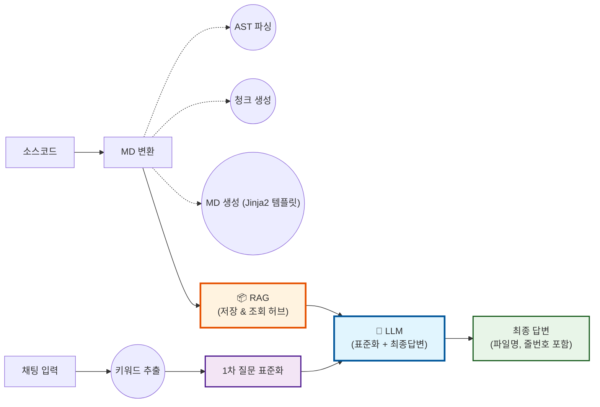

```mermaid
flowchart LR
    %% 소스 분석 플로우
    A["소스코드"] --> B["MD 변환"]
    B -.-> C(("AST 파싱"))
    B -.-> D(("청크 생성"))
    B -.-> E(("MD 생성 (Jinja2 템플릿)"))
    B --> R["📦 RAG<br/>(저장 & 조회 허브)"]
    
    %% MD 변환 결과물: 소스문서, 용어집, 메타데이터

    %% 채팅 질의응답 플로우
    F["채팅 입력"] --> K(("키워드 추출"))
    K --> G["1차 질문 표준화"]
    G --> LLM["🤖 LLM<br/>(표준화 + 최종답변)"]
    R --> LLM
    LLM --> I["최종 답변<br/>(파일명, 줄번호 포함)"]

    %% 스타일링
    classDef llmNode fill:#e1f5fe,stroke:#01579b,stroke-width:3px
    classDef processNode fill:#f3e5f5,stroke:#4a148c,stroke-width:2px
    classDef resultNode fill:#e8f5e8,stroke:#1b5e20,stroke-width:2px
    classDef hubNode fill:#fff3e0,stroke:#e65100,stroke-width:3px
    
    class LLM llmNode
    class G processNode
    class I resultNode
    class R hubNode
```