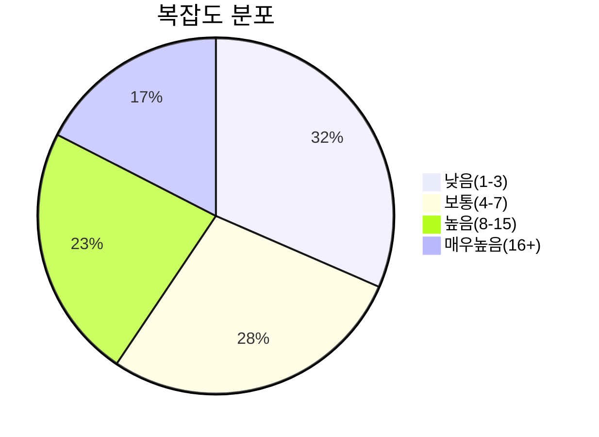

# 📊 분석 대상 프로젝트 요약

> **생성일**: 2025-10-01  
> **⚠️ 주의**: `sample_code`는 폴더명이며 프로젝트명이 아닙니다!  
> **실제 프로젝트**: 2개 (Rule Analyzer + Vizier)  
> **총 파일 수**: 1583개  
> **총 Chunk 수**: 6861개

---

## 🎯 개요

이 문서는 CodeMuse로 분석 중인 **2개 프로젝트**의 전체 구조와 통계를 요약합니다.

## 📝 분석 대상 프로젝트

CodeMuse는 현재 다음 **2개 프로젝트**를 분석하고 있습니다:

### **1. Rule Analyzer (규칙 분석기)**
- **유형**: Python 기반 코드 분석 도구
- **경로**: `sample_code/rule_analyzer/`
- **주요 기능**: 이슈/오류 검출, 조건 파싱/분석, 메트릭 생성

### **2. Vizier (비지어)**
- **유형**: Java/Vue.js 제품 관리 플랫폼
- **경로**: `sample_code/vizier(sample)/`
- **주요 기능**: 제품 관계 관리, 종속관계(Leader-Follower) 관리, 영향 분석

**⚠️ 중요**: `sample_code`는 테스트용 폴더명이며, 실제 프로젝트는 위의 2개입니다.

## 📊 전체 통계

| 🎯 메트릭 | 📊 값 |
|-----------|-------|
| **총 파일 수** | 1583 |
| **총 Chunk 수** | 6861 |
| **총 토큰 수** | 715,082 |
| **평균 복잡도** | 12.7 |
| **최대 복잡도** | 1158 |

## 🏗️ 디렉토리 구조

```
sample_code/
  ├── rule_analyzer/
    ├── analyzers/
    ├── formatters/
      ├── options/
      ├── templates/
    ├── shared/
      ├── config/
      ├── utils/
    ├── streaming/
      ├── protocols/
      ├── utils/
  ├── vizier(sample)/
    ├── vizier-be-prod-develop/
      ├── gradle/
        ├── wrapper/
      ├── src/
        ├── main/
          ├── java/
            ├── com/
              ├── lgcns/
                ├── svcp/
                  ├── prod/
                    ├── advice/
                    ├── auth/
                      ├── service/
                    ├── config/
                    ├── constant/
                    ├── context/
                    ├── dataaccess/
                      ├── impl/
                    ├── entity/
                      ├── external/
                    ├── enums/
                    ├── exception/
                    ├── filters/
                    ├── i18n/
                    ├── interceptor/
                    ├── mapper/
                      ├── ruleengine/
                    ├── online/
                      ├── prod/
                        ├── controller/
                        ├── dto/
                          ├── category/
                          ├── characteristic/
                          ├── common/
                          ├── component/
                            ├── benefit/
                            ├── characteristic/
                            ├── price/
                            ├── service/
                          ├── group/
                          ├── offer/
                          ├── resource/
                        ├── service/
                        ├── util/
                    ├── properties/
                    ├── ruleengine/
                      ├── controller/
                      ├── dto/
                        ├── category/
                        ├── condition/
                        ├── field/
                        ├── rule/
                      ├── entity/
                      ├── service/
                      ├── wrapper/
                    ├── tomcatError/
                      ├── controller/
                    ├── ui/
                      ├── prod/
                        ├── controller/
                          ├── admin/
                        ├── dto/
                          ├── admin/
                            ├── factor/
                            ├── matrix/
                              ├── builder/
                            ├── table/
                              ├── ref/
                          ├── analysis/
                            ├── download/
                          ├── attribute/
                          ├── bulkupload/
                          ├── category/
                            ├── detail/
                            ├── tab/
                            ├── update/
                          ├── characteristic/
                          ├── common/
                            ├── metadata/
                            ├── search/
                            ├── structure/
                          ├── component/
                            ├── addResource/
                            ├── list/
                            ├── search/
                            ├── update/
                          ├── customvalidation/
                            ├── history/
                          ├── dashboard/
                            ├── request/
                            ├── response/
                          ├── export/
                          ├── extend/
                          ├── group/
                            ├── search/
                          ├── history/
                            ├── detail/
                            ├── save/
                          ├── item/
                            ├── detail/
                          ├── label/
                          ├── multiEntity/
                            ├── create/
                            ├── detail/
                            ├── rel/
                            ├── search/
                          ├── notifications/
                          ├── offer/
                            ├── detail/
                            ├── duplicate/
                            ├── list/
                              ├── dto/
                            ├── search/
                            ├── structure/
                              ├── listAddComponent/
                              ├── update/
                          ├── price/
                          ├── publish/
                            ├── aprv/
                            ├── item/
                            ├── packages/
                          ├── resource/
                            ├── create/
                            ├── list/
                            ├── search/
                            ├── update/
                          ├── userpocket/
                        ├── enums/
                          ├── entity/
                          ├── item/
                          ├── publish/
                        ├── service/
                          ├── admin/
                          ├── customexcel/
                            ├── impl/
                          ├── dashboard/
                            ├── impl/
                          ├── impl/
                        ├── util/
                    ├── util/
                      ├── excel/
                        ├── annotation/
                      ├── paging/
                    ├── validator/
                      ├── annotation/
          ├── resources/
            ├── META-INF/
              ├── spring/
            ├── messages/
            ├── sql/
              ├── mariadb/
              ├── postgresql/
    ├── vizier-fe-all-develop/
      ├── .__mf__temp/
        ├── host/
      ├── nginx/
      ├── public/
        ├── files/
        ├── img/
      ├── src/
        ├── api/
          ├── admin/
            ├── factor/
            ├── matrix/
            ├── path/
            ├── rule-engine/
            ├── tableStructure/
          ├── prod/
            ├── path/
        ├── assets/
          ├── files/
          ├── icons/
          ├── images/
          ├── scss/
        ├── components/
          ├── Description/
            ├── subs/
          ├── admin/
            ├── factor-management/
              ├── common/
              ├── factor-types/
            ├── matrix-structure/
              ├── common/
            ├── rule-engine/
              ├── rule-structure/
                ├── icon/
            ├── table-structure/
              ├── tab/
          ├── bulk-upload/
          ├── controls/
            ├── examples/
          ├── prod/
            ├── catalog/
              ├── component/
                ├── create/
              ├── impact-analysis/
                ├── target-search/
                ├── view/
                  ├── GridDisplayMode/
              ├── offer/
                ├── component/
              ├── resource/
            ├── category/
              ├── tree-view/
                ├── CardTree/
                ├── TreeView/
                ├── tabs/
            ├── chatbot/
            ├── common/
            ├── dashboard/
              ├── recently-worked/
              ├── subscriber-top-10/
            ├── extends/
              ├── create/
              ├── mutil-entity/
                ├── search/
                  ├── tabs/
              ├── relation/
                ├── manager/
                  ├── form/
                  ├── relation-viewer/
                    ├── common/
                    ├── content/
                    ├── search/
                ├── search/
              ├── search/
            ├── icons/
            ├── layout/
            ├── publish/
              ├── common/
              ├── step/
            ├── shared/
        ├── composables/
        ├── constants/
          ├── admin/
        ├── enums/
        ├── events/
        ├── interfaces/
          ├── admin/
          ├── prod/
        ├── layouts/
        ├── mocks/
          ├── cmcd/
          ├── domain/
          ├── org/
          ├── prod/
            ├── catalog/
              ├── data/
            ├── category/
            ├── extends/
            ├── impact-analysis/
          ├── screen/
          ├── smg/
          ├── user/
          ├── voca/
        ├── pages/
          ├── admin/
            ├── factor/
            ├── subs/
              ├── attribute/
                ├── item-edit/
                ├── items-view/
              ├── code/
              ├── common/
              ├── custom-validation/
              ├── domain/
              ├── label/
              ├── matrix/
              ├── menu/
              ├── message/
              ├── org/
              ├── permission/
                ├── group/
              ├── screen/
              ├── term/
              ├── user/
              ├── vocab/
            ├── types/
          ├── code/
            ├── subs/
          ├── controls/
          ├── domain/
            ├── subs/
          ├── functions/
            ├── notice/
              ├── subs/
            ├── subs/
              ├── common/
          ├── orgInfo/
            ├── subs/
          ├── prod/
            ├── functions/
              ├── catalog/
                ├── component/
                ├── impact-analysis/
                ├── offer/
                ├── resource/
              ├── category/
                ├── tree-view/
              ├── dashboard/
              ├── extends/
                ├── create/
                ├── group/
                ├── mutil-entity/
                ├── relation/
                ├── search/
              ├── publish/
          ├── solution/
            ├── popup/
          ├── syssms/
            ├── subs/
          ├── userinfo/
            ├── subs/
          ├── vocap/
            ├── subs/
        ├── plugins/
        ├── router/
        ├── store/
          ├── admin/
          ├── catalog/
        ├── styles/
        ├── types/
          ├── catalog/
            ├── component/
        ├── utils/
        ├── views/
      ├── tests/
        ├── e2e/
        ├── setup/
        ├── unit/
```

## 📈 Chunk 분포

### 타입별 분포

| 🧩 Chunk 타입 | 📊 개수 | 📈 비율 |
|---------------|--------|--------|
| overview | 1583 | 23.1% |
| class | 605 | 8.8% |
| method | 319 | 4.6% |
| function | 82 | 1.2% |
| async_function | 4 | 0.1% |
| template | 663 | 9.7% |
| style | 332 | 4.8% |
| arrow_function | 2585 | 37.7% |
| package | 618 | 9.0% |
| enum | 26 | 0.4% |
| interface | 44 | 0.6% |

### 복잡도 분포



## 🔝 복잡한 함수 TOP 10

| 순위 | 함수명 | 파일 | 복잡도 | 토큰 |
|------|-------|------|--------|-------|
| 1 | `getResponse` | mockServiceWorker.js | 46 | 243 |
| 2 | `handleDragEnded` | BentoGrid.vue | 33 | 128 |
| 3 | `handleRequest` | mockServiceWorker.js | 31 | 121 |
| 4 | `handleHover` | SidebarMenu.vue | 29 | 81 |
| 5 | `handleClick` | SubMenuCommon.vue | 29 | 79 |
| 6 | `_analyze_structure` | rule_analyzer.py | 27 | 961 |
| 7 | `fetchAndSaveTranslations` | fetch-i18n.ts | 26 | 71 |
| 8 | `handleImageUpload` | UploadUserImageEditMode.vue | 26 | 74 |
| 9 | `DFSDetectCycle` | extend-utils.ts | 24 | 80 |
| 10 | `_check_number_field_ambiguity` | issue_detector.py | 22 | 1278 |

## 🏷️ 인기 태그 TOP 20

- **javascript**: 2660회
- **arrow_function**: 2585회
- **vue**: 2053회
- **java**: 1851회
- **class**: 1225회
- **vue.js 컴포넌트**: 663회
- **template**: 663회
- **html**: 663회
- **package**: 618회
- **import**: 618회
- **typescript**: 505회
- **style**: 332회
- **css**: 332회
- **typescript 파일**: 252회
- **public_method**: 152회
- **private_method**: 145회
- **spring**: 131회
- **service**: 125회
- **spring-boot**: 96회
- **getter**: 65회

## 📁 디렉토리별 상세 정보

### 📂 rule_analyzer

| 속성 | 값 |
|------|-----|
| **파일 수** | 5 |
| **Chunk 수** | 77 |
| **상대 경로** | `rule_analyzer` |

### 📂 rule_analyzer/analyzers

| 속성 | 값 |
|------|-----|
| **파일 수** | 7 |
| **Chunk 수** | 106 |
| **상대 경로** | `rule_analyzer/analyzers` |

### 📂 rule_analyzer/formatters

| 속성 | 값 |
|------|-----|
| **파일 수** | 3 |
| **Chunk 수** | 25 |
| **상대 경로** | `rule_analyzer/formatters` |

### 📂 rule_analyzer/formatters/options

| 속성 | 값 |
|------|-----|
| **파일 수** | 3 |
| **Chunk 수** | 23 |
| **상대 경로** | `rule_analyzer/formatters/options` |

### 📂 rule_analyzer/formatters/templates

| 속성 | 값 |
|------|-----|
| **파일 수** | 4 |
| **Chunk 수** | 34 |
| **상대 경로** | `rule_analyzer/formatters/templates` |

### 📂 rule_analyzer/shared

| 속성 | 값 |
|------|-----|
| **파일 수** | 2 |
| **Chunk 수** | 10 |
| **상대 경로** | `rule_analyzer/shared` |

### 📂 rule_analyzer/shared/config

| 속성 | 값 |
|------|-----|
| **파일 수** | 2 |
| **Chunk 수** | 20 |
| **상대 경로** | `rule_analyzer/shared/config` |

### 📂 rule_analyzer/shared/utils

| 속성 | 값 |
|------|-----|
| **파일 수** | 4 |
| **Chunk 수** | 34 |
| **상대 경로** | `rule_analyzer/shared/utils` |

### 📂 rule_analyzer/streaming

| 속성 | 값 |
|------|-----|
| **파일 수** | 4 |
| **Chunk 수** | 58 |
| **상대 경로** | `rule_analyzer/streaming` |

### 📂 rule_analyzer/streaming/utils

| 속성 | 값 |
|------|-----|
| **파일 수** | 3 |
| **Chunk 수** | 32 |
| **상대 경로** | `rule_analyzer/streaming/utils` |

### 📂 rule_analyzer/streaming/protocols

| 속성 | 값 |
|------|-----|
| **파일 수** | 3 |
| **Chunk 수** | 21 |
| **상대 경로** | `rule_analyzer/streaming/protocols` |

### 📂 vizier(sample)/vizier-fe-all-develop

| 속성 | 값 |
|------|-----|
| **파일 수** | 5 |
| **Chunk 수** | 5 |
| **상대 경로** | `vizier(sample)/vizier-fe-all-develop` |

### 📂 vizier(sample)/vizier-fe-all-develop/.__mf__temp/host

| 속성 | 값 |
|------|-----|
| **파일 수** | 1 |
| **Chunk 수** | 1 |
| **상대 경로** | `vizier(sample)/vizier-fe-all-develop/.__mf__temp/host` |

### 📂 vizier(sample)/vizier-fe-all-develop/tests/unit

| 속성 | 값 |
|------|-----|
| **파일 수** | 1 |
| **Chunk 수** | 1 |
| **상대 경로** | `vizier(sample)/vizier-fe-all-develop/tests/unit` |

### 📂 vizier(sample)/vizier-fe-all-develop/tests/setup

| 속성 | 값 |
|------|-----|
| **파일 수** | 2 |
| **Chunk 수** | 3 |
| **상대 경로** | `vizier(sample)/vizier-fe-all-develop/tests/setup` |

### 📂 vizier(sample)/vizier-fe-all-develop/tests/e2e

| 속성 | 값 |
|------|-----|
| **파일 수** | 2 |
| **Chunk 수** | 2 |
| **상대 경로** | `vizier(sample)/vizier-fe-all-develop/tests/e2e` |

### 📂 vizier(sample)/vizier-fe-all-develop/public

| 속성 | 값 |
|------|-----|
| **파일 수** | 1 |
| **Chunk 수** | 8 |
| **상대 경로** | `vizier(sample)/vizier-fe-all-develop/public` |

### 📂 vizier(sample)/vizier-fe-all-develop/src

| 속성 | 값 |
|------|-----|
| **파일 수** | 6 |
| **Chunk 수** | 9 |
| **상대 경로** | `vizier(sample)/vizier-fe-all-develop/src` |

### 📂 vizier(sample)/vizier-fe-all-develop/src/mocks

| 속성 | 값 |
|------|-----|
| **파일 수** | 3 |
| **Chunk 수** | 5 |
| **상대 경로** | `vizier(sample)/vizier-fe-all-develop/src/mocks` |

### 📂 vizier(sample)/vizier-fe-all-develop/src/mocks/prod

| 속성 | 값 |
|------|-----|
| **파일 수** | 2 |
| **Chunk 수** | 2 |
| **상대 경로** | `vizier(sample)/vizier-fe-all-develop/src/mocks/prod` |

### 📂 vizier(sample)/vizier-fe-all-develop/src/mocks/prod/extends

| 속성 | 값 |
|------|-----|
| **파일 수** | 1 |
| **Chunk 수** | 1 |
| **상대 경로** | `vizier(sample)/vizier-fe-all-develop/src/mocks/prod/extends` |

### 📂 vizier(sample)/vizier-fe-all-develop/src/mocks/prod/category

| 속성 | 값 |
|------|-----|
| **파일 수** | 2 |
| **Chunk 수** | 2 |
| **상대 경로** | `vizier(sample)/vizier-fe-all-develop/src/mocks/prod/category` |

### 📂 vizier(sample)/vizier-fe-all-develop/src/mocks/prod/catalog

| 속성 | 값 |
|------|-----|
| **파일 수** | 4 |
| **Chunk 수** | 4 |
| **상대 경로** | `vizier(sample)/vizier-fe-all-develop/src/mocks/prod/catalog` |

### 📂 vizier(sample)/vizier-fe-all-develop/src/mocks/prod/catalog/data

| 속성 | 값 |
|------|-----|
| **파일 수** | 4 |
| **Chunk 수** | 4 |
| **상대 경로** | `vizier(sample)/vizier-fe-all-develop/src/mocks/prod/catalog/data` |

### 📂 vizier(sample)/vizier-fe-all-develop/src/mocks/prod/impact-analysis

| 속성 | 값 |
|------|-----|
| **파일 수** | 6 |
| **Chunk 수** | 6 |
| **상대 경로** | `vizier(sample)/vizier-fe-all-develop/src/mocks/prod/impact-analysis` |

### 📂 vizier(sample)/vizier-fe-all-develop/src/mocks/smg

| 속성 | 값 |
|------|-----|
| **파일 수** | 2 |
| **Chunk 수** | 3 |
| **상대 경로** | `vizier(sample)/vizier-fe-all-develop/src/mocks/smg` |

### 📂 vizier(sample)/vizier-fe-all-develop/src/mocks/voca

| 속성 | 값 |
|------|-----|
| **파일 수** | 2 |
| **Chunk 수** | 2 |
| **상대 경로** | `vizier(sample)/vizier-fe-all-develop/src/mocks/voca` |

### 📂 vizier(sample)/vizier-fe-all-develop/src/mocks/org

| 속성 | 값 |
|------|-----|
| **파일 수** | 2 |
| **Chunk 수** | 2 |
| **상대 경로** | `vizier(sample)/vizier-fe-all-develop/src/mocks/org` |

### 📂 vizier(sample)/vizier-fe-all-develop/src/mocks/user

| 속성 | 값 |
|------|-----|
| **파일 수** | 2 |
| **Chunk 수** | 3 |
| **상대 경로** | `vizier(sample)/vizier-fe-all-develop/src/mocks/user` |

### 📂 vizier(sample)/vizier-fe-all-develop/src/mocks/cmcd

| 속성 | 값 |
|------|-----|
| **파일 수** | 2 |
| **Chunk 수** | 3 |
| **상대 경로** | `vizier(sample)/vizier-fe-all-develop/src/mocks/cmcd` |

### 📂 vizier(sample)/vizier-fe-all-develop/src/mocks/screen

| 속성 | 값 |
|------|-----|
| **파일 수** | 2 |
| **Chunk 수** | 4 |
| **상대 경로** | `vizier(sample)/vizier-fe-all-develop/src/mocks/screen` |

### 📂 vizier(sample)/vizier-fe-all-develop/src/mocks/domain

| 속성 | 값 |
|------|-----|
| **파일 수** | 2 |
| **Chunk 수** | 3 |
| **상대 경로** | `vizier(sample)/vizier-fe-all-develop/src/mocks/domain` |

### 📂 vizier(sample)/vizier-fe-all-develop/src/types

| 속성 | 값 |
|------|-----|
| **파일 수** | 2 |
| **Chunk 수** | 4 |
| **상대 경로** | `vizier(sample)/vizier-fe-all-develop/src/types` |

### 📂 vizier(sample)/vizier-fe-all-develop/src/types/catalog/component

| 속성 | 값 |
|------|-----|
| **파일 수** | 1 |
| **Chunk 수** | 1 |
| **상대 경로** | `vizier(sample)/vizier-fe-all-develop/src/types/catalog/component` |

### 📂 vizier(sample)/vizier-fe-all-develop/src/composables

| 속성 | 값 |
|------|-----|
| **파일 수** | 9 |
| **Chunk 수** | 24 |
| **상대 경로** | `vizier(sample)/vizier-fe-all-develop/src/composables` |

### 📂 vizier(sample)/vizier-fe-all-develop/src/plugins

| 속성 | 값 |
|------|-----|
| **파일 수** | 1 |
| **Chunk 수** | 2 |
| **상대 경로** | `vizier(sample)/vizier-fe-all-develop/src/plugins` |

### 📂 vizier(sample)/vizier-fe-all-develop/src/constants

| 속성 | 값 |
|------|-----|
| **파일 수** | 16 |
| **Chunk 수** | 19 |
| **상대 경로** | `vizier(sample)/vizier-fe-all-develop/src/constants` |

### 📂 vizier(sample)/vizier-fe-all-develop/src/constants/admin

| 속성 | 값 |
|------|-----|
| **파일 수** | 9 |
| **Chunk 수** | 9 |
| **상대 경로** | `vizier(sample)/vizier-fe-all-develop/src/constants/admin` |

### 📂 vizier(sample)/vizier-fe-all-develop/src/enums

| 속성 | 값 |
|------|-----|
| **파일 수** | 8 |
| **Chunk 수** | 8 |
| **상대 경로** | `vizier(sample)/vizier-fe-all-develop/src/enums` |

### 📂 vizier(sample)/vizier-fe-all-develop/src/utils

| 속성 | 값 |
|------|-----|
| **파일 수** | 12 |
| **Chunk 수** | 68 |
| **상대 경로** | `vizier(sample)/vizier-fe-all-develop/src/utils` |

### 📂 vizier(sample)/vizier-fe-all-develop/src/components/prod/extends/relation/search

| 속성 | 값 |
|------|-----|
| **파일 수** | 2 |
| **Chunk 수** | 12 |
| **상대 경로** | `vizier(sample)/vizier-fe-all-develop/src/components/prod/extends/relation/search` |

### 📂 vizier(sample)/vizier-fe-all-develop/src/components/prod/extends/relation/manager

| 속성 | 값 |
|------|-----|
| **파일 수** | 4 |
| **Chunk 수** | 16 |
| **상대 경로** | `vizier(sample)/vizier-fe-all-develop/src/components/prod/extends/relation/manager` |

### 📂 vizier(sample)/vizier-fe-all-develop/src/components/prod/extends/relation/manager/relation-viewer/content

| 속성 | 값 |
|------|-----|
| **파일 수** | 3 |
| **Chunk 수** | 30 |
| **상대 경로** | `vizier(sample)/vizier-fe-all-develop/src/components/prod/extends/relation/manager/relation-viewer/content` |

### 📂 vizier(sample)/vizier-fe-all-develop/src/components/prod/extends/relation/manager/relation-viewer/search

| 속성 | 값 |
|------|-----|
| **파일 수** | 3 |
| **Chunk 수** | 19 |
| **상대 경로** | `vizier(sample)/vizier-fe-all-develop/src/components/prod/extends/relation/manager/relation-viewer/search` |

### 📂 vizier(sample)/vizier-fe-all-develop/src/components/prod/extends/relation/manager/relation-viewer/common

| 속성 | 값 |
|------|-----|
| **파일 수** | 4 |
| **Chunk 수** | 37 |
| **상대 경로** | `vizier(sample)/vizier-fe-all-develop/src/components/prod/extends/relation/manager/relation-viewer/common` |

### 📂 vizier(sample)/vizier-fe-all-develop/src/components/prod/extends/relation/manager/form

| 속성 | 값 |
|------|-----|
| **파일 수** | 2 |
| **Chunk 수** | 16 |
| **상대 경로** | `vizier(sample)/vizier-fe-all-develop/src/components/prod/extends/relation/manager/form` |

### 📂 vizier(sample)/vizier-fe-all-develop/src/components/prod/extends/mutil-entity/search

| 속성 | 값 |
|------|-----|
| **파일 수** | 6 |
| **Chunk 수** | 54 |
| **상대 경로** | `vizier(sample)/vizier-fe-all-develop/src/components/prod/extends/mutil-entity/search` |

### 📂 vizier(sample)/vizier-fe-all-develop/src/components/prod/extends/mutil-entity/search/tabs

| 속성 | 값 |
|------|-----|
| **파일 수** | 2 |
| **Chunk 수** | 28 |
| **상대 경로** | `vizier(sample)/vizier-fe-all-develop/src/components/prod/extends/mutil-entity/search/tabs` |

### 📂 vizier(sample)/vizier-fe-all-develop/src/components/prod/extends/search

| 속성 | 값 |
|------|-----|
| **파일 수** | 4 |
| **Chunk 수** | 46 |
| **상대 경로** | `vizier(sample)/vizier-fe-all-develop/src/components/prod/extends/search` |

### 📂 vizier(sample)/vizier-fe-all-develop/src/components/prod/extends/create

| 속성 | 값 |
|------|-----|
| **파일 수** | 1 |
| **Chunk 수** | 8 |
| **상대 경로** | `vizier(sample)/vizier-fe-all-develop/src/components/prod/extends/create` |

### 📂 vizier(sample)/vizier-fe-all-develop/src/components/prod/category/tree-view

| 속성 | 값 |
|------|-----|
| **파일 수** | 9 |
| **Chunk 수** | 61 |
| **상대 경로** | `vizier(sample)/vizier-fe-all-develop/src/components/prod/category/tree-view` |

### 📂 vizier(sample)/vizier-fe-all-develop/src/components/prod/category/tree-view/tabs

| 속성 | 값 |
|------|-----|
| **파일 수** | 2 |
| **Chunk 수** | 14 |
| **상대 경로** | `vizier(sample)/vizier-fe-all-develop/src/components/prod/category/tree-view/tabs` |

### 📂 vizier(sample)/vizier-fe-all-develop/src/components/prod/category/tree-view/TreeView

| 속성 | 값 |
|------|-----|
| **파일 수** | 4 |
| **Chunk 수** | 38 |
| **상대 경로** | `vizier(sample)/vizier-fe-all-develop/src/components/prod/category/tree-view/TreeView` |

### 📂 vizier(sample)/vizier-fe-all-develop/src/components/prod/category/tree-view/CardTree

| 속성 | 값 |
|------|-----|
| **파일 수** | 2 |
| **Chunk 수** | 14 |
| **상대 경로** | `vizier(sample)/vizier-fe-all-develop/src/components/prod/category/tree-view/CardTree` |

### 📂 vizier(sample)/vizier-fe-all-develop/src/components/prod/chatbot

| 속성 | 값 |
|------|-----|
| **파일 수** | 4 |
| **Chunk 수** | 56 |
| **상대 경로** | `vizier(sample)/vizier-fe-all-develop/src/components/prod/chatbot` |

### 📂 vizier(sample)/vizier-fe-all-develop/src/components/prod/layout

| 속성 | 값 |
|------|-----|
| **파일 수** | 20 |
| **Chunk 수** | 101 |
| **상대 경로** | `vizier(sample)/vizier-fe-all-develop/src/components/prod/layout` |

### 📂 vizier(sample)/vizier-fe-all-develop/src/components/prod/catalog/offer

| 속성 | 값 |
|------|-----|
| **파일 수** | 11 |
| **Chunk 수** | 101 |
| **상대 경로** | `vizier(sample)/vizier-fe-all-develop/src/components/prod/catalog/offer` |

### 📂 vizier(sample)/vizier-fe-all-develop/src/components/prod/catalog/offer/component

| 속성 | 값 |
|------|-----|
| **파일 수** | 1 |
| **Chunk 수** | 5 |
| **상대 경로** | `vizier(sample)/vizier-fe-all-develop/src/components/prod/catalog/offer/component` |

### 📂 vizier(sample)/vizier-fe-all-develop/src/components/prod/catalog/component

| 속성 | 값 |
|------|-----|
| **파일 수** | 5 |
| **Chunk 수** | 62 |
| **상대 경로** | `vizier(sample)/vizier-fe-all-develop/src/components/prod/catalog/component` |

### 📂 vizier(sample)/vizier-fe-all-develop/src/components/prod/catalog/component/create

| 속성 | 값 |
|------|-----|
| **파일 수** | 1 |
| **Chunk 수** | 3 |
| **상대 경로** | `vizier(sample)/vizier-fe-all-develop/src/components/prod/catalog/component/create` |

### 📂 vizier(sample)/vizier-fe-all-develop/src/components/prod/catalog/impact-analysis

| 속성 | 값 |
|------|-----|
| **파일 수** | 2 |
| **Chunk 수** | 17 |
| **상대 경로** | `vizier(sample)/vizier-fe-all-develop/src/components/prod/catalog/impact-analysis` |

### 📂 vizier(sample)/vizier-fe-all-develop/src/components/prod/catalog/impact-analysis/view

| 속성 | 값 |
|------|-----|
| **파일 수** | 2 |
| **Chunk 수** | 14 |
| **상대 경로** | `vizier(sample)/vizier-fe-all-develop/src/components/prod/catalog/impact-analysis/view` |

### 📂 vizier(sample)/vizier-fe-all-develop/src/components/prod/catalog/impact-analysis/view/GridDisplayMode

| 속성 | 값 |
|------|-----|
| **파일 수** | 4 |
| **Chunk 수** | 22 |
| **상대 경로** | `vizier(sample)/vizier-fe-all-develop/src/components/prod/catalog/impact-analysis/view/GridDisplayMode` |

### 📂 vizier(sample)/vizier-fe-all-develop/src/components/prod/catalog/impact-analysis/target-search

| 속성 | 값 |
|------|-----|
| **파일 수** | 4 |
| **Chunk 수** | 10 |
| **상대 경로** | `vizier(sample)/vizier-fe-all-develop/src/components/prod/catalog/impact-analysis/target-search` |

### 📂 vizier(sample)/vizier-fe-all-develop/src/components/prod/catalog/resource

| 속성 | 값 |
|------|-----|
| **파일 수** | 6 |
| **Chunk 수** | 48 |
| **상대 경로** | `vizier(sample)/vizier-fe-all-develop/src/components/prod/catalog/resource` |

### 📂 vizier(sample)/vizier-fe-all-develop/src/components/prod/shared

| 속성 | 값 |
|------|-----|
| **파일 수** | 17 |
| **Chunk 수** | 180 |
| **상대 경로** | `vizier(sample)/vizier-fe-all-develop/src/components/prod/shared` |

### 📂 vizier(sample)/vizier-fe-all-develop/src/components/prod/dashboard

| 속성 | 값 |
|------|-----|
| **파일 수** | 13 |
| **Chunk 수** | 77 |
| **상대 경로** | `vizier(sample)/vizier-fe-all-develop/src/components/prod/dashboard` |

### 📂 vizier(sample)/vizier-fe-all-develop/src/components/prod/dashboard/subscriber-top-10

| 속성 | 값 |
|------|-----|
| **파일 수** | 3 |
| **Chunk 수** | 12 |
| **상대 경로** | `vizier(sample)/vizier-fe-all-develop/src/components/prod/dashboard/subscriber-top-10` |

### 📂 vizier(sample)/vizier-fe-all-develop/src/components/prod/dashboard/recently-worked

| 속성 | 값 |
|------|-----|
| **파일 수** | 3 |
| **Chunk 수** | 21 |
| **상대 경로** | `vizier(sample)/vizier-fe-all-develop/src/components/prod/dashboard/recently-worked` |

### 📂 vizier(sample)/vizier-fe-all-develop/src/components/prod/common

| 속성 | 값 |
|------|-----|
| **파일 수** | 35 |
| **Chunk 수** | 166 |
| **상대 경로** | `vizier(sample)/vizier-fe-all-develop/src/components/prod/common` |

### 📂 vizier(sample)/vizier-fe-all-develop/src/components/prod/publish

| 속성 | 값 |
|------|-----|
| **파일 수** | 5 |
| **Chunk 수** | 61 |
| **상대 경로** | `vizier(sample)/vizier-fe-all-develop/src/components/prod/publish` |

### 📂 vizier(sample)/vizier-fe-all-develop/src/components/prod/publish/step

| 속성 | 값 |
|------|-----|
| **파일 수** | 4 |
| **Chunk 수** | 34 |
| **상대 경로** | `vizier(sample)/vizier-fe-all-develop/src/components/prod/publish/step` |

### 📂 vizier(sample)/vizier-fe-all-develop/src/components/prod/publish/common

| 속성 | 값 |
|------|-----|
| **파일 수** | 4 |
| **Chunk 수** | 21 |
| **상대 경로** | `vizier(sample)/vizier-fe-all-develop/src/components/prod/publish/common` |

### 📂 vizier(sample)/vizier-fe-all-develop/src/components/prod/icons

| 속성 | 값 |
|------|-----|
| **파일 수** | 173 |
| **Chunk 수** | 347 |
| **상대 경로** | `vizier(sample)/vizier-fe-all-develop/src/components/prod/icons` |

### 📂 vizier(sample)/vizier-fe-all-develop/src/components/admin/rule-engine

| 속성 | 값 |
|------|-----|
| **파일 수** | 8 |
| **Chunk 수** | 64 |
| **상대 경로** | `vizier(sample)/vizier-fe-all-develop/src/components/admin/rule-engine` |

### 📂 vizier(sample)/vizier-fe-all-develop/src/components/admin/rule-engine/rule-structure

| 속성 | 값 |
|------|-----|
| **파일 수** | 7 |
| **Chunk 수** | 23 |
| **상대 경로** | `vizier(sample)/vizier-fe-all-develop/src/components/admin/rule-engine/rule-structure` |

### 📂 vizier(sample)/vizier-fe-all-develop/src/components/admin/rule-engine/rule-structure/icon

| 속성 | 값 |
|------|-----|
| **파일 수** | 2 |
| **Chunk 수** | 6 |
| **상대 경로** | `vizier(sample)/vizier-fe-all-develop/src/components/admin/rule-engine/rule-structure/icon` |

### 📂 vizier(sample)/vizier-fe-all-develop/src/components/admin/matrix-structure

| 속성 | 값 |
|------|-----|
| **파일 수** | 4 |
| **Chunk 수** | 62 |
| **상대 경로** | `vizier(sample)/vizier-fe-all-develop/src/components/admin/matrix-structure` |

### 📂 vizier(sample)/vizier-fe-all-develop/src/components/admin/matrix-structure/common

| 속성 | 값 |
|------|-----|
| **파일 수** | 2 |
| **Chunk 수** | 17 |
| **상대 경로** | `vizier(sample)/vizier-fe-all-develop/src/components/admin/matrix-structure/common` |

### 📂 vizier(sample)/vizier-fe-all-develop/src/components/admin/table-structure

| 속성 | 값 |
|------|-----|
| **파일 수** | 4 |
| **Chunk 수** | 60 |
| **상대 경로** | `vizier(sample)/vizier-fe-all-develop/src/components/admin/table-structure` |

### 📂 vizier(sample)/vizier-fe-all-develop/src/components/admin/table-structure/tab

| 속성 | 값 |
|------|-----|
| **파일 수** | 2 |
| **Chunk 수** | 12 |
| **상대 경로** | `vizier(sample)/vizier-fe-all-develop/src/components/admin/table-structure/tab` |

### 📂 vizier(sample)/vizier-fe-all-develop/src/components/admin/factor-management

| 속성 | 값 |
|------|-----|
| **파일 수** | 4 |
| **Chunk 수** | 44 |
| **상대 경로** | `vizier(sample)/vizier-fe-all-develop/src/components/admin/factor-management` |

### 📂 vizier(sample)/vizier-fe-all-develop/src/components/admin/factor-management/common

| 속성 | 값 |
|------|-----|
| **파일 수** | 3 |
| **Chunk 수** | 18 |
| **상대 경로** | `vizier(sample)/vizier-fe-all-develop/src/components/admin/factor-management/common` |

### 📂 vizier(sample)/vizier-fe-all-develop/src/components/admin/factor-management/factor-types

| 속성 | 값 |
|------|-----|
| **파일 수** | 2 |
| **Chunk 수** | 19 |
| **상대 경로** | `vizier(sample)/vizier-fe-all-develop/src/components/admin/factor-management/factor-types` |

### 📂 vizier(sample)/vizier-fe-all-develop/src/components/controls

| 속성 | 값 |
|------|-----|
| **파일 수** | 28 |
| **Chunk 수** | 120 |
| **상대 경로** | `vizier(sample)/vizier-fe-all-develop/src/components/controls` |

### 📂 vizier(sample)/vizier-fe-all-develop/src/components/controls/examples

| 속성 | 값 |
|------|-----|
| **파일 수** | 20 |
| **Chunk 수** | 31 |
| **상대 경로** | `vizier(sample)/vizier-fe-all-develop/src/components/controls/examples` |

### 📂 vizier(sample)/vizier-fe-all-develop/src/components/Description

| 속성 | 값 |
|------|-----|
| **파일 수** | 1 |
| **Chunk 수** | 5 |
| **상대 경로** | `vizier(sample)/vizier-fe-all-develop/src/components/Description` |

### 📂 vizier(sample)/vizier-fe-all-develop/src/components/Description/subs

| 속성 | 값 |
|------|-----|
| **파일 수** | 1 |
| **Chunk 수** | 5 |
| **상대 경로** | `vizier(sample)/vizier-fe-all-develop/src/components/Description/subs` |

### 📂 vizier(sample)/vizier-fe-all-develop/src/components/bulk-upload

| 속성 | 값 |
|------|-----|
| **파일 수** | 8 |
| **Chunk 수** | 21 |
| **상대 경로** | `vizier(sample)/vizier-fe-all-develop/src/components/bulk-upload` |

### 📂 vizier(sample)/vizier-fe-all-develop/src/layouts

| 속성 | 값 |
|------|-----|
| **파일 수** | 3 |
| **Chunk 수** | 15 |
| **상대 경로** | `vizier(sample)/vizier-fe-all-develop/src/layouts` |

### 📂 vizier(sample)/vizier-fe-all-develop/src/api/prod

| 속성 | 값 |
|------|-----|
| **파일 수** | 17 |
| **Chunk 수** | 128 |
| **상대 경로** | `vizier(sample)/vizier-fe-all-develop/src/api/prod` |

### 📂 vizier(sample)/vizier-fe-all-develop/src/api/prod/path

| 속성 | 값 |
|------|-----|
| **파일 수** | 1 |
| **Chunk 수** | 1 |
| **상대 경로** | `vizier(sample)/vizier-fe-all-develop/src/api/prod/path` |

### 📂 vizier(sample)/vizier-fe-all-develop/src/api/admin

| 속성 | 값 |
|------|-----|
| **파일 수** | 1 |
| **Chunk 수** | 12 |
| **상대 경로** | `vizier(sample)/vizier-fe-all-develop/src/api/admin` |

### 📂 vizier(sample)/vizier-fe-all-develop/src/api/admin/tableStructure

| 속성 | 값 |
|------|-----|
| **파일 수** | 1 |
| **Chunk 수** | 7 |
| **상대 경로** | `vizier(sample)/vizier-fe-all-develop/src/api/admin/tableStructure` |

### 📂 vizier(sample)/vizier-fe-all-develop/src/api/admin/path

| 속성 | 값 |
|------|-----|
| **파일 수** | 1 |
| **Chunk 수** | 1 |
| **상대 경로** | `vizier(sample)/vizier-fe-all-develop/src/api/admin/path` |

### 📂 vizier(sample)/vizier-fe-all-develop/src/api/admin/factor

| 속성 | 값 |
|------|-----|
| **파일 수** | 1 |
| **Chunk 수** | 9 |
| **상대 경로** | `vizier(sample)/vizier-fe-all-develop/src/api/admin/factor` |

### 📂 vizier(sample)/vizier-fe-all-develop/src/api/admin/rule-engine

| 속성 | 값 |
|------|-----|
| **파일 수** | 3 |
| **Chunk 수** | 16 |
| **상대 경로** | `vizier(sample)/vizier-fe-all-develop/src/api/admin/rule-engine` |

### 📂 vizier(sample)/vizier-fe-all-develop/src/api/admin/matrix

| 속성 | 값 |
|------|-----|
| **파일 수** | 1 |
| **Chunk 수** | 7 |
| **상대 경로** | `vizier(sample)/vizier-fe-all-develop/src/api/admin/matrix` |

### 📂 vizier(sample)/vizier-fe-all-develop/src/events

| 속성 | 값 |
|------|-----|
| **파일 수** | 1 |
| **Chunk 수** | 1 |
| **상대 경로** | `vizier(sample)/vizier-fe-all-develop/src/events` |

### 📂 vizier(sample)/vizier-fe-all-develop/src/views

| 속성 | 값 |
|------|-----|
| **파일 수** | 3 |
| **Chunk 수** | 6 |
| **상대 경로** | `vizier(sample)/vizier-fe-all-develop/src/views` |

### 📂 vizier(sample)/vizier-fe-all-develop/src/pages

| 속성 | 값 |
|------|-----|
| **파일 수** | 1 |
| **Chunk 수** | 2 |
| **상대 경로** | `vizier(sample)/vizier-fe-all-develop/src/pages` |

### 📂 vizier(sample)/vizier-fe-all-develop/src/pages/prod/functions

| 속성 | 값 |
|------|-----|
| **파일 수** | 4 |
| **Chunk 수** | 16 |
| **상대 경로** | `vizier(sample)/vizier-fe-all-develop/src/pages/prod/functions` |

### 📂 vizier(sample)/vizier-fe-all-develop/src/pages/prod/functions/extends/relation

| 속성 | 값 |
|------|-----|
| **파일 수** | 4 |
| **Chunk 수** | 17 |
| **상대 경로** | `vizier(sample)/vizier-fe-all-develop/src/pages/prod/functions/extends/relation` |

### 📂 vizier(sample)/vizier-fe-all-develop/src/pages/prod/functions/extends/group

| 속성 | 값 |
|------|-----|
| **파일 수** | 4 |
| **Chunk 수** | 24 |
| **상대 경로** | `vizier(sample)/vizier-fe-all-develop/src/pages/prod/functions/extends/group` |

### 📂 vizier(sample)/vizier-fe-all-develop/src/pages/prod/functions/extends/mutil-entity

| 속성 | 값 |
|------|-----|
| **파일 수** | 2 |
| **Chunk 수** | 5 |
| **상대 경로** | `vizier(sample)/vizier-fe-all-develop/src/pages/prod/functions/extends/mutil-entity` |

### 📂 vizier(sample)/vizier-fe-all-develop/src/pages/prod/functions/extends/search

| 속성 | 값 |
|------|-----|
| **파일 수** | 1 |
| **Chunk 수** | 5 |
| **상대 경로** | `vizier(sample)/vizier-fe-all-develop/src/pages/prod/functions/extends/search` |

### 📂 vizier(sample)/vizier-fe-all-develop/src/pages/prod/functions/extends/create

| 속성 | 값 |
|------|-----|
| **파일 수** | 1 |
| **Chunk 수** | 5 |
| **상대 경로** | `vizier(sample)/vizier-fe-all-develop/src/pages/prod/functions/extends/create` |

### 📂 vizier(sample)/vizier-fe-all-develop/src/pages/prod/functions/category/tree-view

| 속성 | 값 |
|------|-----|
| **파일 수** | 1 |
| **Chunk 수** | 6 |
| **상대 경로** | `vizier(sample)/vizier-fe-all-develop/src/pages/prod/functions/category/tree-view` |

### 📂 vizier(sample)/vizier-fe-all-develop/src/pages/prod/functions/catalog/offer

| 속성 | 값 |
|------|-----|
| **파일 수** | 3 |
| **Chunk 수** | 63 |
| **상대 경로** | `vizier(sample)/vizier-fe-all-develop/src/pages/prod/functions/catalog/offer` |

### 📂 vizier(sample)/vizier-fe-all-develop/src/pages/prod/functions/catalog/component

| 속성 | 값 |
|------|-----|
| **파일 수** | 2 |
| **Chunk 수** | 18 |
| **상대 경로** | `vizier(sample)/vizier-fe-all-develop/src/pages/prod/functions/catalog/component` |

### 📂 vizier(sample)/vizier-fe-all-develop/src/pages/prod/functions/catalog/impact-analysis

| 속성 | 값 |
|------|-----|
| **파일 수** | 1 |
| **Chunk 수** | 2 |
| **상대 경로** | `vizier(sample)/vizier-fe-all-develop/src/pages/prod/functions/catalog/impact-analysis` |

### 📂 vizier(sample)/vizier-fe-all-develop/src/pages/prod/functions/catalog/resource

| 속성 | 값 |
|------|-----|
| **파일 수** | 2 |
| **Chunk 수** | 12 |
| **상대 경로** | `vizier(sample)/vizier-fe-all-develop/src/pages/prod/functions/catalog/resource` |

### 📂 vizier(sample)/vizier-fe-all-develop/src/pages/prod/functions/dashboard

| 속성 | 값 |
|------|-----|
| **파일 수** | 1 |
| **Chunk 수** | 4 |
| **상대 경로** | `vizier(sample)/vizier-fe-all-develop/src/pages/prod/functions/dashboard` |

### 📂 vizier(sample)/vizier-fe-all-develop/src/pages/prod/functions/publish

| 속성 | 값 |
|------|-----|
| **파일 수** | 1 |
| **Chunk 수** | 5 |
| **상대 경로** | `vizier(sample)/vizier-fe-all-develop/src/pages/prod/functions/publish` |

### 📂 vizier(sample)/vizier-fe-all-develop/src/pages/admin

| 속성 | 값 |
|------|-----|
| **파일 수** | 16 |
| **Chunk 수** | 98 |
| **상대 경로** | `vizier(sample)/vizier-fe-all-develop/src/pages/admin` |

### 📂 vizier(sample)/vizier-fe-all-develop/src/pages/admin/types

| 속성 | 값 |
|------|-----|
| **파일 수** | 4 |
| **Chunk 수** | 4 |
| **상대 경로** | `vizier(sample)/vizier-fe-all-develop/src/pages/admin/types` |

### 📂 vizier(sample)/vizier-fe-all-develop/src/pages/admin/subs

| 속성 | 값 |
|------|-----|
| **파일 수** | 2 |
| **Chunk 수** | 12 |
| **상대 경로** | `vizier(sample)/vizier-fe-all-develop/src/pages/admin/subs` |

### 📂 vizier(sample)/vizier-fe-all-develop/src/pages/admin/subs/custom-validation

| 속성 | 값 |
|------|-----|
| **파일 수** | 20 |
| **Chunk 수** | 135 |
| **상대 경로** | `vizier(sample)/vizier-fe-all-develop/src/pages/admin/subs/custom-validation` |

### 📂 vizier(sample)/vizier-fe-all-develop/src/pages/admin/subs/attribute

| 속성 | 값 |
|------|-----|
| **파일 수** | 2 |
| **Chunk 수** | 39 |
| **상대 경로** | `vizier(sample)/vizier-fe-all-develop/src/pages/admin/subs/attribute` |

### 📂 vizier(sample)/vizier-fe-all-develop/src/pages/admin/subs/attribute/item-edit

| 속성 | 값 |
|------|-----|
| **파일 수** | 13 |
| **Chunk 수** | 45 |
| **상대 경로** | `vizier(sample)/vizier-fe-all-develop/src/pages/admin/subs/attribute/item-edit` |

### 📂 vizier(sample)/vizier-fe-all-develop/src/pages/admin/subs/attribute/items-view

| 속성 | 값 |
|------|-----|
| **파일 수** | 1 |
| **Chunk 수** | 6 |
| **상대 경로** | `vizier(sample)/vizier-fe-all-develop/src/pages/admin/subs/attribute/items-view` |

### 📂 vizier(sample)/vizier-fe-all-develop/src/pages/admin/subs/org

| 속성 | 값 |
|------|-----|
| **파일 수** | 5 |
| **Chunk 수** | 38 |
| **상대 경로** | `vizier(sample)/vizier-fe-all-develop/src/pages/admin/subs/org` |

### 📂 vizier(sample)/vizier-fe-all-develop/src/pages/admin/subs/term

| 속성 | 값 |
|------|-----|
| **파일 수** | 2 |
| **Chunk 수** | 19 |
| **상대 경로** | `vizier(sample)/vizier-fe-all-develop/src/pages/admin/subs/term` |

### 📂 vizier(sample)/vizier-fe-all-develop/src/pages/admin/subs/code

| 속성 | 값 |
|------|-----|
| **파일 수** | 2 |
| **Chunk 수** | 10 |
| **상대 경로** | `vizier(sample)/vizier-fe-all-develop/src/pages/admin/subs/code` |

### 📂 vizier(sample)/vizier-fe-all-develop/src/pages/admin/subs/label

| 속성 | 값 |
|------|-----|
| **파일 수** | 7 |
| **Chunk 수** | 23 |
| **상대 경로** | `vizier(sample)/vizier-fe-all-develop/src/pages/admin/subs/label` |

### 📂 vizier(sample)/vizier-fe-all-develop/src/pages/admin/subs/message

| 속성 | 값 |
|------|-----|
| **파일 수** | 1 |
| **Chunk 수** | 7 |
| **상대 경로** | `vizier(sample)/vizier-fe-all-develop/src/pages/admin/subs/message` |

### 📂 vizier(sample)/vizier-fe-all-develop/src/pages/admin/subs/user

| 속성 | 값 |
|------|-----|
| **파일 수** | 2 |
| **Chunk 수** | 21 |
| **상대 경로** | `vizier(sample)/vizier-fe-all-develop/src/pages/admin/subs/user` |

### 📂 vizier(sample)/vizier-fe-all-develop/src/pages/admin/subs/vocab

| 속성 | 값 |
|------|-----|
| **파일 수** | 1 |
| **Chunk 수** | 6 |
| **상대 경로** | `vizier(sample)/vizier-fe-all-develop/src/pages/admin/subs/vocab` |

### 📂 vizier(sample)/vizier-fe-all-develop/src/pages/admin/subs/common

| 속성 | 값 |
|------|-----|
| **파일 수** | 2 |
| **Chunk 수** | 7 |
| **상대 경로** | `vizier(sample)/vizier-fe-all-develop/src/pages/admin/subs/common` |

### 📂 vizier(sample)/vizier-fe-all-develop/src/pages/admin/subs/screen

| 속성 | 값 |
|------|-----|
| **파일 수** | 4 |
| **Chunk 수** | 50 |
| **상대 경로** | `vizier(sample)/vizier-fe-all-develop/src/pages/admin/subs/screen` |

### 📂 vizier(sample)/vizier-fe-all-develop/src/pages/admin/subs/menu

| 속성 | 값 |
|------|-----|
| **파일 수** | 8 |
| **Chunk 수** | 75 |
| **상대 경로** | `vizier(sample)/vizier-fe-all-develop/src/pages/admin/subs/menu` |

### 📂 vizier(sample)/vizier-fe-all-develop/src/pages/admin/subs/permission

| 속성 | 값 |
|------|-----|
| **파일 수** | 1 |
| **Chunk 수** | 8 |
| **상대 경로** | `vizier(sample)/vizier-fe-all-develop/src/pages/admin/subs/permission` |

### 📂 vizier(sample)/vizier-fe-all-develop/src/pages/admin/subs/permission/group

| 속성 | 값 |
|------|-----|
| **파일 수** | 2 |
| **Chunk 수** | 27 |
| **상대 경로** | `vizier(sample)/vizier-fe-all-develop/src/pages/admin/subs/permission/group` |

### 📂 vizier(sample)/vizier-fe-all-develop/src/pages/admin/subs/domain

| 속성 | 값 |
|------|-----|
| **파일 수** | 5 |
| **Chunk 수** | 29 |
| **상대 경로** | `vizier(sample)/vizier-fe-all-develop/src/pages/admin/subs/domain` |

### 📂 vizier(sample)/vizier-fe-all-develop/src/pages/admin/subs/matrix

| 속성 | 값 |
|------|-----|
| **파일 수** | 1 |
| **Chunk 수** | 3 |
| **상대 경로** | `vizier(sample)/vizier-fe-all-develop/src/pages/admin/subs/matrix` |

### 📂 vizier(sample)/vizier-fe-all-develop/src/pages/admin/factor

| 속성 | 값 |
|------|-----|
| **파일 수** | 1 |
| **Chunk 수** | 6 |
| **상대 경로** | `vizier(sample)/vizier-fe-all-develop/src/pages/admin/factor` |

### 📂 vizier(sample)/vizier-fe-all-develop/src/pages/code

| 속성 | 값 |
|------|-----|
| **파일 수** | 2 |
| **Chunk 수** | 5 |
| **상대 경로** | `vizier(sample)/vizier-fe-all-develop/src/pages/code` |

### 📂 vizier(sample)/vizier-fe-all-develop/src/pages/code/subs

| 속성 | 값 |
|------|-----|
| **파일 수** | 4 |
| **Chunk 수** | 24 |
| **상대 경로** | `vizier(sample)/vizier-fe-all-develop/src/pages/code/subs` |

### 📂 vizier(sample)/vizier-fe-all-develop/src/pages/solution

| 속성 | 값 |
|------|-----|
| **파일 수** | 8 |
| **Chunk 수** | 145 |
| **상대 경로** | `vizier(sample)/vizier-fe-all-develop/src/pages/solution` |

### 📂 vizier(sample)/vizier-fe-all-develop/src/pages/solution/popup

| 속성 | 값 |
|------|-----|
| **파일 수** | 4 |
| **Chunk 수** | 62 |
| **상대 경로** | `vizier(sample)/vizier-fe-all-develop/src/pages/solution/popup` |

### 📂 vizier(sample)/vizier-fe-all-develop/src/pages/vocap

| 속성 | 값 |
|------|-----|
| **파일 수** | 2 |
| **Chunk 수** | 5 |
| **상대 경로** | `vizier(sample)/vizier-fe-all-develop/src/pages/vocap` |

### 📂 vizier(sample)/vizier-fe-all-develop/src/pages/vocap/subs

| 속성 | 값 |
|------|-----|
| **파일 수** | 7 |
| **Chunk 수** | 49 |
| **상대 경로** | `vizier(sample)/vizier-fe-all-develop/src/pages/vocap/subs` |

### 📂 vizier(sample)/vizier-fe-all-develop/src/pages/controls

| 속성 | 값 |
|------|-----|
| **파일 수** | 20 |
| **Chunk 수** | 53 |
| **상대 경로** | `vizier(sample)/vizier-fe-all-develop/src/pages/controls` |

### 📂 vizier(sample)/vizier-fe-all-develop/src/pages/syssms

| 속성 | 값 |
|------|-----|
| **파일 수** | 2 |
| **Chunk 수** | 5 |
| **상대 경로** | `vizier(sample)/vizier-fe-all-develop/src/pages/syssms` |

### 📂 vizier(sample)/vizier-fe-all-develop/src/pages/syssms/subs

| 속성 | 값 |
|------|-----|
| **파일 수** | 3 |
| **Chunk 수** | 19 |
| **상대 경로** | `vizier(sample)/vizier-fe-all-develop/src/pages/syssms/subs` |

### 📂 vizier(sample)/vizier-fe-all-develop/src/pages/userinfo

| 속성 | 값 |
|------|-----|
| **파일 수** | 2 |
| **Chunk 수** | 5 |
| **상대 경로** | `vizier(sample)/vizier-fe-all-develop/src/pages/userinfo` |

### 📂 vizier(sample)/vizier-fe-all-develop/src/pages/userinfo/subs

| 속성 | 값 |
|------|-----|
| **파일 수** | 4 |
| **Chunk 수** | 27 |
| **상대 경로** | `vizier(sample)/vizier-fe-all-develop/src/pages/userinfo/subs` |

### 📂 vizier(sample)/vizier-fe-all-develop/src/pages/functions

| 속성 | 값 |
|------|-----|
| **파일 수** | 7 |
| **Chunk 수** | 58 |
| **상대 경로** | `vizier(sample)/vizier-fe-all-develop/src/pages/functions` |

### 📂 vizier(sample)/vizier-fe-all-develop/src/pages/functions/subs

| 속성 | 값 |
|------|-----|
| **파일 수** | 19 |
| **Chunk 수** | 187 |
| **상대 경로** | `vizier(sample)/vizier-fe-all-develop/src/pages/functions/subs` |

### 📂 vizier(sample)/vizier-fe-all-develop/src/pages/functions/subs/common

| 속성 | 값 |
|------|-----|
| **파일 수** | 1 |
| **Chunk 수** | 1 |
| **상대 경로** | `vizier(sample)/vizier-fe-all-develop/src/pages/functions/subs/common` |

### 📂 vizier(sample)/vizier-fe-all-develop/src/pages/functions/notice

| 속성 | 값 |
|------|-----|
| **파일 수** | 2 |
| **Chunk 수** | 9 |
| **상대 경로** | `vizier(sample)/vizier-fe-all-develop/src/pages/functions/notice` |

### 📂 vizier(sample)/vizier-fe-all-develop/src/pages/functions/notice/subs

| 속성 | 값 |
|------|-----|
| **파일 수** | 1 |
| **Chunk 수** | 6 |
| **상대 경로** | `vizier(sample)/vizier-fe-all-develop/src/pages/functions/notice/subs` |

### 📂 vizier(sample)/vizier-fe-all-develop/src/pages/orgInfo

| 속성 | 값 |
|------|-----|
| **파일 수** | 3 |
| **Chunk 수** | 9 |
| **상대 경로** | `vizier(sample)/vizier-fe-all-develop/src/pages/orgInfo` |

### 📂 vizier(sample)/vizier-fe-all-develop/src/pages/orgInfo/subs

| 속성 | 값 |
|------|-----|
| **파일 수** | 4 |
| **Chunk 수** | 30 |
| **상대 경로** | `vizier(sample)/vizier-fe-all-develop/src/pages/orgInfo/subs` |

### 📂 vizier(sample)/vizier-fe-all-develop/src/pages/domain

| 속성 | 값 |
|------|-----|
| **파일 수** | 2 |
| **Chunk 수** | 5 |
| **상대 경로** | `vizier(sample)/vizier-fe-all-develop/src/pages/domain` |

### 📂 vizier(sample)/vizier-fe-all-develop/src/pages/domain/subs

| 속성 | 값 |
|------|-----|
| **파일 수** | 3 |
| **Chunk 수** | 21 |
| **상대 경로** | `vizier(sample)/vizier-fe-all-develop/src/pages/domain/subs` |

### 📂 vizier(sample)/vizier-fe-all-develop/src/interfaces

| 속성 | 값 |
|------|-----|
| **파일 수** | 1 |
| **Chunk 수** | 1 |
| **상대 경로** | `vizier(sample)/vizier-fe-all-develop/src/interfaces` |

### 📂 vizier(sample)/vizier-fe-all-develop/src/interfaces/prod

| 속성 | 값 |
|------|-----|
| **파일 수** | 20 |
| **Chunk 수** | 20 |
| **상대 경로** | `vizier(sample)/vizier-fe-all-develop/src/interfaces/prod` |

### 📂 vizier(sample)/vizier-fe-all-develop/src/interfaces/admin

| 속성 | 값 |
|------|-----|
| **파일 수** | 5 |
| **Chunk 수** | 5 |
| **상대 경로** | `vizier(sample)/vizier-fe-all-develop/src/interfaces/admin` |

### 📂 vizier(sample)/vizier-fe-all-develop/src/store

| 속성 | 값 |
|------|-----|
| **파일 수** | 40 |
| **Chunk 수** | 199 |
| **상대 경로** | `vizier(sample)/vizier-fe-all-develop/src/store` |

### 📂 vizier(sample)/vizier-fe-all-develop/src/store/catalog

| 속성 | 값 |
|------|-----|
| **파일 수** | 1 |
| **Chunk 수** | 4 |
| **상대 경로** | `vizier(sample)/vizier-fe-all-develop/src/store/catalog` |

### 📂 vizier(sample)/vizier-fe-all-develop/src/store/admin

| 속성 | 값 |
|------|-----|
| **파일 수** | 19 |
| **Chunk 수** | 93 |
| **상대 경로** | `vizier(sample)/vizier-fe-all-develop/src/store/admin` |

### 📂 vizier(sample)/vizier-fe-all-develop/src/router

| 속성 | 값 |
|------|-----|
| **파일 수** | 1 |
| **Chunk 수** | 2 |
| **상대 경로** | `vizier(sample)/vizier-fe-all-develop/src/router` |

### 📂 vizier(sample)/vizier-be-prod-develop/src/main/java/com/lgcns/svcp/prod

| 속성 | 값 |
|------|-----|
| **파일 수** | 1 |
| **Chunk 수** | 3 |
| **상대 경로** | `vizier(sample)/vizier-be-prod-develop/src/main/java/com/lgcns/svcp/prod` |

### 📂 vizier(sample)/vizier-be-prod-develop/src/main/java/com/lgcns/svcp/prod/filters

| 속성 | 값 |
|------|-----|
| **파일 수** | 4 |
| **Chunk 수** | 12 |
| **상대 경로** | `vizier(sample)/vizier-be-prod-develop/src/main/java/com/lgcns/svcp/prod/filters` |

### 📂 vizier(sample)/vizier-be-prod-develop/src/main/java/com/lgcns/svcp/prod/ui/prod/dto

| 속성 | 값 |
|------|-----|
| **파일 수** | 7 |
| **Chunk 수** | 21 |
| **상대 경로** | `vizier(sample)/vizier-be-prod-develop/src/main/java/com/lgcns/svcp/prod/ui/prod/dto` |

### 📂 vizier(sample)/vizier-be-prod-develop/src/main/java/com/lgcns/svcp/prod/ui/prod/dto/userpocket

| 속성 | 값 |
|------|-----|
| **파일 수** | 3 |
| **Chunk 수** | 9 |
| **상대 경로** | `vizier(sample)/vizier-be-prod-develop/src/main/java/com/lgcns/svcp/prod/ui/prod/dto/userpocket` |

### 📂 vizier(sample)/vizier-be-prod-develop/src/main/java/com/lgcns/svcp/prod/ui/prod/dto/offer

| 속성 | 값 |
|------|-----|
| **파일 수** | 21 |
| **Chunk 수** | 63 |
| **상대 경로** | `vizier(sample)/vizier-be-prod-develop/src/main/java/com/lgcns/svcp/prod/ui/prod/dto/offer` |

### 📂 vizier(sample)/vizier-be-prod-develop/src/main/java/com/lgcns/svcp/prod/ui/prod/dto/offer/search

| 속성 | 값 |
|------|-----|
| **파일 수** | 1 |
| **Chunk 수** | 3 |
| **상대 경로** | `vizier(sample)/vizier-be-prod-develop/src/main/java/com/lgcns/svcp/prod/ui/prod/dto/offer/search` |

### 📂 vizier(sample)/vizier-be-prod-develop/src/main/java/com/lgcns/svcp/prod/ui/prod/dto/offer/duplicate

| 속성 | 값 |
|------|-----|
| **파일 수** | 1 |
| **Chunk 수** | 3 |
| **상대 경로** | `vizier(sample)/vizier-be-prod-develop/src/main/java/com/lgcns/svcp/prod/ui/prod/dto/offer/duplicate` |

### 📂 vizier(sample)/vizier-be-prod-develop/src/main/java/com/lgcns/svcp/prod/ui/prod/dto/offer/detail

| 속성 | 값 |
|------|-----|
| **파일 수** | 4 |
| **Chunk 수** | 12 |
| **상대 경로** | `vizier(sample)/vizier-be-prod-develop/src/main/java/com/lgcns/svcp/prod/ui/prod/dto/offer/detail` |

### 📂 vizier(sample)/vizier-be-prod-develop/src/main/java/com/lgcns/svcp/prod/ui/prod/dto/offer/list

| 속성 | 값 |
|------|-----|
| **파일 수** | 5 |
| **Chunk 수** | 15 |
| **상대 경로** | `vizier(sample)/vizier-be-prod-develop/src/main/java/com/lgcns/svcp/prod/ui/prod/dto/offer/list` |

### 📂 vizier(sample)/vizier-be-prod-develop/src/main/java/com/lgcns/svcp/prod/ui/prod/dto/offer/list/dto

| 속성 | 값 |
|------|-----|
| **파일 수** | 3 |
| **Chunk 수** | 9 |
| **상대 경로** | `vizier(sample)/vizier-be-prod-develop/src/main/java/com/lgcns/svcp/prod/ui/prod/dto/offer/list/dto` |

### 📂 vizier(sample)/vizier-be-prod-develop/src/main/java/com/lgcns/svcp/prod/ui/prod/dto/offer/structure

| 속성 | 값 |
|------|-----|
| **파일 수** | 4 |
| **Chunk 수** | 12 |
| **상대 경로** | `vizier(sample)/vizier-be-prod-develop/src/main/java/com/lgcns/svcp/prod/ui/prod/dto/offer/structure` |

### 📂 vizier(sample)/vizier-be-prod-develop/src/main/java/com/lgcns/svcp/prod/ui/prod/dto/offer/structure/update

| 속성 | 값 |
|------|-----|
| **파일 수** | 2 |
| **Chunk 수** | 6 |
| **상대 경로** | `vizier(sample)/vizier-be-prod-develop/src/main/java/com/lgcns/svcp/prod/ui/prod/dto/offer/structure/update` |

### 📂 vizier(sample)/vizier-be-prod-develop/src/main/java/com/lgcns/svcp/prod/ui/prod/dto/offer/structure/listAddComponent

| 속성 | 값 |
|------|-----|
| **파일 수** | 2 |
| **Chunk 수** | 6 |
| **상대 경로** | `vizier(sample)/vizier-be-prod-develop/src/main/java/com/lgcns/svcp/prod/ui/prod/dto/offer/structure/listAddComponent` |

### 📂 vizier(sample)/vizier-be-prod-develop/src/main/java/com/lgcns/svcp/prod/ui/prod/dto/extend

| 속성 | 값 |
|------|-----|
| **파일 수** | 17 |
| **Chunk 수** | 51 |
| **상대 경로** | `vizier(sample)/vizier-be-prod-develop/src/main/java/com/lgcns/svcp/prod/ui/prod/dto/extend` |

### 📂 vizier(sample)/vizier-be-prod-develop/src/main/java/com/lgcns/svcp/prod/ui/prod/dto/bulkupload

| 속성 | 값 |
|------|-----|
| **파일 수** | 2 |
| **Chunk 수** | 6 |
| **상대 경로** | `vizier(sample)/vizier-be-prod-develop/src/main/java/com/lgcns/svcp/prod/ui/prod/dto/bulkupload` |

### 📂 vizier(sample)/vizier-be-prod-develop/src/main/java/com/lgcns/svcp/prod/ui/prod/dto/analysis

| 속성 | 값 |
|------|-----|
| **파일 수** | 3 |
| **Chunk 수** | 9 |
| **상대 경로** | `vizier(sample)/vizier-be-prod-develop/src/main/java/com/lgcns/svcp/prod/ui/prod/dto/analysis` |

### 📂 vizier(sample)/vizier-be-prod-develop/src/main/java/com/lgcns/svcp/prod/ui/prod/dto/analysis/download

| 속성 | 값 |
|------|-----|
| **파일 수** | 1 |
| **Chunk 수** | 3 |
| **상대 경로** | `vizier(sample)/vizier-be-prod-develop/src/main/java/com/lgcns/svcp/prod/ui/prod/dto/analysis/download` |

### 📂 vizier(sample)/vizier-be-prod-develop/src/main/java/com/lgcns/svcp/prod/ui/prod/dto/characteristic

| 속성 | 값 |
|------|-----|
| **파일 수** | 20 |
| **Chunk 수** | 60 |
| **상대 경로** | `vizier(sample)/vizier-be-prod-develop/src/main/java/com/lgcns/svcp/prod/ui/prod/dto/characteristic` |

### 📂 vizier(sample)/vizier-be-prod-develop/src/main/java/com/lgcns/svcp/prod/ui/prod/dto/attribute

| 속성 | 값 |
|------|-----|
| **파일 수** | 9 |
| **Chunk 수** | 27 |
| **상대 경로** | `vizier(sample)/vizier-be-prod-develop/src/main/java/com/lgcns/svcp/prod/ui/prod/dto/attribute` |

### 📂 vizier(sample)/vizier-be-prod-develop/src/main/java/com/lgcns/svcp/prod/ui/prod/dto/category

| 속성 | 값 |
|------|-----|
| **파일 수** | 8 |
| **Chunk 수** | 24 |
| **상대 경로** | `vizier(sample)/vizier-be-prod-develop/src/main/java/com/lgcns/svcp/prod/ui/prod/dto/category` |

### 📂 vizier(sample)/vizier-be-prod-develop/src/main/java/com/lgcns/svcp/prod/ui/prod/dto/category/update

| 속성 | 값 |
|------|-----|
| **파일 수** | 3 |
| **Chunk 수** | 9 |
| **상대 경로** | `vizier(sample)/vizier-be-prod-develop/src/main/java/com/lgcns/svcp/prod/ui/prod/dto/category/update` |

### 📂 vizier(sample)/vizier-be-prod-develop/src/main/java/com/lgcns/svcp/prod/ui/prod/dto/category/tab

| 속성 | 값 |
|------|-----|
| **파일 수** | 1 |
| **Chunk 수** | 3 |
| **상대 경로** | `vizier(sample)/vizier-be-prod-develop/src/main/java/com/lgcns/svcp/prod/ui/prod/dto/category/tab` |

### 📂 vizier(sample)/vizier-be-prod-develop/src/main/java/com/lgcns/svcp/prod/ui/prod/dto/category/detail

| 속성 | 값 |
|------|-----|
| **파일 수** | 1 |
| **Chunk 수** | 3 |
| **상대 경로** | `vizier(sample)/vizier-be-prod-develop/src/main/java/com/lgcns/svcp/prod/ui/prod/dto/category/detail` |

### 📂 vizier(sample)/vizier-be-prod-develop/src/main/java/com/lgcns/svcp/prod/ui/prod/dto/group

| 속성 | 값 |
|------|-----|
| **파일 수** | 2 |
| **Chunk 수** | 6 |
| **상대 경로** | `vizier(sample)/vizier-be-prod-develop/src/main/java/com/lgcns/svcp/prod/ui/prod/dto/group` |

### 📂 vizier(sample)/vizier-be-prod-develop/src/main/java/com/lgcns/svcp/prod/ui/prod/dto/group/search

| 속성 | 값 |
|------|-----|
| **파일 수** | 1 |
| **Chunk 수** | 3 |
| **상대 경로** | `vizier(sample)/vizier-be-prod-develop/src/main/java/com/lgcns/svcp/prod/ui/prod/dto/group/search` |

### 📂 vizier(sample)/vizier-be-prod-develop/src/main/java/com/lgcns/svcp/prod/ui/prod/dto/multiEntity

| 속성 | 값 |
|------|-----|
| **파일 수** | 2 |
| **Chunk 수** | 6 |
| **상대 경로** | `vizier(sample)/vizier-be-prod-develop/src/main/java/com/lgcns/svcp/prod/ui/prod/dto/multiEntity` |

### 📂 vizier(sample)/vizier-be-prod-develop/src/main/java/com/lgcns/svcp/prod/ui/prod/dto/multiEntity/search

| 속성 | 값 |
|------|-----|
| **파일 수** | 2 |
| **Chunk 수** | 6 |
| **상대 경로** | `vizier(sample)/vizier-be-prod-develop/src/main/java/com/lgcns/svcp/prod/ui/prod/dto/multiEntity/search` |

### 📂 vizier(sample)/vizier-be-prod-develop/src/main/java/com/lgcns/svcp/prod/ui/prod/dto/multiEntity/detail

| 속성 | 값 |
|------|-----|
| **파일 수** | 3 |
| **Chunk 수** | 9 |
| **상대 경로** | `vizier(sample)/vizier-be-prod-develop/src/main/java/com/lgcns/svcp/prod/ui/prod/dto/multiEntity/detail` |

### 📂 vizier(sample)/vizier-be-prod-develop/src/main/java/com/lgcns/svcp/prod/ui/prod/dto/multiEntity/rel

| 속성 | 값 |
|------|-----|
| **파일 수** | 4 |
| **Chunk 수** | 12 |
| **상대 경로** | `vizier(sample)/vizier-be-prod-develop/src/main/java/com/lgcns/svcp/prod/ui/prod/dto/multiEntity/rel` |

### 📂 vizier(sample)/vizier-be-prod-develop/src/main/java/com/lgcns/svcp/prod/ui/prod/dto/multiEntity/create

| 속성 | 값 |
|------|-----|
| **파일 수** | 1 |
| **Chunk 수** | 3 |
| **상대 경로** | `vizier(sample)/vizier-be-prod-develop/src/main/java/com/lgcns/svcp/prod/ui/prod/dto/multiEntity/create` |

### 📂 vizier(sample)/vizier-be-prod-develop/src/main/java/com/lgcns/svcp/prod/ui/prod/dto/admin/factor

| 속성 | 값 |
|------|-----|
| **파일 수** | 5 |
| **Chunk 수** | 15 |
| **상대 경로** | `vizier(sample)/vizier-be-prod-develop/src/main/java/com/lgcns/svcp/prod/ui/prod/dto/admin/factor` |

### 📂 vizier(sample)/vizier-be-prod-develop/src/main/java/com/lgcns/svcp/prod/ui/prod/dto/admin/table

| 속성 | 값 |
|------|-----|
| **파일 수** | 9 |
| **Chunk 수** | 27 |
| **상대 경로** | `vizier(sample)/vizier-be-prod-develop/src/main/java/com/lgcns/svcp/prod/ui/prod/dto/admin/table` |

### 📂 vizier(sample)/vizier-be-prod-develop/src/main/java/com/lgcns/svcp/prod/ui/prod/dto/admin/table/ref

| 속성 | 값 |
|------|-----|
| **파일 수** | 1 |
| **Chunk 수** | 3 |
| **상대 경로** | `vizier(sample)/vizier-be-prod-develop/src/main/java/com/lgcns/svcp/prod/ui/prod/dto/admin/table/ref` |

### 📂 vizier(sample)/vizier-be-prod-develop/src/main/java/com/lgcns/svcp/prod/ui/prod/dto/admin/matrix

| 속성 | 값 |
|------|-----|
| **파일 수** | 7 |
| **Chunk 수** | 21 |
| **상대 경로** | `vizier(sample)/vizier-be-prod-develop/src/main/java/com/lgcns/svcp/prod/ui/prod/dto/admin/matrix` |

### 📂 vizier(sample)/vizier-be-prod-develop/src/main/java/com/lgcns/svcp/prod/ui/prod/dto/admin/matrix/builder

| 속성 | 값 |
|------|-----|
| **파일 수** | 3 |
| **Chunk 수** | 9 |
| **상대 경로** | `vizier(sample)/vizier-be-prod-develop/src/main/java/com/lgcns/svcp/prod/ui/prod/dto/admin/matrix/builder` |

### 📂 vizier(sample)/vizier-be-prod-develop/src/main/java/com/lgcns/svcp/prod/ui/prod/dto/label

| 속성 | 값 |
|------|-----|
| **파일 수** | 6 |
| **Chunk 수** | 18 |
| **상대 경로** | `vizier(sample)/vizier-be-prod-develop/src/main/java/com/lgcns/svcp/prod/ui/prod/dto/label` |

### 📂 vizier(sample)/vizier-be-prod-develop/src/main/java/com/lgcns/svcp/prod/ui/prod/dto/component

| 속성 | 값 |
|------|-----|
| **파일 수** | 4 |
| **Chunk 수** | 12 |
| **상대 경로** | `vizier(sample)/vizier-be-prod-develop/src/main/java/com/lgcns/svcp/prod/ui/prod/dto/component` |

### 📂 vizier(sample)/vizier-be-prod-develop/src/main/java/com/lgcns/svcp/prod/ui/prod/dto/component/update

| 속성 | 값 |
|------|-----|
| **파일 수** | 2 |
| **Chunk 수** | 6 |
| **상대 경로** | `vizier(sample)/vizier-be-prod-develop/src/main/java/com/lgcns/svcp/prod/ui/prod/dto/component/update` |

### 📂 vizier(sample)/vizier-be-prod-develop/src/main/java/com/lgcns/svcp/prod/ui/prod/dto/component/addResource

| 속성 | 값 |
|------|-----|
| **파일 수** | 3 |
| **Chunk 수** | 9 |
| **상대 경로** | `vizier(sample)/vizier-be-prod-develop/src/main/java/com/lgcns/svcp/prod/ui/prod/dto/component/addResource` |

### 📂 vizier(sample)/vizier-be-prod-develop/src/main/java/com/lgcns/svcp/prod/ui/prod/dto/component/search

| 속성 | 값 |
|------|-----|
| **파일 수** | 2 |
| **Chunk 수** | 6 |
| **상대 경로** | `vizier(sample)/vizier-be-prod-develop/src/main/java/com/lgcns/svcp/prod/ui/prod/dto/component/search` |

### 📂 vizier(sample)/vizier-be-prod-develop/src/main/java/com/lgcns/svcp/prod/ui/prod/dto/component/list

| 속성 | 값 |
|------|-----|
| **파일 수** | 3 |
| **Chunk 수** | 9 |
| **상대 경로** | `vizier(sample)/vizier-be-prod-develop/src/main/java/com/lgcns/svcp/prod/ui/prod/dto/component/list` |

### 📂 vizier(sample)/vizier-be-prod-develop/src/main/java/com/lgcns/svcp/prod/ui/prod/dto/dashboard

| 속성 | 값 |
|------|-----|
| **파일 수** | 13 |
| **Chunk 수** | 39 |
| **상대 경로** | `vizier(sample)/vizier-be-prod-develop/src/main/java/com/lgcns/svcp/prod/ui/prod/dto/dashboard` |

### 📂 vizier(sample)/vizier-be-prod-develop/src/main/java/com/lgcns/svcp/prod/ui/prod/dto/dashboard/response

| 속성 | 값 |
|------|-----|
| **파일 수** | 5 |
| **Chunk 수** | 15 |
| **상대 경로** | `vizier(sample)/vizier-be-prod-develop/src/main/java/com/lgcns/svcp/prod/ui/prod/dto/dashboard/response` |

### 📂 vizier(sample)/vizier-be-prod-develop/src/main/java/com/lgcns/svcp/prod/ui/prod/dto/dashboard/request

| 속성 | 값 |
|------|-----|
| **파일 수** | 5 |
| **Chunk 수** | 15 |
| **상대 경로** | `vizier(sample)/vizier-be-prod-develop/src/main/java/com/lgcns/svcp/prod/ui/prod/dto/dashboard/request` |

### 📂 vizier(sample)/vizier-be-prod-develop/src/main/java/com/lgcns/svcp/prod/ui/prod/dto/common

| 속성 | 값 |
|------|-----|
| **파일 수** | 13 |
| **Chunk 수** | 39 |
| **상대 경로** | `vizier(sample)/vizier-be-prod-develop/src/main/java/com/lgcns/svcp/prod/ui/prod/dto/common` |

### 📂 vizier(sample)/vizier-be-prod-develop/src/main/java/com/lgcns/svcp/prod/ui/prod/dto/common/search

| 속성 | 값 |
|------|-----|
| **파일 수** | 3 |
| **Chunk 수** | 9 |
| **상대 경로** | `vizier(sample)/vizier-be-prod-develop/src/main/java/com/lgcns/svcp/prod/ui/prod/dto/common/search` |

### 📂 vizier(sample)/vizier-be-prod-develop/src/main/java/com/lgcns/svcp/prod/ui/prod/dto/common/structure

| 속성 | 값 |
|------|-----|
| **파일 수** | 1 |
| **Chunk 수** | 3 |
| **상대 경로** | `vizier(sample)/vizier-be-prod-develop/src/main/java/com/lgcns/svcp/prod/ui/prod/dto/common/structure` |

### 📂 vizier(sample)/vizier-be-prod-develop/src/main/java/com/lgcns/svcp/prod/ui/prod/dto/common/metadata

| 속성 | 값 |
|------|-----|
| **파일 수** | 2 |
| **Chunk 수** | 6 |
| **상대 경로** | `vizier(sample)/vizier-be-prod-develop/src/main/java/com/lgcns/svcp/prod/ui/prod/dto/common/metadata` |

### 📂 vizier(sample)/vizier-be-prod-develop/src/main/java/com/lgcns/svcp/prod/ui/prod/dto/publish/aprv

| 속성 | 값 |
|------|-----|
| **파일 수** | 4 |
| **Chunk 수** | 12 |
| **상대 경로** | `vizier(sample)/vizier-be-prod-develop/src/main/java/com/lgcns/svcp/prod/ui/prod/dto/publish/aprv` |

### 📂 vizier(sample)/vizier-be-prod-develop/src/main/java/com/lgcns/svcp/prod/ui/prod/dto/publish/item

| 속성 | 값 |
|------|-----|
| **파일 수** | 2 |
| **Chunk 수** | 6 |
| **상대 경로** | `vizier(sample)/vizier-be-prod-develop/src/main/java/com/lgcns/svcp/prod/ui/prod/dto/publish/item` |

### 📂 vizier(sample)/vizier-be-prod-develop/src/main/java/com/lgcns/svcp/prod/ui/prod/dto/publish/packages

| 속성 | 값 |
|------|-----|
| **파일 수** | 8 |
| **Chunk 수** | 24 |
| **상대 경로** | `vizier(sample)/vizier-be-prod-develop/src/main/java/com/lgcns/svcp/prod/ui/prod/dto/publish/packages` |

### 📂 vizier(sample)/vizier-be-prod-develop/src/main/java/com/lgcns/svcp/prod/ui/prod/dto/price

| 속성 | 값 |
|------|-----|
| **파일 수** | 12 |
| **Chunk 수** | 36 |
| **상대 경로** | `vizier(sample)/vizier-be-prod-develop/src/main/java/com/lgcns/svcp/prod/ui/prod/dto/price` |

### 📂 vizier(sample)/vizier-be-prod-develop/src/main/java/com/lgcns/svcp/prod/ui/prod/dto/item

| 속성 | 값 |
|------|-----|
| **파일 수** | 5 |
| **Chunk 수** | 15 |
| **상대 경로** | `vizier(sample)/vizier-be-prod-develop/src/main/java/com/lgcns/svcp/prod/ui/prod/dto/item` |

### 📂 vizier(sample)/vizier-be-prod-develop/src/main/java/com/lgcns/svcp/prod/ui/prod/dto/item/detail

| 속성 | 값 |
|------|-----|
| **파일 수** | 1 |
| **Chunk 수** | 3 |
| **상대 경로** | `vizier(sample)/vizier-be-prod-develop/src/main/java/com/lgcns/svcp/prod/ui/prod/dto/item/detail` |

### 📂 vizier(sample)/vizier-be-prod-develop/src/main/java/com/lgcns/svcp/prod/ui/prod/dto/history/detail

| 속성 | 값 |
|------|-----|
| **파일 수** | 9 |
| **Chunk 수** | 27 |
| **상대 경로** | `vizier(sample)/vizier-be-prod-develop/src/main/java/com/lgcns/svcp/prod/ui/prod/dto/history/detail` |

### 📂 vizier(sample)/vizier-be-prod-develop/src/main/java/com/lgcns/svcp/prod/ui/prod/dto/history/save

| 속성 | 값 |
|------|-----|
| **파일 수** | 5 |
| **Chunk 수** | 15 |
| **상대 경로** | `vizier(sample)/vizier-be-prod-develop/src/main/java/com/lgcns/svcp/prod/ui/prod/dto/history/save` |

### 📂 vizier(sample)/vizier-be-prod-develop/src/main/java/com/lgcns/svcp/prod/ui/prod/dto/export

| 속성 | 값 |
|------|-----|
| **파일 수** | 9 |
| **Chunk 수** | 27 |
| **상대 경로** | `vizier(sample)/vizier-be-prod-develop/src/main/java/com/lgcns/svcp/prod/ui/prod/dto/export` |

### 📂 vizier(sample)/vizier-be-prod-develop/src/main/java/com/lgcns/svcp/prod/ui/prod/dto/resource

| 속성 | 값 |
|------|-----|
| **파일 수** | 10 |
| **Chunk 수** | 29 |
| **상대 경로** | `vizier(sample)/vizier-be-prod-develop/src/main/java/com/lgcns/svcp/prod/ui/prod/dto/resource` |

### 📂 vizier(sample)/vizier-be-prod-develop/src/main/java/com/lgcns/svcp/prod/ui/prod/dto/resource/update

| 속성 | 값 |
|------|-----|
| **파일 수** | 1 |
| **Chunk 수** | 3 |
| **상대 경로** | `vizier(sample)/vizier-be-prod-develop/src/main/java/com/lgcns/svcp/prod/ui/prod/dto/resource/update` |

### 📂 vizier(sample)/vizier-be-prod-develop/src/main/java/com/lgcns/svcp/prod/ui/prod/dto/resource/search

| 속성 | 값 |
|------|-----|
| **파일 수** | 1 |
| **Chunk 수** | 3 |
| **상대 경로** | `vizier(sample)/vizier-be-prod-develop/src/main/java/com/lgcns/svcp/prod/ui/prod/dto/resource/search` |

### 📂 vizier(sample)/vizier-be-prod-develop/src/main/java/com/lgcns/svcp/prod/ui/prod/dto/resource/list

| 속성 | 값 |
|------|-----|
| **파일 수** | 1 |
| **Chunk 수** | 3 |
| **상대 경로** | `vizier(sample)/vizier-be-prod-develop/src/main/java/com/lgcns/svcp/prod/ui/prod/dto/resource/list` |

### 📂 vizier(sample)/vizier-be-prod-develop/src/main/java/com/lgcns/svcp/prod/ui/prod/dto/resource/create

| 속성 | 값 |
|------|-----|
| **파일 수** | 3 |
| **Chunk 수** | 9 |
| **상대 경로** | `vizier(sample)/vizier-be-prod-develop/src/main/java/com/lgcns/svcp/prod/ui/prod/dto/resource/create` |

### 📂 vizier(sample)/vizier-be-prod-develop/src/main/java/com/lgcns/svcp/prod/ui/prod/dto/notifications

| 속성 | 값 |
|------|-----|
| **파일 수** | 1 |
| **Chunk 수** | 3 |
| **상대 경로** | `vizier(sample)/vizier-be-prod-develop/src/main/java/com/lgcns/svcp/prod/ui/prod/dto/notifications` |

### 📂 vizier(sample)/vizier-be-prod-develop/src/main/java/com/lgcns/svcp/prod/ui/prod/dto/customvalidation

| 속성 | 값 |
|------|-----|
| **파일 수** | 22 |
| **Chunk 수** | 66 |
| **상대 경로** | `vizier(sample)/vizier-be-prod-develop/src/main/java/com/lgcns/svcp/prod/ui/prod/dto/customvalidation` |

### 📂 vizier(sample)/vizier-be-prod-develop/src/main/java/com/lgcns/svcp/prod/ui/prod/dto/customvalidation/history

| 속성 | 값 |
|------|-----|
| **파일 수** | 5 |
| **Chunk 수** | 15 |
| **상대 경로** | `vizier(sample)/vizier-be-prod-develop/src/main/java/com/lgcns/svcp/prod/ui/prod/dto/customvalidation/history` |

### 📂 vizier(sample)/vizier-be-prod-develop/src/main/java/com/lgcns/svcp/prod/ui/prod/util

| 속성 | 값 |
|------|-----|
| **파일 수** | 2 |
| **Chunk 수** | 6 |
| **상대 경로** | `vizier(sample)/vizier-be-prod-develop/src/main/java/com/lgcns/svcp/prod/ui/prod/util` |

### 📂 vizier(sample)/vizier-be-prod-develop/src/main/java/com/lgcns/svcp/prod/ui/prod/enums

| 속성 | 값 |
|------|-----|
| **파일 수** | 11 |
| **Chunk 수** | 33 |
| **상대 경로** | `vizier(sample)/vizier-be-prod-develop/src/main/java/com/lgcns/svcp/prod/ui/prod/enums` |

### 📂 vizier(sample)/vizier-be-prod-develop/src/main/java/com/lgcns/svcp/prod/ui/prod/enums/entity

| 속성 | 값 |
|------|-----|
| **파일 수** | 2 |
| **Chunk 수** | 6 |
| **상대 경로** | `vizier(sample)/vizier-be-prod-develop/src/main/java/com/lgcns/svcp/prod/ui/prod/enums/entity` |

### 📂 vizier(sample)/vizier-be-prod-develop/src/main/java/com/lgcns/svcp/prod/ui/prod/enums/publish

| 속성 | 값 |
|------|-----|
| **파일 수** | 7 |
| **Chunk 수** | 21 |
| **상대 경로** | `vizier(sample)/vizier-be-prod-develop/src/main/java/com/lgcns/svcp/prod/ui/prod/enums/publish` |

### 📂 vizier(sample)/vizier-be-prod-develop/src/main/java/com/lgcns/svcp/prod/ui/prod/enums/item

| 속성 | 값 |
|------|-----|
| **파일 수** | 3 |
| **Chunk 수** | 9 |
| **상대 경로** | `vizier(sample)/vizier-be-prod-develop/src/main/java/com/lgcns/svcp/prod/ui/prod/enums/item` |

### 📂 vizier(sample)/vizier-be-prod-develop/src/main/java/com/lgcns/svcp/prod/ui/prod/controller

| 속성 | 값 |
|------|-----|
| **파일 수** | 21 |
| **Chunk 수** | 63 |
| **상대 경로** | `vizier(sample)/vizier-be-prod-develop/src/main/java/com/lgcns/svcp/prod/ui/prod/controller` |

### 📂 vizier(sample)/vizier-be-prod-develop/src/main/java/com/lgcns/svcp/prod/ui/prod/controller/admin

| 속성 | 값 |
|------|-----|
| **파일 수** | 3 |
| **Chunk 수** | 9 |
| **상대 경로** | `vizier(sample)/vizier-be-prod-develop/src/main/java/com/lgcns/svcp/prod/ui/prod/controller/admin` |

### 📂 vizier(sample)/vizier-be-prod-develop/src/main/java/com/lgcns/svcp/prod/ui/prod/service

| 속성 | 값 |
|------|-----|
| **파일 수** | 19 |
| **Chunk 수** | 57 |
| **상대 경로** | `vizier(sample)/vizier-be-prod-develop/src/main/java/com/lgcns/svcp/prod/ui/prod/service` |

### 📂 vizier(sample)/vizier-be-prod-develop/src/main/java/com/lgcns/svcp/prod/ui/prod/service/impl

| 속성 | 값 |
|------|-----|
| **파일 수** | 6 |
| **Chunk 수** | 18 |
| **상대 경로** | `vizier(sample)/vizier-be-prod-develop/src/main/java/com/lgcns/svcp/prod/ui/prod/service/impl` |

### 📂 vizier(sample)/vizier-be-prod-develop/src/main/java/com/lgcns/svcp/prod/ui/prod/service/customexcel

| 속성 | 값 |
|------|-----|
| **파일 수** | 10 |
| **Chunk 수** | 30 |
| **상대 경로** | `vizier(sample)/vizier-be-prod-develop/src/main/java/com/lgcns/svcp/prod/ui/prod/service/customexcel` |

### 📂 vizier(sample)/vizier-be-prod-develop/src/main/java/com/lgcns/svcp/prod/ui/prod/service/customexcel/impl

| 속성 | 값 |
|------|-----|
| **파일 수** | 10 |
| **Chunk 수** | 30 |
| **상대 경로** | `vizier(sample)/vizier-be-prod-develop/src/main/java/com/lgcns/svcp/prod/ui/prod/service/customexcel/impl` |

### 📂 vizier(sample)/vizier-be-prod-develop/src/main/java/com/lgcns/svcp/prod/ui/prod/service/admin

| 속성 | 값 |
|------|-----|
| **파일 수** | 3 |
| **Chunk 수** | 9 |
| **상대 경로** | `vizier(sample)/vizier-be-prod-develop/src/main/java/com/lgcns/svcp/prod/ui/prod/service/admin` |

### 📂 vizier(sample)/vizier-be-prod-develop/src/main/java/com/lgcns/svcp/prod/ui/prod/service/dashboard

| 속성 | 값 |
|------|-----|
| **파일 수** | 5 |
| **Chunk 수** | 15 |
| **상대 경로** | `vizier(sample)/vizier-be-prod-develop/src/main/java/com/lgcns/svcp/prod/ui/prod/service/dashboard` |

### 📂 vizier(sample)/vizier-be-prod-develop/src/main/java/com/lgcns/svcp/prod/ui/prod/service/dashboard/impl

| 속성 | 값 |
|------|-----|
| **파일 수** | 5 |
| **Chunk 수** | 15 |
| **상대 경로** | `vizier(sample)/vizier-be-prod-develop/src/main/java/com/lgcns/svcp/prod/ui/prod/service/dashboard/impl` |

### 📂 vizier(sample)/vizier-be-prod-develop/src/main/java/com/lgcns/svcp/prod/ruleengine

| 속성 | 값 |
|------|-----|
| **파일 수** | 2 |
| **Chunk 수** | 2 |
| **상대 경로** | `vizier(sample)/vizier-be-prod-develop/src/main/java/com/lgcns/svcp/prod/ruleengine` |

### 📂 vizier(sample)/vizier-be-prod-develop/src/main/java/com/lgcns/svcp/prod/ruleengine/dto/category

| 속성 | 값 |
|------|-----|
| **파일 수** | 2 |
| **Chunk 수** | 6 |
| **상대 경로** | `vizier(sample)/vizier-be-prod-develop/src/main/java/com/lgcns/svcp/prod/ruleengine/dto/category` |

### 📂 vizier(sample)/vizier-be-prod-develop/src/main/java/com/lgcns/svcp/prod/ruleengine/dto/field

| 속성 | 값 |
|------|-----|
| **파일 수** | 2 |
| **Chunk 수** | 6 |
| **상대 경로** | `vizier(sample)/vizier-be-prod-develop/src/main/java/com/lgcns/svcp/prod/ruleengine/dto/field` |

### 📂 vizier(sample)/vizier-be-prod-develop/src/main/java/com/lgcns/svcp/prod/ruleengine/dto/rule

| 속성 | 값 |
|------|-----|
| **파일 수** | 7 |
| **Chunk 수** | 21 |
| **상대 경로** | `vizier(sample)/vizier-be-prod-develop/src/main/java/com/lgcns/svcp/prod/ruleengine/dto/rule` |

### 📂 vizier(sample)/vizier-be-prod-develop/src/main/java/com/lgcns/svcp/prod/ruleengine/dto/condition

| 속성 | 값 |
|------|-----|
| **파일 수** | 2 |
| **Chunk 수** | 6 |
| **상대 경로** | `vizier(sample)/vizier-be-prod-develop/src/main/java/com/lgcns/svcp/prod/ruleengine/dto/condition` |

### 📂 vizier(sample)/vizier-be-prod-develop/src/main/java/com/lgcns/svcp/prod/ruleengine/wrapper

| 속성 | 값 |
|------|-----|
| **파일 수** | 2 |
| **Chunk 수** | 6 |
| **상대 경로** | `vizier(sample)/vizier-be-prod-develop/src/main/java/com/lgcns/svcp/prod/ruleengine/wrapper` |

### 📂 vizier(sample)/vizier-be-prod-develop/src/main/java/com/lgcns/svcp/prod/ruleengine/entity

| 속성 | 값 |
|------|-----|
| **파일 수** | 1 |
| **Chunk 수** | 3 |
| **상대 경로** | `vizier(sample)/vizier-be-prod-develop/src/main/java/com/lgcns/svcp/prod/ruleengine/entity` |

### 📂 vizier(sample)/vizier-be-prod-develop/src/main/java/com/lgcns/svcp/prod/ruleengine/controller

| 속성 | 값 |
|------|-----|
| **파일 수** | 4 |
| **Chunk 수** | 12 |
| **상대 경로** | `vizier(sample)/vizier-be-prod-develop/src/main/java/com/lgcns/svcp/prod/ruleengine/controller` |

### 📂 vizier(sample)/vizier-be-prod-develop/src/main/java/com/lgcns/svcp/prod/ruleengine/service

| 속성 | 값 |
|------|-----|
| **파일 수** | 4 |
| **Chunk 수** | 12 |
| **상대 경로** | `vizier(sample)/vizier-be-prod-develop/src/main/java/com/lgcns/svcp/prod/ruleengine/service` |

### 📂 vizier(sample)/vizier-be-prod-develop/src/main/java/com/lgcns/svcp/prod/context

| 속성 | 값 |
|------|-----|
| **파일 수** | 2 |
| **Chunk 수** | 6 |
| **상대 경로** | `vizier(sample)/vizier-be-prod-develop/src/main/java/com/lgcns/svcp/prod/context` |

### 📂 vizier(sample)/vizier-be-prod-develop/src/main/java/com/lgcns/svcp/prod/validator

| 속성 | 값 |
|------|-----|
| **파일 수** | 1 |
| **Chunk 수** | 3 |
| **상대 경로** | `vizier(sample)/vizier-be-prod-develop/src/main/java/com/lgcns/svcp/prod/validator` |

### 📂 vizier(sample)/vizier-be-prod-develop/src/main/java/com/lgcns/svcp/prod/validator/annotation

| 속성 | 값 |
|------|-----|
| **파일 수** | 1 |
| **Chunk 수** | 2 |
| **상대 경로** | `vizier(sample)/vizier-be-prod-develop/src/main/java/com/lgcns/svcp/prod/validator/annotation` |

### 📂 vizier(sample)/vizier-be-prod-develop/src/main/java/com/lgcns/svcp/prod/util

| 속성 | 값 |
|------|-----|
| **파일 수** | 8 |
| **Chunk 수** | 24 |
| **상대 경로** | `vizier(sample)/vizier-be-prod-develop/src/main/java/com/lgcns/svcp/prod/util` |

### 📂 vizier(sample)/vizier-be-prod-develop/src/main/java/com/lgcns/svcp/prod/util/excel

| 속성 | 값 |
|------|-----|
| **파일 수** | 7 |
| **Chunk 수** | 21 |
| **상대 경로** | `vizier(sample)/vizier-be-prod-develop/src/main/java/com/lgcns/svcp/prod/util/excel` |

### 📂 vizier(sample)/vizier-be-prod-develop/src/main/java/com/lgcns/svcp/prod/util/excel/annotation

| 속성 | 값 |
|------|-----|
| **파일 수** | 2 |
| **Chunk 수** | 4 |
| **상대 경로** | `vizier(sample)/vizier-be-prod-develop/src/main/java/com/lgcns/svcp/prod/util/excel/annotation` |

### 📂 vizier(sample)/vizier-be-prod-develop/src/main/java/com/lgcns/svcp/prod/util/paging

| 속성 | 값 |
|------|-----|
| **파일 수** | 2 |
| **Chunk 수** | 5 |
| **상대 경로** | `vizier(sample)/vizier-be-prod-develop/src/main/java/com/lgcns/svcp/prod/util/paging` |

### 📂 vizier(sample)/vizier-be-prod-develop/src/main/java/com/lgcns/svcp/prod/config

| 속성 | 값 |
|------|-----|
| **파일 수** | 7 |
| **Chunk 수** | 21 |
| **상대 경로** | `vizier(sample)/vizier-be-prod-develop/src/main/java/com/lgcns/svcp/prod/config` |

### 📂 vizier(sample)/vizier-be-prod-develop/src/main/java/com/lgcns/svcp/prod/auth/service

| 속성 | 값 |
|------|-----|
| **파일 수** | 1 |
| **Chunk 수** | 3 |
| **상대 경로** | `vizier(sample)/vizier-be-prod-develop/src/main/java/com/lgcns/svcp/prod/auth/service` |

### 📂 vizier(sample)/vizier-be-prod-develop/src/main/java/com/lgcns/svcp/prod/entity

| 속성 | 값 |
|------|-----|
| **파일 수** | 17 |
| **Chunk 수** | 51 |
| **상대 경로** | `vizier(sample)/vizier-be-prod-develop/src/main/java/com/lgcns/svcp/prod/entity` |

### 📂 vizier(sample)/vizier-be-prod-develop/src/main/java/com/lgcns/svcp/prod/entity/external

| 속성 | 값 |
|------|-----|
| **파일 수** | 2 |
| **Chunk 수** | 6 |
| **상대 경로** | `vizier(sample)/vizier-be-prod-develop/src/main/java/com/lgcns/svcp/prod/entity/external` |

### 📂 vizier(sample)/vizier-be-prod-develop/src/main/java/com/lgcns/svcp/prod/enums

| 속성 | 값 |
|------|-----|
| **파일 수** | 2 |
| **Chunk 수** | 6 |
| **상대 경로** | `vizier(sample)/vizier-be-prod-develop/src/main/java/com/lgcns/svcp/prod/enums` |

### 📂 vizier(sample)/vizier-be-prod-develop/src/main/java/com/lgcns/svcp/prod/mapper

| 속성 | 값 |
|------|-----|
| **파일 수** | 20 |
| **Chunk 수** | 60 |
| **상대 경로** | `vizier(sample)/vizier-be-prod-develop/src/main/java/com/lgcns/svcp/prod/mapper` |

### 📂 vizier(sample)/vizier-be-prod-develop/src/main/java/com/lgcns/svcp/prod/mapper/ruleengine

| 속성 | 값 |
|------|-----|
| **파일 수** | 1 |
| **Chunk 수** | 3 |
| **상대 경로** | `vizier(sample)/vizier-be-prod-develop/src/main/java/com/lgcns/svcp/prod/mapper/ruleengine` |

### 📂 vizier(sample)/vizier-be-prod-develop/src/main/java/com/lgcns/svcp/prod/advice

| 속성 | 값 |
|------|-----|
| **파일 수** | 3 |
| **Chunk 수** | 9 |
| **상대 경로** | `vizier(sample)/vizier-be-prod-develop/src/main/java/com/lgcns/svcp/prod/advice` |

### 📂 vizier(sample)/vizier-be-prod-develop/src/main/java/com/lgcns/svcp/prod/dataaccess

| 속성 | 값 |
|------|-----|
| **파일 수** | 1 |
| **Chunk 수** | 3 |
| **상대 경로** | `vizier(sample)/vizier-be-prod-develop/src/main/java/com/lgcns/svcp/prod/dataaccess` |

### 📂 vizier(sample)/vizier-be-prod-develop/src/main/java/com/lgcns/svcp/prod/dataaccess/impl

| 속성 | 값 |
|------|-----|
| **파일 수** | 1 |
| **Chunk 수** | 3 |
| **상대 경로** | `vizier(sample)/vizier-be-prod-develop/src/main/java/com/lgcns/svcp/prod/dataaccess/impl` |

### 📂 vizier(sample)/vizier-be-prod-develop/src/main/java/com/lgcns/svcp/prod/constant

| 속성 | 값 |
|------|-----|
| **파일 수** | 3 |
| **Chunk 수** | 9 |
| **상대 경로** | `vizier(sample)/vizier-be-prod-develop/src/main/java/com/lgcns/svcp/prod/constant` |

### 📂 vizier(sample)/vizier-be-prod-develop/src/main/java/com/lgcns/svcp/prod/properties

| 속성 | 값 |
|------|-----|
| **파일 수** | 1 |
| **Chunk 수** | 3 |
| **상대 경로** | `vizier(sample)/vizier-be-prod-develop/src/main/java/com/lgcns/svcp/prod/properties` |

### 📂 vizier(sample)/vizier-be-prod-develop/src/main/java/com/lgcns/svcp/prod/online/prod/dto

| 속성 | 값 |
|------|-----|
| **파일 수** | 4 |
| **Chunk 수** | 12 |
| **상대 경로** | `vizier(sample)/vizier-be-prod-develop/src/main/java/com/lgcns/svcp/prod/online/prod/dto` |

### 📂 vizier(sample)/vizier-be-prod-develop/src/main/java/com/lgcns/svcp/prod/online/prod/dto/offer

| 속성 | 값 |
|------|-----|
| **파일 수** | 6 |
| **Chunk 수** | 18 |
| **상대 경로** | `vizier(sample)/vizier-be-prod-develop/src/main/java/com/lgcns/svcp/prod/online/prod/dto/offer` |

### 📂 vizier(sample)/vizier-be-prod-develop/src/main/java/com/lgcns/svcp/prod/online/prod/dto/characteristic

| 속성 | 값 |
|------|-----|
| **파일 수** | 13 |
| **Chunk 수** | 39 |
| **상대 경로** | `vizier(sample)/vizier-be-prod-develop/src/main/java/com/lgcns/svcp/prod/online/prod/dto/characteristic` |

### 📂 vizier(sample)/vizier-be-prod-develop/src/main/java/com/lgcns/svcp/prod/online/prod/dto/category

| 속성 | 값 |
|------|-----|
| **파일 수** | 1 |
| **Chunk 수** | 3 |
| **상대 경로** | `vizier(sample)/vizier-be-prod-develop/src/main/java/com/lgcns/svcp/prod/online/prod/dto/category` |

### 📂 vizier(sample)/vizier-be-prod-develop/src/main/java/com/lgcns/svcp/prod/online/prod/dto/group

| 속성 | 값 |
|------|-----|
| **파일 수** | 8 |
| **Chunk 수** | 24 |
| **상대 경로** | `vizier(sample)/vizier-be-prod-develop/src/main/java/com/lgcns/svcp/prod/online/prod/dto/group` |

### 📂 vizier(sample)/vizier-be-prod-develop/src/main/java/com/lgcns/svcp/prod/online/prod/dto/component/characteristic

| 속성 | 값 |
|------|-----|
| **파일 수** | 4 |
| **Chunk 수** | 12 |
| **상대 경로** | `vizier(sample)/vizier-be-prod-develop/src/main/java/com/lgcns/svcp/prod/online/prod/dto/component/characteristic` |

### 📂 vizier(sample)/vizier-be-prod-develop/src/main/java/com/lgcns/svcp/prod/online/prod/dto/component/price

| 속성 | 값 |
|------|-----|
| **파일 수** | 5 |
| **Chunk 수** | 15 |
| **상대 경로** | `vizier(sample)/vizier-be-prod-develop/src/main/java/com/lgcns/svcp/prod/online/prod/dto/component/price` |

### 📂 vizier(sample)/vizier-be-prod-develop/src/main/java/com/lgcns/svcp/prod/online/prod/dto/component/service

| 속성 | 값 |
|------|-----|
| **파일 수** | 6 |
| **Chunk 수** | 18 |
| **상대 경로** | `vizier(sample)/vizier-be-prod-develop/src/main/java/com/lgcns/svcp/prod/online/prod/dto/component/service` |

### 📂 vizier(sample)/vizier-be-prod-develop/src/main/java/com/lgcns/svcp/prod/online/prod/dto/component/benefit

| 속성 | 값 |
|------|-----|
| **파일 수** | 4 |
| **Chunk 수** | 12 |
| **상대 경로** | `vizier(sample)/vizier-be-prod-develop/src/main/java/com/lgcns/svcp/prod/online/prod/dto/component/benefit` |

### 📂 vizier(sample)/vizier-be-prod-develop/src/main/java/com/lgcns/svcp/prod/online/prod/dto/common

| 속성 | 값 |
|------|-----|
| **파일 수** | 5 |
| **Chunk 수** | 15 |
| **상대 경로** | `vizier(sample)/vizier-be-prod-develop/src/main/java/com/lgcns/svcp/prod/online/prod/dto/common` |

### 📂 vizier(sample)/vizier-be-prod-develop/src/main/java/com/lgcns/svcp/prod/online/prod/dto/resource

| 속성 | 값 |
|------|-----|
| **파일 수** | 3 |
| **Chunk 수** | 9 |
| **상대 경로** | `vizier(sample)/vizier-be-prod-develop/src/main/java/com/lgcns/svcp/prod/online/prod/dto/resource` |

### 📂 vizier(sample)/vizier-be-prod-develop/src/main/java/com/lgcns/svcp/prod/online/prod/util

| 속성 | 값 |
|------|-----|
| **파일 수** | 1 |
| **Chunk 수** | 3 |
| **상대 경로** | `vizier(sample)/vizier-be-prod-develop/src/main/java/com/lgcns/svcp/prod/online/prod/util` |

### 📂 vizier(sample)/vizier-be-prod-develop/src/main/java/com/lgcns/svcp/prod/online/prod/controller

| 속성 | 값 |
|------|-----|
| **파일 수** | 7 |
| **Chunk 수** | 21 |
| **상대 경로** | `vizier(sample)/vizier-be-prod-develop/src/main/java/com/lgcns/svcp/prod/online/prod/controller` |

### 📂 vizier(sample)/vizier-be-prod-develop/src/main/java/com/lgcns/svcp/prod/online/prod/service

| 속성 | 값 |
|------|-----|
| **파일 수** | 8 |
| **Chunk 수** | 24 |
| **상대 경로** | `vizier(sample)/vizier-be-prod-develop/src/main/java/com/lgcns/svcp/prod/online/prod/service` |

### 📂 vizier(sample)/vizier-be-prod-develop/src/main/java/com/lgcns/svcp/prod/i18n

| 속성 | 값 |
|------|-----|
| **파일 수** | 1 |
| **Chunk 수** | 3 |
| **상대 경로** | `vizier(sample)/vizier-be-prod-develop/src/main/java/com/lgcns/svcp/prod/i18n` |

### 📂 vizier(sample)/vizier-be-prod-develop/src/main/java/com/lgcns/svcp/prod/tomcatError/controller

| 속성 | 값 |
|------|-----|
| **파일 수** | 1 |
| **Chunk 수** | 3 |
| **상대 경로** | `vizier(sample)/vizier-be-prod-develop/src/main/java/com/lgcns/svcp/prod/tomcatError/controller` |

### 📂 vizier(sample)/vizier-be-prod-develop/src/main/java/com/lgcns/svcp/prod/exception

| 속성 | 값 |
|------|-----|
| **파일 수** | 1 |
| **Chunk 수** | 3 |
| **상대 경로** | `vizier(sample)/vizier-be-prod-develop/src/main/java/com/lgcns/svcp/prod/exception` |

### 📂 vizier(sample)/vizier-be-prod-develop/src/main/java/com/lgcns/svcp/prod/interceptor

| 속성 | 값 |
|------|-----|
| **파일 수** | 3 |
| **Chunk 수** | 9 |
| **상대 경로** | `vizier(sample)/vizier-be-prod-develop/src/main/java/com/lgcns/svcp/prod/interceptor` |


## 🧩 주요 모듈별 기능 요약

### rule_analyzer
- 설명: 모듈 기능 요약
- 주요 클래스/함수: __init__.py, advanced_analyzer.py, chunk_builder.py, condition_analyzer.py, config_manager.py, constants.py### vizier(sample)
- 설명: 모듈 기능 요약
- 주요 클래스/함수: AIChatBotIcon.vue, AIIcon.vue, AIcon.vue, AccordionPage.vue, ActionButtons.vue, ActionSearch.vue
## 🛠️ 코드 품질 인사이트

- 잠재적 리스크 파일: vizier(sample)/vizier-be-prod-develop/src/main/java/com/lgcns/svcp/prod/ui/prod/service/impl/UiCustomValidationServiceImpl.java, vizier(sample)/vizier-be-prod-develop/src/main/java/com/lgcns/svcp/prod/ui/prod/service/UiComponentService.java, vizier(sample)/vizier-fe-all-develop/src/pages/solution/popup/OrderEventDetlPopup.vue, vizier(sample)/vizier-fe-all-develop/src/pages/solution/FuncMgmtPage.vue, vizier(sample)/vizier-fe-all-develop/src/components/prod/chatbot/ChatBot.vue, vizier(sample)/vizier-be-prod-develop/src/main/java/com/lgcns/svcp/prod/ui/prod/service/UiOfferService.java, vizier(sample)/vizier-be-prod-develop/src/main/java/com/lgcns/svcp/prod/ui/prod/service/UIPublishService.java, vizier(sample)/vizier-be-prod-develop/src/main/java/com/lgcns/svcp/prod/ruleengine/service/RuleService.java- 중복 코드 발생 구간: 3곳
- 테스트 관련 코드 비율: 0%

## 🚀 개선 제안

- 리팩토링 우선순위: vizier(sample)/vizier-be-prod-develop/src/main/java/com/lgcns/svcp/prod/ui/prod/service/impl/UiCustomValidationServiceImpl.java, vizier(sample)/vizier-be-prod-develop/src/main/java/com/lgcns/svcp/prod/ui/prod/service/UiComponentService.java, vizier(sample)/vizier-fe-all-develop/src/pages/solution/popup/OrderEventDetlPopup.vue, vizier(sample)/vizier-fe-all-develop/src/pages/solution/FuncMgmtPage.vue, vizier(sample)/vizier-fe-all-develop/src/components/prod/chatbot/ChatBot.vue- 추천 리팩토링 기법: 큰 함수 분리(SRP), 타입 힌트/정적 분석 강화, 단위 테스트 추가, 복잡도 높은 분기 단순화, 핵심 경로 우선 리팩토링- 현대화 가이드라인: CI 도입 및 자동 테스트, 로깅/옵저버빌리티 강화, 설정의 환경변수화/보안 비밀 분리
---

*이 요약은 AST 파싱을 통해 자동 생성되었습니다.*