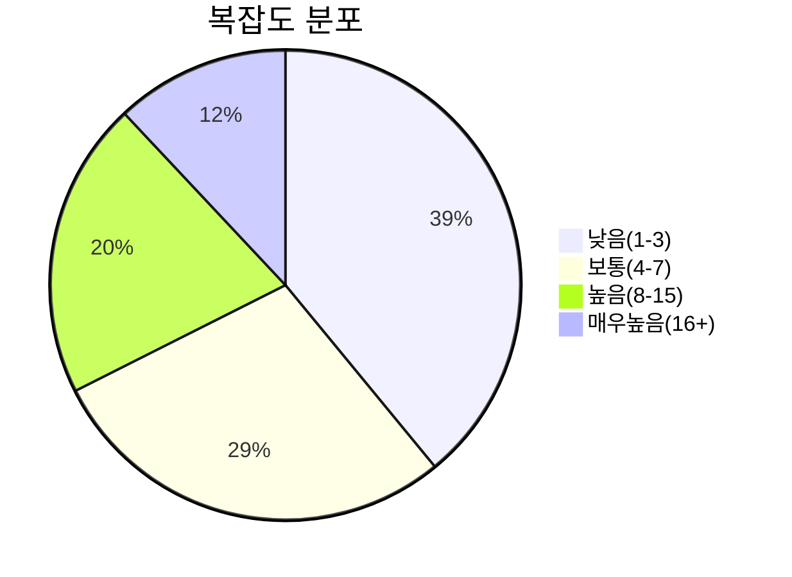

# 📊 프로젝트 요약

> **생성일**: 2025-09-26  
> **분석 대상**: `sample_code`  
> **총 파일 수**: 676개  
> **총 Chunk 수**: 2667개

---

## 🎯 개요

이 문서는 **sample_code** 프로젝트의 전체 구조와 통계를 요약합니다.

## 📝 시스템 개요

'sample_code' 코드베이스는 코드 분석/검증을(를) 수행하며, 이슈/오류 검출, 지표/메트릭 생성, 조건 파싱/분석를(을) 포함합니다.
- 주요 목적: 코드 분석/검증
- 주요 도메인: sample_code
- 핵심 기능 요약: 이슈/오류 검출, 지표/메트릭 생성, 조건 파싱/분석
## 📊 전체 통계

| 🎯 메트릭 | 📊 값 |
|-----------|-------|
| **총 파일 수** | 676 |
| **총 Chunk 수** | 2667 |
| **총 토큰 수** | 327,727 |
| **평균 복잡도** | 9.1 |
| **최대 복잡도** | 249 |

## 🏗️ 디렉토리 구조

```
sample_code/
  ├── rule_analyzer/
    ├── analyzers/
    ├── formatters/
      ├── options/
      ├── templates/
    ├── shared/
      ├── config/
      ├── utils/
    ├── streaming/
      ├── protocols/
      ├── utils/
  ├── vizier(sample)/
    ├── be/
      ├── src/
        ├── main/
          ├── java/
            ├── com/
              ├── lgcns/
                ├── svcp/
                  ├── prod/
                    ├── config/
                    ├── dataaccess/
                      ├── impl/
                    ├── entity/
                      ├── external/
                    ├── online/
                      ├── prod/
                        ├── controller/
                        ├── dto/
                        ├── service/
                    ├── ui/
                      ├── prod/
                        ├── controller/
                        ├── dto/
                          ├── analysis/
                            ├── download/
                          ├── extend/
                          ├── multiEntity/
                            ├── create/
                            ├── detail/
                            ├── rel/
                            ├── search/
                        ├── service/
                    ├── util/
                      ├── excel/
                        ├── annotation/
                      ├── paging/
          ├── resources/
            ├── messages/
            ├── sql/
              ├── mariadb/
              ├── postgresql/
    ├── fe/
      ├── nginx/
      ├── public/
        ├── files/
        ├── img/
      ├── src/
        ├── api/
          ├── prod/
            ├── path/
        ├── assets/
          ├── files/
          ├── icons/
          ├── images/
          ├── scss/
        ├── components/
          ├── Description/
            ├── subs/
          ├── admin/
            ├── factor-management/
              ├── common/
              ├── factor-types/
            ├── matrix-structure/
              ├── common/
            ├── rule-engine/
              ├── rule-structure/
                ├── icon/
            ├── table-structure/
              ├── tab/
          ├── bulk-upload/
          ├── controls/
            ├── examples/
          ├── prod/
            ├── common/
            ├── extends/
              ├── relation/
                ├── manager/
                  ├── form/
                  ├── relation-viewer/
                    ├── common/
                    ├── content/
                    ├── search/
                ├── search/
            ├── icons/
            ├── layout/
            ├── shared/
        ├── composables/
        ├── constants/
        ├── enums/
        ├── events/
        ├── interfaces/
          ├── prod/
        ├── layouts/
        ├── mocks/
          ├── cmcd/
          ├── domain/
          ├── org/
          ├── prod/
            ├── catalog/
              ├── data/
            ├── category/
            ├── extends/
            ├── impact-analysis/
          ├── screen/
          ├── smg/
          ├── user/
          ├── voca/
        ├── pages/
          ├── prod/
            ├── functions/
              ├── extends/
                ├── relation/
        ├── plugins/
        ├── router/
        ├── store/
        ├── styles/
        ├── types/
          ├── catalog/
            ├── component/
        ├── utils/
        ├── views/
      ├── tests/
        ├── e2e/
        ├── setup/
        ├── unit/
```

## 📈 Chunk 분포

### 타입별 분포

| 🧩 Chunk 타입 | 📊 개수 | 📈 비율 |
|---------------|--------|--------|
| overview | 676 | 25.3% |
| class | 150 | 5.6% |
| method | 319 | 12.0% |
| function | 65 | 2.4% |
| async_function | 4 | 0.1% |
| package | 93 | 3.5% |
| interface | 2 | 0.1% |
| template | 355 | 13.3% |
| style | 125 | 4.7% |
| arrow_function | 878 | 32.9% |

### 복잡도 분포



## 🔝 복잡한 함수 TOP 10

| 순위 | 함수명 | 파일 | 복잡도 | 토큰 |
|------|-------|------|--------|-------|
| 1 | `getResponse` | mockServiceWorker.js | 46 | 243 |
| 2 | `handleDragEnded` | BentoGrid.vue | 33 | 128 |
| 3 | `handleRequest` | mockServiceWorker.js | 31 | 121 |
| 4 | `handleHover` | SidebarMenu.vue | 29 | 81 |
| 5 | `handleClick` | SubMenuCommon.vue | 29 | 79 |
| 6 | `_analyze_structure` | rule_analyzer.py | 27 | 961 |
| 7 | `fetchAndSaveTranslations` | fetch-i18n.ts | 26 | 71 |
| 8 | `DFSDetectCycle` | extend-utils.ts | 24 | 80 |
| 9 | `_check_number_field_ambiguity` | issue_detector.py | 22 | 1278 |
| 10 | `_parse_condition_tree` | condition_analyzer.py | 20 | 645 |

## 🏷️ 인기 태그 TOP 20

- **vue**: 972회
- **javascript**: 934회
- **arrow_function**: 878회
- **typescript**: 364회
- **vue.js 컴포넌트**: 355회
- **template**: 355회
- **html**: 355회
- **java**: 276회
- **class**: 243회
- **typescript 파일**: 182회
- **public_method**: 152회
- **private_method**: 145회
- **style**: 125회
- **css**: 125회
- **package**: 93회
- **import**: 93회
- **getter**: 65회
- **function**: 46회
- **sample_code**: 40회
- **rule_analyzer**: 40회

## 📁 디렉토리별 상세 정보

### 📂 rule_analyzer

| 속성 | 값 |
|------|-----|
| **파일 수** | 5 |
| **Chunk 수** | 77 |
| **상대 경로** | `rule_analyzer` |

### 📂 rule_analyzer/analyzers

| 속성 | 값 |
|------|-----|
| **파일 수** | 7 |
| **Chunk 수** | 106 |
| **상대 경로** | `rule_analyzer/analyzers` |

### 📂 rule_analyzer/formatters

| 속성 | 값 |
|------|-----|
| **파일 수** | 3 |
| **Chunk 수** | 25 |
| **상대 경로** | `rule_analyzer/formatters` |

### 📂 rule_analyzer/formatters/options

| 속성 | 값 |
|------|-----|
| **파일 수** | 3 |
| **Chunk 수** | 23 |
| **상대 경로** | `rule_analyzer/formatters/options` |

### 📂 rule_analyzer/formatters/templates

| 속성 | 값 |
|------|-----|
| **파일 수** | 4 |
| **Chunk 수** | 34 |
| **상대 경로** | `rule_analyzer/formatters/templates` |

### 📂 rule_analyzer/shared

| 속성 | 값 |
|------|-----|
| **파일 수** | 2 |
| **Chunk 수** | 10 |
| **상대 경로** | `rule_analyzer/shared` |

### 📂 rule_analyzer/shared/config

| 속성 | 값 |
|------|-----|
| **파일 수** | 2 |
| **Chunk 수** | 20 |
| **상대 경로** | `rule_analyzer/shared/config` |

### 📂 rule_analyzer/shared/utils

| 속성 | 값 |
|------|-----|
| **파일 수** | 4 |
| **Chunk 수** | 34 |
| **상대 경로** | `rule_analyzer/shared/utils` |

### 📂 rule_analyzer/streaming

| 속성 | 값 |
|------|-----|
| **파일 수** | 4 |
| **Chunk 수** | 58 |
| **상대 경로** | `rule_analyzer/streaming` |

### 📂 rule_analyzer/streaming/utils

| 속성 | 값 |
|------|-----|
| **파일 수** | 3 |
| **Chunk 수** | 32 |
| **상대 경로** | `rule_analyzer/streaming/utils` |

### 📂 rule_analyzer/streaming/protocols

| 속성 | 값 |
|------|-----|
| **파일 수** | 3 |
| **Chunk 수** | 21 |
| **상대 경로** | `rule_analyzer/streaming/protocols` |

### 📂 vizier(sample)/be/src/main/java/com/lgcns/svcp/prod

| 속성 | 값 |
|------|-----|
| **파일 수** | 1 |
| **Chunk 수** | 3 |
| **상대 경로** | `vizier(sample)/be/src/main/java/com/lgcns/svcp/prod` |

### 📂 vizier(sample)/be/src/main/java/com/lgcns/svcp/prod/ui/prod/dto/extend

| 속성 | 값 |
|------|-----|
| **파일 수** | 17 |
| **Chunk 수** | 51 |
| **상대 경로** | `vizier(sample)/be/src/main/java/com/lgcns/svcp/prod/ui/prod/dto/extend` |

### 📂 vizier(sample)/be/src/main/java/com/lgcns/svcp/prod/ui/prod/dto/analysis

| 속성 | 값 |
|------|-----|
| **파일 수** | 3 |
| **Chunk 수** | 9 |
| **상대 경로** | `vizier(sample)/be/src/main/java/com/lgcns/svcp/prod/ui/prod/dto/analysis` |

### 📂 vizier(sample)/be/src/main/java/com/lgcns/svcp/prod/ui/prod/dto/analysis/download

| 속성 | 값 |
|------|-----|
| **파일 수** | 1 |
| **Chunk 수** | 3 |
| **상대 경로** | `vizier(sample)/be/src/main/java/com/lgcns/svcp/prod/ui/prod/dto/analysis/download` |

### 📂 vizier(sample)/be/src/main/java/com/lgcns/svcp/prod/ui/prod/dto/multiEntity

| 속성 | 값 |
|------|-----|
| **파일 수** | 2 |
| **Chunk 수** | 6 |
| **상대 경로** | `vizier(sample)/be/src/main/java/com/lgcns/svcp/prod/ui/prod/dto/multiEntity` |

### 📂 vizier(sample)/be/src/main/java/com/lgcns/svcp/prod/ui/prod/dto/multiEntity/search

| 속성 | 값 |
|------|-----|
| **파일 수** | 2 |
| **Chunk 수** | 6 |
| **상대 경로** | `vizier(sample)/be/src/main/java/com/lgcns/svcp/prod/ui/prod/dto/multiEntity/search` |

### 📂 vizier(sample)/be/src/main/java/com/lgcns/svcp/prod/ui/prod/dto/multiEntity/detail

| 속성 | 값 |
|------|-----|
| **파일 수** | 3 |
| **Chunk 수** | 9 |
| **상대 경로** | `vizier(sample)/be/src/main/java/com/lgcns/svcp/prod/ui/prod/dto/multiEntity/detail` |

### 📂 vizier(sample)/be/src/main/java/com/lgcns/svcp/prod/ui/prod/dto/multiEntity/rel

| 속성 | 값 |
|------|-----|
| **파일 수** | 4 |
| **Chunk 수** | 12 |
| **상대 경로** | `vizier(sample)/be/src/main/java/com/lgcns/svcp/prod/ui/prod/dto/multiEntity/rel` |

### 📂 vizier(sample)/be/src/main/java/com/lgcns/svcp/prod/ui/prod/dto/multiEntity/create

| 속성 | 값 |
|------|-----|
| **파일 수** | 1 |
| **Chunk 수** | 3 |
| **상대 경로** | `vizier(sample)/be/src/main/java/com/lgcns/svcp/prod/ui/prod/dto/multiEntity/create` |

### 📂 vizier(sample)/be/src/main/java/com/lgcns/svcp/prod/ui/prod/controller

| 속성 | 값 |
|------|-----|
| **파일 수** | 4 |
| **Chunk 수** | 12 |
| **상대 경로** | `vizier(sample)/be/src/main/java/com/lgcns/svcp/prod/ui/prod/controller` |

### 📂 vizier(sample)/be/src/main/java/com/lgcns/svcp/prod/ui/prod/service

| 속성 | 값 |
|------|-----|
| **파일 수** | 4 |
| **Chunk 수** | 12 |
| **상대 경로** | `vizier(sample)/be/src/main/java/com/lgcns/svcp/prod/ui/prod/service` |

### 📂 vizier(sample)/be/src/main/java/com/lgcns/svcp/prod/util

| 속성 | 값 |
|------|-----|
| **파일 수** | 8 |
| **Chunk 수** | 24 |
| **상대 경로** | `vizier(sample)/be/src/main/java/com/lgcns/svcp/prod/util` |

### 📂 vizier(sample)/be/src/main/java/com/lgcns/svcp/prod/util/excel

| 속성 | 값 |
|------|-----|
| **파일 수** | 7 |
| **Chunk 수** | 21 |
| **상대 경로** | `vizier(sample)/be/src/main/java/com/lgcns/svcp/prod/util/excel` |

### 📂 vizier(sample)/be/src/main/java/com/lgcns/svcp/prod/util/excel/annotation

| 속성 | 값 |
|------|-----|
| **파일 수** | 2 |
| **Chunk 수** | 4 |
| **상대 경로** | `vizier(sample)/be/src/main/java/com/lgcns/svcp/prod/util/excel/annotation` |

### 📂 vizier(sample)/be/src/main/java/com/lgcns/svcp/prod/util/paging

| 속성 | 값 |
|------|-----|
| **파일 수** | 2 |
| **Chunk 수** | 5 |
| **상대 경로** | `vizier(sample)/be/src/main/java/com/lgcns/svcp/prod/util/paging` |

### 📂 vizier(sample)/be/src/main/java/com/lgcns/svcp/prod/config

| 속성 | 값 |
|------|-----|
| **파일 수** | 7 |
| **Chunk 수** | 21 |
| **상대 경로** | `vizier(sample)/be/src/main/java/com/lgcns/svcp/prod/config` |

### 📂 vizier(sample)/be/src/main/java/com/lgcns/svcp/prod/entity

| 속성 | 값 |
|------|-----|
| **파일 수** | 17 |
| **Chunk 수** | 51 |
| **상대 경로** | `vizier(sample)/be/src/main/java/com/lgcns/svcp/prod/entity` |

### 📂 vizier(sample)/be/src/main/java/com/lgcns/svcp/prod/entity/external

| 속성 | 값 |
|------|-----|
| **파일 수** | 2 |
| **Chunk 수** | 6 |
| **상대 경로** | `vizier(sample)/be/src/main/java/com/lgcns/svcp/prod/entity/external` |

### 📂 vizier(sample)/be/src/main/java/com/lgcns/svcp/prod/dataaccess

| 속성 | 값 |
|------|-----|
| **파일 수** | 1 |
| **Chunk 수** | 3 |
| **상대 경로** | `vizier(sample)/be/src/main/java/com/lgcns/svcp/prod/dataaccess` |

### 📂 vizier(sample)/be/src/main/java/com/lgcns/svcp/prod/dataaccess/impl

| 속성 | 값 |
|------|-----|
| **파일 수** | 1 |
| **Chunk 수** | 3 |
| **상대 경로** | `vizier(sample)/be/src/main/java/com/lgcns/svcp/prod/dataaccess/impl` |

### 📂 vizier(sample)/be/src/main/java/com/lgcns/svcp/prod/online/prod/dto

| 속성 | 값 |
|------|-----|
| **파일 수** | 2 |
| **Chunk 수** | 6 |
| **상대 경로** | `vizier(sample)/be/src/main/java/com/lgcns/svcp/prod/online/prod/dto` |

### 📂 vizier(sample)/be/src/main/java/com/lgcns/svcp/prod/online/prod/controller

| 속성 | 값 |
|------|-----|
| **파일 수** | 1 |
| **Chunk 수** | 3 |
| **상대 경로** | `vizier(sample)/be/src/main/java/com/lgcns/svcp/prod/online/prod/controller` |

### 📂 vizier(sample)/be/src/main/java/com/lgcns/svcp/prod/online/prod/service

| 속성 | 값 |
|------|-----|
| **파일 수** | 1 |
| **Chunk 수** | 3 |
| **상대 경로** | `vizier(sample)/be/src/main/java/com/lgcns/svcp/prod/online/prod/service` |

### 📂 vizier(sample)/fe

| 속성 | 값 |
|------|-----|
| **파일 수** | 5 |
| **Chunk 수** | 5 |
| **상대 경로** | `vizier(sample)/fe` |

### 📂 vizier(sample)/fe/tests/unit

| 속성 | 값 |
|------|-----|
| **파일 수** | 1 |
| **Chunk 수** | 1 |
| **상대 경로** | `vizier(sample)/fe/tests/unit` |

### 📂 vizier(sample)/fe/tests/setup

| 속성 | 값 |
|------|-----|
| **파일 수** | 2 |
| **Chunk 수** | 3 |
| **상대 경로** | `vizier(sample)/fe/tests/setup` |

### 📂 vizier(sample)/fe/tests/e2e

| 속성 | 값 |
|------|-----|
| **파일 수** | 2 |
| **Chunk 수** | 2 |
| **상대 경로** | `vizier(sample)/fe/tests/e2e` |

### 📂 vizier(sample)/fe/public

| 속성 | 값 |
|------|-----|
| **파일 수** | 1 |
| **Chunk 수** | 8 |
| **상대 경로** | `vizier(sample)/fe/public` |

### 📂 vizier(sample)/fe/src

| 속성 | 값 |
|------|-----|
| **파일 수** | 6 |
| **Chunk 수** | 9 |
| **상대 경로** | `vizier(sample)/fe/src` |

### 📂 vizier(sample)/fe/src/mocks

| 속성 | 값 |
|------|-----|
| **파일 수** | 3 |
| **Chunk 수** | 5 |
| **상대 경로** | `vizier(sample)/fe/src/mocks` |

### 📂 vizier(sample)/fe/src/mocks/prod

| 속성 | 값 |
|------|-----|
| **파일 수** | 2 |
| **Chunk 수** | 2 |
| **상대 경로** | `vizier(sample)/fe/src/mocks/prod` |

### 📂 vizier(sample)/fe/src/mocks/prod/extends

| 속성 | 값 |
|------|-----|
| **파일 수** | 1 |
| **Chunk 수** | 1 |
| **상대 경로** | `vizier(sample)/fe/src/mocks/prod/extends` |

### 📂 vizier(sample)/fe/src/mocks/prod/category

| 속성 | 값 |
|------|-----|
| **파일 수** | 2 |
| **Chunk 수** | 2 |
| **상대 경로** | `vizier(sample)/fe/src/mocks/prod/category` |

### 📂 vizier(sample)/fe/src/mocks/prod/catalog

| 속성 | 값 |
|------|-----|
| **파일 수** | 4 |
| **Chunk 수** | 4 |
| **상대 경로** | `vizier(sample)/fe/src/mocks/prod/catalog` |

### 📂 vizier(sample)/fe/src/mocks/prod/catalog/data

| 속성 | 값 |
|------|-----|
| **파일 수** | 4 |
| **Chunk 수** | 4 |
| **상대 경로** | `vizier(sample)/fe/src/mocks/prod/catalog/data` |

### 📂 vizier(sample)/fe/src/mocks/prod/impact-analysis

| 속성 | 값 |
|------|-----|
| **파일 수** | 6 |
| **Chunk 수** | 6 |
| **상대 경로** | `vizier(sample)/fe/src/mocks/prod/impact-analysis` |

### 📂 vizier(sample)/fe/src/mocks/smg

| 속성 | 값 |
|------|-----|
| **파일 수** | 2 |
| **Chunk 수** | 3 |
| **상대 경로** | `vizier(sample)/fe/src/mocks/smg` |

### 📂 vizier(sample)/fe/src/mocks/voca

| 속성 | 값 |
|------|-----|
| **파일 수** | 2 |
| **Chunk 수** | 2 |
| **상대 경로** | `vizier(sample)/fe/src/mocks/voca` |

### 📂 vizier(sample)/fe/src/mocks/org

| 속성 | 값 |
|------|-----|
| **파일 수** | 2 |
| **Chunk 수** | 2 |
| **상대 경로** | `vizier(sample)/fe/src/mocks/org` |

### 📂 vizier(sample)/fe/src/mocks/user

| 속성 | 값 |
|------|-----|
| **파일 수** | 2 |
| **Chunk 수** | 3 |
| **상대 경로** | `vizier(sample)/fe/src/mocks/user` |

### 📂 vizier(sample)/fe/src/mocks/cmcd

| 속성 | 값 |
|------|-----|
| **파일 수** | 2 |
| **Chunk 수** | 3 |
| **상대 경로** | `vizier(sample)/fe/src/mocks/cmcd` |

### 📂 vizier(sample)/fe/src/mocks/screen

| 속성 | 값 |
|------|-----|
| **파일 수** | 2 |
| **Chunk 수** | 4 |
| **상대 경로** | `vizier(sample)/fe/src/mocks/screen` |

### 📂 vizier(sample)/fe/src/mocks/domain

| 속성 | 값 |
|------|-----|
| **파일 수** | 2 |
| **Chunk 수** | 3 |
| **상대 경로** | `vizier(sample)/fe/src/mocks/domain` |

### 📂 vizier(sample)/fe/src/types

| 속성 | 값 |
|------|-----|
| **파일 수** | 2 |
| **Chunk 수** | 4 |
| **상대 경로** | `vizier(sample)/fe/src/types` |

### 📂 vizier(sample)/fe/src/types/catalog/component

| 속성 | 값 |
|------|-----|
| **파일 수** | 1 |
| **Chunk 수** | 1 |
| **상대 경로** | `vizier(sample)/fe/src/types/catalog/component` |

### 📂 vizier(sample)/fe/src/composables

| 속성 | 값 |
|------|-----|
| **파일 수** | 9 |
| **Chunk 수** | 24 |
| **상대 경로** | `vizier(sample)/fe/src/composables` |

### 📂 vizier(sample)/fe/src/plugins

| 속성 | 값 |
|------|-----|
| **파일 수** | 1 |
| **Chunk 수** | 2 |
| **상대 경로** | `vizier(sample)/fe/src/plugins` |

### 📂 vizier(sample)/fe/src/constants

| 속성 | 값 |
|------|-----|
| **파일 수** | 14 |
| **Chunk 수** | 15 |
| **상대 경로** | `vizier(sample)/fe/src/constants` |

### 📂 vizier(sample)/fe/src/enums

| 속성 | 값 |
|------|-----|
| **파일 수** | 8 |
| **Chunk 수** | 8 |
| **상대 경로** | `vizier(sample)/fe/src/enums` |

### 📂 vizier(sample)/fe/src/utils

| 속성 | 값 |
|------|-----|
| **파일 수** | 11 |
| **Chunk 수** | 64 |
| **상대 경로** | `vizier(sample)/fe/src/utils` |

### 📂 vizier(sample)/fe/src/components/prod/extends/relation/search

| 속성 | 값 |
|------|-----|
| **파일 수** | 2 |
| **Chunk 수** | 12 |
| **상대 경로** | `vizier(sample)/fe/src/components/prod/extends/relation/search` |

### 📂 vizier(sample)/fe/src/components/prod/extends/relation/manager

| 속성 | 값 |
|------|-----|
| **파일 수** | 4 |
| **Chunk 수** | 16 |
| **상대 경로** | `vizier(sample)/fe/src/components/prod/extends/relation/manager` |

### 📂 vizier(sample)/fe/src/components/prod/extends/relation/manager/relation-viewer/content

| 속성 | 값 |
|------|-----|
| **파일 수** | 3 |
| **Chunk 수** | 30 |
| **상대 경로** | `vizier(sample)/fe/src/components/prod/extends/relation/manager/relation-viewer/content` |

### 📂 vizier(sample)/fe/src/components/prod/extends/relation/manager/relation-viewer/search

| 속성 | 값 |
|------|-----|
| **파일 수** | 3 |
| **Chunk 수** | 19 |
| **상대 경로** | `vizier(sample)/fe/src/components/prod/extends/relation/manager/relation-viewer/search` |

### 📂 vizier(sample)/fe/src/components/prod/extends/relation/manager/relation-viewer/common

| 속성 | 값 |
|------|-----|
| **파일 수** | 4 |
| **Chunk 수** | 37 |
| **상대 경로** | `vizier(sample)/fe/src/components/prod/extends/relation/manager/relation-viewer/common` |

### 📂 vizier(sample)/fe/src/components/prod/extends/relation/manager/form

| 속성 | 값 |
|------|-----|
| **파일 수** | 2 |
| **Chunk 수** | 16 |
| **상대 경로** | `vizier(sample)/fe/src/components/prod/extends/relation/manager/form` |

### 📂 vizier(sample)/fe/src/components/prod/layout

| 속성 | 값 |
|------|-----|
| **파일 수** | 20 |
| **Chunk 수** | 101 |
| **상대 경로** | `vizier(sample)/fe/src/components/prod/layout` |

### 📂 vizier(sample)/fe/src/components/prod/shared

| 속성 | 값 |
|------|-----|
| **파일 수** | 17 |
| **Chunk 수** | 180 |
| **상대 경로** | `vizier(sample)/fe/src/components/prod/shared` |

### 📂 vizier(sample)/fe/src/components/prod/common

| 속성 | 값 |
|------|-----|
| **파일 수** | 35 |
| **Chunk 수** | 166 |
| **상대 경로** | `vizier(sample)/fe/src/components/prod/common` |

### 📂 vizier(sample)/fe/src/components/prod/icons

| 속성 | 값 |
|------|-----|
| **파일 수** | 173 |
| **Chunk 수** | 347 |
| **상대 경로** | `vizier(sample)/fe/src/components/prod/icons` |

### 📂 vizier(sample)/fe/src/components/admin/rule-engine

| 속성 | 값 |
|------|-----|
| **파일 수** | 8 |
| **Chunk 수** | 64 |
| **상대 경로** | `vizier(sample)/fe/src/components/admin/rule-engine` |

### 📂 vizier(sample)/fe/src/components/admin/rule-engine/rule-structure

| 속성 | 값 |
|------|-----|
| **파일 수** | 7 |
| **Chunk 수** | 23 |
| **상대 경로** | `vizier(sample)/fe/src/components/admin/rule-engine/rule-structure` |

### 📂 vizier(sample)/fe/src/components/admin/rule-engine/rule-structure/icon

| 속성 | 값 |
|------|-----|
| **파일 수** | 2 |
| **Chunk 수** | 6 |
| **상대 경로** | `vizier(sample)/fe/src/components/admin/rule-engine/rule-structure/icon` |

### 📂 vizier(sample)/fe/src/components/admin/matrix-structure

| 속성 | 값 |
|------|-----|
| **파일 수** | 4 |
| **Chunk 수** | 62 |
| **상대 경로** | `vizier(sample)/fe/src/components/admin/matrix-structure` |

### 📂 vizier(sample)/fe/src/components/admin/matrix-structure/common

| 속성 | 값 |
|------|-----|
| **파일 수** | 2 |
| **Chunk 수** | 17 |
| **상대 경로** | `vizier(sample)/fe/src/components/admin/matrix-structure/common` |

### 📂 vizier(sample)/fe/src/components/admin/table-structure

| 속성 | 값 |
|------|-----|
| **파일 수** | 4 |
| **Chunk 수** | 60 |
| **상대 경로** | `vizier(sample)/fe/src/components/admin/table-structure` |

### 📂 vizier(sample)/fe/src/components/admin/table-structure/tab

| 속성 | 값 |
|------|-----|
| **파일 수** | 2 |
| **Chunk 수** | 12 |
| **상대 경로** | `vizier(sample)/fe/src/components/admin/table-structure/tab` |

### 📂 vizier(sample)/fe/src/components/admin/factor-management

| 속성 | 값 |
|------|-----|
| **파일 수** | 4 |
| **Chunk 수** | 44 |
| **상대 경로** | `vizier(sample)/fe/src/components/admin/factor-management` |

### 📂 vizier(sample)/fe/src/components/admin/factor-management/common

| 속성 | 값 |
|------|-----|
| **파일 수** | 3 |
| **Chunk 수** | 18 |
| **상대 경로** | `vizier(sample)/fe/src/components/admin/factor-management/common` |

### 📂 vizier(sample)/fe/src/components/admin/factor-management/factor-types

| 속성 | 값 |
|------|-----|
| **파일 수** | 2 |
| **Chunk 수** | 19 |
| **상대 경로** | `vizier(sample)/fe/src/components/admin/factor-management/factor-types` |

### 📂 vizier(sample)/fe/src/components/controls

| 속성 | 값 |
|------|-----|
| **파일 수** | 28 |
| **Chunk 수** | 120 |
| **상대 경로** | `vizier(sample)/fe/src/components/controls` |

### 📂 vizier(sample)/fe/src/components/controls/examples

| 속성 | 값 |
|------|-----|
| **파일 수** | 20 |
| **Chunk 수** | 31 |
| **상대 경로** | `vizier(sample)/fe/src/components/controls/examples` |

### 📂 vizier(sample)/fe/src/components/Description

| 속성 | 값 |
|------|-----|
| **파일 수** | 1 |
| **Chunk 수** | 5 |
| **상대 경로** | `vizier(sample)/fe/src/components/Description` |

### 📂 vizier(sample)/fe/src/components/Description/subs

| 속성 | 값 |
|------|-----|
| **파일 수** | 1 |
| **Chunk 수** | 5 |
| **상대 경로** | `vizier(sample)/fe/src/components/Description/subs` |

### 📂 vizier(sample)/fe/src/components/bulk-upload

| 속성 | 값 |
|------|-----|
| **파일 수** | 8 |
| **Chunk 수** | 21 |
| **상대 경로** | `vizier(sample)/fe/src/components/bulk-upload` |

### 📂 vizier(sample)/fe/src/layouts

| 속성 | 값 |
|------|-----|
| **파일 수** | 3 |
| **Chunk 수** | 15 |
| **상대 경로** | `vizier(sample)/fe/src/layouts` |

### 📂 vizier(sample)/fe/src/api/prod

| 속성 | 값 |
|------|-----|
| **파일 수** | 15 |
| **Chunk 수** | 121 |
| **상대 경로** | `vizier(sample)/fe/src/api/prod` |

### 📂 vizier(sample)/fe/src/api/prod/path

| 속성 | 값 |
|------|-----|
| **파일 수** | 1 |
| **Chunk 수** | 1 |
| **상대 경로** | `vizier(sample)/fe/src/api/prod/path` |

### 📂 vizier(sample)/fe/src/events

| 속성 | 값 |
|------|-----|
| **파일 수** | 1 |
| **Chunk 수** | 1 |
| **상대 경로** | `vizier(sample)/fe/src/events` |

### 📂 vizier(sample)/fe/src/views

| 속성 | 값 |
|------|-----|
| **파일 수** | 3 |
| **Chunk 수** | 6 |
| **상대 경로** | `vizier(sample)/fe/src/views` |

### 📂 vizier(sample)/fe/src/pages

| 속성 | 값 |
|------|-----|
| **파일 수** | 1 |
| **Chunk 수** | 2 |
| **상대 경로** | `vizier(sample)/fe/src/pages` |

### 📂 vizier(sample)/fe/src/pages/prod/functions

| 속성 | 값 |
|------|-----|
| **파일 수** | 4 |
| **Chunk 수** | 16 |
| **상대 경로** | `vizier(sample)/fe/src/pages/prod/functions` |

### 📂 vizier(sample)/fe/src/pages/prod/functions/extends/relation

| 속성 | 값 |
|------|-----|
| **파일 수** | 4 |
| **Chunk 수** | 17 |
| **상대 경로** | `vizier(sample)/fe/src/pages/prod/functions/extends/relation` |

### 📂 vizier(sample)/fe/src/interfaces

| 속성 | 값 |
|------|-----|
| **파일 수** | 1 |
| **Chunk 수** | 1 |
| **상대 경로** | `vizier(sample)/fe/src/interfaces` |

### 📂 vizier(sample)/fe/src/interfaces/prod

| 속성 | 값 |
|------|-----|
| **파일 수** | 18 |
| **Chunk 수** | 18 |
| **상대 경로** | `vizier(sample)/fe/src/interfaces/prod` |

### 📂 vizier(sample)/fe/src/store

| 속성 | 값 |
|------|-----|
| **파일 수** | 33 |
| **Chunk 수** | 130 |
| **상대 경로** | `vizier(sample)/fe/src/store` |

### 📂 vizier(sample)/fe/src/router

| 속성 | 값 |
|------|-----|
| **파일 수** | 1 |
| **Chunk 수** | 2 |
| **상대 경로** | `vizier(sample)/fe/src/router` |


## 🧩 주요 모듈별 기능 요약

### rule_analyzer
- 설명: 모듈 기능 요약
- 주요 클래스/함수: __init__.py, advanced_analyzer.py, chunk_builder.py, condition_analyzer.py, config_manager.py, constants.py### vizier(sample)
- 설명: 모듈 기능 요약
- 주요 클래스/함수: AIChatBotIcon.vue, AIIcon.vue, AIcon.vue, AddLabelIcon.vue, AdditionalTab.vue, AdminIcon.vue
## 🛠️ 코드 품질 인사이트

- 잠재적 리스크 파일: vizier(sample)/fe/src/components/prod/extends/relation/manager/relation-viewer/common/ExtendAccordionGroupRow.vue, vizier(sample)/fe/src/components/admin/table-structure/TableContent.vue, vizier(sample)/be/src/main/java/com/lgcns/svcp/prod/ui/prod/service/UIExtendsService.java, vizier(sample)/fe/src/components/prod/extends/relation/manager/relation-viewer/content/ExtendsFocusColumn.vue, vizier(sample)/fe/src/components/admin/rule-engine/RuleSearch.vue, vizier(sample)/be/src/main/java/com/lgcns/svcp/prod/util/excel/ExcelReader.java, rule_analyzer/analyzers/issue_detector.py, vizier(sample)/fe/src/utils/format-data.ts- 중복 코드 발생 구간: 3곳
- 테스트 관련 코드 비율: 0%

## 🚀 개선 제안

- 리팩토링 우선순위: vizier(sample)/fe/src/components/prod/extends/relation/manager/relation-viewer/common/ExtendAccordionGroupRow.vue, vizier(sample)/fe/src/components/admin/table-structure/TableContent.vue, vizier(sample)/be/src/main/java/com/lgcns/svcp/prod/ui/prod/service/UIExtendsService.java, vizier(sample)/fe/src/components/prod/extends/relation/manager/relation-viewer/content/ExtendsFocusColumn.vue, vizier(sample)/fe/src/components/admin/rule-engine/RuleSearch.vue- 추천 리팩토링 기법: 큰 함수 분리(SRP), 타입 힌트/정적 분석 강화, 단위 테스트 추가, 복잡도 높은 분기 단순화, 핵심 경로 우선 리팩토링- 현대화 가이드라인: CI 도입 및 자동 테스트, 로깅/옵저버빌리티 강화, 설정의 환경변수화/보안 비밀 분리
---

*이 요약은 AST 파싱을 통해 자동 생성되었습니다.*