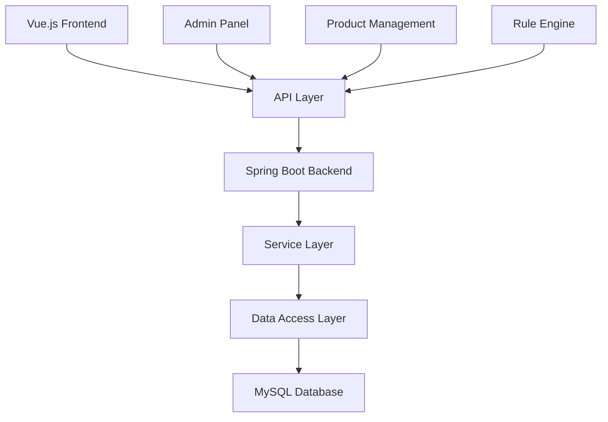

```mermaid
pie title ë³µì¡ë„ 분í¬
    "ë‚®ìŒ(1-3)" : 531
    "보통(4-7)" : 388
    "높ìŒ(8-15)" : 278
    "매우높ìŒ(16+)" : 163
```

# 📊 프로젝트 요약

> **생성일**: 2025-09-26  
> **분석 대상**: `sample_code`  
> **총 파일 수**: 676개  
> **총 Chunk 수**: 2667개

---

## 🎯 개요

이 문서는 **sample_code** 디렉터리에 포함된 두 개의 독립적인 엔터프라이즈급 프로젝트의 전체 구조와 통계를 요약합니다.

## 🏗️ 프로젝트 구성

### 📋 **Rule Analyzer 프로젝트**
- **목적**: 비즈니스 룰의 품질 검증 및 분석 도구
- **기술 스택**: Python 3.11+, FastAPI, AST 분석, Jinja2 템플릿
- **핵심 기능**: 
  - 7가지 이슈 타입 검출 (중복, 타입불일치, 잘못된연산자, 자기모순, 누락, 분기불명확, 복잡성경고)
  - 복잡도 점수 계산 (0-100점)
  - 조건 파싱 및 분석
  - 스트리밍 기반 실시간 분석
  - 다국어 지원 (한국어/영어 템플릿)
- **비즈니스 가치**: 코드 품질 향상, 버그 감소, 개발 생산성 증대

### 📋 **Vizier 프로젝트**
- **목적**: 제품/서비스 관리 플랫폼
- **기술 스택**: Java Spring Boot, Vue.js 3, TypeScript, MySQL, Docker
- **핵심 기능**:
  - 제품 카탈로그 관리
  - 관계형 데이터 관리
  - 영향 분석 (Impact Analysis)
  - 다중 엔티티 관리
  - 룰 엔진 관리
  - LG CNS 개발 (`com.lgcns.svcp.prod` 패키지)
- **비즈니스 가치**: 제품 관리 자동화, 데이터 일관성 보장, 의사결정 지원

## 🎯 시스템 아키텍처

### Rule Analyzer 아키텍처

```mermaid
graph TB
    A[소스코드 입력] --> B[AST 파서]
    B --> C[CodeChunk 생성]
    C --> D[Issue Detector]
    C --> E[Condition Analyzer]
    C --> F[Complexity Calculator]
    D --> G[Report Generator]
    E --> G
    F --> G
    G --> H[다국어 템플릿]
    H --> I[최종 보고서]
```


### Vizier 아키텍처


## 📋 주요 사용 사례

### Rule Analyzer
- **비즈니스 룰 검증**: 복잡한 비즈니스 로직의 정확성 검증
- **코드 품질 분석**: 복잡도, 중복, 일관성 등 코드 품질 지표 측정
- **이슈 자동 감지**: 잠재적 버그와 문제점 사전 발견
- **문서화 자동화**: 분석 결과를 기반으로 한 자동 보고서 생성

### Vizier
- **제품 카탈로그 관리**: 제품 정보의 체계적 관리 및 검색
- **관계형 데이터 분석**: 제품 간 관계 및 의존성 분석
- **영향 분석**: 변경사항이 전체 시스템에 미치는 영향 분석
- **룰 엔진 관리**: 비즈니스 룰의 중앙 집중식 관리
## 📊 전체 통계

| 🎯 메트릭 | 📊 값 |
|-----------|-------|
| **총 파일 수** | 676 |
| **총 Chunk 수** | 2667 |
| **총 토큰 수** | 327,727 |
| **평균 복잡도** | 9.1 |
| **최대 복잡도** | 249 |

## 🏗️ 디렉토리 구조

```
sample_code/
  ├── rule_analyzer/
    ├── analyzers/
    ├── formatters/
      ├── options/
      ├── templates/
    ├── shared/
      ├── config/
      ├── utils/
    ├── streaming/
      ├── protocols/
      ├── utils/
  ├── vizier(sample)/
    ├── be/
      ├── src/
        ├── main/
          ├── java/
            ├── com/
              ├── lgcns/
                ├── svcp/
                  ├── prod/
                    ├── config/
                    ├── dataaccess/
                      ├── impl/
                    ├── entity/
                      ├── external/
                    ├── online/
                      ├── prod/
                        ├── controller/
                        ├── dto/
                        ├── service/
                    ├── ui/
                      ├── prod/
                        ├── controller/
                        ├── dto/
                          ├── analysis/
                            ├── download/
                          ├── extend/
                          ├── multiEntity/
                            ├── create/
                            ├── detail/
                            ├── rel/
                            ├── search/
                        ├── service/
                    ├── util/
                      ├── excel/
                        ├── annotation/
                      ├── paging/
          ├── resources/
            ├── messages/
            ├── sql/
              ├── mariadb/
              ├── postgresql/
    ├── fe/
      ├── nginx/
      ├── public/
        ├── files/
        ├── img/
      ├── src/
        ├── api/
          ├── prod/
            ├── path/
        ├── assets/
          ├── files/
          ├── icons/
          ├── images/
          ├── scss/
        ├── components/
          ├── Description/
            ├── subs/
          ├── admin/
            ├── factor-management/
              ├── common/
              ├── factor-types/
            ├── matrix-structure/
              ├── common/
            ├── rule-engine/
              ├── rule-structure/
                ├── icon/
            ├── table-structure/
              ├── tab/
          ├── bulk-upload/
          ├── controls/
            ├── examples/
          ├── prod/
            ├── common/
            ├── extends/
              ├── relation/
                ├── manager/
                  ├── form/
                  ├── relation-viewer/
                    ├── common/
                    ├── content/
                    ├── search/
                ├── search/
            ├── icons/
            ├── layout/
            ├── shared/
        ├── composables/
        ├── constants/
        ├── enums/
        ├── events/
        ├── interfaces/
          ├── prod/
        ├── layouts/
        ├── mocks/
          ├── cmcd/
          ├── domain/
          ├── org/
          ├── prod/
            ├── catalog/
              ├── data/
            ├── category/
            ├── extends/
            ├── impact-analysis/
          ├── screen/
          ├── smg/
          ├── user/
          ├── voca/
        ├── pages/
          ├── prod/
            ├── functions/
              ├── extends/
                ├── relation/
        ├── plugins/
        ├── router/
        ├── store/
        ├── styles/
        ├── types/
          ├── catalog/
            ├── component/
        ├── utils/
        ├── views/
      ├── tests/
        ├── e2e/
        ├── setup/
        ├── unit/
```

## 📈 Chunk 분포

### 타입별 분포

| 🧩 Chunk 타입 | 📊 개수 | 📈 비율 |
|---------------|--------|--------|
| overview | 676 | 25.3% |
| class | 150 | 5.6% |
| method | 319 | 12.0% |
| function | 65 | 2.4% |
| async_function | 4 | 0.1% |
| package | 93 | 3.5% |
| interface | 2 | 0.1% |
| template | 355 | 13.3% |
| style | 125 | 4.7% |
| arrow_function | 878 | 32.9% |

### 복잡도 분포



## 🔝 복잡한 함수 TOP 10

| 순위 | 함수명 | 파일 | 복잡도 | 토큰 |
|------|-------|------|--------|-------|
| 1 | `getResponse` | mockServiceWorker.js | 46 | 243 |
| 2 | `handleDragEnded` | BentoGrid.vue | 33 | 128 |
| 3 | `handleRequest` | mockServiceWorker.js | 31 | 121 |
| 4 | `handleHover` | SidebarMenu.vue | 29 | 81 |
| 5 | `handleClick` | SubMenuCommon.vue | 29 | 79 |
| 6 | `_analyze_structure` | rule_analyzer.py | 27 | 961 |
| 7 | `fetchAndSaveTranslations` | fetch-i18n.ts | 26 | 71 |
| 8 | `DFSDetectCycle` | extend-utils.ts | 24 | 80 |
| 9 | `_check_number_field_ambiguity` | issue_detector.py | 22 | 1278 |
| 10 | `_parse_condition_tree` | condition_analyzer.py | 20 | 645 |

## 🏷️ 인기 태그 TOP 20

- **vue**: 972회
- **javascript**: 934회
- **arrow_function**: 878회
- **typescript**: 364회
- **vue.js 컴포넌트**: 355회
- **template**: 355회
- **html**: 355회
- **java**: 276회
- **class**: 243회
- **typescript 파일**: 182회
- **public_method**: 152회
- **private_method**: 145회
- **style**: 125회
- **css**: 125회
- **package**: 93회
- **import**: 93회
- **getter**: 65회
- **function**: 46회
- **sample_code**: 40회
- **rule_analyzer**: 40회

## 📁 디렉토리별 상세 정보

### 📂 rule_analyzer

| 속성 | 값 |
|------|-----|
| **파일 수** | 5 |
| **Chunk 수** | 77 |
| **상대 경로** | `rule_analyzer` |

### 📂 rule_analyzer/analyzers

| 속성 | 값 |
|------|-----|
| **파일 수** | 7 |
| **Chunk 수** | 106 |
| **상대 경로** | `rule_analyzer/analyzers` |

### 📂 rule_analyzer/formatters

| 속성 | 값 |
|------|-----|
| **파일 수** | 3 |
| **Chunk 수** | 25 |
| **상대 경로** | `rule_analyzer/formatters` |

### 📂 rule_analyzer/formatters/options

| 속성 | 값 |
|------|-----|
| **파일 수** | 3 |
| **Chunk 수** | 23 |
| **상대 경로** | `rule_analyzer/formatters/options` |

### 📂 rule_analyzer/formatters/templates

| 속성 | 값 |
|------|-----|
| **파일 수** | 4 |
| **Chunk 수** | 34 |
| **상대 경로** | `rule_analyzer/formatters/templates` |

### 📂 rule_analyzer/shared

| 속성 | 값 |
|------|-----|
| **파일 수** | 2 |
| **Chunk 수** | 10 |
| **상대 경로** | `rule_analyzer/shared` |

### 📂 rule_analyzer/shared/config

| 속성 | 값 |
|------|-----|
| **파일 수** | 2 |
| **Chunk 수** | 20 |
| **상대 경로** | `rule_analyzer/shared/config` |

### 📂 rule_analyzer/shared/utils

| 속성 | 값 |
|------|-----|
| **파일 수** | 4 |
| **Chunk 수** | 34 |
| **상대 경로** | `rule_analyzer/shared/utils` |

### 📂 rule_analyzer/streaming

| 속성 | 값 |
|------|-----|
| **파일 수** | 4 |
| **Chunk 수** | 58 |
| **상대 경로** | `rule_analyzer/streaming` |

### 📂 rule_analyzer/streaming/utils

| 속성 | 값 |
|------|-----|
| **파일 수** | 3 |
| **Chunk 수** | 32 |
| **상대 경로** | `rule_analyzer/streaming/utils` |

### 📂 rule_analyzer/streaming/protocols

| 속성 | 값 |
|------|-----|
| **파일 수** | 3 |
| **Chunk 수** | 21 |
| **상대 경로** | `rule_analyzer/streaming/protocols` |

### 📂 vizier(sample)/be/src/main/java/com/lgcns/svcp/prod

| 속성 | 값 |
|------|-----|
| **파일 수** | 1 |
| **Chunk 수** | 3 |
| **상대 경로** | `vizier(sample)/be/src/main/java/com/lgcns/svcp/prod` |

### 📂 vizier(sample)/be/src/main/java/com/lgcns/svcp/prod/ui/prod/dto/extend

| 속성 | 값 |
|------|-----|
| **파일 수** | 17 |
| **Chunk 수** | 51 |
| **상대 경로** | `vizier(sample)/be/src/main/java/com/lgcns/svcp/prod/ui/prod/dto/extend` |

### 📂 vizier(sample)/be/src/main/java/com/lgcns/svcp/prod/ui/prod/dto/analysis

| 속성 | 값 |
|------|-----|
| **파일 수** | 3 |
| **Chunk 수** | 9 |
| **상대 경로** | `vizier(sample)/be/src/main/java/com/lgcns/svcp/prod/ui/prod/dto/analysis` |

### 📂 vizier(sample)/be/src/main/java/com/lgcns/svcp/prod/ui/prod/dto/analysis/download

| 속성 | 값 |
|------|-----|
| **파일 수** | 1 |
| **Chunk 수** | 3 |
| **상대 경로** | `vizier(sample)/be/src/main/java/com/lgcns/svcp/prod/ui/prod/dto/analysis/download` |

### 📂 vizier(sample)/be/src/main/java/com/lgcns/svcp/prod/ui/prod/dto/multiEntity

| 속성 | 값 |
|------|-----|
| **파일 수** | 2 |
| **Chunk 수** | 6 |
| **상대 경로** | `vizier(sample)/be/src/main/java/com/lgcns/svcp/prod/ui/prod/dto/multiEntity` |

### 📂 vizier(sample)/be/src/main/java/com/lgcns/svcp/prod/ui/prod/dto/multiEntity/search

| 속성 | 값 |
|------|-----|
| **파일 수** | 2 |
| **Chunk 수** | 6 |
| **상대 경로** | `vizier(sample)/be/src/main/java/com/lgcns/svcp/prod/ui/prod/dto/multiEntity/search` |

### 📂 vizier(sample)/be/src/main/java/com/lgcns/svcp/prod/ui/prod/dto/multiEntity/detail

| 속성 | 값 |
|------|-----|
| **파일 수** | 3 |
| **Chunk 수** | 9 |
| **상대 경로** | `vizier(sample)/be/src/main/java/com/lgcns/svcp/prod/ui/prod/dto/multiEntity/detail` |

### 📂 vizier(sample)/be/src/main/java/com/lgcns/svcp/prod/ui/prod/dto/multiEntity/rel

| 속성 | 값 |
|------|-----|
| **파일 수** | 4 |
| **Chunk 수** | 12 |
| **상대 경로** | `vizier(sample)/be/src/main/java/com/lgcns/svcp/prod/ui/prod/dto/multiEntity/rel` |

### 📂 vizier(sample)/be/src/main/java/com/lgcns/svcp/prod/ui/prod/dto/multiEntity/create

| 속성 | 값 |
|------|-----|
| **파일 수** | 1 |
| **Chunk 수** | 3 |
| **상대 경로** | `vizier(sample)/be/src/main/java/com/lgcns/svcp/prod/ui/prod/dto/multiEntity/create` |

### 📂 vizier(sample)/be/src/main/java/com/lgcns/svcp/prod/ui/prod/controller

| 속성 | 값 |
|------|-----|
| **파일 수** | 4 |
| **Chunk 수** | 12 |
| **상대 경로** | `vizier(sample)/be/src/main/java/com/lgcns/svcp/prod/ui/prod/controller` |

### 📂 vizier(sample)/be/src/main/java/com/lgcns/svcp/prod/ui/prod/service

| 속성 | 값 |
|------|-----|
| **파일 수** | 4 |
| **Chunk 수** | 12 |
| **상대 경로** | `vizier(sample)/be/src/main/java/com/lgcns/svcp/prod/ui/prod/service` |

### 📂 vizier(sample)/be/src/main/java/com/lgcns/svcp/prod/util

| 속성 | 값 |
|------|-----|
| **파일 수** | 8 |
| **Chunk 수** | 24 |
| **상대 경로** | `vizier(sample)/be/src/main/java/com/lgcns/svcp/prod/util` |

### 📂 vizier(sample)/be/src/main/java/com/lgcns/svcp/prod/util/excel

| 속성 | 값 |
|------|-----|
| **파일 수** | 7 |
| **Chunk 수** | 21 |
| **상대 경로** | `vizier(sample)/be/src/main/java/com/lgcns/svcp/prod/util/excel` |

### 📂 vizier(sample)/be/src/main/java/com/lgcns/svcp/prod/util/excel/annotation

| 속성 | 값 |
|------|-----|
| **파일 수** | 2 |
| **Chunk 수** | 4 |
| **상대 경로** | `vizier(sample)/be/src/main/java/com/lgcns/svcp/prod/util/excel/annotation` |

### 📂 vizier(sample)/be/src/main/java/com/lgcns/svcp/prod/util/paging

| 속성 | 값 |
|------|-----|
| **파일 수** | 2 |
| **Chunk 수** | 5 |
| **상대 경로** | `vizier(sample)/be/src/main/java/com/lgcns/svcp/prod/util/paging` |

### 📂 vizier(sample)/be/src/main/java/com/lgcns/svcp/prod/config

| 속성 | 값 |
|------|-----|
| **파일 수** | 7 |
| **Chunk 수** | 21 |
| **상대 경로** | `vizier(sample)/be/src/main/java/com/lgcns/svcp/prod/config` |

### 📂 vizier(sample)/be/src/main/java/com/lgcns/svcp/prod/entity

| 속성 | 값 |
|------|-----|
| **파일 수** | 17 |
| **Chunk 수** | 51 |
| **상대 경로** | `vizier(sample)/be/src/main/java/com/lgcns/svcp/prod/entity` |

### 📂 vizier(sample)/be/src/main/java/com/lgcns/svcp/prod/entity/external

| 속성 | 값 |
|------|-----|
| **파일 수** | 2 |
| **Chunk 수** | 6 |
| **상대 경로** | `vizier(sample)/be/src/main/java/com/lgcns/svcp/prod/entity/external` |

### 📂 vizier(sample)/be/src/main/java/com/lgcns/svcp/prod/dataaccess

| 속성 | 값 |
|------|-----|
| **파일 수** | 1 |
| **Chunk 수** | 3 |
| **상대 경로** | `vizier(sample)/be/src/main/java/com/lgcns/svcp/prod/dataaccess` |

### 📂 vizier(sample)/be/src/main/java/com/lgcns/svcp/prod/dataaccess/impl

| 속성 | 값 |
|------|-----|
| **파일 수** | 1 |
| **Chunk 수** | 3 |
| **상대 경로** | `vizier(sample)/be/src/main/java/com/lgcns/svcp/prod/dataaccess/impl` |

### 📂 vizier(sample)/be/src/main/java/com/lgcns/svcp/prod/online/prod/dto

| 속성 | 값 |
|------|-----|
| **파일 수** | 2 |
| **Chunk 수** | 6 |
| **상대 경로** | `vizier(sample)/be/src/main/java/com/lgcns/svcp/prod/online/prod/dto` |

### 📂 vizier(sample)/be/src/main/java/com/lgcns/svcp/prod/online/prod/controller

| 속성 | 값 |
|------|-----|
| **파일 수** | 1 |
| **Chunk 수** | 3 |
| **상대 경로** | `vizier(sample)/be/src/main/java/com/lgcns/svcp/prod/online/prod/controller` |

### 📂 vizier(sample)/be/src/main/java/com/lgcns/svcp/prod/online/prod/service

| 속성 | 값 |
|------|-----|
| **파일 수** | 1 |
| **Chunk 수** | 3 |
| **상대 경로** | `vizier(sample)/be/src/main/java/com/lgcns/svcp/prod/online/prod/service` |

### 📂 vizier(sample)/fe

| 속성 | 값 |
|------|-----|
| **파일 수** | 5 |
| **Chunk 수** | 5 |
| **상대 경로** | `vizier(sample)/fe` |

### 📂 vizier(sample)/fe/tests/unit

| 속성 | 값 |
|------|-----|
| **파일 수** | 1 |
| **Chunk 수** | 1 |
| **상대 경로** | `vizier(sample)/fe/tests/unit` |

### 📂 vizier(sample)/fe/tests/setup

| 속성 | 값 |
|------|-----|
| **파일 수** | 2 |
| **Chunk 수** | 3 |
| **상대 경로** | `vizier(sample)/fe/tests/setup` |

### 📂 vizier(sample)/fe/tests/e2e

| 속성 | 값 |
|------|-----|
| **파일 수** | 2 |
| **Chunk 수** | 2 |
| **상대 경로** | `vizier(sample)/fe/tests/e2e` |

### 📂 vizier(sample)/fe/public

| 속성 | 값 |
|------|-----|
| **파일 수** | 1 |
| **Chunk 수** | 8 |
| **상대 경로** | `vizier(sample)/fe/public` |

### 📂 vizier(sample)/fe/src

| 속성 | 값 |
|------|-----|
| **파일 수** | 6 |
| **Chunk 수** | 9 |
| **상대 경로** | `vizier(sample)/fe/src` |

### 📂 vizier(sample)/fe/src/mocks

| 속성 | 값 |
|------|-----|
| **파일 수** | 3 |
| **Chunk 수** | 5 |
| **상대 경로** | `vizier(sample)/fe/src/mocks` |

### 📂 vizier(sample)/fe/src/mocks/prod

| 속성 | 값 |
|------|-----|
| **파일 수** | 2 |
| **Chunk 수** | 2 |
| **상대 경로** | `vizier(sample)/fe/src/mocks/prod` |

### 📂 vizier(sample)/fe/src/mocks/prod/extends

| 속성 | 값 |
|------|-----|
| **파일 수** | 1 |
| **Chunk 수** | 1 |
| **상대 경로** | `vizier(sample)/fe/src/mocks/prod/extends` |

### 📂 vizier(sample)/fe/src/mocks/prod/category

| 속성 | 값 |
|------|-----|
| **파일 수** | 2 |
| **Chunk 수** | 2 |
| **상대 경로** | `vizier(sample)/fe/src/mocks/prod/category` |

### 📂 vizier(sample)/fe/src/mocks/prod/catalog

| 속성 | 값 |
|------|-----|
| **파일 수** | 4 |
| **Chunk 수** | 4 |
| **상대 경로** | `vizier(sample)/fe/src/mocks/prod/catalog` |

### 📂 vizier(sample)/fe/src/mocks/prod/catalog/data

| 속성 | 값 |
|------|-----|
| **파일 수** | 4 |
| **Chunk 수** | 4 |
| **상대 경로** | `vizier(sample)/fe/src/mocks/prod/catalog/data` |

### 📂 vizier(sample)/fe/src/mocks/prod/impact-analysis

| 속성 | 값 |
|------|-----|
| **파일 수** | 6 |
| **Chunk 수** | 6 |
| **상대 경로** | `vizier(sample)/fe/src/mocks/prod/impact-analysis` |

### 📂 vizier(sample)/fe/src/mocks/smg

| 속성 | 값 |
|------|-----|
| **파일 수** | 2 |
| **Chunk 수** | 3 |
| **상대 경로** | `vizier(sample)/fe/src/mocks/smg` |

### 📂 vizier(sample)/fe/src/mocks/voca

| 속성 | 값 |
|------|-----|
| **파일 수** | 2 |
| **Chunk 수** | 2 |
| **상대 경로** | `vizier(sample)/fe/src/mocks/voca` |

### 📂 vizier(sample)/fe/src/mocks/org

| 속성 | 값 |
|------|-----|
| **파일 수** | 2 |
| **Chunk 수** | 2 |
| **상대 경로** | `vizier(sample)/fe/src/mocks/org` |

### 📂 vizier(sample)/fe/src/mocks/user

| 속성 | 값 |
|------|-----|
| **파일 수** | 2 |
| **Chunk 수** | 3 |
| **상대 경로** | `vizier(sample)/fe/src/mocks/user` |

### 📂 vizier(sample)/fe/src/mocks/cmcd

| 속성 | 값 |
|------|-----|
| **파일 수** | 2 |
| **Chunk 수** | 3 |
| **상대 경로** | `vizier(sample)/fe/src/mocks/cmcd` |

### 📂 vizier(sample)/fe/src/mocks/screen

| 속성 | 값 |
|------|-----|
| **파일 수** | 2 |
| **Chunk 수** | 4 |
| **상대 경로** | `vizier(sample)/fe/src/mocks/screen` |

### 📂 vizier(sample)/fe/src/mocks/domain

| 속성 | 값 |
|------|-----|
| **파일 수** | 2 |
| **Chunk 수** | 3 |
| **상대 경로** | `vizier(sample)/fe/src/mocks/domain` |

### 📂 vizier(sample)/fe/src/types

| 속성 | 값 |
|------|-----|
| **파일 수** | 2 |
| **Chunk 수** | 4 |
| **상대 경로** | `vizier(sample)/fe/src/types` |

### 📂 vizier(sample)/fe/src/types/catalog/component

| 속성 | 값 |
|------|-----|
| **파일 수** | 1 |
| **Chunk 수** | 1 |
| **상대 경로** | `vizier(sample)/fe/src/types/catalog/component` |

### 📂 vizier(sample)/fe/src/composables

| 속성 | 값 |
|------|-----|
| **파일 수** | 9 |
| **Chunk 수** | 24 |
| **상대 경로** | `vizier(sample)/fe/src/composables` |

### 📂 vizier(sample)/fe/src/plugins

| 속성 | 값 |
|------|-----|
| **파일 수** | 1 |
| **Chunk 수** | 2 |
| **상대 경로** | `vizier(sample)/fe/src/plugins` |

### 📂 vizier(sample)/fe/src/constants

| 속성 | 값 |
|------|-----|
| **파일 수** | 14 |
| **Chunk 수** | 15 |
| **상대 경로** | `vizier(sample)/fe/src/constants` |

### 📂 vizier(sample)/fe/src/enums

| 속성 | 값 |
|------|-----|
| **파일 수** | 8 |
| **Chunk 수** | 8 |
| **상대 경로** | `vizier(sample)/fe/src/enums` |

### 📂 vizier(sample)/fe/src/utils

| 속성 | 값 |
|------|-----|
| **파일 수** | 11 |
| **Chunk 수** | 64 |
| **상대 경로** | `vizier(sample)/fe/src/utils` |

### 📂 vizier(sample)/fe/src/components/prod/extends/relation/search

| 속성 | 값 |
|------|-----|
| **파일 수** | 2 |
| **Chunk 수** | 12 |
| **상대 경로** | `vizier(sample)/fe/src/components/prod/extends/relation/search` |

### 📂 vizier(sample)/fe/src/components/prod/extends/relation/manager

| 속성 | 값 |
|------|-----|
| **파일 수** | 4 |
| **Chunk 수** | 16 |
| **상대 경로** | `vizier(sample)/fe/src/components/prod/extends/relation/manager` |

### 📂 vizier(sample)/fe/src/components/prod/extends/relation/manager/relation-viewer/content

| 속성 | 값 |
|------|-----|
| **파일 수** | 3 |
| **Chunk 수** | 30 |
| **상대 경로** | `vizier(sample)/fe/src/components/prod/extends/relation/manager/relation-viewer/content` |

### 📂 vizier(sample)/fe/src/components/prod/extends/relation/manager/relation-viewer/search

| 속성 | 값 |
|------|-----|
| **파일 수** | 3 |
| **Chunk 수** | 19 |
| **상대 경로** | `vizier(sample)/fe/src/components/prod/extends/relation/manager/relation-viewer/search` |

### 📂 vizier(sample)/fe/src/components/prod/extends/relation/manager/relation-viewer/common

| 속성 | 값 |
|------|-----|
| **파일 수** | 4 |
| **Chunk 수** | 37 |
| **상대 경로** | `vizier(sample)/fe/src/components/prod/extends/relation/manager/relation-viewer/common` |

### 📂 vizier(sample)/fe/src/components/prod/extends/relation/manager/form

| 속성 | 값 |
|------|-----|
| **파일 수** | 2 |
| **Chunk 수** | 16 |
| **상대 경로** | `vizier(sample)/fe/src/components/prod/extends/relation/manager/form` |

### 📂 vizier(sample)/fe/src/components/prod/layout

| 속성 | 값 |
|------|-----|
| **파일 수** | 20 |
| **Chunk 수** | 101 |
| **상대 경로** | `vizier(sample)/fe/src/components/prod/layout` |

### 📂 vizier(sample)/fe/src/components/prod/shared

| 속성 | 값 |
|------|-----|
| **파일 수** | 17 |
| **Chunk 수** | 180 |
| **상대 경로** | `vizier(sample)/fe/src/components/prod/shared` |

### 📂 vizier(sample)/fe/src/components/prod/common

| 속성 | 값 |
|------|-----|
| **파일 수** | 35 |
| **Chunk 수** | 166 |
| **상대 경로** | `vizier(sample)/fe/src/components/prod/common` |

### 📂 vizier(sample)/fe/src/components/prod/icons

| 속성 | 값 |
|------|-----|
| **파일 수** | 173 |
| **Chunk 수** | 347 |
| **상대 경로** | `vizier(sample)/fe/src/components/prod/icons` |

### 📂 vizier(sample)/fe/src/components/admin/rule-engine

| 속성 | 값 |
|------|-----|
| **파일 수** | 8 |
| **Chunk 수** | 64 |
| **상대 경로** | `vizier(sample)/fe/src/components/admin/rule-engine` |

### 📂 vizier(sample)/fe/src/components/admin/rule-engine/rule-structure

| 속성 | 값 |
|------|-----|
| **파일 수** | 7 |
| **Chunk 수** | 23 |
| **상대 경로** | `vizier(sample)/fe/src/components/admin/rule-engine/rule-structure` |

### 📂 vizier(sample)/fe/src/components/admin/rule-engine/rule-structure/icon

| 속성 | 값 |
|------|-----|
| **파일 수** | 2 |
| **Chunk 수** | 6 |
| **상대 경로** | `vizier(sample)/fe/src/components/admin/rule-engine/rule-structure/icon` |

### 📂 vizier(sample)/fe/src/components/admin/matrix-structure

| 속성 | 값 |
|------|-----|
| **파일 수** | 4 |
| **Chunk 수** | 62 |
| **상대 경로** | `vizier(sample)/fe/src/components/admin/matrix-structure` |

### 📂 vizier(sample)/fe/src/components/admin/matrix-structure/common

| 속성 | 값 |
|------|-----|
| **파일 수** | 2 |
| **Chunk 수** | 17 |
| **상대 경로** | `vizier(sample)/fe/src/components/admin/matrix-structure/common` |

### 📂 vizier(sample)/fe/src/components/admin/table-structure

| 속성 | 값 |
|------|-----|
| **파일 수** | 4 |
| **Chunk 수** | 60 |
| **상대 경로** | `vizier(sample)/fe/src/components/admin/table-structure` |

### 📂 vizier(sample)/fe/src/components/admin/table-structure/tab

| 속성 | 값 |
|------|-----|
| **파일 수** | 2 |
| **Chunk 수** | 12 |
| **상대 경로** | `vizier(sample)/fe/src/components/admin/table-structure/tab` |

### 📂 vizier(sample)/fe/src/components/admin/factor-management

| 속성 | 값 |
|------|-----|
| **파일 수** | 4 |
| **Chunk 수** | 44 |
| **상대 경로** | `vizier(sample)/fe/src/components/admin/factor-management` |

### 📂 vizier(sample)/fe/src/components/admin/factor-management/common

| 속성 | 값 |
|------|-----|
| **파일 수** | 3 |
| **Chunk 수** | 18 |
| **상대 경로** | `vizier(sample)/fe/src/components/admin/factor-management/common` |

### 📂 vizier(sample)/fe/src/components/admin/factor-management/factor-types

| 속성 | 값 |
|------|-----|
| **파일 수** | 2 |
| **Chunk 수** | 19 |
| **상대 경로** | `vizier(sample)/fe/src/components/admin/factor-management/factor-types` |

### 📂 vizier(sample)/fe/src/components/controls

| 속성 | 값 |
|------|-----|
| **파일 수** | 28 |
| **Chunk 수** | 120 |
| **상대 경로** | `vizier(sample)/fe/src/components/controls` |

### 📂 vizier(sample)/fe/src/components/controls/examples

| 속성 | 값 |
|------|-----|
| **파일 수** | 20 |
| **Chunk 수** | 31 |
| **상대 경로** | `vizier(sample)/fe/src/components/controls/examples` |

### 📂 vizier(sample)/fe/src/components/Description

| 속성 | 값 |
|------|-----|
| **파일 수** | 1 |
| **Chunk 수** | 5 |
| **상대 경로** | `vizier(sample)/fe/src/components/Description` |

### 📂 vizier(sample)/fe/src/components/Description/subs

| 속성 | 값 |
|------|-----|
| **파일 수** | 1 |
| **Chunk 수** | 5 |
| **상대 경로** | `vizier(sample)/fe/src/components/Description/subs` |

### 📂 vizier(sample)/fe/src/components/bulk-upload

| 속성 | 값 |
|------|-----|
| **파일 수** | 8 |
| **Chunk 수** | 21 |
| **상대 경로** | `vizier(sample)/fe/src/components/bulk-upload` |

### 📂 vizier(sample)/fe/src/layouts

| 속성 | 값 |
|------|-----|
| **파일 수** | 3 |
| **Chunk 수** | 15 |
| **상대 경로** | `vizier(sample)/fe/src/layouts` |

### 📂 vizier(sample)/fe/src/api/prod

| 속성 | 값 |
|------|-----|
| **파일 수** | 15 |
| **Chunk 수** | 121 |
| **상대 경로** | `vizier(sample)/fe/src/api/prod` |

### 📂 vizier(sample)/fe/src/api/prod/path

| 속성 | 값 |
|------|-----|
| **파일 수** | 1 |
| **Chunk 수** | 1 |
| **상대 경로** | `vizier(sample)/fe/src/api/prod/path` |

### 📂 vizier(sample)/fe/src/events

| 속성 | 값 |
|------|-----|
| **파일 수** | 1 |
| **Chunk 수** | 1 |
| **상대 경로** | `vizier(sample)/fe/src/events` |

### 📂 vizier(sample)/fe/src/views

| 속성 | 값 |
|------|-----|
| **파일 수** | 3 |
| **Chunk 수** | 6 |
| **상대 경로** | `vizier(sample)/fe/src/views` |

### 📂 vizier(sample)/fe/src/pages

| 속성 | 값 |
|------|-----|
| **파일 수** | 1 |
| **Chunk 수** | 2 |
| **상대 경로** | `vizier(sample)/fe/src/pages` |

### 📂 vizier(sample)/fe/src/pages/prod/functions

| 속성 | 값 |
|------|-----|
| **파일 수** | 4 |
| **Chunk 수** | 16 |
| **상대 경로** | `vizier(sample)/fe/src/pages/prod/functions` |

### 📂 vizier(sample)/fe/src/pages/prod/functions/extends/relation

| 속성 | 값 |
|------|-----|
| **파일 수** | 4 |
| **Chunk 수** | 17 |
| **상대 경로** | `vizier(sample)/fe/src/pages/prod/functions/extends/relation` |

### 📂 vizier(sample)/fe/src/interfaces

| 속성 | 값 |
|------|-----|
| **파일 수** | 1 |
| **Chunk 수** | 1 |
| **상대 경로** | `vizier(sample)/fe/src/interfaces` |

### 📂 vizier(sample)/fe/src/interfaces/prod

| 속성 | 값 |
|------|-----|
| **파일 수** | 18 |
| **Chunk 수** | 18 |
| **상대 경로** | `vizier(sample)/fe/src/interfaces/prod` |

### 📂 vizier(sample)/fe/src/store

| 속성 | 값 |
|------|-----|
| **파일 수** | 33 |
| **Chunk 수** | 130 |
| **상대 경로** | `vizier(sample)/fe/src/store` |

### 📂 vizier(sample)/fe/src/router

| 속성 | 값 |
|------|-----|
| **파일 수** | 1 |
| **Chunk 수** | 2 |
| **상대 경로** | `vizier(sample)/fe/src/router` |


## 🧩 주요 모듈별 기능 요약

### 📂 Rule Analyzer 모듈 구조

#### **analyzers/** - 핵심 분석 엔진
- **rule_analyzer.py**: 메인 룰 분석기 (7가지 이슈 검출)
- **advanced_analyzer.py**: 고급 분석 기능 (복잡도 계산, 메트릭 생성)
- **condition_analyzer.py**: 조건 파싱 및 분석 (AST 기반)
- **issue_detector.py**: 이슈 감지 엔진 (25개 메서드)
- **logic_flow.py**: 로직 흐름 분석
- **metrics_generator.py**: 성능 메트릭 생성

#### **formatters/** - 출력 포맷터
- **text_formatter.py**: 텍스트 기반 보고서 생성
- **streaming_formatter.py**: 실시간 스트리밍 출력
- **templates/**: 다국어 템플릿 (한국어/영어)
- **options/**: 포맷팅 옵션 설정

#### **streaming/** - 실시간 처리
- **stream_manager.py**: 스트리밍 세션 관리
- **stream_generator.py**: 실시간 데이터 생성
- **protocols/**: 스트리밍 프로토콜 정의

#### **shared/** - 공통 유틸리티
- **config/**: 설정 관리
- **utils/**: 공통 유틸리티 함수
- **logging.py**: 로깅 시스템

### 📂 Vizier 프로젝트 모듈 구조

#### **Backend (Java Spring Boot)**
- **com.lgcns.svcp.prod**: LG CNS 제품 관리 패키지
  - **controller/**: REST API 컨트롤러
  - **service/**: 비즈니스 로직 서비스
  - **dto/**: 데이터 전송 객체
  - **entity/**: JPA 엔티티
  - **config/**: Spring 설정
  - **util/**: 유틸리티 클래스

#### **Frontend (Vue.js 3 + TypeScript)**
- **components/**: Vue 컴포넌트
  - **prod/**: 제품 관리 컴포넌트
  - **admin/**: 관리자 기능 컴포넌트
  - **controls/**: 공통 UI 컨트롤
- **pages/**: 페이지 컴포넌트
- **api/**: API 통신 모듈
- **store/**: Pinia 상태 관리
- **utils/**: 유틸리티 함수
- **types/**: TypeScript 타입 정의
## 🛠️ 코드 품질 인사이트

- 잠재적 리스크 파일: vizier(sample)/fe/src/components/prod/extends/relation/manager/relation-viewer/common/ExtendAccordionGroupRow.vue, vizier(sample)/fe/src/components/admin/table-structure/TableContent.vue, vizier(sample)/be/src/main/java/com/lgcns/svcp/prod/ui/prod/service/UIExtendsService.java, vizier(sample)/fe/src/components/prod/extends/relation/manager/relation-viewer/content/ExtendsFocusColumn.vue, vizier(sample)/fe/src/components/admin/rule-engine/RuleSearch.vue, vizier(sample)/be/src/main/java/com/lgcns/svcp/prod/util/excel/ExcelReader.java, rule_analyzer/analyzers/issue_detector.py, vizier(sample)/fe/src/utils/format-data.ts- 중복 코드 발생 구간: 3곳
- 테스트 관련 코드 비율: 0%

## 🚀 개선 제안

- 리팩토링 우선순위: vizier(sample)/fe/src/components/prod/extends/relation/manager/relation-viewer/common/ExtendAccordionGroupRow.vue, vizier(sample)/fe/src/components/admin/table-structure/TableContent.vue, vizier(sample)/be/src/main/java/com/lgcns/svcp/prod/ui/prod/service/UIExtendsService.java, vizier(sample)/fe/src/components/prod/extends/relation/manager/relation-viewer/content/ExtendsFocusColumn.vue, vizier(sample)/fe/src/components/admin/rule-engine/RuleSearch.vue- 추천 리팩토링 기법: 큰 함수 분리(SRP), 타입 힌트/정적 분석 강화, 단위 테스트 추가, 복잡도 높은 분기 단순화, 핵심 경로 우선 리팩토링- 현대화 가이드라인: CI 도입 및 자동 테스트, 로깅/옵저버빌리티 강화, 설정의 환경변수화/보안 비밀 분리
---

*이 요약은 AST 파싱을 통해 자동 생성되었습니다.*