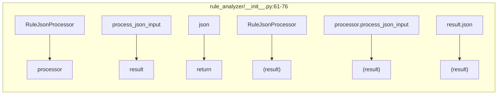
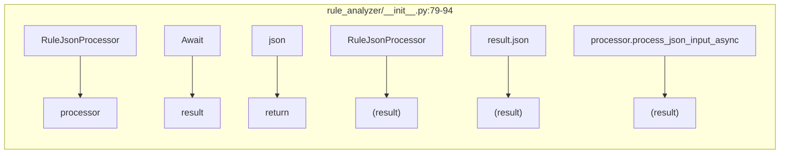
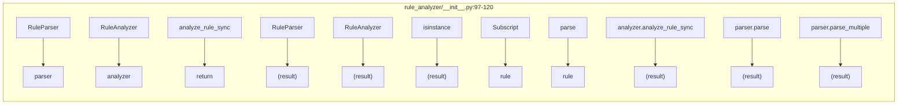
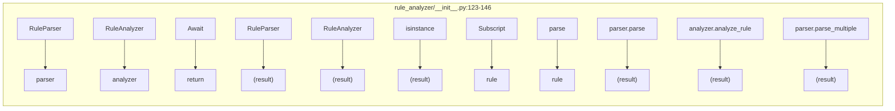
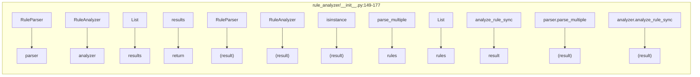
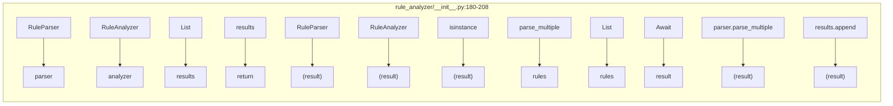
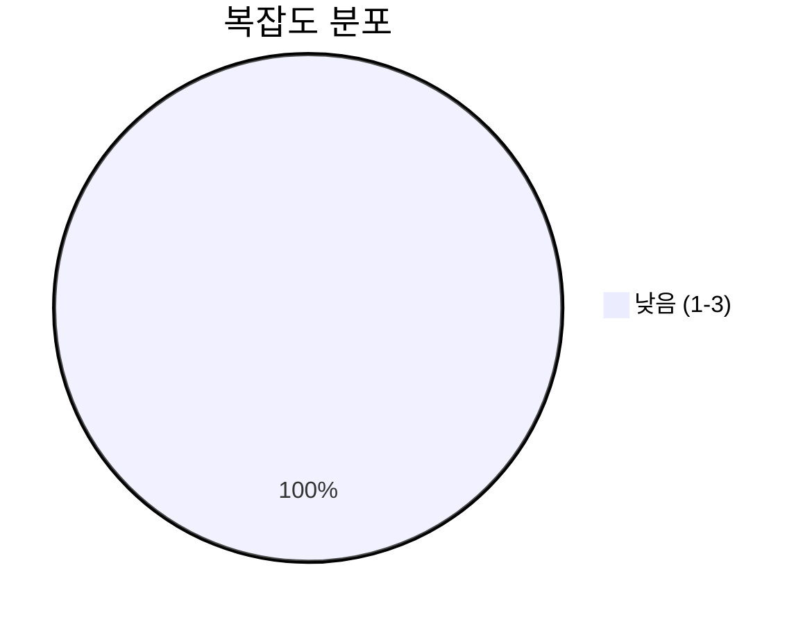
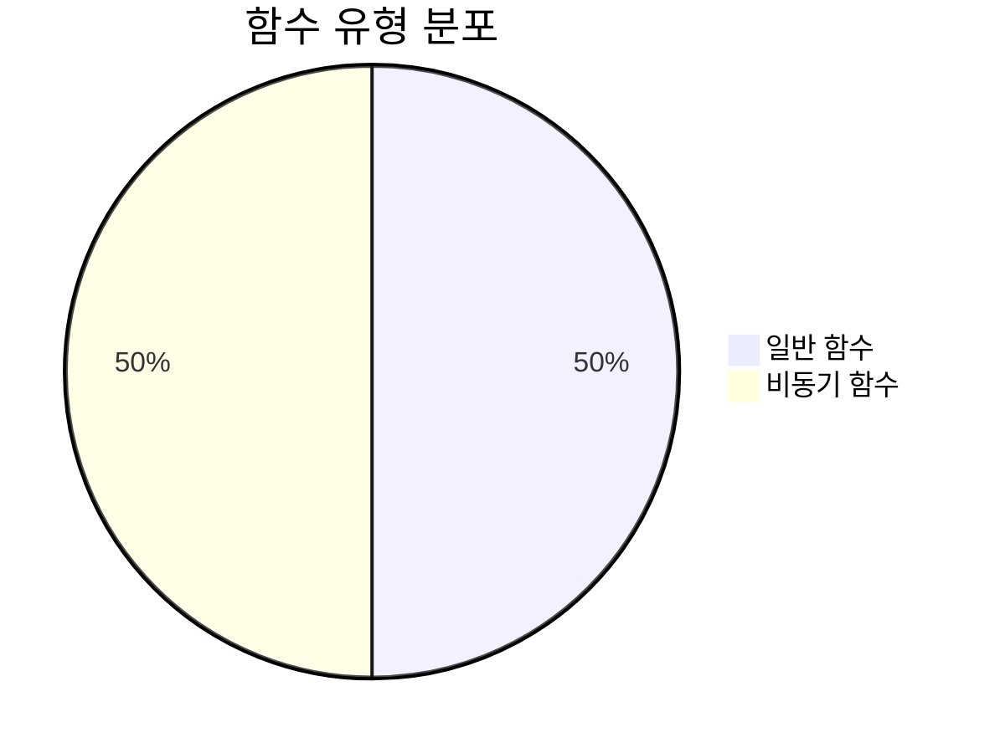
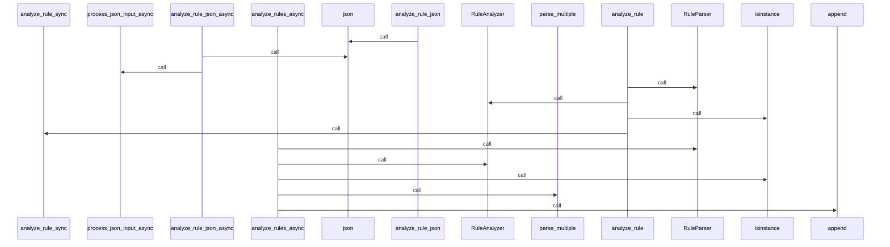
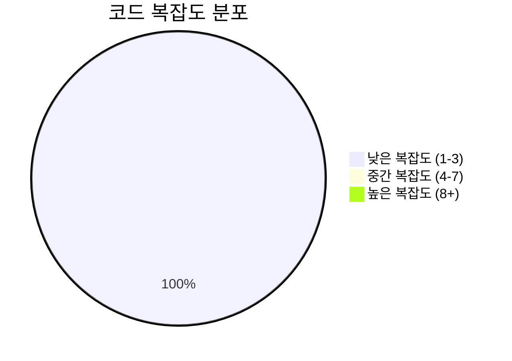

# 📄 __init__.py

> **파일 경로**: `rule_analyzer/__init__.py`  
> **생성일**: 2025-09-26  
> **Chunk 수**: 7개

---

## 📑 목차

### ⚙️ 함수
- [`analyze_rule_json`](#function-analyze_rule_json) - 복잡도: 1
- [`analyze_rule_json_async`](#function-analyze_rule_json_async) 🔄 - 복잡도: 1
- [`analyze_rule`](#function-analyze_rule) - 복잡도: 2
- [`analyze_rule_async`](#function-analyze_rule_async) 🔄 - 복잡도: 2
- [`analyze_rules`](#function-analyze_rules) - 복잡도: 3
- [`analyze_rules_async`](#function-analyze_rules_async) 🔄 - 복잡도: 3


## 📋 파일 개요

| | |
|--|--|
| 📦 **의존성**: `importlib` • `typing` • `json_processor` • `models` • `analyzers` • `exceptions` 외 1개 | ⚡ **총 복잡도**: 12 |
| 📊 **총 토큰 수**: 1,509 | 🔄 **비동기 함수**: 3개 |


## ⚙️ 함수

### <a id="function-analyze_rule_json"></a>🔧 `analyze_rule_json`


> 📖 **함수 설명**  
> JSON으로 룰을 분석하고 JSON 결과를 반환

Why: 상위 시스템이 표준 JSON만 전달해도 분석/검증 결과를 구조화된 JSON으로 즉시 받을 수 있게 하기 위함입니다.
How: 입력을 파싱한 뒤 단일/배치 여부를 판별하여 RuleAnalyzer로 분석하고, 결과를 JSON 직렬화하여 반환합니다.

Args:
    json_input: JSON 입력 (룰 배열, 래퍼 객체, 또는 JSON 문자열)

Returns:
    JSON 결과 문자열

| 속성 | 값 |
|------|----|
| ⚡ 복잡도 | 1 |
| 📊 토큰 수 | 203 |
| 📍 라인 범위 | 61-76 |


#### 🧩 시그니처 상세

- **Signature**: `analyze_rule_json(json_input: Union[str, list, dict]) -> str`- **Parameters**: `json_input: Union[str, list, dict]`
- **Returns**: `str`


#### 📞 Calls

`RuleJsonProcessor`, `process_json_input`, `json`

#### 🧭 DATA FLOW



<details>
<summary>💻 코드 미리보기</summary>

```python
def analyze_rule_json(json_input: Union[str, list, dict]) -> str:
    """
    JSON으로 룰을 분석하고 JSON 결과를 반환

    Why: 상위 시스템이 표준 JSON만 전달해도 분석/검증 결과를 구조화된 JSON으로 즉시 받을 수 있게 하기 위함입니다.
    How: 입력을 파싱한 뒤 단일/배치 여부를 판별하여 RuleAnalyzer로 분석하고, 결과를 JSON 직렬화하여 반환합니다.

    Args:
        json_input: JSON 입력 (룰 배열, 래퍼 객체, 또는 JSON 문자열)

    Returns:
        JSON 결과 문자열
    """
    processor = RuleJsonProcessor()
    result = processor.process_json_input(json_input)
    return result.json()...
```

**Chunk 메타데이터**
- 🆔 **ID**: `f7bfcf6da457`
- 🏷️ **태그**: ``

</details>

---

### <a id="function-analyze_rule_json_async"></a>🔧 `analyze_rule_json_async`

 

> 📖 **함수 설명**  
> JSON으로 룰을 비동기 분석하고 JSON 결과를 반환

Why: 대량/동시 요청 환경에서 블로킹 없이 빠르게 분석 파이프라인을 처리하기 위함입니다.
How: 비동기 파서/분석기를 활용하여 이벤트 루프에서 처리하고, 결과를 JSON으로 직렬화합니다.

Args:
    json_input: JSON 입력 (룰 배열, 래퍼 객체, 또는 JSON 문자열)

Returns:
    JSON 결과 문자열

| 속성 | 값 |
|------|----|
| ⚡ 복잡도 | 1 |
| 📊 토큰 수 | 197 |
| 📍 라인 범위 | 79-94 |


#### 🧩 시그니처 상세

- **Signature**: `analyze_rule_json_async(json_input: Union[str, list, dict]) -> str`- **Parameters**: `json_input: Union[str, list, dict]`
- **Returns**: `str`


#### 📞 Calls

`RuleJsonProcessor`, `json`, `process_json_input_async`

#### 🧭 DATA FLOW



<details>
<summary>💻 코드 미리보기</summary>

```python
async def analyze_rule_json_async(json_input: Union[str, list, dict]) -> str:
    """
    JSON으로 룰을 비동기 분석하고 JSON 결과를 반환

    Why: 대량/동시 요청 환경에서 블로킹 없이 빠르게 분석 파이프라인을 처리하기 위함입니다.
    How: 비동기 파서/분석기를 활용하여 이벤트 루프에서 처리하고, 결과를 JSON으로 직렬화합니다.

    Args:
        json_input: JSON 입력 (룰 배열, 래퍼 객체, 또는 JSON 문자열)

    Returns:
        JSON 결과 문자열
    """
    processor = RuleJsonProcessor()
    result = await processor.process_json_input_async(json_input)
    return result.json()...
```

**Chunk 메타데이터**
- 🆔 **ID**: `98b43d36be3a`
- 🏷️ **태그**: `async`

</details>

---

### <a id="function-analyze_rule"></a>🔧 `analyze_rule`


> 📖 **함수 설명**  
> 룰 데이터를 분석하여 ValidationResult를 반환

Why: 애플리케이션 코드에서 간단히 호출해 즉시 분석 결과 객체를 활용하기 위함입니다.
How: 입력을 파싱하여 Rule 객체로 만든 뒤 RuleAnalyzer로 검증/이슈/복잡도/품질 메트릭을 계산합니다.

Args:
    rule_data: 룰 데이터 딕셔너리 또는 룰 배열

Returns:
    ValidationResult: 분석 결과

| 속성 | 값 |
|------|----|
| ⚡ 복잡도 | 2 |
| 📊 토큰 수 | 246 |
| 📍 라인 범위 | 97-120 |


#### 🧩 시그니처 상세

- **Signature**: `analyze_rule(rule_data: Union[dict, list]) -> ValidationResult`- **Parameters**: `rule_data: Union[dict, list]`
- **Returns**: `ValidationResult`


#### 📞 Calls

`RuleParser`, `RuleAnalyzer`, `isinstance`, `analyze_rule_sync`, `parse`, `parse_multiple`

#### 🧭 DATA FLOW



<details>
<summary>💻 코드 미리보기</summary>

```python
def analyze_rule(rule_data: Union[dict, list]) -> ValidationResult:
    """
    룰 데이터를 분석하여 ValidationResult를 반환

    Why: 애플리케이션 코드에서 간단히 호출해 즉시 분석 결과 객체를 활용하기 위함입니다.
    How: 입력을 파싱하여 Rule 객체로 만든 뒤 RuleAnalyzer로 검증/이슈/복잡도/품질 메트릭을 계산합니다.

    Args:
        rule_data: 룰 데이터 딕셔너리 또는 룰 배열

    Returns:
        ValidationResult: 분석 결과
    """
    parser = RuleParser()
    analyzer = RuleAnalyzer()

    if isinstance(rule_data, list):
        # 룰 배열인 경우 첫 번째 룰만 분석
        rule = parser.parse_multiple(rule_data)[0]
    else:
        # 단일 룰인 경우
        rule = parser.parse(rule_data)

    return analyzer.analyze_rule_sync(rule)...
```

**Chunk 메타데이터**
- 🆔 **ID**: `3ad83a348219`
- 🏷️ **태그**: ``

</details>

---

### <a id="function-analyze_rule_async"></a>🔧 `analyze_rule_async`

 

> 📖 **함수 설명**  
> 룰 데이터를 비동기 분석하여 ValidationResult를 반환

Why: 고부하 환경에서 병렬 분석 처리량을 높이기 위함입니다.
How: 비동기 RuleAnalyzer를 호출하여 검증/이슈/복잡도/품질 메트릭을 산출합니다.

Args:
    rule_data: 룰 데이터 딕셔너리 또는 룰 배열

Returns:
    ValidationResult: 분석 결과

| 속성 | 값 |
|------|----|
| ⚡ 복잡도 | 2 |
| 📊 토큰 수 | 233 |
| 📍 라인 범위 | 123-146 |


#### 🧩 시그니처 상세

- **Signature**: `analyze_rule_async(rule_data: Union[dict, list]) -> ValidationResult`- **Parameters**: `rule_data: Union[dict, list]`
- **Returns**: `ValidationResult`


#### 📞 Calls

`RuleParser`, `RuleAnalyzer`, `isinstance`, `parse`, `analyze_rule`, `parse_multiple`

#### 🧭 DATA FLOW



<details>
<summary>💻 코드 미리보기</summary>

```python
async def analyze_rule_async(rule_data: Union[dict, list]) -> ValidationResult:
    """
    룰 데이터를 비동기 분석하여 ValidationResult를 반환

    Why: 고부하 환경에서 병렬 분석 처리량을 높이기 위함입니다.
    How: 비동기 RuleAnalyzer를 호출하여 검증/이슈/복잡도/품질 메트릭을 산출합니다.

    Args:
        rule_data: 룰 데이터 딕셔너리 또는 룰 배열

    Returns:
        ValidationResult: 분석 결과
    """
    parser = RuleParser()
    analyzer = RuleAnalyzer()

    if isinstance(rule_data, list):
        # 룰 배열인 경우 첫 번째 룰만 분석
        rule = parser.parse_multiple(rule_data)[0]
    else:
        # 단일 룰인 경우
        rule = parser.parse(rule_data)

    return await analyzer.analyze_rule(rule)...
```

**Chunk 메타데이터**
- 🆔 **ID**: `c851b18643dc`
- 🏷️ **태그**: `async`

</details>

---

### <a id="function-analyze_rules"></a>🔧 `analyze_rules`


> 📖 **함수 설명**  
> 룰 데이터들을 분석하여 ValidationResult 리스트를 반환

Why: 여러 룰을 한 번에 점검하여 품질/모순/누락을 일괄 확인하기 위함입니다.
How: 입력을 Rule 리스트로 파싱하고 각 룰에 대해 동기 분석을 수행해 결과를 모읍니다.

Args:
    rule_data: 룰 데이터 딕셔너리 또는 룰 배열

Returns:
    List[ValidationResult]: 분석 결과 리스트

| 속성 | 값 |
|------|----|
| ⚡ 복잡도 | 3 |
| 📊 토큰 수 | 261 |
| 📍 라인 범위 | 149-177 |


#### 🧩 시그니처 상세

- **Signature**: `analyze_rules(rule_data: Union[dict, list]) -> List[ValidationResult]`- **Parameters**: `rule_data: Union[dict, list]`
- **Returns**: `List[ValidationResult]`


#### 📞 Calls

`RuleParser`, `RuleAnalyzer`, `isinstance`, `parse_multiple`, `analyze_rule_sync`, `append`, `parse`

#### 🧭 DATA FLOW



<details>
<summary>💻 코드 미리보기</summary>

```python
def analyze_rules(rule_data: Union[dict, list]) -> List[ValidationResult]:
    """
    룰 데이터들을 분석하여 ValidationResult 리스트를 반환

    Why: 여러 룰을 한 번에 점검하여 품질/모순/누락을 일괄 확인하기 위함입니다.
    How: 입력을 Rule 리스트로 파싱하고 각 룰에 대해 동기 분석을 수행해 결과를 모읍니다.

    Args:
        rule_data: 룰 데이터 딕셔너리 또는 룰 배열

    Returns:
        List[ValidationResult]: 분석 결과 리스트
    """
    parser = RuleParser()
    analyzer = RuleAnalyzer()

    if isinstance(rule_data, list):
        # 룰 배열인 경우
        rules = parser.parse_multiple(rule_data)
    else:
        # 단일 룰인 경우 배열로 변환
        rules = [parser.parse(rule_data)]

    results = []
    for rule in rules:
        result = analyzer.analyze_rule_sync(rule)
        results.append(result)

    return results...
```

**Chunk 메타데이터**
- 🆔 **ID**: `a7a152f995fe`
- 🏷️ **태그**: ``

</details>

---

### <a id="function-analyze_rules_async"></a>🔧 `analyze_rules_async`

 

> 📖 **함수 설명**  
> 룰 데이터들을 비동기 분석하여 ValidationResult 리스트를 반환

Why: 배치 분석 처리량을 극대화하고 응답 대기 시간을 줄이기 위함입니다.
How: 비동기 RuleAnalyzer를 사용해 각 룰을 순차/동시로 처리하고 결과를 수집합니다.

Args:
    rule_data: 룰 데이터 딕셔너리 또는 룰 배열

Returns:
    List[ValidationResult]: 분석 결과 리스트

| 속성 | 값 |
|------|----|
| ⚡ 복잡도 | 3 |
| 📊 토큰 수 | 252 |
| 📍 라인 범위 | 180-208 |


#### 🧩 시그니처 상세

- **Signature**: `analyze_rules_async(rule_data: Union[dict, list]) -> List[ValidationResult]`- **Parameters**: `rule_data: Union[dict, list]`
- **Returns**: `List[ValidationResult]`


#### 📞 Calls

`RuleParser`, `RuleAnalyzer`, `isinstance`, `parse_multiple`, `append`, `parse`, `analyze_rule`

#### 🧭 DATA FLOW



<details>
<summary>💻 코드 미리보기</summary>

```python
async def analyze_rules_async(rule_data: Union[dict, list]) -> List[ValidationResult]:
    """
    룰 데이터들을 비동기 분석하여 ValidationResult 리스트를 반환

    Why: 배치 분석 처리량을 극대화하고 응답 대기 시간을 줄이기 위함입니다.
    How: 비동기 RuleAnalyzer를 사용해 각 룰을 순차/동시로 처리하고 결과를 수집합니다.

    Args:
        rule_data: 룰 데이터 딕셔너리 또는 룰 배열

    Returns:
        List[ValidationResult]: 분석 결과 리스트
    """
    parser = RuleParser()
    analyzer = RuleAnalyzer()

    if isinstance(rule_data, list):
        # 룰 배열인 경우
        rules = parser.parse_multiple(rule_data)
    else:
        # 단일 룰인 경우 배열로 변환
        rules = [parser.parse(rule_data)]

    results = []
    for rule in rules:
        result = await analyzer.analyze_rule(rule)
        results.append(result)

    return results...
```

**Chunk 메타데이터**
- 🆔 **ID**: `5a5b84e715c0`
- 🏷️ **태그**: `async`

</details>

---


## 📊 시각화 및 분석

### ⚡ 복잡도 분석



### 🔧 함수 유형 분석



### 🔗 호출 순서 (Sequence)




## 📈 퍼포먼스 메트릭스

### 📊 핵심 지표

| 🎯 메트릭 | 📊 값 | 🚦 상태 |
|-----------|-------|--------|
| **총 라인 수** | 138 | 🟡 보통 |
| **평균 복잡도** | 2.0 | 🟢 양호 |
| **최대 복잡도** | 3 | 🟢 양호 |
| **함수 밀도** | 85.7% | 🔴 주의 |


### 🎯 품질 점수




## 🧩 Chunk 요약

이 파일은 총 **7개의 chunk**로 구성되어 있으며, **1,509개의 토큰**을 포함합니다.

| 🧩 Chunk 타입 | 📊 개수 | ⚡ 평균 복잡도 | 📝 총 토큰 | 📈 비율 |
|---------------|--------|-------------|----------|--------|
| 📋 파일 개요 | 1 | 0.0 | 117 | 7.8% |
| ⚙️ 함수 | 3 | 2.0 | 710 | 47.1% |
| 🔄 비동기 함수 | 3 | 2.0 | 682 | 45.2% |

