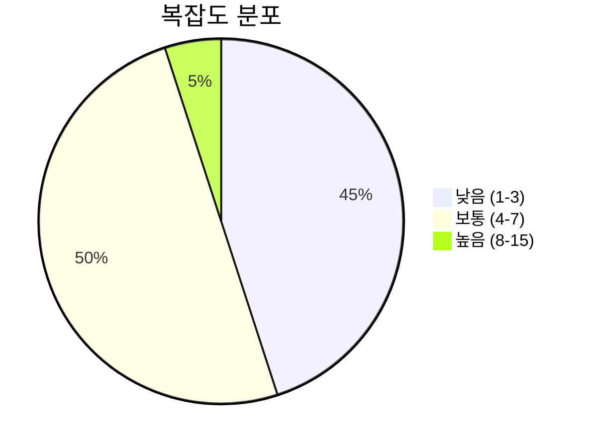
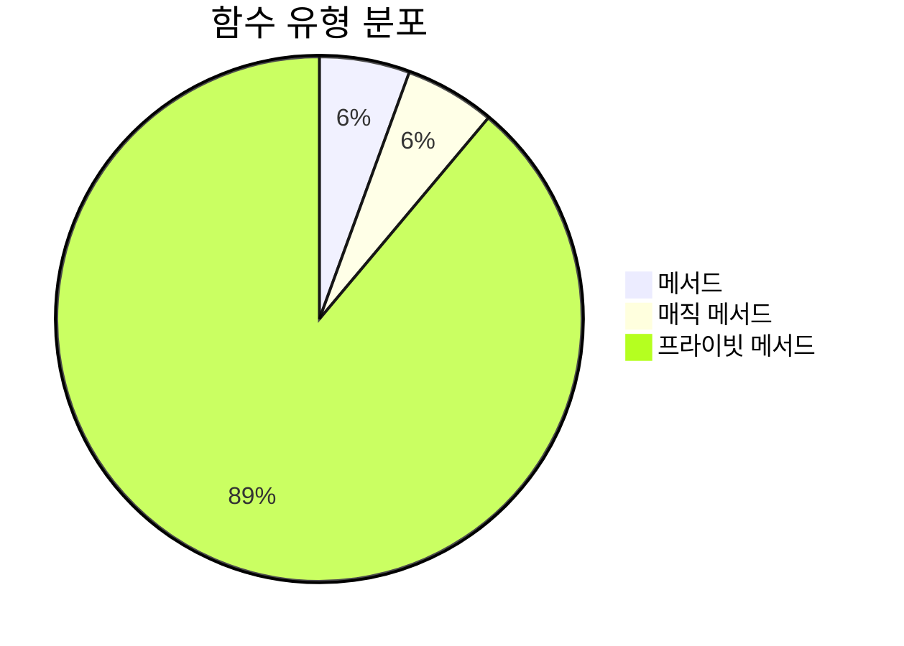
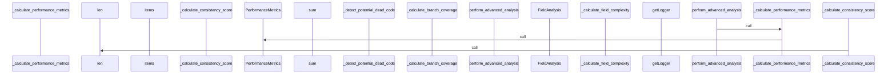
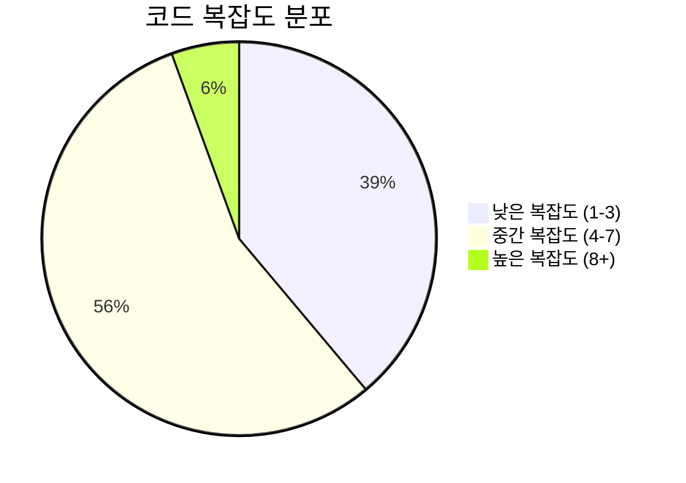

# 📄 advanced_analyzer.py

> **파일 경로**: `rule_analyzer/analyzers/advanced_analyzer.py`  
> **생성일**: 2025-10-01  
> **Chunk 수**: 20개

---

## 📑 목차

### 🏗️ 클래스
- [`AdvancedAnalyzer`](#class-advancedanalyzer) - 복잡도: 0


## 📋 파일 개요

| | |
|--|--|
| 📦 **의존성**: `models` • `logging` • `exceptions` • `typing` | ⚡ **총 복잡도**: 68 |
| 📊 **총 토큰 수**: 4,042 | 🔄 **비동기 함수**: 1개 |


## 🏗️ 클래스

### <a id="class-advancedanalyzer"></a>🎯 `AdvancedAnalyzer`


> 📝 **클래스 설명**  
> 고급 분석 기능을 담당하는 클래스 (순수 로직)

#### 📋 메서드 목록

| 메서드 | 타입 | 복잡도 | 설명 |
|--------|------|--------|------|
| `__init__` | magic | 1 | AdvancedAnalyzer 초기화 |
| `_analyze_fields` | private | 7 | 필드별 상세 분석 |
| `_analyze_logic_flow` | private | 4 | 로직 플로우 분석 |
| `_calculate_branch_coverage` | private | 4 | 분기 커버리지 계산 |
| `_calculate_completeness_score` | private | 2 | 완성도 점수 계산 |
| `_calculate_consistency_score` | private | 1 | 일관성 점수 계산 |
| `_calculate_field_complexity` | private | 4 | 필드 복잡도 점수 계산 |
| `_calculate_maintainability_score` | private | 2 | 유지보수성 점수 계산 |
| `_calculate_performance_metrics` | private | 4 | 성능 메트릭 계산 |
| `_calculate_readability_score` | private | 5 | 가독성 점수 계산 |
| `_calculate_values_range` | private | 8 | 값 범위 계산 |
| `_count_total_conditions` | private | 4 | 총 조건 수 계산 |
| `_detect_potential_dead_code` | private | 5 | 잠재적 데드 코드 검출 |
| `_determine_field_type` | private | 6 | 필드 타입 결정 |
| `_evaluate_quality_metrics` | private | 1 | 품질 메트릭 평가 |
| `_generate_optimization_suggestions` | private | 3 | 최적화 제안 생성 |
| `_identify_bottleneck_conditions` | private | 5 | 병목 조건 식별 |
| `perform_advanced_analysis` | async public | 2 | 고급 분석 수행 (순수 로직) |


#### 🔧 메서드 상세

##### `_calculate_values_range`
| 속성 | 값 |
|------|----|
| ⚡ 복잡도 | 8 |
| 📊 토큰 수 | 182 |
| 📍 라인 범위 | 267-295 |
- **Signature**: `_calculate_values_range(self, values: List[Any]) -> Optional[Dict[str, Any]]`- **Parameters**: `self, values: List[Any]`- **Returns**: `Optional[Dict[str, Any]]`
- **Calls**: `min`, `max`, `len`, `isinstance`, `sum`, `set`, `append`, `float`---
##### `_analyze_fields`
| 속성 | 값 |
|------|----|
| ⚡ 복잡도 | 7 |
| 📊 토큰 수 | 510 |
| 📍 라인 범위 | 84-141 |
- **Signature**: `_analyze_fields(self, conditions: List[RuleCondition], issues: List) -> List[FieldAnalysis]`- **Parameters**: `self, conditions: List[RuleCondition], issues: List`- **Returns**: `List[FieldAnalysis]`
- **Calls**: `items`, `_calculate_values_range`, `_calculate_field_complexity`, `FieldAnalysis`, `append`, `add`, `len`, `_determine_field_type`, `list`, `set`---
##### `_determine_field_type`
| 속성 | 값 |
|------|----|
| ⚡ 복잡도 | 6 |
| 📊 토큰 수 | 114 |
| 📍 라인 범위 | 297-314 |
- **Signature**: `_determine_field_type(self, values: List[Any]) -> str`- **Parameters**: `self, values: List[Any]`- **Returns**: `str`
- **Calls**: `isinstance`---
##### `_detect_potential_dead_code`
| 속성 | 값 |
|------|----|
| ⚡ 복잡도 | 5 |
| 📊 토큰 수 | 138 |
| 📍 라인 범위 | 363-375 |
- **Signature**: `_detect_potential_dead_code(self, conditions: List[RuleCondition]) -> List[str]`- **Parameters**: `self, conditions: List[RuleCondition]`- **Returns**: `List[str]`
- **Calls**: `append`---
##### `_identify_bottleneck_conditions`
| 속성 | 값 |
|------|----|
| ⚡ 복잡도 | 5 |
| 📊 토큰 수 | 156 |
| 📍 라인 범위 | 407-421 |
- **Signature**: `_identify_bottleneck_conditions(self, conditions: List[RuleCondition]) -> List[str]`- **Parameters**: `self, conditions: List[RuleCondition]`- **Returns**: `List[str]`
- **Calls**: `append`, `isinstance`, `len`---
##### `_calculate_readability_score`
| 속성 | 값 |
|------|----|
| ⚡ 복잡도 | 5 |
| 📊 토큰 수 | 155 |
| 📍 라인 범위 | 443-459 |
- **Signature**: `_calculate_readability_score(self, conditions: List[RuleCondition], complexity_score: int) -> int`- **Parameters**: `self, conditions: List[RuleCondition], complexity_score: int`- **Returns**: `int`
- **Calls**: `int`, `max`---
##### `_analyze_logic_flow`
| 속성 | 값 |
|------|----|
| ⚡ 복잡도 | 4 |
| 📊 토큰 수 | 333 |
| 📍 라인 범위 | 143-178 |
- **Signature**: `_analyze_logic_flow(self, conditions: List[RuleCondition]) -> LogicFlow`- **Parameters**: `self, conditions: List[RuleCondition]`- **Returns**: `LogicFlow`
- **Calls**: `analyze_conditions_recursive`, `_calculate_branch_coverage`, `_detect_potential_dead_code`, `LogicFlow`, `append`, `get`---
##### `_calculate_performance_metrics`
| 속성 | 값 |
|------|----|
| ⚡ 복잡도 | 4 |
| 📊 토큰 수 | 402 |
| 📍 라인 범위 | 180-220 |
- **Signature**: `_calculate_performance_metrics(self, conditions: List[RuleCondition], complexity_score: int) -> PerformanceMetrics`- **Parameters**: `self, conditions: List[RuleCondition], complexity_score: int`- **Returns**: `PerformanceMetrics`
- **Calls**: `_count_total_conditions`, `_generate_optimization_suggestions`, `_identify_bottleneck_conditions`, `PerformanceMetrics`---
##### `_calculate_field_complexity`
| 속성 | 값 |
|------|----|
| ⚡ 복잡도 | 4 |
| 📊 토큰 수 | 149 |
| 📍 라인 범위 | 316-332 |
- **Signature**: `_calculate_field_complexity(self, condition_count: int, operator_count: int, values_range: Optional[Dict[str, Any]]) -> int`- **Parameters**: `self, condition_count: int, operator_count: int, values_range: Optional[Dict[str, Any]]`- **Returns**: `int`
- **Calls**: `min`---
##### `_calculate_branch_coverage`
| 속성 | 값 |
|------|----|
| ⚡ 복잡도 | 4 |
| 📊 토큰 수 | 191 |
| 📍 라인 범위 | 334-361 |
- **Signature**: `_calculate_branch_coverage(self, conditions: List[RuleCondition]) -> Dict[str, Any]`- **Parameters**: `self, conditions: List[RuleCondition]`- **Returns**: `Dict[str, Any]`
- **Calls**: `count_branches`---
##### `_count_total_conditions`
| 속성 | 값 |
|------|----|
| ⚡ 복잡도 | 4 |
| 📊 토큰 수 | 94 |
| 📍 라인 범위 | 377-390 |
- **Signature**: `_count_total_conditions(self, conditions: List[RuleCondition]) -> int`- **Parameters**: `self, conditions: List[RuleCondition]`- **Returns**: `int`
- **Calls**: `count_recursive`---
##### `_generate_optimization_suggestions`
| 속성 | 값 |
|------|----|
| ⚡ 복잡도 | 3 |
| 📊 토큰 수 | 132 |
| 📍 라인 범위 | 392-405 |
- **Signature**: `_generate_optimization_suggestions(self, conditions: List[RuleCondition], complexity_score: int) -> List[str]`- **Parameters**: `self, conditions: List[RuleCondition], complexity_score: int`- **Returns**: `List[str]`
- **Calls**: `_count_total_conditions`, `append`---
##### `perform_advanced_analysis`
| 속성 | 값 |
|------|----|
| ⚡ 복잡도 | 2 |
| 📊 토큰 수 | 473 |
| 📍 라인 범위 | 34-82 |
- **Signature**: `perform_advanced_analysis(self, rule: Rule, conditions: List[RuleCondition], basic_issues: List, complexity_score: int) -> Dict[str, Any]`- **Parameters**: `self, rule: Rule, conditions: List[RuleCondition], basic_issues: List, complexity_score: int`- **Returns**: `Dict[str, Any]`
- **Calls**: `_analyze_fields`, `_analyze_logic_flow`, `_calculate_performance_metrics`, `_evaluate_quality_metrics`, `error`, `AdvancedAnalysisError`, `str`- **Raises**: `AdvancedAnalysisError`---
##### `_calculate_maintainability_score`
| 속성 | 값 |
|------|----|
| ⚡ 복잡도 | 2 |
| 📊 토큰 수 | 177 |
| 📍 라인 범위 | 423-441 |
- **Signature**: `_calculate_maintainability_score(self, conditions: List[RuleCondition], issues: List) -> int`- **Parameters**: `self, conditions: List[RuleCondition], issues: List`- **Returns**: `int`
- **Calls**: `len`, `_count_total_conditions`, `max`---
##### `_calculate_completeness_score`
| 속성 | 값 |
|------|----|
| ⚡ 복잡도 | 2 |
| 📊 토큰 수 | 131 |
| 📍 라인 범위 | 461-475 |
- **Signature**: `_calculate_completeness_score(self, conditions: List[RuleCondition], issues: List) -> int`- **Parameters**: `self, conditions: List[RuleCondition], issues: List`- **Returns**: `int`
- **Calls**: `max`, `len`---
##### `__init__`
| 속성 | 값 |
|------|----|
| ⚡ 복잡도 | 1 |
| 📊 토큰 수 | 23 |
| 📍 라인 범위 | 30-32 |
- **Signature**: `__init__(self)`- **Parameters**: `self`- **Returns**: `N/A`
- **Calls**: `getLogger`---
##### `_evaluate_quality_metrics`
| 속성 | 값 |
|------|----|
| ⚡ 복잡도 | 1 |
| 📊 토큰 수 | 366 |
| 📍 라인 범위 | 222-264 |
- **Signature**: `_evaluate_quality_metrics(self, conditions: List[RuleCondition], issues: List, complexity_score: int) -> QualityMetrics`- **Parameters**: `self, conditions: List[RuleCondition], issues: List, complexity_score: int`- **Returns**: `QualityMetrics`
- **Calls**: `_calculate_maintainability_score`, `_calculate_readability_score`, `_calculate_completeness_score`, `_calculate_consistency_score`, `int`, `QualityMetrics`---
##### `_calculate_consistency_score`
| 속성 | 값 |
|------|----|
| ⚡ 복잡도 | 1 |
| 📊 토큰 수 | 156 |
| 📍 라인 범위 | 477-493 |
- **Signature**: `_calculate_consistency_score(self, conditions: List[RuleCondition], issues: List) -> int`- **Parameters**: `self, conditions: List[RuleCondition], issues: List`- **Returns**: `int`
- **Calls**: `max`, `len`---
<details>
<summary>🔍 코드 미리보기</summary>

```python
class AdvancedAnalyzer:
    """
    고급 분석 기능을 담당하는 클래스 (순수 로직)
    """

    def __init__(self):...
```

**Chunk 정보**
- 🆔 **ID**: `cc52bd634884`
- 📍 **라인**: 25-35
- 📊 **토큰**: 41
- 🏷️ **태그**: `class`

</details>

---


## 📊 시각화 및 분석

### ⚡ 복잡도 분석



### 🔧 함수 유형 분석



### 🔗 호출 순서 (Sequence)




## 📈 퍼포먼스 메트릭스

### 📊 핵심 지표

| 🎯 메트릭 | 📊 값 | 🚦 상태 |
|-----------|-------|--------|
| **총 라인 수** | 457 | 🟡 보통 |
| **평균 복잡도** | 3.8 | 🟡 보통 |
| **최대 복잡도** | 8 | 🟢 양호 |
| **함수 밀도** | 90.0% | 🔴 주의 |


### 🎯 품질 점수




## 🧩 Chunk 요약

이 파일은 총 **20개의 chunk**로 구성되어 있으며, **4,042개의 토큰**을 포함합니다.

| 🧩 Chunk 타입 | 📊 개수 | ⚡ 평균 복잡도 | 📝 총 토큰 | 📈 비율 |
|---------------|--------|-------------|----------|--------|
| 📋 파일 개요 | 1 | 0.0 | 119 | 2.9% |
| 🏗️ 클래스 | 1 | 0.0 | 41 | 1.0% |
| 🔧 메서드 | 18 | 3.8 | 3,882 | 96.0% |

