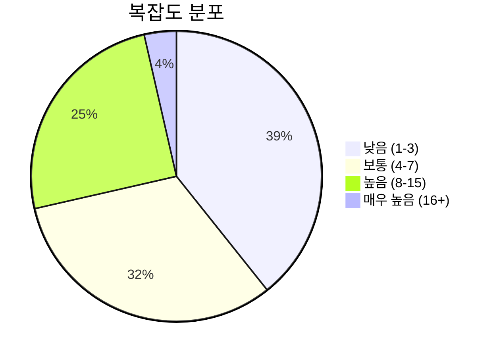
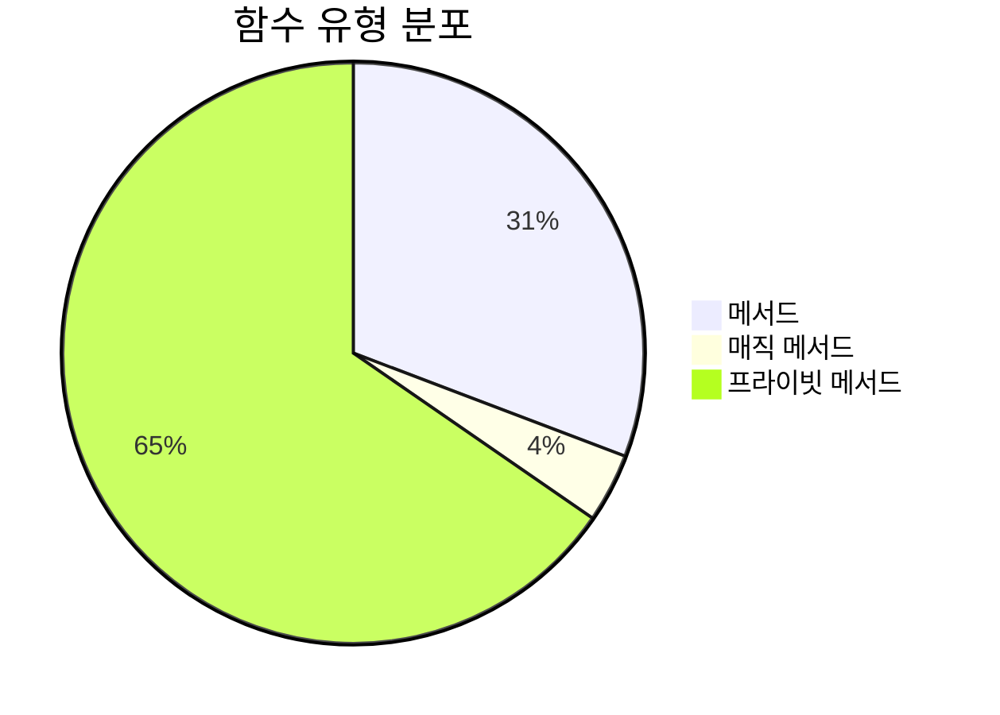
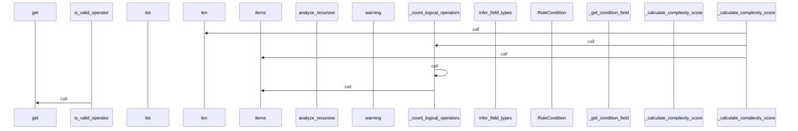
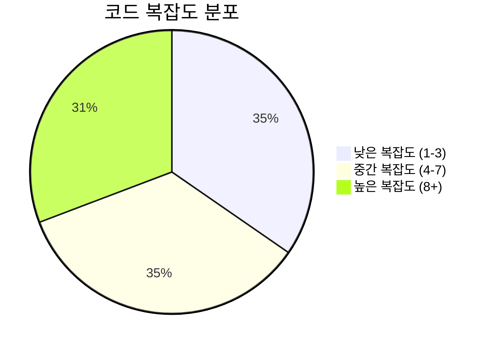

# 📄 condition_analyzer.py

> **파일 경로**: `rule_analyzer/analyzers/condition_analyzer.py`  
> **생성일**: 2025-10-01  
> **Chunk 수**: 28개

---

## 📑 목차

### 🏗️ 클래스
- [`ConditionAnalyzer`](#class-conditionanalyzer) - 복잡도: 0


## 📋 파일 개요

| | |
|--|--|
| 📦 **의존성**: `models` • `exceptions` • `typing` • `re` • `logging` | ⚡ **총 복잡도**: 159 |
| 📊 **총 토큰 수**: 9,417 |  |


## 🏗️ 클래스

### <a id="class-conditionanalyzer"></a>🎯 `ConditionAnalyzer`


> 📝 **클래스 설명**  
> 조건 분석 및 파싱을 담당하는 클래스

이 클래스는 다음 기능들을 제공합니다:
- 조건 트리 파싱 및 변환
- 필드 타입 자동 추론
- 조건 구조 분석
- 복잡성 및 깊이 계산

#### 📋 메서드 목록

| 메서드 | 타입 | 복잡도 | 설명 |
|--------|------|--------|------|
| `__init__` | magic | 1 | ConditionAnalyzer 초기화 |
| `_analyze_original_structure` | private | 11 | 원본 조건 트리의 구조 분석 |
| `_calculate_complexity_score` | private | 6 | 복잡도 점수 계산 |
| `_calculate_depth` | private | 4 | 조건 트리의 최대 깊이 계산 |
| `_convert_value_by_type` | private | 11 | 필드 데이터 타입에 따라 값 변환 |
| `_count_all_conditions` | private | 3 | 모든 조건의 개수 계산 (재귀) |
| `_count_field_conditions` | private | 4 | 필드 조건의 개수 계산 (논리 연산자 제외) |
| `_count_logical_operators` | private | 9 | 논리 연산자 개수 계산 |
| `_extract_condition_details` | private | 3 | 조건 세부사항 추출 |
| `_extract_unique_fields` | private | 4 | 고유한 필드명들 추출 |
| `_get_condition_field` | private | 2 | 조건에서 필드명 추출 |
| `_infer_type_from_value` | private | 9 | 값과 연산자로부터 타입 추론 |
| `_is_date_string` | private | 3 | 문자열이 날짜 형식인지 확인 |
| `_parse_condition_tree` | private | 20 | 조건 트리를 파싱하여 조건 리스트로 변환 |
| `_parse_conditions_list` | private | 2 | 조건 리스트를 파싱하여 RuleCondition 리스트로 변환 |
| `_parse_dict_condition` | private | 5 | 딕셔너리 형태의 조건을 RuleCondition으로 변환 |
| `_parse_object_condition` | private | 5 | 객체 형태의 조건을 RuleCondition으로 변환 |
| `_post_process_conditions` | private | 4 | 조건들의 후처리 |
| `calculate_structure_metrics` | public | 4 | 조건들의 구조 메트릭 계산 |
| `get_field_type` | public | 2 | 필드의 타입 반환 |
| `infer_field_types` | public | 7 | 조건들로부터 필드 타입을 추론 |
| `is_ambiguous` | public | 15 | 두 조건이 모호한지 판단 (레거시와 동일한 방식) |
| `is_contradictory` | public | 14 | 두 조건이 서로 모순되는지 판단 (레거시와 동일한 방식) |
| `is_valid_operator` | public | 1 | 필드에 대한 연산자의 유효성 확인 |
| `is_valid_type` | public | 1 | 필드에 대한 값의 타입 유효성 확인 |
| `parse_rule_conditions` | public | 9 | 룰에서 조건들을 파싱하여 RuleCondition 리스트로 변환 |


#### 🔧 메서드 상세

##### `_parse_condition_tree`
| 속성 | 값 |
|------|----|
| ⚡ 복잡도 | 20 |
| 📊 토큰 수 | 645 |
| 📍 라인 범위 | 131-204 |
- **Signature**: `_parse_condition_tree(self, tree: Any) -> List[RuleCondition]`- **Parameters**: `self, tree: Any`- **Returns**: `List[RuleCondition]`
- **Calls**: `isinstance`, `debug`, `hasattr`, `error`, `get`, `_parse_dict_condition`, `extend`, `append`, `type`, `_parse_condition_tree`, `_parse_object_condition`, `str`---
##### `is_ambiguous`
| 속성 | 값 |
|------|----|
| ⚡ 복잡도 | 15 |
| 📊 토큰 수 | 788 |
| 📍 라인 범위 | 1037-1104 |
- **Signature**: `is_ambiguous(self, cond1, cond2)`- **Parameters**: `self, cond1, cond2`- **Returns**: `N/A`
- **Calls**: `getattr`, `float`, `hasattr`, `isinstance`---
##### `is_contradictory`
| 속성 | 값 |
|------|----|
| ⚡ 복잡도 | 14 |
| 📊 토큰 수 | 888 |
| 📍 라인 범위 | 958-1035 |
- **Signature**: `is_contradictory(self, cond1, cond2)`- **Parameters**: `self, cond1, cond2`- **Returns**: `N/A`
- **Calls**: `getattr`, `isinstance`, `float`, `hasattr`, `str`---
##### `_analyze_original_structure`
| 속성 | 값 |
|------|----|
| ⚡ 복잡도 | 11 |
| 📊 토큰 수 | 422 |
| 📍 라인 범위 | 688-745 |
- **Signature**: `_analyze_original_structure(self, condition_tree: Any) -> tuple[int, int]`- **Parameters**: `self, condition_tree: Any`- **Returns**: `tuple[int, int]`
- **Calls**: `analyze_recursive`, `isinstance`, `error`, `hasattr`, `max`, `str`---
##### `_convert_value_by_type`
| 속성 | 값 |
|------|----|
| ⚡ 복잡도 | 11 |
| 📊 토큰 수 | 314 |
| 📍 라인 범위 | 886-934 |
- **Signature**: `_convert_value_by_type(self, value: Any, field_data_type: str) -> Any`- **Parameters**: `self, value: Any, field_data_type: str`- **Returns**: `Any`
- **Calls**: `lower`, `isinstance`, `warning`, `bool`, `float`, `int`, `str`---
##### `parse_rule_conditions`
| 속성 | 값 |
|------|----|
| ⚡ 복잡도 | 9 |
| 📊 토큰 수 | 794 |
| 📍 라인 범위 | 60-129 |
- **Signature**: `parse_rule_conditions(self, rule: Rule) -> List[RuleCondition]`- **Parameters**: `self, rule: Rule`- **Returns**: `List[RuleCondition]`
- **Calls**: `getattr`, `isinstance`, `_post_process_conditions`, `debug`, `error`, `ConditionAnalysisError`, `_parse_condition_tree`, `hasattr`, `_parse_conditions_list`, `warning`, `len`, `str`, `type`- **Raises**: `ConditionAnalysisError`---
##### `_infer_type_from_value`
| 속성 | 값 |
|------|----|
| ⚡ 복잡도 | 9 |
| 📊 토큰 수 | 265 |
| 📍 라인 범위 | 378-424 |
- **Signature**: `_infer_type_from_value(self, value: Any, operator: Optional[str]) -> str`- **Parameters**: `self, value: Any, operator: Optional[str]`- **Returns**: `str`
- **Calls**: `isinstance`, `_is_date_string`, `float`, `lower`---
##### `_count_logical_operators`
| 속성 | 값 |
|------|----|
| ⚡ 복잡도 | 9 |
| 📊 토큰 수 | 240 |
| 📍 라인 범위 | 747-779 |
- **Signature**: `_count_logical_operators(self, conditions: List[RuleCondition]) -> Dict[str, int]`- **Parameters**: `self, conditions: List[RuleCondition]`- **Returns**: `Dict[str, int]`
- **Calls**: `_count_logical_operators`, `items`, `lower`---
##### `infer_field_types`
| 속성 | 값 |
|------|----|
| ⚡ 복잡도 | 7 |
| 📊 토큰 수 | 454 |
| 📍 라인 범위 | 328-376 |
- **Signature**: `infer_field_types(self, rule: Rule, conditions: List[RuleCondition]) -> Dict[str, str]`- **Parameters**: `self, rule: Rule, conditions: List[RuleCondition]`- **Returns**: `Dict[str, str]`
- **Calls**: `update`, `debug`, `analyze_condition`, `error`, `lower`, `_infer_type_from_value`, `len`, `str`---
##### `_calculate_complexity_score`
| 속성 | 값 |
|------|----|
| ⚡ 복잡도 | 6 |
| 📊 토큰 수 | 359 |
| 📍 라인 범위 | 647-686 |
- **Signature**: `_calculate_complexity_score(self, conditions: List[RuleCondition]) -> int`- **Parameters**: `self, conditions: List[RuleCondition]`- **Returns**: `int`
- **Calls**: `_count_all_conditions`, `_calculate_depth`, `len`, `_count_logical_operators`, `items`, `_extract_unique_fields`---
##### `_parse_dict_condition`
| 속성 | 값 |
|------|----|
| ⚡ 복잡도 | 5 |
| 📊 토큰 수 | 469 |
| 📍 라인 범위 | 206-258 |
- **Signature**: `_parse_dict_condition(self, condition_dict: dict) -> Optional[RuleCondition]`- **Parameters**: `self, condition_dict: dict`- **Returns**: `Optional[RuleCondition]`
- **Calls**: `get`, `_convert_value_by_type`, `debug`, `RuleCondition`, `error`, `warning`, `extend`, `_parse_condition_tree`, `lower`, `str`, `type`---
##### `_parse_object_condition`
| 속성 | 값 |
|------|----|
| ⚡ 복잡도 | 5 |
| 📊 토큰 수 | 361 |
| 📍 라인 범위 | 260-308 |
- **Signature**: `_parse_object_condition(self, condition_obj: Any) -> Optional[RuleCondition]`- **Parameters**: `self, condition_obj: Any`- **Returns**: `Optional[RuleCondition]`
- **Calls**: `isinstance`, `getattr`, `_convert_value_by_type`, `RuleCondition`, `error`, `extend`, `_parse_condition_tree`, `str`---
##### `calculate_structure_metrics`
| 속성 | 값 |
|------|----|
| ⚡ 복잡도 | 4 |
| 📊 토큰 수 | 609 |
| 📍 라인 범위 | 450-511 |
- **Signature**: `calculate_structure_metrics(self, conditions: List[RuleCondition], rule: Optional[Rule]) -> Dict[str, Any]`- **Parameters**: `self, conditions: List[RuleCondition], rule: Optional[Rule]`- **Returns**: `Dict[str, Any]`
- **Calls**: `_count_all_conditions`, `_count_field_conditions`, `_calculate_depth`, `len`, `_calculate_complexity_score`, `_count_logical_operators`, `_extract_condition_details`, `debug`, `_extract_unique_fields`, `hasattr`, `error`, `_analyze_original_structure`, `warning`, `str`---
##### `_calculate_depth`
| 속성 | 값 |
|------|----|
| ⚡ 복잡도 | 4 |
| 📊 토큰 수 | 190 |
| 📍 라인 범위 | 513-539 |
- **Signature**: `_calculate_depth(self, conditions: List[RuleCondition], current_depth: int) -> int`- **Parameters**: `self, conditions: List[RuleCondition], current_depth: int`- **Returns**: `int`
- **Calls**: `_calculate_depth`, `max`---
##### `_count_field_conditions`
| 속성 | 값 |
|------|----|
| ⚡ 복잡도 | 4 |
| 📊 토큰 수 | 150 |
| 📍 라인 범위 | 560-581 |
- **Signature**: `_count_field_conditions(self, conditions: List[RuleCondition]) -> int`- **Parameters**: `self, conditions: List[RuleCondition]`- **Returns**: `int`
- **Calls**: `_count_field_conditions`---
##### `_extract_unique_fields`
| 속성 | 값 |
|------|----|
| ⚡ 복잡도 | 4 |
| 📊 토큰 수 | 130 |
| 📍 라인 범위 | 583-603 |
- **Signature**: `_extract_unique_fields(self, conditions: List[RuleCondition]) -> List[str]`- **Parameters**: `self, conditions: List[RuleCondition]`- **Returns**: `List[str]`
- **Calls**: `set`, `extract_fields`, `list`, `add`---
##### `_post_process_conditions`
| 속성 | 값 |
|------|----|
| ⚡ 복잡도 | 4 |
| 📊 토큰 수 | 134 |
| 📍 라인 범위 | 936-956 |
- **Signature**: `_post_process_conditions(self, conditions: List[RuleCondition])`- **Parameters**: `self, conditions: List[RuleCondition]`- **Returns**: `N/A`
- **Calls**: `process_condition`, `_convert_value_by_type`, `_post_process_conditions`---
##### `_is_date_string`
| 속성 | 값 |
|------|----|
| ⚡ 복잡도 | 3 |
| 📊 토큰 수 | 233 |
| 📍 라인 범위 | 426-448 |
- **Signature**: `_is_date_string(self, value: str) -> bool`- **Parameters**: `self, value: str`- **Returns**: `bool`
- **Calls**: `match`---
##### `_count_all_conditions`
| 속성 | 값 |
|------|----|
| ⚡ 복잡도 | 3 |
| 📊 토큰 수 | 106 |
| 📍 라인 범위 | 541-558 |
- **Signature**: `_count_all_conditions(self, conditions: List[RuleCondition]) -> int`- **Parameters**: `self, conditions: List[RuleCondition]`- **Returns**: `int`
- **Calls**: `_count_all_conditions`---
##### `_extract_condition_details`
| 속성 | 값 |
|------|----|
| ⚡ 복잡도 | 3 |
| 📊 토큰 수 | 275 |
| 📍 라인 범위 | 605-645 |
- **Signature**: `_extract_condition_details(self, conditions: List[RuleCondition], depth_level: int, parent_logic: Optional[str]) -> List[Dict[str, Any]]`- **Parameters**: `self, conditions: List[RuleCondition], depth_level: int, parent_logic: Optional[str]`- **Returns**: `List[Dict[str, Any]]`
- **Calls**: `append`, `_extract_condition_details`, `extend`---
##### `_parse_conditions_list`
| 속성 | 값 |
|------|----|
| ⚡ 복잡도 | 2 |
| 📊 토큰 수 | 107 |
| 📍 라인 범위 | 310-326 |
- **Signature**: `_parse_conditions_list(self, conditions_list: List[Any]) -> List[RuleCondition]`- **Parameters**: `self, conditions_list: List[Any]`- **Returns**: `List[RuleCondition]`
- **Calls**: `_parse_condition_tree`, `extend`---
##### `get_field_type`
| 속성 | 값 |
|------|----|
| ⚡ 복잡도 | 2 |
| 📊 토큰 수 | 365 |
| 📍 라인 범위 | 781-818 |
- **Signature**: `get_field_type(self, field: str, condition: Optional[RuleCondition]) -> str`- **Parameters**: `self, field: str, condition: Optional[RuleCondition]`- **Returns**: `str`
- **Calls**: `get`, `lower`---
##### `_get_condition_field`
| 속성 | 값 |
|------|----|
| ⚡ 복잡도 | 2 |
| 📊 토큰 수 | 78 |
| 📍 라인 범위 | 872-884 |
- **Signature**: `_get_condition_field(self, condition: RuleCondition) -> Optional[str]`- **Parameters**: `self, condition: RuleCondition`- **Returns**: `Optional[str]`
---
##### `__init__`
| 속성 | 값 |
|------|----|
| ⚡ 복잡도 | 1 |
| 📊 토큰 수 | 248 |
| 📍 라인 범위 | 30-58 |
- **Signature**: `__init__(self)`- **Parameters**: `self`- **Returns**: `N/A`
- **Calls**: `getLogger`---
##### `is_valid_operator`
| 속성 | 값 |
|------|----|
| ⚡ 복잡도 | 1 |
| 📊 토큰 수 | 246 |
| 📍 라인 범위 | 820-839 |
- **Signature**: `is_valid_operator(self, field: str, operator: str, condition: Optional[RuleCondition]) -> bool`- **Parameters**: `self, field: str, operator: str, condition: Optional[RuleCondition]`- **Returns**: `bool`
- **Calls**: `get_field_type`, `get`---
##### `is_valid_type`
| 속성 | 값 |
|------|----|
| ⚡ 복잡도 | 1 |
| 📊 토큰 수 | 316 |
| 📍 라인 범위 | 841-870 |
- **Signature**: `is_valid_type(self, field: str, value: Any, condition: Optional[RuleCondition]) -> bool`- **Parameters**: `self, field: str, value: Any, condition: Optional[RuleCondition]`- **Returns**: `bool`
- **Calls**: `get_field_type`, `_infer_type_from_value`, `get`---
<details>
<summary>🔍 코드 미리보기</summary>

```python
class ConditionAnalyzer:
    """
    조건 분석 및 파싱을 담당하는 클래스

    이 클래스는 다음 기능들을 제공합니다:
    - 조건 트리 파싱 및 변환
    - 필드 타입 자동 추론
    - 조건 구조 분석
    - 복잡성 및 깊이 계산
    """

    def __init__(self):...
```

**Chunk 정보**
- 🆔 **ID**: `52ad50ec3a0d`
- 📍 **라인**: 19-29
- 📊 **토큰**: 107
- 🏷️ **태그**: `class`

</details>

---


## 📊 시각화 및 분석

### ⚡ 복잡도 분석



### 🔧 함수 유형 분석



### 🔗 호출 순서 (Sequence)




## 📈 퍼포먼스 메트릭스

### 📊 핵심 지표

| 🎯 메트릭 | 📊 값 | 🚦 상태 |
|-----------|-------|--------|
| **총 라인 수** | 1061 | 🔴 주의 |
| **평균 복잡도** | 6.1 | 🟡 보통 |
| **최대 복잡도** | 20 | 🟡 보통 |
| **함수 밀도** | 92.9% | 🔴 주의 |


### 🎯 품질 점수




## 🧩 Chunk 요약

이 파일은 총 **28개의 chunk**로 구성되어 있으며, **9,417개의 토큰**을 포함합니다.

| 🧩 Chunk 타입 | 📊 개수 | ⚡ 평균 복잡도 | 📝 총 토큰 | 📈 비율 |
|---------------|--------|-------------|----------|--------|
| 📋 파일 개요 | 1 | 0.0 | 124 | 1.3% |
| 🏗️ 클래스 | 1 | 0.0 | 107 | 1.1% |
| 🔧 메서드 | 26 | 6.1 | 9,186 | 97.5% |

