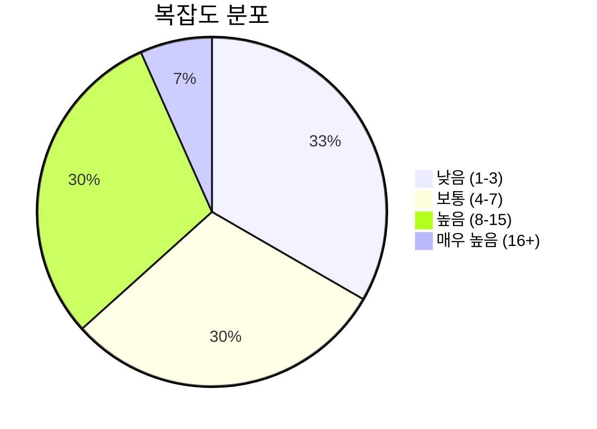
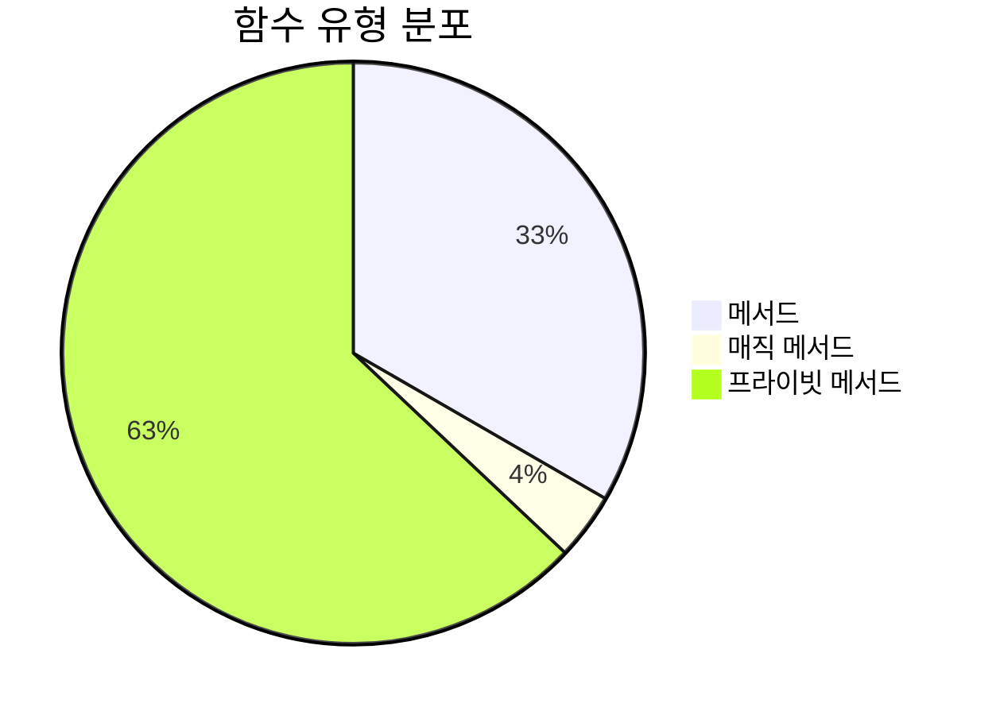
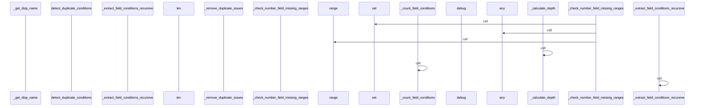
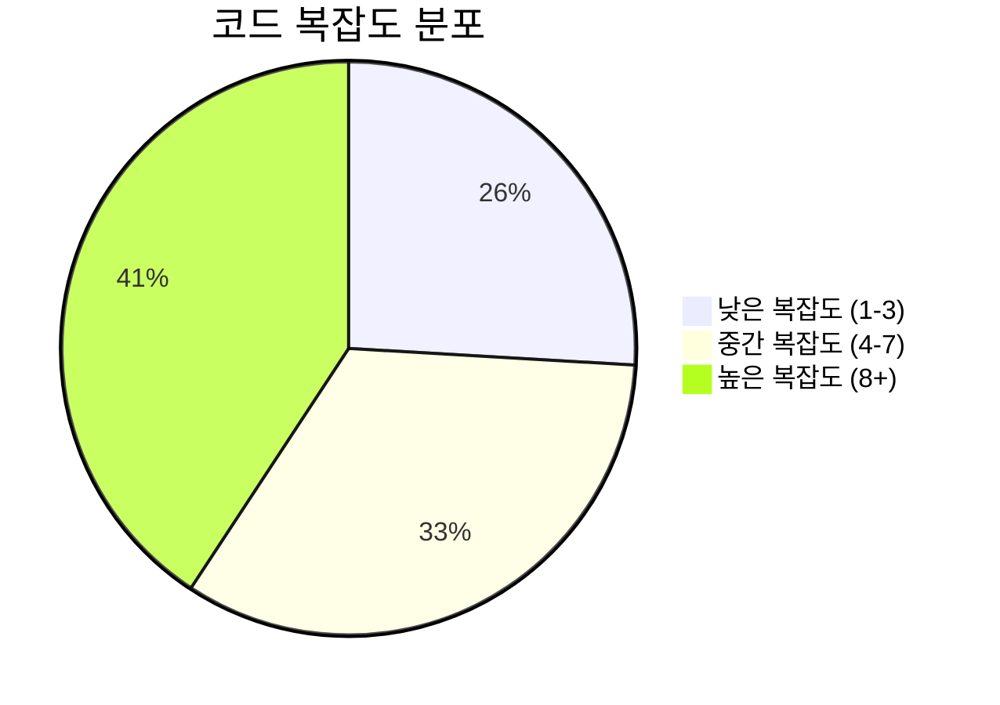

# 📄 issue_detector.py

> **파일 경로**: `rule_analyzer/analyzers/issue_detector.py`  
> **생성일**: 2025-10-13  
> **Chunk 수**: 30개

---

## 📑 목차

### 🏗️ 클래스
- [`QualityThresholds`](#class-qualitythresholds) - 복잡도: 0
- [`IssueDetector`](#class-issuedetector) - 복잡도: 0


## 📋 파일 개요

| | |
|--|--|
| 📦 **의존성**: `logging` • `condition_analyzer` • `typing` • `models` • `exceptions` | ⚡ **총 복잡도**: 202 |
| 📊 **총 토큰 수**: 10,807 | 🔄 **비동기 함수**: 1개 |


## 🏗️ 클래스

### <a id="class-qualitythresholds"></a>🎯 `QualityThresholds`


<details>
<summary>🔍 코드 미리보기</summary>

```python
class QualityThresholds:
    MAX_COMPLEXITY_SCORE = 50
    MAX_DEPTH = 5
    MAX_CONDITIONS_PER_FIELD = 10


class IssueDetector:...
```

**Chunk 정보**
- 🆔 **ID**: `2e6d6af45e4a`
- 📍 **라인**: 22-32
- 📊 **토큰**: 35
- 🏷️ **태그**: `class`

</details>

---

### <a id="class-issuedetector"></a>🎯 `IssueDetector`


> 📝 **클래스 설명**  
> 이슈 검출 및 검증을 담당하는 클래스

7가지 주요 이슈 타입을 검출합니다:
1. duplicate_condition - 중복 조건
2. type_mismatch - 타입 불일치
3. invalid_operator - 잘못된 연산자
4. self_contradiction - 자기모순
5. missing_condition - 누락 조건
6. ambiguous_branch - 분기 불명확
7. complexity_warning - 복잡성 경고

#### 📋 메서드 목록

| 메서드 | 타입 | 복잡도 | 설명 |
|--------|------|--------|------|
| `__init__` | magic | 1 | IssueDetector 초기화 |
| `_calculate_depth` | private | 4 | 조건 트리의 최대 깊이 계산 |
| `_check_contradiction` | private | 13 | 두 조건 간의 모순 여부 확인 |
| `_check_number_field_ambiguity` | private | 22 | 숫자 필드에 대한 분기 불명확 검사 (레거시와 100% 동일) |
| `_check_number_field_missing_ranges` | private | 20 | 숫자 필드에 대한 범위 누락 검사 (레거시와 100% 동일) |
| `_check_redundant_pattern` | private | 7 | 리던던트 조건 패턴 검사 (레거시와 100% 동일) |
| `_check_string_field_ambiguity` | private | 8 |  |
| `_compare_non_numeric` | private | 8 | 숫자가 아닌 값들에 대한 비교 (레거시와 100% 동일) |
| `_count_field_conditions` | private | 4 | 필드별 조건 개수 계산 |
| `_create_condition_signature` | private | 3 | 조건의 고유 시그니처 생성 (레거시와 100% 동일) |
| `_detect_field_missing_edge_cases` | private | 5 | 필드의 누락된 엣지 케이스 검출 (레거시와 동일) |
| `_detect_field_redundant_conditions` | private | 8 | 필드의 리던던트 조건 검출 (레거시와 동일) |
| `_extract_field_conditions_recursive` | private | 8 | 재귀적으로 필드 조건 추출 (레거시와 100% 동일) |
| `_get_condition_uuid` | private | 3 | 조건의 UUID를 안전하게 추출 (레거시와 100% 동일) |
| `_get_disp_name` | private | 5 | 조건의 표시명을 안전하게 추출 (레거시와 100% 동일) |
| `_is_numeric_value` | private | 2 | 값이 숫자인지 확인 (레거시와 100% 동일) |
| `_remove_duplicate_issues` | private | 3 | 중복 이슈 제거 |
| `_value_matches_condition` | private | 12 | 값이 조건에 맞는지 확인 (레거시와 100% 동일) |
| `detect_all_issues` | async public | 2 | 모든 이슈 타입을 검출 |
| `detect_ambiguous_branches` | public | 14 | 분기 불명확성 검출 |
| `detect_complexity_warnings` | public | 2 | 복잡성 경고 검출 |
| `detect_duplicate_conditions` | public | 7 | 중복 조건 검출 |
| `detect_invalid_operators` | public | 6 | 잘못된 연산자 검출 |
| `detect_issues_from_rule_direct` | public | 5 | 룰 JSON을 직접 분석하여 누락된 이슈들을 검출 |
| `detect_missing_conditions` | public | 12 | 누락된 조건 검출 |
| `detect_self_contradiction` | public | 12 | 자기모순 조건 검출 |
| `detect_type_mismatch` | public | 6 | 타입 불일치 검출 |


#### 🔧 메서드 상세

##### `_check_number_field_ambiguity`
| 속성 | 값 |
|------|----|
| ⚡ 복잡도 | 22 |
| 📊 토큰 수 | 1278 |
| 📍 라인 범위 | 581-717 |
- **Signature**: `_check_number_field_ambiguity(self, field: str, conditions: list) -> Optional[ConditionIssue]`- **Parameters**: `self, field: str, conditions: list`- **Returns**: `Optional[ConditionIssue]`
- **Calls**: `range`, `set`, `len`, `join`, `append`, `float`, `getattr`, `ConditionIssue`, `isinstance`, `add`, `all`, `str`, `_value_matches_condition`, `get`---
##### `_check_number_field_missing_ranges`
| 속성 | 값 |
|------|----|
| ⚡ 복잡도 | 20 |
| 📊 토큰 수 | 883 |
| 📍 라인 범위 | 413-506 |
- **Signature**: `_check_number_field_missing_ranges(self, field: str, conditions: list) -> list`- **Parameters**: `self, field: str, conditions: list`- **Returns**: `list`
- **Calls**: `set`, `any`, `append`, `sorted`, `range`, `float`, `getattr`, `ConditionIssue`, `len`, `int`, `add`---
##### `detect_ambiguous_branches`
| 속성 | 값 |
|------|----|
| ⚡ 복잡도 | 14 |
| 📊 토큰 수 | 598 |
| 📍 라인 범위 | 508-579 |
- **Signature**: `detect_ambiguous_branches(self, conditions: list) -> list`- **Parameters**: `self, conditions: list`- **Returns**: `list`
- **Calls**: `collect_field_conditions`, `items`, `enumerate`, `get_field_type`, `len`, `_check_number_field_ambiguity`, `str`, `getattr`, `append`, `hasattr`, `isinstance`, `_check_string_field_ambiguity`, `extend`---
##### `_check_contradiction`
| 속성 | 값 |
|------|----|
| ⚡ 복잡도 | 13 |
| 📊 토큰 수 | 389 |
| 📍 라인 범위 | 296-332 |
- **Signature**: `_check_contradiction(self, cond1: Dict[str, Any], cond2: Dict[str, Any]) -> bool`- **Parameters**: `self, cond1: Dict[str, Any], cond2: Dict[str, Any]`- **Returns**: `bool`
- **Calls**: `isinstance`---
##### `detect_self_contradiction`
| 속성 | 값 |
|------|----|
| ⚡ 복잡도 | 12 |
| 📊 토큰 수 | 541 |
| 📍 라인 범위 | 243-294 |
- **Signature**: `detect_self_contradiction(self, conditions: list) -> list`- **Parameters**: `self, conditions: list`- **Returns**: `list`
- **Calls**: `collect_field_conditions`, `items`, `enumerate`, `range`, `len`, `str`, `getattr`, `append`, `hasattr`, `is_contradictory`, `extend`, `ConditionIssue`, `_get_disp_name`---
##### `detect_missing_conditions`
| 속성 | 값 |
|------|----|
| ⚡ 복잡도 | 12 |
| 📊 토큰 수 | 696 |
| 📍 라인 범위 | 334-411 |
- **Signature**: `detect_missing_conditions(self, rule, conditions: list) -> list`- **Parameters**: `self, rule, conditions: list`- **Returns**: `list`
- **Calls**: `collect_field_conditions_recursive`, `items`, `ConditionIssue`, `append`, `get_field_type`, `len`, `_check_number_field_missing_ranges`, `extend`, `hasattr`, `detect_missing_conditions`, `getattr`---
##### `_value_matches_condition`
| 속성 | 값 |
|------|----|
| ⚡ 복잡도 | 12 |
| 📊 토큰 수 | 415 |
| 📍 라인 범위 | 719-765 |
- **Signature**: `_value_matches_condition(self, value: Any, condition: Dict[str, Any]) -> bool`- **Parameters**: `self, value: Any, condition: Dict[str, Any]`- **Returns**: `bool`
- **Calls**: `isinstance`, `float`, `_compare_non_numeric`---
##### `_compare_non_numeric`
| 속성 | 값 |
|------|----|
| ⚡ 복잡도 | 8 |
| 📊 토큰 수 | 245 |
| 📍 라인 범위 | 767-791 |
- **Signature**: `_compare_non_numeric(self, value: Any, cond_value: Any, op: str) -> bool`- **Parameters**: `self, value: Any, cond_value: Any, op: str`- **Returns**: `bool`
- **Calls**: `str`, `debug`---
##### `_check_string_field_ambiguity`
| 속성 | 값 |
|------|----|
| ⚡ 복잡도 | 8 |
| 📊 토큰 수 | 349 |
| 📍 라인 범위 | 793-834 |
- **Signature**: `_check_string_field_ambiguity(self, field: str, conditions: list) -> Optional[ConditionIssue]`- **Parameters**: `self, field: str, conditions: list`- **Returns**: `Optional[ConditionIssue]`
- **Calls**: `items`, `isinstance`, `append`, `len`, `set`, `join`, `ConditionIssue`, `get`, `getattr`---
##### `_detect_field_redundant_conditions`
| 속성 | 값 |
|------|----|
| ⚡ 복잡도 | 8 |
| 📊 토큰 수 | 430 |
| 📍 라인 범위 | 951-992 |
- **Signature**: `_detect_field_redundant_conditions(self, field_name: str, conditions: List[Dict[str, Any]]) -> List[ConditionIssue]`- **Parameters**: `self, field_name: str, conditions: List[Dict[str, Any]]`- **Returns**: `List[ConditionIssue]`
- **Calls**: `enumerate`, `isinstance`, `append`, `_check_redundant_pattern`, `_get_condition_uuid`, `ConditionIssue`, `float`, `_get_disp_name`---
##### `_extract_field_conditions_recursive`
| 속성 | 값 |
|------|----|
| ⚡ 복잡도 | 8 |
| 📊 토큰 수 | 318 |
| 📍 라인 범위 | 1112-1147 |
- **Signature**: `_extract_field_conditions_recursive(self, tree, field_conditions, path)`- **Parameters**: `self, tree, field_conditions, path`- **Returns**: `N/A`
- **Calls**: `isinstance`, `append`, `enumerate`, `_extract_field_conditions_recursive`, `get`---
##### `detect_duplicate_conditions`
| 속성 | 값 |
|------|----|
| ⚡ 복잡도 | 7 |
| 📊 토큰 수 | 399 |
| 📍 라인 범위 | 117-155 |
- **Signature**: `detect_duplicate_conditions(self, conditions: list) -> list`- **Parameters**: `self, conditions: list`- **Returns**: `list`
- **Calls**: `check_duplicates`, `enumerate`, `_create_condition_signature`, `str`, `hasattr`, `ConditionIssue`, `append`, `getattr`, `_get_disp_name`---
##### `_check_redundant_pattern`
| 속성 | 값 |
|------|----|
| ⚡ 복잡도 | 7 |
| 📊 토큰 수 | 398 |
| 📍 라인 범위 | 1074-1102 |
- **Signature**: `_check_redundant_pattern(self, field_name: str, op1: str, val1: float, op2: str, val2: float) -> str`- **Parameters**: `self, field_name: str, op1: str, val1: float, op2: str, val2: float`- **Returns**: `str`
---
##### `detect_type_mismatch`
| 속성 | 값 |
|------|----|
| ⚡ 복잡도 | 6 |
| 📊 토큰 수 | 378 |
| 📍 라인 범위 | 157-197 |
- **Signature**: `detect_type_mismatch(self, conditions: list) -> list`- **Parameters**: `self, conditions: list`- **Returns**: `list`
- **Calls**: `check_types`, `enumerate`, `str`, `is_valid_type`, `ConditionIssue`, `append`, `hasattr`, `getattr`, `_get_disp_name`---
##### `detect_invalid_operators`
| 속성 | 값 |
|------|----|
| ⚡ 복잡도 | 6 |
| 📊 토큰 수 | 408 |
| 📍 라인 범위 | 199-241 |
- **Signature**: `detect_invalid_operators(self, conditions: list) -> list`- **Parameters**: `self, conditions: list`- **Returns**: `list`
- **Calls**: `check_operators`, `enumerate`, `str`, `getattr`, `ConditionIssue`, `append`, `hasattr`, `is_valid_operator`, `_get_disp_name`---
##### `detect_issues_from_rule_direct`
| 속성 | 값 |
|------|----|
| ⚡ 복잡도 | 5 |
| 📊 토큰 수 | 423 |
| 📍 라인 범위 | 917-949 |
- **Signature**: `detect_issues_from_rule_direct(self, rule: Rule) -> List[ConditionIssue]`- **Parameters**: `self, rule: Rule`- **Returns**: `List[ConditionIssue]`
- **Calls**: `hasattr`, `_extract_field_conditions_recursive`, `items`, `error`, `_is_numeric_field`, `_detect_field_redundant_conditions`, `extend`, `_detect_field_missing_edge_cases`, `str`---
##### `_detect_field_missing_edge_cases`
| 속성 | 값 |
|------|----|
| ⚡ 복잡도 | 5 |
| 📊 토큰 수 | 501 |
| 📍 라인 범위 | 994-1046 |
- **Signature**: `_detect_field_missing_edge_cases(self, field_name: str, conditions: List[Dict[str, Any]]) -> List[ConditionIssue]`- **Parameters**: `self, field_name: str, conditions: List[Dict[str, Any]]`- **Returns**: `List[ConditionIssue]`
- **Calls**: `any`, `float`, `min`, `debug`, `append`, `_is_numeric_value`, `_get_condition_uuid`, `ConditionIssue`, `str`, `_get_disp_name`---
##### `_get_disp_name`
| 속성 | 값 |
|------|----|
| ⚡ 복잡도 | 5 |
| 📊 토큰 수 | 151 |
| 📍 라인 범위 | 1058-1072 |
- **Signature**: `_get_disp_name(self, condition_info) -> Optional[str]`- **Parameters**: `self, condition_info`- **Returns**: `Optional[str]`
- **Calls**: `isinstance`, `get`, `getattr`---
##### `_calculate_depth`
| 속성 | 값 |
|------|----|
| ⚡ 복잡도 | 4 |
| 📊 토큰 수 | 112 |
| 📍 라인 범위 | 866-882 |
- **Signature**: `_calculate_depth(self, conditions: List[RuleCondition], current_depth: int) -> int`- **Parameters**: `self, conditions: List[RuleCondition], current_depth: int`- **Returns**: `int`
- **Calls**: `_calculate_depth`, `max`---
##### `_count_field_conditions`
| 속성 | 값 |
|------|----|
| ⚡ 복잡도 | 4 |
| 📊 토큰 수 | 103 |
| 📍 라인 범위 | 884-894 |
- **Signature**: `_count_field_conditions(self, conditions: List[RuleCondition], field_counts: Dict[str, int])`- **Parameters**: `self, conditions: List[RuleCondition], field_counts: Dict[str, int]`- **Returns**: `N/A`
- **Calls**: `_count_field_conditions`, `get`---
##### `_create_condition_signature`
| 속성 | 값 |
|------|----|
| ⚡ 복잡도 | 3 |
| 📊 토큰 수 | 135 |
| 📍 라인 범위 | 896-903 |
- **Signature**: `_create_condition_signature(self, condition: RuleCondition) -> str`- **Parameters**: `self, condition: RuleCondition`- **Returns**: `str`
- **Calls**: `hasattr`, `str`, `getattr`, `len`---
##### `_remove_duplicate_issues`
| 속성 | 값 |
|------|----|
| ⚡ 복잡도 | 3 |
| 📊 토큰 수 | 99 |
| 📍 라인 범위 | 905-915 |
- **Signature**: `_remove_duplicate_issues(self, issues: List[ConditionIssue]) -> List[ConditionIssue]`- **Parameters**: `self, issues: List[ConditionIssue]`- **Returns**: `List[ConditionIssue]`
- **Calls**: `list`, `values`, `getattr`---
##### `_get_condition_uuid`
| 속성 | 값 |
|------|----|
| ⚡ 복잡도 | 3 |
| 📊 토큰 수 | 103 |
| 📍 라인 범위 | 1048-1056 |
- **Signature**: `_get_condition_uuid(self, condition_info) -> Optional[str]`- **Parameters**: `self, condition_info`- **Returns**: `Optional[str]`
- **Calls**: `isinstance`, `get`, `getattr`---
##### `detect_all_issues`
| 속성 | 값 |
|------|----|
| ⚡ 복잡도 | 2 |
| 📊 토큰 수 | 643 |
| 📍 라인 범위 | 52-115 |
- **Signature**: `detect_all_issues(self, rule: Rule, conditions: List[RuleCondition], complexity_score: int) -> List[ConditionIssue]`- **Parameters**: `self, rule: Rule, conditions: List[RuleCondition], complexity_score: int`- **Returns**: `List[ConditionIssue]`
- **Calls**: `detect_duplicate_conditions`, `extend`, `detect_type_mismatch`, `detect_invalid_operators`, `detect_self_contradiction`, `detect_missing_conditions`, `detect_ambiguous_branches`, `detect_complexity_warnings`, `_remove_duplicate_issues`, `info`, `error`, `IssueDetectionError`, `len`, `str`- **Raises**: `IssueDetectionError`---
##### `detect_complexity_warnings`
| 속성 | 값 |
|------|----|
| ⚡ 복잡도 | 2 |
| 📊 토큰 수 | 332 |
| 📍 라인 범위 | 836-864 |
- **Signature**: `detect_complexity_warnings(self, conditions: list, complexity_score: int) -> list`- **Parameters**: `self, conditions: list, complexity_score: int`- **Returns**: `list`
- **Calls**: `ConditionIssue`, `append`---
##### `_is_numeric_value`
| 속성 | 값 |
|------|----|
| ⚡ 복잡도 | 2 |
| 📊 토큰 수 | 60 |
| 📍 라인 범위 | 1104-1110 |
- **Signature**: `_is_numeric_value(self, value: Any) -> bool`- **Parameters**: `self, value: Any`- **Returns**: `bool`
- **Calls**: `float`---
##### `__init__`
| 속성 | 값 |
|------|----|
| ⚡ 복잡도 | 1 |
| 📊 토큰 수 | 66 |
| 📍 라인 범위 | 42-50 |
- **Signature**: `__init__(self, condition_analyzer: ConditionAnalyzer)`- **Parameters**: `self, condition_analyzer: ConditionAnalyzer`- **Returns**: `N/A`
- **Calls**: `getLogger`---
<details>
<summary>🔍 코드 미리보기</summary>

```python
class IssueDetector:
    """
    이슈 검출 및 검증을 담당하는 클래스

    7가지 주요 이슈 타입을 검출합니다:
    1. duplicate_condition - 중복 조건
    2. type_mismatch - 타입 불일치
    3. invalid_operator - 잘못된 연산자
    4. self_contradiction - 자기모순
    5. missing_condition - 누락 조건
    6. ambiguous_branch - 분기 불명확
    7. complexity_warning - 복잡성 경고
    """

    def __init__(self, condition_analyzer: ConditionAnalyzer):...
```

**Chunk 정보**
- 🆔 **ID**: `f4b08ad9ef33`
- 📍 **라인**: 28-38
- 📊 **토큰**: 168
- 🏷️ **태그**: `class`

</details>

---


## 📊 시각화 및 분석

### ⚡ 복잡도 분석



### 🔧 함수 유형 분석



### 🔗 호출 순서 (Sequence)




## 📈 퍼포먼스 메트릭스

### 📊 핵심 지표

| 🎯 메트릭 | 📊 값 | 🚦 상태 |
|-----------|-------|--------|
| **총 라인 수** | 1102 | 🔴 주의 |
| **평균 복잡도** | 7.5 | 🔴 주의 |
| **최대 복잡도** | 22 | 🔴 주의 |
| **함수 밀도** | 90.0% | 🔴 주의 |


### 🎯 품질 점수




## 🧩 Chunk 요약

이 파일은 총 **30개의 chunk**로 구성되어 있으며, **10,807개의 토큰**을 포함합니다.

| 🧩 Chunk 타입 | 📊 개수 | ⚡ 평균 복잡도 | 📝 총 토큰 | 📈 비율 |
|---------------|--------|-------------|----------|--------|
| 📋 파일 개요 | 1 | 0.0 | 151 | 1.4% |
| 🏗️ 클래스 | 2 | 0.0 | 203 | 1.9% |
| 🔧 메서드 | 27 | 7.5 | 10,453 | 96.7% |

