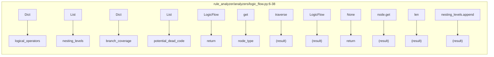
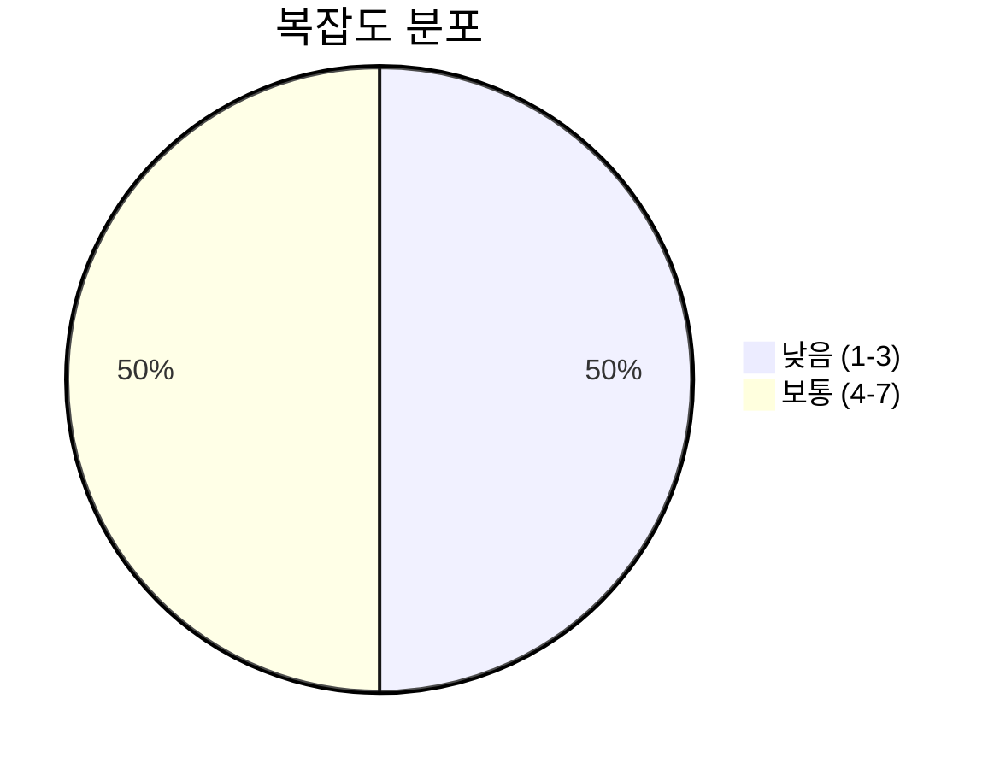
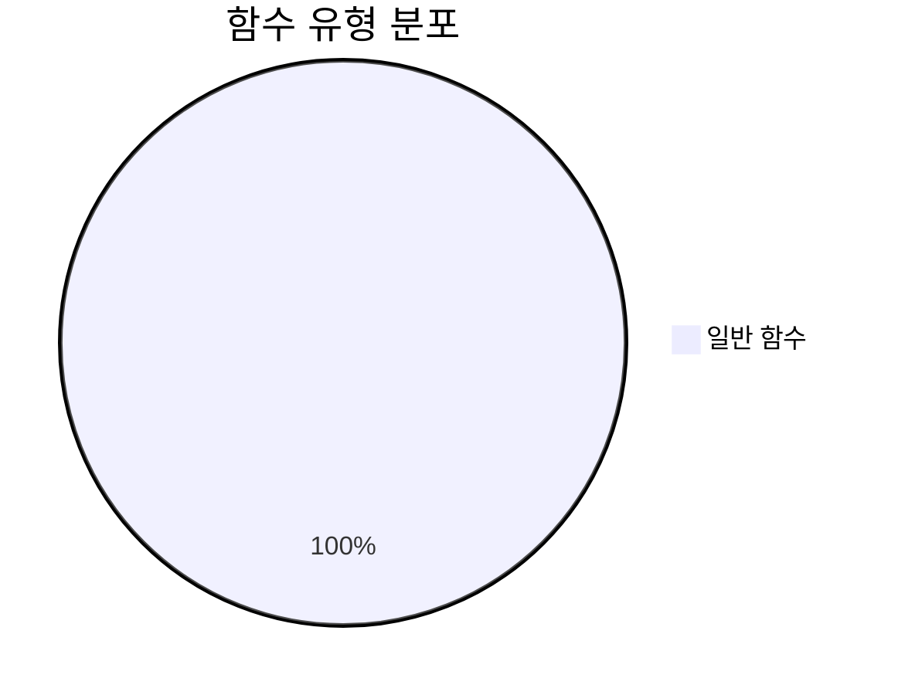
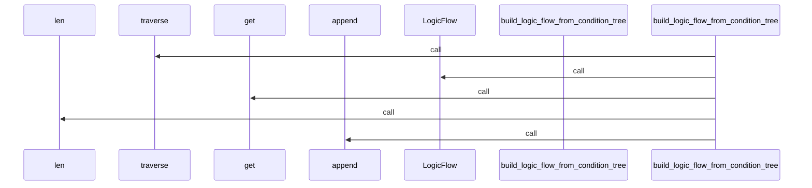
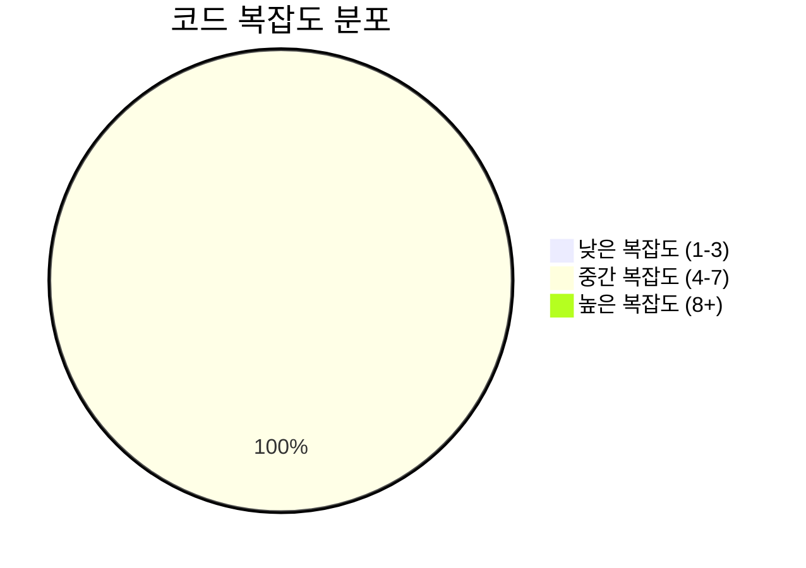

# 📄 logic_flow.py

> **파일 경로**: `rule_analyzer/analyzers/logic_flow.py`  
> **생성일**: 2025-09-26  
> **Chunk 수**: 2개

---

## 📑 목차

### ⚙️ 함수
- [`build_logic_flow_from_condition_tree`](#function-build_logic_flow_from_condition_tree) - 복잡도: 5


## 📋 파일 개요

| | |
|--|--|
| 📦 **의존성**: `typing` • `models` | ⚡ **총 복잡도**: 5 |
| 📊 **총 토큰 수**: 442 |  |


## ⚙️ 함수

### <a id="function-build_logic_flow_from_condition_tree"></a>🔧 `build_logic_flow_from_condition_tree`


> 📖 **함수 설명**  
> condition_tree(dict)에서 LogicFlow 객체를 생성합니다.

Why: 룰의 논리 구조를 분석하여 복잡성과 잠재적 문제점을 파악하고 최적화 방향을 제시하기 위함입니다.
How: 조건 트리를 재귀적으로 순회하여 논리 연산자 사용 빈도, 중첩 레벨 분포, 분기 커버리지를 계산합니다.

| 속성 | 값 |
|------|----|
| ⚡ 복잡도 | 5 |
| 📊 토큰 수 | 413 |
| 📍 라인 범위 | 6-38 |


#### 🧩 시그니처 상세

- **Signature**: `build_logic_flow_from_condition_tree(condition_tree: Dict[str, Any]) -> LogicFlow`- **Parameters**: `condition_tree: Dict[str, Any]`
- **Returns**: `LogicFlow`


#### 📞 Calls

`traverse`, `LogicFlow`, `get`, `len`, `append`

#### 🧭 DATA FLOW



<details>
<summary>💻 코드 미리보기</summary>

```python
def build_logic_flow_from_condition_tree(condition_tree: Dict[str, Any]) -> LogicFlow:
    """
    condition_tree(dict)에서 LogicFlow 객체를 생성합니다.

    Why: 룰의 논리 구조를 분석하여 복잡성과 잠재적 문제점을 파악하고 최적화 방향을 제시하기 위함입니다.
    How: 조건 트리를 재귀적으로 순회하여 논리 연산자 사용 빈도, 중첩 레벨 분포, 분기 커버리지를 계산합니다.
    """
    # 예시: AND/OR 카운트, 레벨별 조건 수, 분기 커버리지, 도달 불가능 조건
    logical_operators = {"AND": 0, "OR": 0}
    nesting_levels = []
    branch_coverage = {}
    potential_dead_code = []

    def traverse(node, depth=0):
        if not node:
            return
        if len(nesting_levels) <= depth:
            nesting_levels.append(0)
        nesting_levels[depth] += 1
        node_type = node.get("type")
        if node_type in ("AND", "OR"):
            logical_operators[node_type] += 1
            for child in node.get("c...
```

**Chunk 메타데이터**
- 🆔 **ID**: `29f64ee845cf`
- 🏷️ **태그**: ``

</details>

---


## 📊 시각화 및 분석

### ⚡ 복잡도 분석



### 🔧 함수 유형 분석



### 🔗 호출 순서 (Sequence)




## 📈 퍼포먼스 메트릭스

### 📊 핵심 지표

| 🎯 메트릭 | 📊 값 | 🚦 상태 |
|-----------|-------|--------|
| **총 라인 수** | 33 | 🟢 양호 |
| **평균 복잡도** | 5.0 | 🟡 보통 |
| **최대 복잡도** | 5 | 🟢 양호 |
| **함수 밀도** | 50.0% | 🔴 주의 |


### 🎯 품질 점수




## 🧩 Chunk 요약

이 파일은 총 **2개의 chunk**로 구성되어 있으며, **442개의 토큰**을 포함합니다.

| 🧩 Chunk 타입 | 📊 개수 | ⚡ 평균 복잡도 | 📝 총 토큰 | 📈 비율 |
|---------------|--------|-------------|----------|--------|
| 📋 파일 개요 | 1 | 0.0 | 29 | 6.6% |
| ⚙️ 함수 | 1 | 5.0 | 413 | 93.4% |

