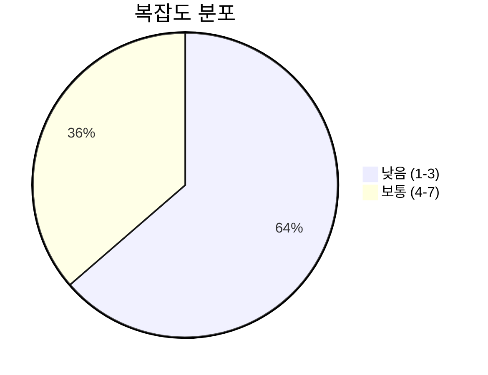
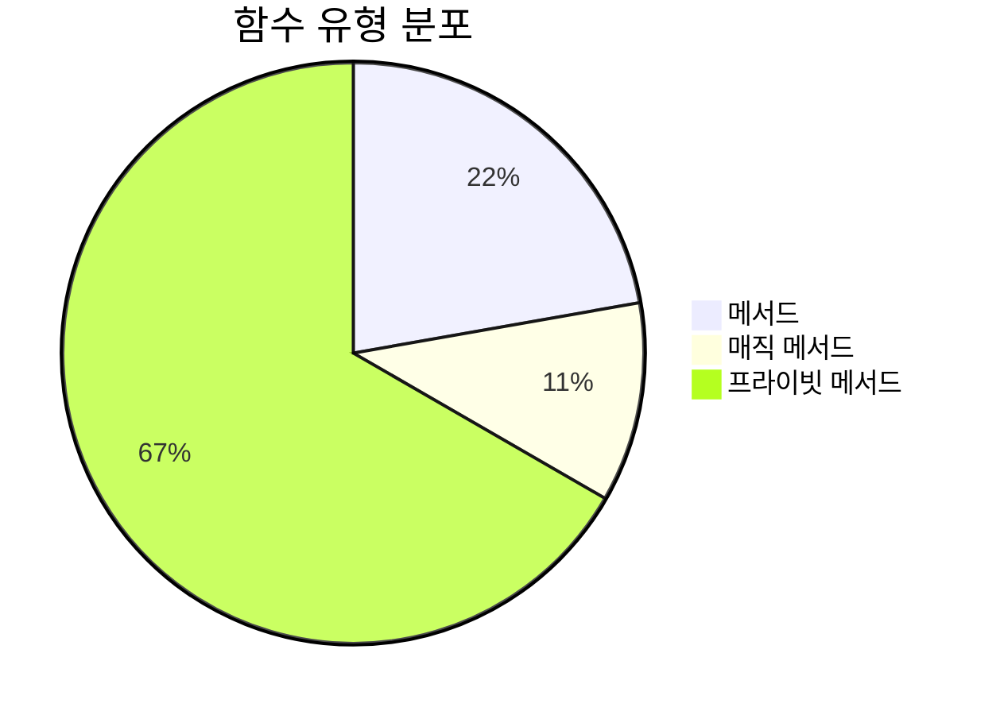
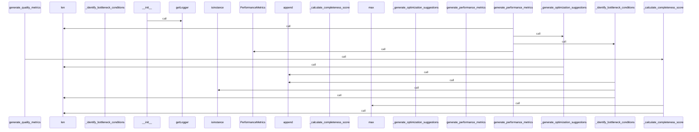
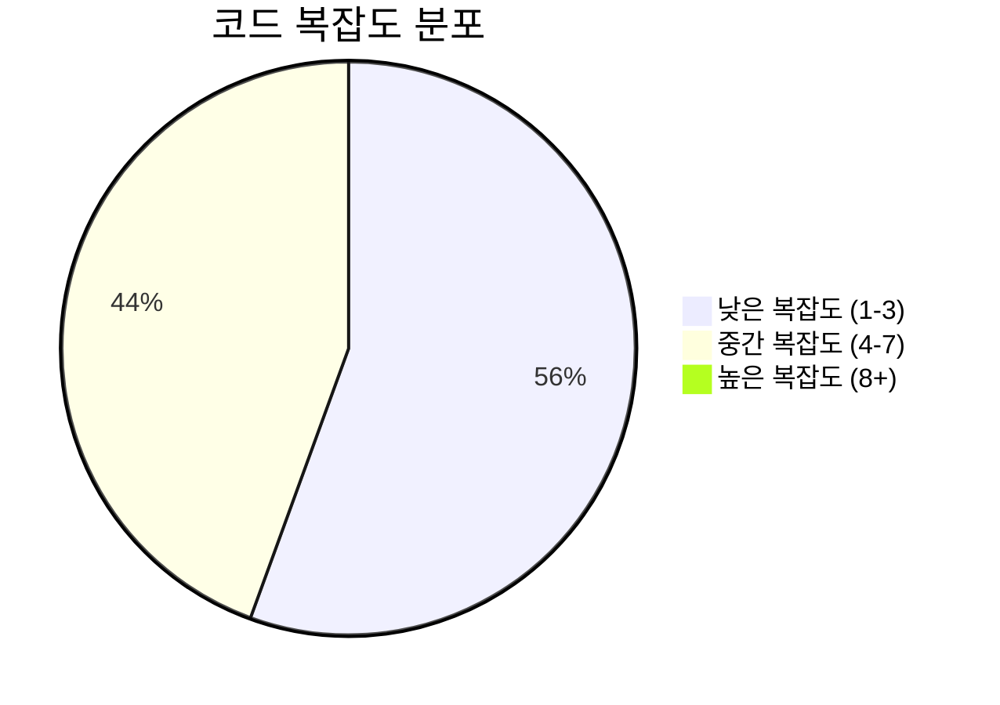

# 📄 metrics_generator.py

> **파일 경로**: `rule_analyzer/analyzers/metrics_generator.py`  
> **생성일**: 2025-10-13  
> **Chunk 수**: 11개

---

## 📑 목차

### 🏗️ 클래스
- [`MetricsGenerator`](#class-metricsgenerator) - 복잡도: 0


## 📋 파일 개요

| | |
|--|--|
| 📦 **의존성**: `models` • `typing` • `exceptions` • `logging` | ⚡ **총 복잡도**: 28 |
| 📊 **총 토큰 수**: 2,204 |  |


## 🏗️ 클래스

### <a id="class-metricsgenerator"></a>🎯 `MetricsGenerator`


> 📝 **클래스 설명**  
> 메트릭 생성을 담당하는 클래스

#### 📋 메서드 목록

| 메서드 | 타입 | 복잡도 | 설명 |
|--------|------|--------|------|
| `__init__` | magic | 1 | MetricsGenerator 초기화 |
| `_calculate_completeness_score` | private | 2 | 완성도 점수 계산 |
| `_calculate_consistency_score` | private | 1 | 일관성 점수 계산 |
| `_calculate_maintainability_score` | private | 2 | 유지보수성 점수 계산 |
| `_calculate_readability_score` | private | 5 | 가독성 점수 계산 |
| `_generate_optimization_suggestions` | private | 5 | 최적화 제안 생성 |
| `_identify_bottleneck_conditions` | private | 5 | 병목 조건 식별 |
| `generate_performance_metrics` | public | 5 | 성능 메트릭 생성 |
| `generate_quality_metrics` | public | 2 | 품질 메트릭 생성 |


#### 🔧 메서드 상세

##### `generate_performance_metrics`
| 속성 | 값 |
|------|----|
| ⚡ 복잡도 | 5 |
| 📊 토큰 수 | 551 |
| 📍 라인 범위 | 28-86 |
- **Signature**: `generate_performance_metrics(self, conditions: List[RuleCondition], complexity_score: int, field_analysis: List[FieldAnalysis]) -> PerformanceMetrics`- **Parameters**: `self, conditions: List[RuleCondition], complexity_score: int, field_analysis: List[FieldAnalysis]`- **Returns**: `PerformanceMetrics`
- **Calls**: `len`, `_generate_optimization_suggestions`, `_identify_bottleneck_conditions`, `PerformanceMetrics`, `error`, `AdvancedAnalysisError`, `str`- **Raises**: `AdvancedAnalysisError`---
##### `_generate_optimization_suggestions`
| 속성 | 값 |
|------|----|
| ⚡ 복잡도 | 5 |
| 📊 토큰 수 | 212 |
| 📍 라인 범위 | 150-173 |
- **Signature**: `_generate_optimization_suggestions(self, conditions: List[RuleCondition], complexity_score: int, field_analysis: List[FieldAnalysis]) -> List[str]`- **Parameters**: `self, conditions: List[RuleCondition], complexity_score: int, field_analysis: List[FieldAnalysis]`- **Returns**: `List[str]`
- **Calls**: `len`, `append`---
##### `_identify_bottleneck_conditions`
| 속성 | 값 |
|------|----|
| ⚡ 복잡도 | 5 |
| 📊 토큰 수 | 156 |
| 📍 라인 범위 | 175-189 |
- **Signature**: `_identify_bottleneck_conditions(self, conditions: List[RuleCondition]) -> List[str]`- **Parameters**: `self, conditions: List[RuleCondition]`- **Returns**: `List[str]`
- **Calls**: `append`, `isinstance`, `len`---
##### `_calculate_readability_score`
| 속성 | 값 |
|------|----|
| ⚡ 복잡도 | 5 |
| 📊 토큰 수 | 164 |
| 📍 라인 범위 | 213-232 |
- **Signature**: `_calculate_readability_score(self, conditions: List[RuleCondition], complexity_score: int, field_analysis: List[FieldAnalysis]) -> int`- **Parameters**: `self, conditions: List[RuleCondition], complexity_score: int, field_analysis: List[FieldAnalysis]`- **Returns**: `int`
- **Calls**: `max`, `int`---
##### `generate_quality_metrics`
| 속성 | 값 |
|------|----|
| ⚡ 복잡도 | 2 |
| 📊 토큰 수 | 517 |
| 📍 라인 범위 | 88-148 |
- **Signature**: `generate_quality_metrics(self, conditions: List[RuleCondition], issues: List, complexity_score: int, field_analysis: List[FieldAnalysis]) -> QualityMetrics`- **Parameters**: `self, conditions: List[RuleCondition], issues: List, complexity_score: int, field_analysis: List[FieldAnalysis]`- **Returns**: `QualityMetrics`
- **Calls**: `_calculate_maintainability_score`, `_calculate_readability_score`, `_calculate_completeness_score`, `_calculate_consistency_score`, `int`, `QualityMetrics`, `error`, `AdvancedAnalysisError`, `str`- **Raises**: `AdvancedAnalysisError`---
##### `_calculate_maintainability_score`
| 속성 | 값 |
|------|----|
| ⚡ 복잡도 | 2 |
| 📊 토큰 수 | 197 |
| 📍 라인 범위 | 191-211 |
- **Signature**: `_calculate_maintainability_score(self, conditions: List[RuleCondition], issues: List, complexity_score: int) -> int`- **Parameters**: `self, conditions: List[RuleCondition], issues: List, complexity_score: int`- **Returns**: `int`
- **Calls**: `len`, `max`---
##### `_calculate_completeness_score`
| 속성 | 값 |
|------|----|
| ⚡ 복잡도 | 2 |
| 📊 토큰 수 | 131 |
| 📍 라인 범위 | 234-248 |
- **Signature**: `_calculate_completeness_score(self, conditions: List[RuleCondition], issues: List) -> int`- **Parameters**: `self, conditions: List[RuleCondition], issues: List`- **Returns**: `int`
- **Calls**: `max`, `len`---
##### `__init__`
| 속성 | 값 |
|------|----|
| ⚡ 복잡도 | 1 |
| 📊 토큰 수 | 23 |
| 📍 라인 범위 | 24-26 |
- **Signature**: `__init__(self)`- **Parameters**: `self`- **Returns**: `N/A`
- **Calls**: `getLogger`---
##### `_calculate_consistency_score`
| 속성 | 값 |
|------|----|
| ⚡ 복잡도 | 1 |
| 📊 토큰 수 | 156 |
| 📍 라인 범위 | 250-266 |
- **Signature**: `_calculate_consistency_score(self, conditions: List[RuleCondition], issues: List) -> int`- **Parameters**: `self, conditions: List[RuleCondition], issues: List`- **Returns**: `int`
- **Calls**: `max`, `len`---
<details>
<summary>🔍 코드 미리보기</summary>

```python
class MetricsGenerator:
    """
    메트릭 생성을 담당하는 클래스
    """

    def __init__(self):...
```

**Chunk 정보**
- 🆔 **ID**: `edcac18462b6`
- 📍 **라인**: 19-29
- 📊 **토큰**: 28
- 🏷️ **태그**: `class`

</details>

---


## 📊 시각화 및 분석

### ⚡ 복잡도 분석



### 🔧 함수 유형 분석



### 🔗 호출 순서 (Sequence)




## 📈 퍼포먼스 메트릭스

### 📊 핵심 지표

| 🎯 메트릭 | 📊 값 | 🚦 상태 |
|-----------|-------|--------|
| **총 라인 수** | 246 | 🟡 보통 |
| **평균 복잡도** | 3.1 | 🟡 보통 |
| **최대 복잡도** | 5 | 🟢 양호 |
| **함수 밀도** | 81.8% | 🔴 주의 |


### 🎯 품질 점수




## 🧩 Chunk 요약

이 파일은 총 **11개의 chunk**로 구성되어 있으며, **2,204개의 토큰**을 포함합니다.

| 🧩 Chunk 타입 | 📊 개수 | ⚡ 평균 복잡도 | 📝 총 토큰 | 📈 비율 |
|---------------|--------|-------------|----------|--------|
| 📋 파일 개요 | 1 | 0.0 | 69 | 3.1% |
| 🏗️ 클래스 | 1 | 0.0 | 28 | 1.3% |
| 🔧 메서드 | 9 | 3.1 | 2,107 | 95.6% |

