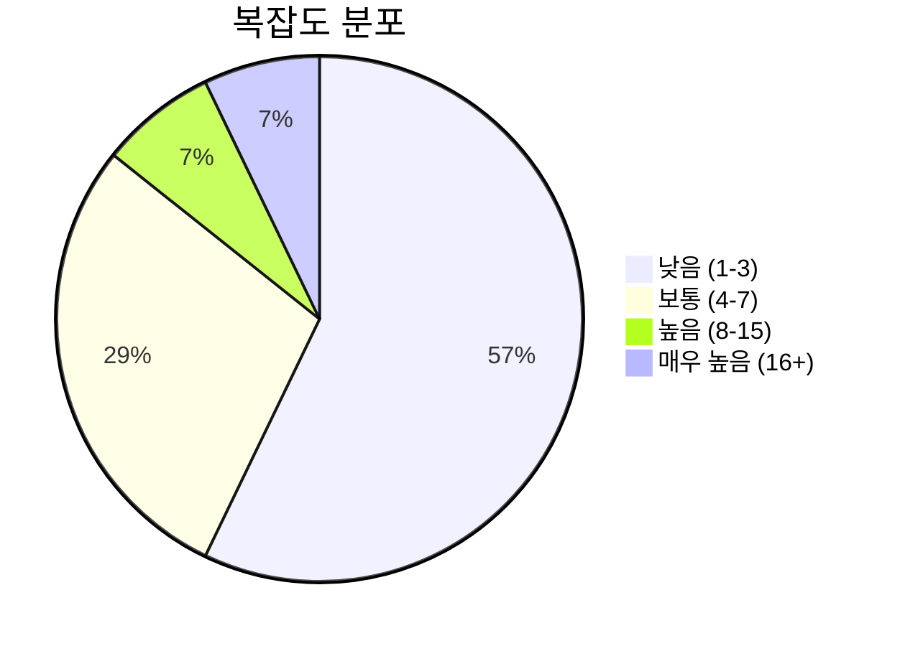
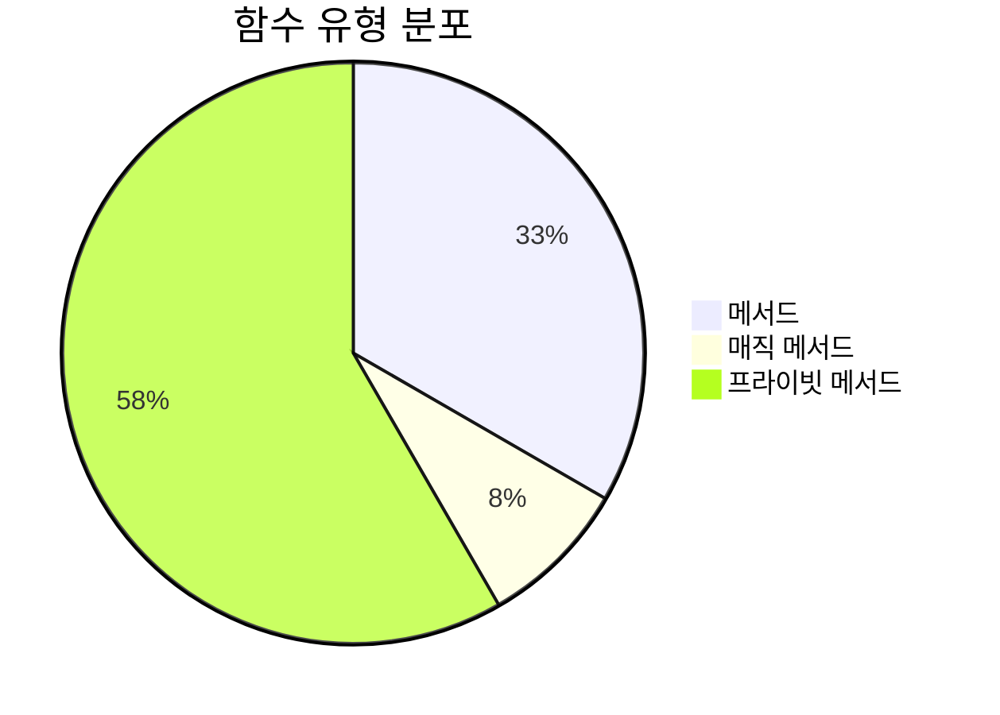
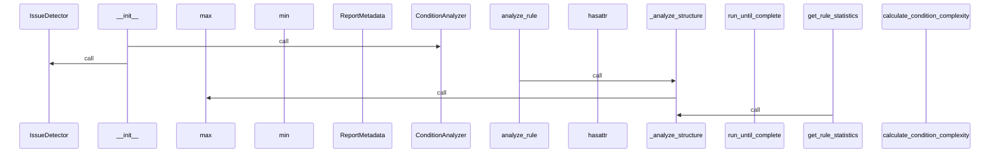
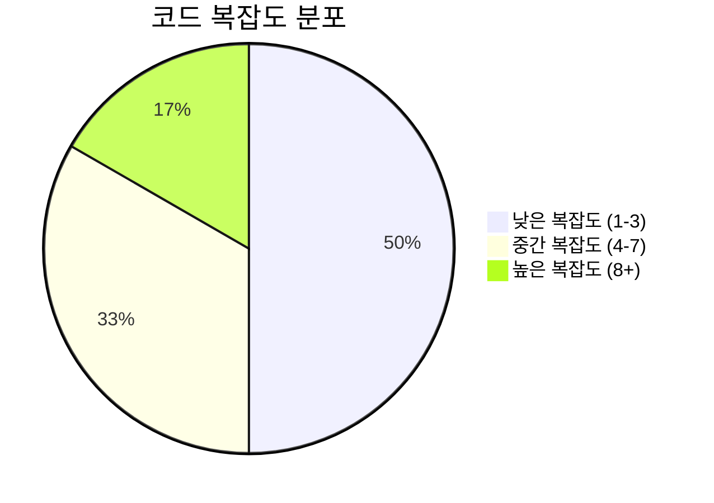

# 📄 rule_analyzer.py

> **파일 경로**: `rule_analyzer/analyzers/rule_analyzer.py`  
> **생성일**: 2025-09-26  
> **Chunk 수**: 14개

---

## 📑 목차

### 🏗️ 클래스
- [`RuleAnalyzer`](#class-ruleanalyzer) - 복잡도: 0


## 📋 파일 개요

| | |
|--|--|
| 📦 **의존성**: `advanced_analyzer` • `typing` • `issue_detector` • `asyncio` • `models` • `logging` 외 3개 | ⚡ **총 복잡도**: 74 |
| 📊 **총 토큰 수**: 4,445 | 🔄 **비동기 함수**: 1개 |


## 🏗️ 클래스

### <a id="class-ruleanalyzer"></a>🎯 `RuleAnalyzer`


> 📝 **클래스 설명**  
> 룰 분석을 담당하는 메인 클래스 (순수 로직)

#### 📋 메서드 목록

| 메서드 | 타입 | 복잡도 | 설명 |
|--------|------|--------|------|
| `__init__` | magic | 1 | RuleAnalyzer 초기화 |
| `_analyze_structure` | private | 27 | 룰 구조 분석 |
| `_calculate_complexity` | private | 13 | 복잡도 점수 계산 |
| `_count_issues_by_type` | private | 2 | 이슈 타입별 카운트 |
| `_create_report_metadata` | private | 2 | 리포트 메타데이터 생성 |
| `_extract_conditions_from_tree` | private | 7 | 조건 트리에서 조건 추출 |
| `_generate_summary` | private | 4 | 요약 생성 |
| `_parse_conditions` | private | 6 | 조건 파싱 |
| `analyze_rule` | async public | 3 | 룰을 종합적으로 분석 (순수 로직) |
| `analyze_rule_sync` | public | 2 | 룰을 동기적으로 분석 (비동기 래퍼) |
| `get_rule_statistics` | public | 2 | 룰 통계 정보 반환 |
| `validate_rule` | public | 5 | 룰 유효성 검증 (간단한 버전) |


#### 🔧 메서드 상세

##### `_analyze_structure`
| 속성 | 값 |
|------|----|
| ⚡ 복잡도 | 27 |
| 📊 토큰 수 | 961 |
| 📍 라인 범위 | 164-291 |
- **Signature**: `_analyze_structure(self, rule: Rule) -> StructureInfo`- **Parameters**: `self, rule: Rule`- **Returns**: `StructureInfo`
- **Calls**: `set`, `isinstance`, `StructureInfo`, `max`, `get`, `getattr`, `analyze_condition_tree`, `hasattr`, `list`, `add`---
##### `_calculate_complexity`
| 속성 | 값 |
|------|----|
| ⚡ 복잡도 | 13 |
| 📊 토큰 수 | 466 |
| 📍 라인 범위 | 354-412 |
- **Signature**: `_calculate_complexity(self, conditions: List, structure_info: StructureInfo) -> int`- **Parameters**: `self, conditions: List, structure_info: StructureInfo`- **Returns**: `int`
- **Calls**: `calculate_condition_complexity`, `min`, `len`, `isinstance`, `get`, `getattr`, `hasattr`---
##### `_extract_conditions_from_tree`
| 속성 | 값 |
|------|----|
| ⚡ 복잡도 | 7 |
| 📊 토큰 수 | 260 |
| 📍 라인 범위 | 322-352 |
- **Signature**: `_extract_conditions_from_tree(self, tree) -> List`- **Parameters**: `self, tree`- **Returns**: `List`
- **Calls**: `isinstance`, `get`, `getattr`, `append`, `hasattr`---
##### `_parse_conditions`
| 속성 | 값 |
|------|----|
| ⚡ 복잡도 | 6 |
| 📊 토큰 수 | 226 |
| 📍 라인 범위 | 293-320 |
- **Signature**: `_parse_conditions(self, rule: Rule) -> List`- **Parameters**: `self, rule: Rule`- **Returns**: `List`
- **Calls**: `isinstance`, `extend`, `hasattr`, `_extract_conditions_from_tree`---
##### `validate_rule`
| 속성 | 값 |
|------|----|
| ⚡ 복잡도 | 5 |
| 📊 토큰 수 | 253 |
| 📍 라인 범위 | 471-500 |
- **Signature**: `validate_rule(self, rule: Rule) -> bool`- **Parameters**: `self, rule: Rule`- **Returns**: `bool`
- **Calls**: `error`, `len`, `str`---
##### `_generate_summary`
| 속성 | 값 |
|------|----|
| ⚡ 복잡도 | 4 |
| 📊 토큰 수 | 262 |
| 📍 라인 범위 | 414-434 |
- **Signature**: `_generate_summary(self, rule: Rule, issues: List, complexity_score: int) -> str`- **Parameters**: `self, rule: Rule, issues: List, complexity_score: int`- **Returns**: `str`
- **Calls**: `len`, `isinstance`, `get`, `getattr`---
##### `analyze_rule`
| 속성 | 값 |
|------|----|
| ⚡ 복잡도 | 3 |
| 📊 토큰 수 | 892 |
| 📍 라인 범위 | 43-133 |
- **Signature**: `analyze_rule(self, rule: Rule, analysis_options: Optional[Dict[str, Any]]) -> ValidationResult`- **Parameters**: `self, rule: Rule, analysis_options: Optional[Dict[str, Any]]`- **Returns**: `ValidationResult`
- **Calls**: `timestamp`, `_analyze_structure`, `_parse_conditions`, `_calculate_complexity`, `_generate_summary`, `_count_issues_by_type`, `_create_report_metadata`, `get`, `ValidationResult`, `info`, `now`, `detect_all_issues`, `len`, `perform_advanced_analysis`, `isinstance`, `getattr`, `LogicFlow`, `error`, `RuleAnalyzerError`, `hasattr`, `str`- **Raises**: `RuleAnalyzerError`---
##### `analyze_rule_sync`
| 속성 | 값 |
|------|----|
| ⚡ 복잡도 | 2 |
| 📊 토큰 수 | 266 |
| 📍 라인 범위 | 135-162 |
- **Signature**: `analyze_rule_sync(self, rule: Rule, analysis_options: Optional[Dict[str, Any]]) -> ValidationResult`- **Parameters**: `self, rule: Rule, analysis_options: Optional[Dict[str, Any]]`- **Returns**: `ValidationResult`
- **Calls**: `run`, `analyze_rule`, `new_event_loop`, `set_event_loop`, `run_until_complete`, `close`---
##### `_count_issues_by_type`
| 속성 | 값 |
|------|----|
| ⚡ 복잡도 | 2 |
| 📊 토큰 수 | 74 |
| 📍 라인 범위 | 436-442 |
- **Signature**: `_count_issues_by_type(self, issues: List) -> Dict[str, int]`- **Parameters**: `self, issues: List`- **Returns**: `Dict[str, int]`
- **Calls**: `get`---
##### `_create_report_metadata`
| 속성 | 값 |
|------|----|
| ⚡ 복잡도 | 2 |
| 📊 토큰 수 | 240 |
| 📍 라인 범위 | 444-469 |
- **Signature**: `_create_report_metadata(self, rule: Rule, start_time: float) -> ReportMetadata`- **Parameters**: `self, rule: Rule, start_time: float`- **Returns**: `ReportMetadata`
- **Calls**: `int`, `isinstance`, `ReportMetadata`, `get`, `getattr`, `isoformat`, `timestamp`, `now`---
##### `get_rule_statistics`
| 속성 | 값 |
|------|----|
| ⚡ 복잡도 | 2 |
| 📊 토큰 수 | 291 |
| 📍 라인 범위 | 502-532 |
- **Signature**: `get_rule_statistics(self, rule: Rule) -> Dict[str, Any]`- **Parameters**: `self, rule: Rule`- **Returns**: `Dict[str, Any]`
- **Calls**: `_analyze_structure`, `_parse_conditions`, `_calculate_complexity`, `len`, `error`, `str`---
##### `__init__`
| 속성 | 값 |
|------|----|
| ⚡ 복잡도 | 1 |
| 📊 토큰 수 | 54 |
| 📍 라인 범위 | 36-41 |
- **Signature**: `__init__(self)`- **Parameters**: `self`- **Returns**: `N/A`
- **Calls**: `getLogger`, `ConditionAnalyzer`, `IssueDetector`, `AdvancedAnalyzer`---
<details>
<summary>🔍 코드 미리보기</summary>

```python
class RuleAnalyzer:
    """
    룰 분석을 담당하는 메인 클래스 (순수 로직)
    """

    def __init__(self):...
```

**Chunk 정보**
- 🆔 **ID**: `e15017fd679f`
- 📍 **라인**: 31-41
- 📊 **토큰**: 40
- 🏷️ **태그**: `class`

</details>

---


## 📊 시각화 및 분석

### ⚡ 복잡도 분석



### 🔧 함수 유형 분석



### 🔗 호출 순서 (Sequence)




## 📈 퍼포먼스 메트릭스

### 📊 핵심 지표

| 🎯 메트릭 | 📊 값 | 🚦 상태 |
|-----------|-------|--------|
| **총 라인 수** | 497 | 🟡 보통 |
| **평균 복잡도** | 6.2 | 🟡 보통 |
| **최대 복잡도** | 27 | 🔴 주의 |
| **함수 밀도** | 85.7% | 🔴 주의 |


### 🎯 품질 점수




## 🧩 Chunk 요약

이 파일은 총 **14개의 chunk**로 구성되어 있으며, **4,445개의 토큰**을 포함합니다.

| 🧩 Chunk 타입 | 📊 개수 | ⚡ 평균 복잡도 | 📝 총 토큰 | 📈 비율 |
|---------------|--------|-------------|----------|--------|
| 📋 파일 개요 | 1 | 0.0 | 160 | 3.6% |
| 🏗️ 클래스 | 1 | 0.0 | 40 | 0.9% |
| 🔧 메서드 | 12 | 6.2 | 4,245 | 95.5% |

