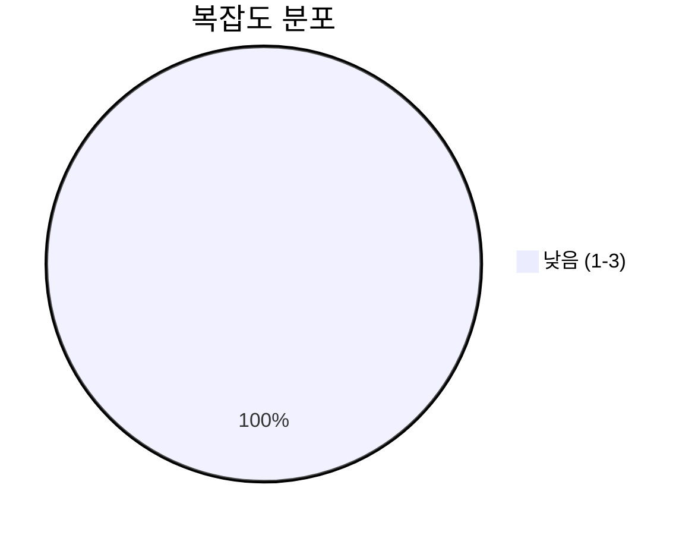
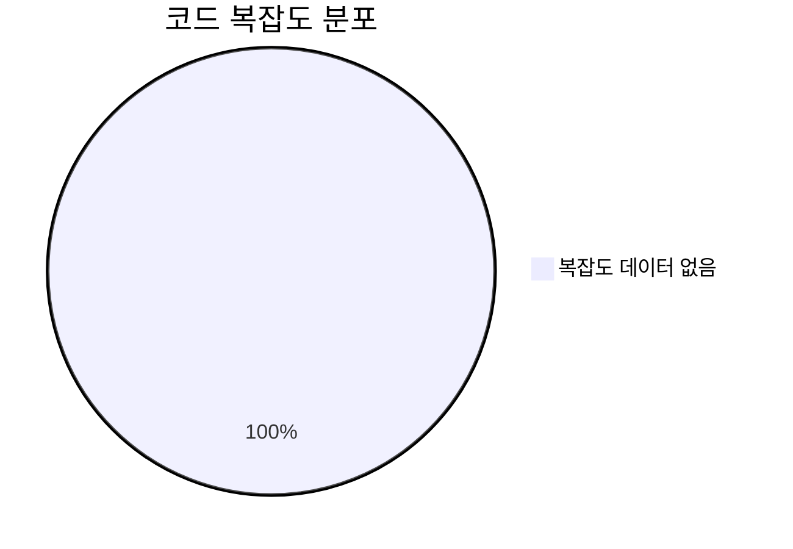

# 📄 exceptions.py

> **파일 경로**: `rule_analyzer/exceptions.py`  
> **생성일**: 2025-10-01  
> **Chunk 수**: 11개

---

## 📑 목차

### 🏗️ 클래스
- [`RuleAnalyzerError`](#class-ruleanalyzererror) - 복잡도: 0
- [`RuleParsingError`](#class-ruleparsingerror) - 복잡도: 0
- [`ConditionAnalysisError`](#class-conditionanalysiserror) - 복잡도: 0
- [`IssueDetectionError`](#class-issuedetectionerror) - 복잡도: 0
- [`AdvancedAnalysisError`](#class-advancedanalysiserror) - 복잡도: 0
- [`ValidationError`](#class-validationerror) - 복잡도: 0
- [`JSONProcessingError`](#class-jsonprocessingerror) - 복잡도: 0
- [`ConfigurationError`](#class-configurationerror) - 복잡도: 0
- [`DataTypeError`](#class-datatypeerror) - 복잡도: 0
- [`LogicError`](#class-logicerror) - 복잡도: 0


## 📋 파일 개요

| | |
|--|--|
| 📊 **총 토큰 수**: 379 |  |


## 🏗️ 클래스

### <a id="class-ruleanalyzererror"></a>🎯 `RuleAnalyzerError`


> 📝 **클래스 설명**  
> 룰 분석기 기본 예외

| 속성 | 값 |
|------|----|
| 🧬 상속 | `Exception` |


<details>
<summary>🔍 코드 미리보기</summary>

```python
class RuleAnalyzerError(Exception):
    """룰 분석기 기본 예외"""

    pass


class RuleParsingError(RuleAnalyzerError):...
```

**Chunk 정보**
- 🆔 **ID**: `34ad6b043e4f`
- 📍 **라인**: 8-18
- 📊 **토큰**: 34
- 🏷️ **태그**: `class, exception`

</details>

---

### <a id="class-ruleparsingerror"></a>🎯 `RuleParsingError`


> 📝 **클래스 설명**  
> 룰 파싱 오류

| 속성 | 값 |
|------|----|
| 🧬 상속 | `RuleAnalyzerError` |


<details>
<summary>🔍 코드 미리보기</summary>

```python
class RuleParsingError(RuleAnalyzerError):
    """룰 파싱 오류"""

    pass


class ConditionAnalysisError(RuleAnalyzerError):...
```

**Chunk 정보**
- 🆔 **ID**: `23e70da9b425`
- 📍 **라인**: 14-24
- 📊 **토큰**: 31
- 🏷️ **태그**: `class, exception`

</details>

---

### <a id="class-conditionanalysiserror"></a>🎯 `ConditionAnalysisError`


> 📝 **클래스 설명**  
> 조건 분석 오류

| 속성 | 값 |
|------|----|
| 🧬 상속 | `RuleAnalyzerError` |


<details>
<summary>🔍 코드 미리보기</summary>

```python
class ConditionAnalysisError(RuleAnalyzerError):
    """조건 분석 오류"""

    pass


class IssueDetectionError(RuleAnalyzerError):...
```

**Chunk 정보**
- 🆔 **ID**: `6b33435260d9`
- 📍 **라인**: 20-30
- 📊 **토큰**: 33
- 🏷️ **태그**: `class, exception`

</details>

---

### <a id="class-issuedetectionerror"></a>🎯 `IssueDetectionError`


> 📝 **클래스 설명**  
> 이슈 검출 오류

| 속성 | 값 |
|------|----|
| 🧬 상속 | `RuleAnalyzerError` |


<details>
<summary>🔍 코드 미리보기</summary>

```python
class IssueDetectionError(RuleAnalyzerError):
    """이슈 검출 오류"""

    pass


class AdvancedAnalysisError(RuleAnalyzerError):...
```

**Chunk 정보**
- 🆔 **ID**: `75e8d11f4884`
- 📍 **라인**: 26-36
- 📊 **토큰**: 31
- 🏷️ **태그**: `class, exception`

</details>

---

### <a id="class-advancedanalysiserror"></a>🎯 `AdvancedAnalysisError`


> 📝 **클래스 설명**  
> 고급 분석 오류

| 속성 | 값 |
|------|----|
| 🧬 상속 | `RuleAnalyzerError` |


<details>
<summary>🔍 코드 미리보기</summary>

```python
class AdvancedAnalysisError(RuleAnalyzerError):
    """고급 분석 오류"""

    pass


class ValidationError(RuleAnalyzerError):...
```

**Chunk 정보**
- 🆔 **ID**: `65dd933492c0`
- 📍 **라인**: 32-42
- 📊 **토큰**: 31
- 🏷️ **태그**: `class, exception`

</details>

---

### <a id="class-validationerror"></a>🎯 `ValidationError`


> 📝 **클래스 설명**  
> 검증 오류

| 속성 | 값 |
|------|----|
| 🧬 상속 | `RuleAnalyzerError` |


<details>
<summary>🔍 코드 미리보기</summary>

```python
class ValidationError(RuleAnalyzerError):
    """검증 오류"""

    pass


class JSONProcessingError(RuleAnalyzerError):...
```

**Chunk 정보**
- 🆔 **ID**: `73fb18e8107e`
- 📍 **라인**: 38-48
- 📊 **토큰**: 28
- 🏷️ **태그**: `class, exception`

</details>

---

### <a id="class-jsonprocessingerror"></a>🎯 `JSONProcessingError`


> 📝 **클래스 설명**  
> JSON 처리 오류

| 속성 | 값 |
|------|----|
| 🧬 상속 | `RuleAnalyzerError` |


<details>
<summary>🔍 코드 미리보기</summary>

```python
class JSONProcessingError(RuleAnalyzerError):
    """JSON 처리 오류"""

    pass


class ConfigurationError(RuleAnalyzerError):...
```

**Chunk 정보**
- 🆔 **ID**: `02fe6c312f4a`
- 📍 **라인**: 44-54
- 📊 **토큰**: 27
- 🏷️ **태그**: `class, exception`

</details>

---

### <a id="class-configurationerror"></a>🎯 `ConfigurationError`


> 📝 **클래스 설명**  
> 설정 오류

| 속성 | 값 |
|------|----|
| 🧬 상속 | `RuleAnalyzerError` |


<details>
<summary>🔍 코드 미리보기</summary>

```python
class ConfigurationError(RuleAnalyzerError):
    """설정 오류"""

    pass


class DataTypeError(RuleAnalyzerError):...
```

**Chunk 정보**
- 🆔 **ID**: `a15940548655`
- 📍 **라인**: 50-60
- 📊 **토큰**: 27
- 🏷️ **태그**: `class, exception`

</details>

---

### <a id="class-datatypeerror"></a>🎯 `DataTypeError`


> 📝 **클래스 설명**  
> 데이터 타입 오류

| 속성 | 값 |
|------|----|
| 🧬 상속 | `RuleAnalyzerError` |


<details>
<summary>🔍 코드 미리보기</summary>

```python
class DataTypeError(RuleAnalyzerError):
    """데이터 타입 오류"""

    pass


class LogicError(RuleAnalyzerError):...
```

**Chunk 정보**
- 🆔 **ID**: `fcfdef79b995`
- 📍 **라인**: 56-66
- 📊 **토큰**: 29
- 🏷️ **태그**: `class, exception`

</details>

---

### <a id="class-logicerror"></a>🎯 `LogicError`


> 📝 **클래스 설명**  
> 로직 오류

| 속성 | 값 |
|------|----|
| 🧬 상속 | `RuleAnalyzerError` |


<details>
<summary>🔍 코드 미리보기</summary>

```python
class LogicError(RuleAnalyzerError):
    """로직 오류"""

    pass
...
```

**Chunk 정보**
- 🆔 **ID**: `afc335e32165`
- 📍 **라인**: 62-72
- 📊 **토큰**: 19
- 🏷️ **태그**: `class, exception`

</details>

---


## 📊 시각화 및 분석

### ⚡ 복잡도 분석




## 📈 퍼포먼스 메트릭스

### 📊 핵심 지표

| 🎯 메트릭 | 📊 값 | 🚦 상태 |
|-----------|-------|--------|
| **총 라인 수** | 110 | 🟡 보통 |
| **평균 복잡도** | 0.0 | 🟢 양호 |
| **최대 복잡도** | 0 | 🟢 양호 |
| **함수 밀도** | 0.0% | 🟢 양호 |


### 🎯 품질 점수




## 🧩 Chunk 요약

이 파일은 총 **11개의 chunk**로 구성되어 있으며, **379개의 토큰**을 포함합니다.

| 🧩 Chunk 타입 | 📊 개수 | ⚡ 평균 복잡도 | 📝 총 토큰 | 📈 비율 |
|---------------|--------|-------------|----------|--------|
| 📋 파일 개요 | 1 | 0.0 | 89 | 23.5% |
| 🏗️ 클래스 | 10 | 0.0 | 290 | 76.5% |

