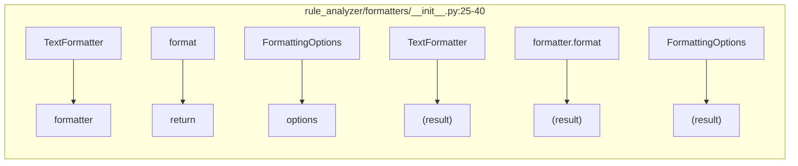
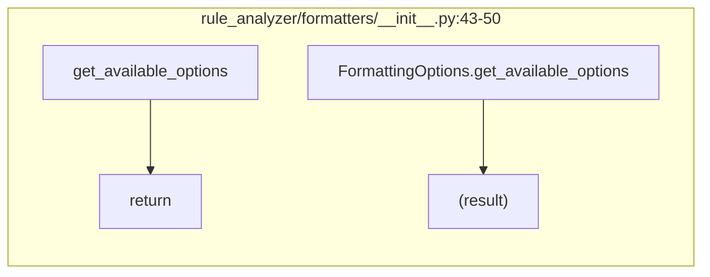
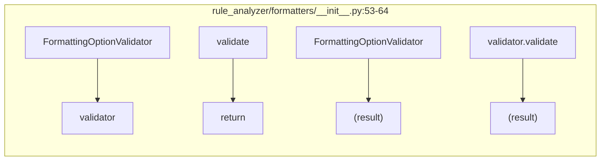
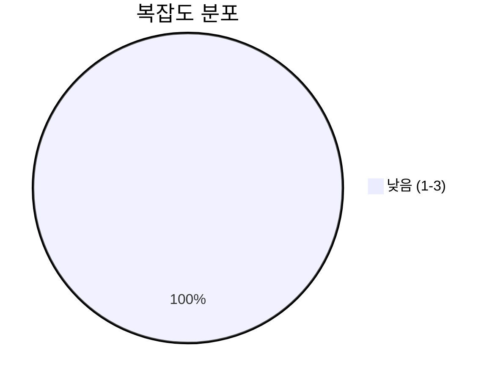
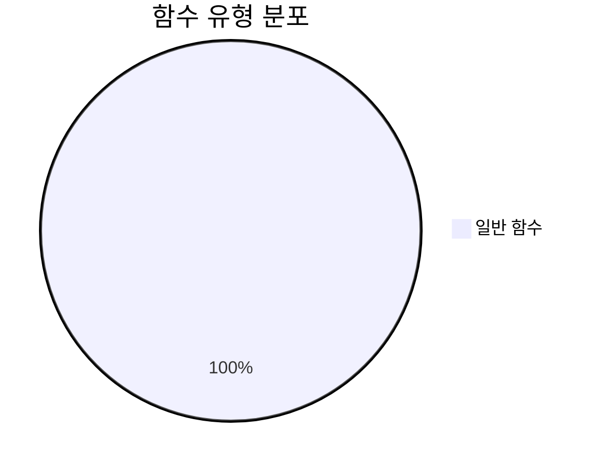
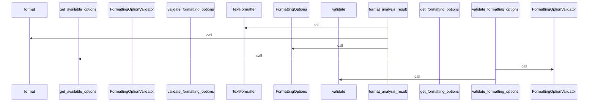
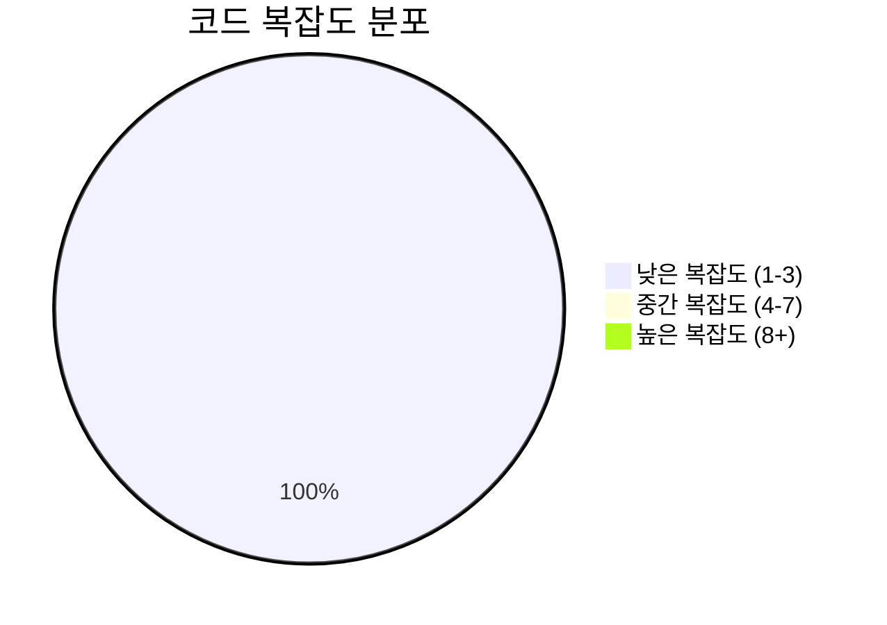

# 📄 __init__.py

> **파일 경로**: `rule_analyzer/formatters/__init__.py`  
> **생성일**: 2025-09-26  
> **Chunk 수**: 4개

---

## 📑 목차

### ⚙️ 함수
- [`format_analysis_result`](#function-format_analysis_result) - 복잡도: 2
- [`get_formatting_options`](#function-get_formatting_options) - 복잡도: 1
- [`validate_formatting_options`](#function-validate_formatting_options) - 복잡도: 1


## 📋 파일 개요

| | |
|--|--|
| 📦 **의존성**: `streaming_formatter` • `options` • `text_formatter` | ⚡ **총 복잡도**: 4 |
| 📊 **총 토큰 수**: 427 |  |


## ⚙️ 함수

### <a id="function-format_analysis_result"></a>🔧 `format_analysis_result`


> 📖 **함수 설명**  
> 분석 결과를 텍스트로 포맷팅

Args:
    validation_result: ValidationResult 객체
    options: 포맷팅 옵션

Returns:
    포맷팅된 텍스트

| 속성 | 값 |
|------|----|
| ⚡ 복잡도 | 2 |
| 📊 토큰 수 | 100 |
| 📍 라인 범위 | 25-40 |


#### 🧩 시그니처 상세

- **Signature**: `format_analysis_result(validation_result, options: FormattingOptions) -> str`- **Parameters**: `validation_result, options: FormattingOptions`
- **Returns**: `str`


#### 📞 Calls

`TextFormatter`, `format`, `FormattingOptions`

#### 🧭 DATA FLOW



<details>
<summary>💻 코드 미리보기</summary>

```python
def format_analysis_result(validation_result, options: FormattingOptions = None) -> str:
    """
    분석 결과를 텍스트로 포맷팅

    Args:
        validation_result: ValidationResult 객체
        options: 포맷팅 옵션

    Returns:
        포맷팅된 텍스트
    """
    if options is None:
        options = FormattingOptions()

    formatter = TextFormatter(options)
    return formatter.format(validation_result)...
```

**Chunk 메타데이터**
- 🆔 **ID**: `b93c9e89feb3`
- 🏷️ **태그**: ``

</details>

---

### <a id="function-get_formatting_options"></a>🔧 `get_formatting_options`


> 📖 **함수 설명**  
> 사용 가능한 포맷팅 옵션 반환

Returns:
    포맷팅 옵션 정보 딕셔너리

| 속성 | 값 |
|------|----|
| ⚡ 복잡도 | 1 |
| 📊 토큰 수 | 56 |
| 📍 라인 범위 | 43-50 |


#### 🧩 시그니처 상세

- **Signature**: `get_formatting_options() -> dict`- **Returns**: `dict`


#### 📞 Calls

`get_available_options`

#### 🧭 DATA FLOW



<details>
<summary>💻 코드 미리보기</summary>

```python
def get_formatting_options() -> dict:
    """
    사용 가능한 포맷팅 옵션 반환

    Returns:
        포맷팅 옵션 정보 딕셔너리
    """
    return FormattingOptions.get_available_options()...
```

**Chunk 메타데이터**
- 🆔 **ID**: `83b9ac889465`
- 🏷️ **태그**: `getter`

</details>

---

### <a id="function-validate_formatting_options"></a>🔧 `validate_formatting_options`


> 📖 **함수 설명**  
> 포맷팅 옵션 유효성 검증

Args:
    options: 검증할 옵션 딕셔너리

Returns:
    (유효성 여부, 에러 메시지 리스트)

| 속성 | 값 |
|------|----|
| ⚡ 복잡도 | 1 |
| 📊 토큰 수 | 93 |
| 📍 라인 범위 | 53-64 |


#### 🧩 시그니처 상세

- **Signature**: `validate_formatting_options(options: dict) -> tuple[bool, list[str]]`- **Parameters**: `options: dict`
- **Returns**: `tuple[bool, list[str]]`


#### 📞 Calls

`FormattingOptionValidator`, `validate`

#### 🧭 DATA FLOW



<details>
<summary>💻 코드 미리보기</summary>

```python
def validate_formatting_options(options: dict) -> tuple[bool, list[str]]:
    """
    포맷팅 옵션 유효성 검증

    Args:
        options: 검증할 옵션 딕셔너리

    Returns:
        (유효성 여부, 에러 메시지 리스트)
    """
    validator = FormattingOptionValidator()
    return validator.validate(options)...
```

**Chunk 메타데이터**
- 🆔 **ID**: `96e51b92c99c`
- 🏷️ **태그**: `validation`

</details>

---


## 📊 시각화 및 분석

### ⚡ 복잡도 분석



### 🔧 함수 유형 분석



### 🔗 호출 순서 (Sequence)




## 📈 퍼포먼스 메트릭스

### 📊 핵심 지표

| 🎯 메트릭 | 📊 값 | 🚦 상태 |
|-----------|-------|--------|
| **총 라인 수** | 36 | 🟢 양호 |
| **평균 복잡도** | 1.3 | 🟢 양호 |
| **최대 복잡도** | 2 | 🟢 양호 |
| **함수 밀도** | 75.0% | 🔴 주의 |


### 🎯 품질 점수




## 🧩 Chunk 요약

이 파일은 총 **4개의 chunk**로 구성되어 있으며, **427개의 토큰**을 포함합니다.

| 🧩 Chunk 타입 | 📊 개수 | ⚡ 평균 복잡도 | 📝 총 토큰 | 📈 비율 |
|---------------|--------|-------------|----------|--------|
| 📋 파일 개요 | 1 | 0.0 | 178 | 41.7% |
| ⚙️ 함수 | 3 | 1.3 | 249 | 58.3% |

