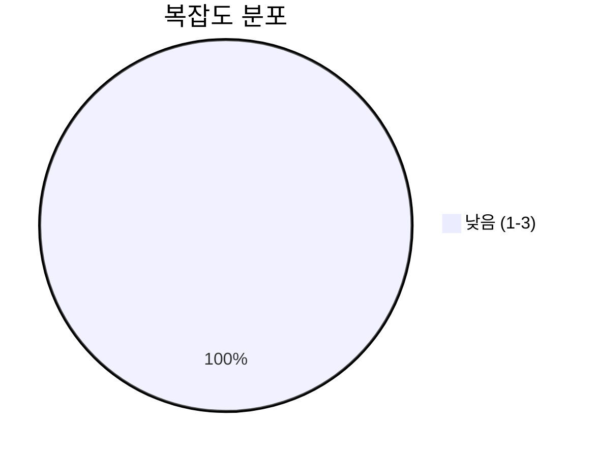
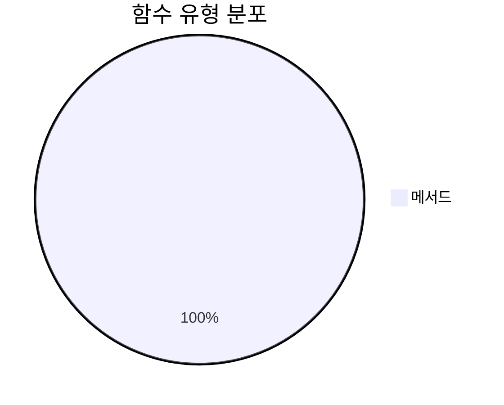
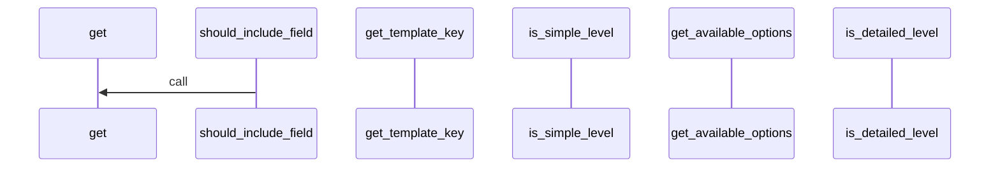
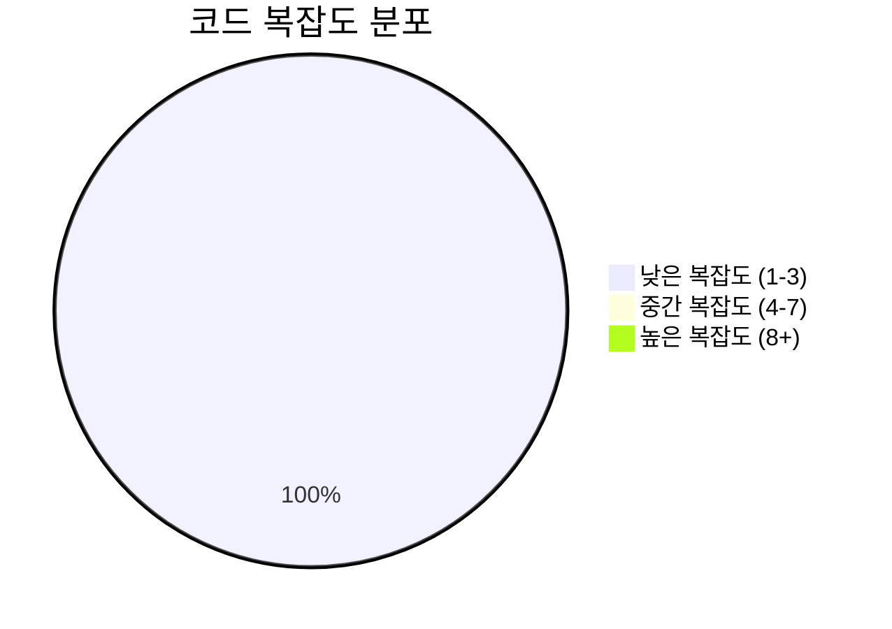

# 📄 formatting_options.py

> **파일 경로**: `rule_analyzer/formatters/options/formatting_options.py`  
> **생성일**: 2025-10-01  
> **Chunk 수**: 9개

---

## 📑 목차

### 🏗️ 클래스
- [`DetailLevel`](#class-detaillevel) - 복잡도: 0
- [`Language`](#class-language) - 복잡도: 0
- [`FormattingOptions`](#class-formattingoptions) - 복잡도: 0


## 📋 파일 개요

| | |
|--|--|
| 📦 **의존성**: `typing` • `enum` • `pydantic` | ⚡ **총 복잡도**: 5 |
| 📊 **총 토큰 수**: 1,101 |  |


## 🏗️ 클래스

### <a id="class-detaillevel"></a>🎯 `DetailLevel`


> 📝 **클래스 설명**  
> 상세도 레벨

| 속성 | 값 |
|------|----|
| 🧬 상속 | `str → Enum` |


<details>
<summary>🔍 코드 미리보기</summary>

```python
class DetailLevel(str, Enum):
    """상세도 레벨"""

    SIMPLE = "simple"  # 간단: 핵심 정보만
    NORMAL = "normal"  # 일반: 기본 정보 + 요약
    DETAILED = "detailed"  # 상세: 모든 정보 포함


class Language(str, Enum):...
```

**Chunk 정보**
- 🆔 **ID**: `8ac027b9c10b`
- 📍 **라인**: 13-23
- 📊 **토큰**: 85
- 🏷️ **태그**: `class, enum`

</details>

---

### <a id="class-language"></a>🎯 `Language`


> 📝 **클래스 설명**  
> 지원 언어

| 속성 | 값 |
|------|----|
| 🧬 상속 | `str → Enum` |


<details>
<summary>🔍 코드 미리보기</summary>

```python
class Language(str, Enum):
    """지원 언어"""

    KOREAN = "ko"  # 한국어 (기본)
    ENGLISH = "en"  # 영어 (향후 확장)


class FormattingOptions(BaseModel):...
```

**Chunk 정보**
- 🆔 **ID**: `417918793904`
- 📍 **라인**: 21-31
- 📊 **토큰**: 61
- 🏷️ **태그**: `class, enum`

</details>

---

### <a id="class-formattingoptions"></a>🎯 `FormattingOptions`

 

> 📝 **클래스 설명**  
> 포맷팅 옵션 모델

사용자가 포맷팅 방식을 커스터마이징할 수 있는 옵션들을 정의합니다.

| 속성 | 값 |
|------|----|
| 🧬 상속 | `BaseModel` |


#### 📋 메서드 목록

| 메서드 | 타입 | 복잡도 | 설명 |
|--------|------|--------|------|
| `get_available_options` | public | 1 | 사용 가능한 포맷팅 옵션 정보 반환 |
| `get_template_key` | public | 1 | 현재 옵션에 해당하는 템플릿 키 반환 |
| `is_detailed_level` | public | 1 | 상세 레벨인지 확인 |
| `is_simple_level` | public | 1 | 간단 레벨인지 확인 |
| `should_include_field` | public | 1 | 특정 필드를 포함해야 하는지 확인 |


#### 🔧 메서드 상세

##### `get_available_options`
| 속성 | 값 |
|------|----|
| 🎨 데코레이터 | `classmethod` |
| ⚡ 복잡도 | 1 |
| 📊 토큰 수 | 180 |
| 📍 라인 범위 | 79-103 |
- **Signature**: `get_available_options(cls) -> Dict[str, Any]`- **Parameters**: `cls`- **Returns**: `Dict[str, Any]`
---
##### `get_template_key`
| 속성 | 값 |
|------|----|
| ⚡ 복잡도 | 1 |
| 📊 토큰 수 | 65 |
| 📍 라인 범위 | 105-112 |
- **Signature**: `get_template_key(self) -> str`- **Parameters**: `self`- **Returns**: `str`
---
##### `is_simple_level`
| 속성 | 값 |
|------|----|
| ⚡ 복잡도 | 1 |
| 📊 토큰 수 | 35 |
| 📍 라인 범위 | 114-116 |
- **Signature**: `is_simple_level(self) -> bool`- **Parameters**: `self`- **Returns**: `bool`
---
##### `is_detailed_level`
| 속성 | 값 |
|------|----|
| ⚡ 복잡도 | 1 |
| 📊 토큰 수 | 35 |
| 📍 라인 범위 | 118-120 |
- **Signature**: `is_detailed_level(self) -> bool`- **Parameters**: `self`- **Returns**: `bool`
---
##### `should_include_field`
| 속성 | 값 |
|------|----|
| ⚡ 복잡도 | 1 |
| 📊 토큰 수 | 108 |
| 📍 라인 범위 | 122-139 |
- **Signature**: `should_include_field(self, field_name: str) -> bool`- **Parameters**: `self, field_name: str`- **Returns**: `bool`
- **Calls**: `get`---
<details>
<summary>🔍 코드 미리보기</summary>

```python
class FormattingOptions(BaseModel):
    """
    포맷팅 옵션 모델

    사용자가 포맷팅 방식을 커스터마이징할 수 있는 옵션들을 정의합니다.
    """

    # 기본 옵션
    include_emojis: bool = Field(default=True, description="이모지 포함 여부")

    language: Language = Field(default=Language.KOREAN, description="출력 언어")

    detail_level: DetailLevel = Field(
        default=DetailLevel.NORMAL, description="상세도 레벨"
    )

    # 고급 옵션
    custom_template: Optional[str] = Field(
        default=None, description="사용자 정의 템플릿 (JSON 형태)"
    )

    max_line_length: int = Field(default=80, ge=40, le=200, description="최대 줄 길이")

    include_timestamps: bool = Field(default=True, description="타임스탬프 포함 여부")

    include_metadata: bool = Field(default=True, description="메타데이터 포함 여부")

    # 스타일 옵션
    bullet_style: str = Field(default="•", descript...
```

**Chunk 정보**
- 🆔 **ID**: `f202522f315f`
- 📍 **라인**: 28-38
- 📊 **토큰**: 444
- 🏷️ **태그**: `class, pydantic`

</details>

---


## 📊 시각화 및 분석

### ⚡ 복잡도 분석



### 🔧 함수 유형 분석



### 🔗 호출 순서 (Sequence)




## 📈 퍼포먼스 메트릭스

### 📊 핵심 지표

| 🎯 메트릭 | 📊 값 | 🚦 상태 |
|-----------|-------|--------|
| **총 라인 수** | 90 | 🟢 양호 |
| **평균 복잡도** | 1.0 | 🟢 양호 |
| **최대 복잡도** | 1 | 🟢 양호 |
| **함수 밀도** | 55.6% | 🔴 주의 |


### 🎯 품질 점수




## 🧩 Chunk 요약

이 파일은 총 **9개의 chunk**로 구성되어 있으며, **1,101개의 토큰**을 포함합니다.

| 🧩 Chunk 타입 | 📊 개수 | ⚡ 평균 복잡도 | 📝 총 토큰 | 📈 비율 |
|---------------|--------|-------------|----------|--------|
| 📋 파일 개요 | 1 | 0.0 | 88 | 8.0% |
| 🏗️ 클래스 | 3 | 0.0 | 590 | 53.6% |
| 🔧 메서드 | 5 | 1.0 | 423 | 38.4% |

