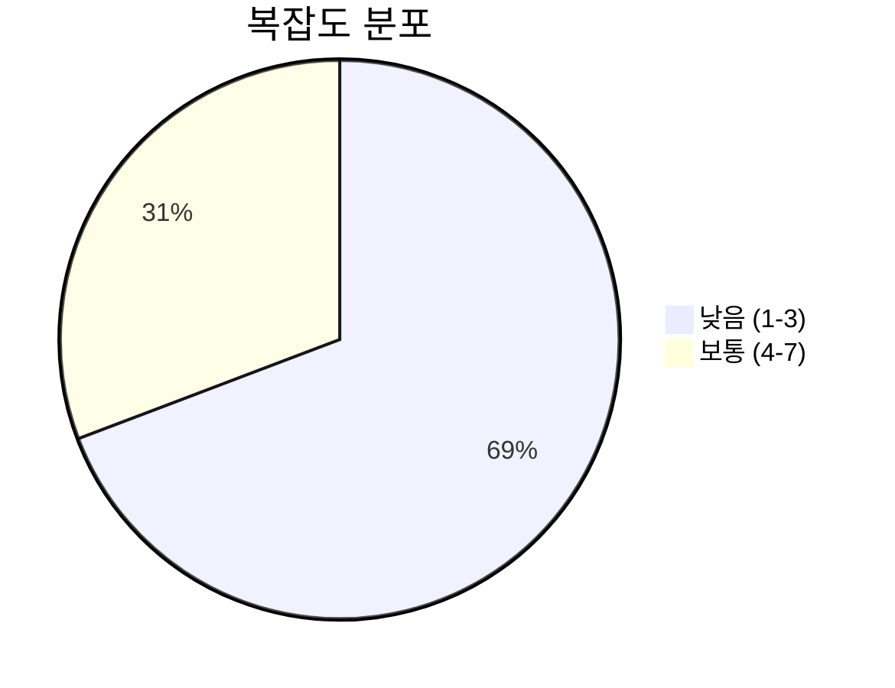
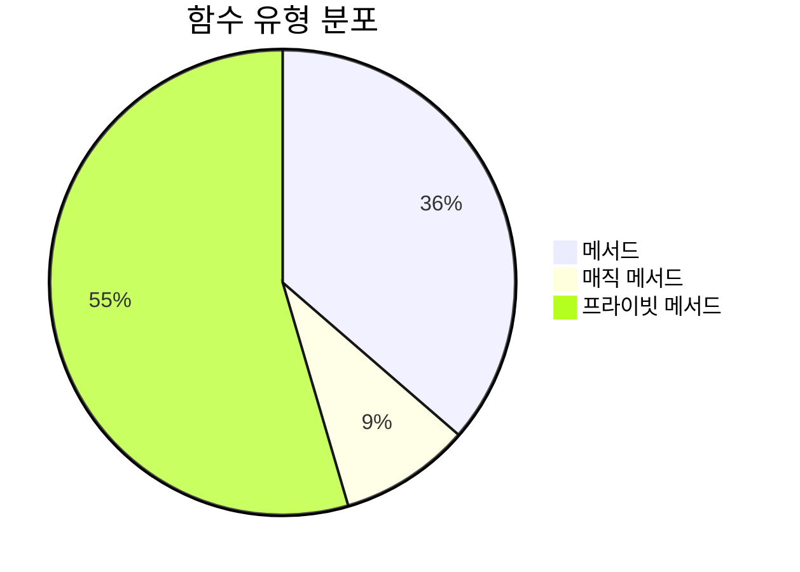
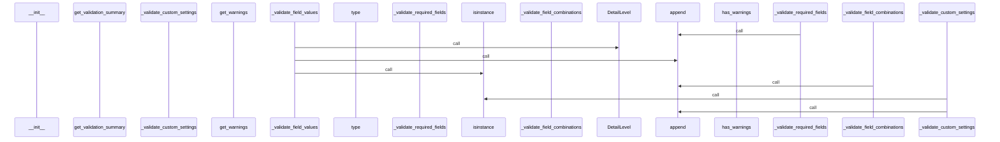
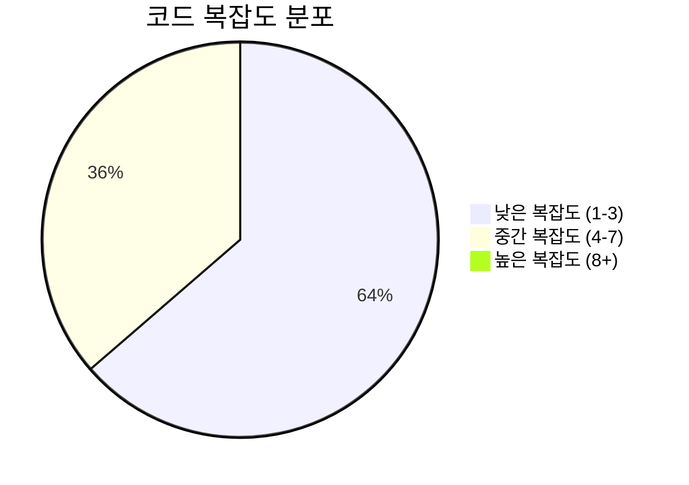

# 📄 option_validator.py

> **파일 경로**: `rule_analyzer/formatters/options/option_validator.py`  
> **생성일**: 2025-09-26  
> **Chunk 수**: 13개

---

## 📑 목차

### 🏗️ 클래스
- [`FormattingOptionValidator`](#class-formattingoptionvalidator) - 복잡도: 0


## 📋 파일 개요

| | |
|--|--|
| 📦 **의존성**: `formatting_options` • `typing` • `json` | ⚡ **총 복잡도**: 30 |
| 📊 **총 토큰 수**: 1,648 |  |


## 🏗️ 클래스

### <a id="class-formattingoptionvalidator"></a>🎯 `FormattingOptionValidator`


> 📝 **클래스 설명**  
> 포맷팅 옵션 유효성 검증 클래스

#### 📋 메서드 목록

| 메서드 | 타입 | 복잡도 | 설명 |
|--------|------|--------|------|
| `__init__` | magic | 1 | 검증기 초기화 |
| `_validate_custom_settings` | private | 4 | 사용자 정의 설정 검증 |
| `_validate_custom_template` | private | 4 | 사용자 정의 템플릿 검증 |
| `_validate_field_combinations` | private | 3 | 필드 조합 검증 |
| `_validate_field_types` | private | 4 | 필드 타입 검증 |
| `_validate_field_values` | private | 7 | 필드 값 검증 |
| `_validate_required_fields` | private | 3 | 필수 필드 검증 |
| `get_validation_summary` | public | 1 | 검증 결과 요약 반환 |
| `get_warnings` | public | 1 | 경고 메시지 반환 |
| `has_warnings` | public | 1 | 경고가 있는지 확인 |
| `validate` | public | 1 | 포맷팅 옵션 유효성 검증 |


#### 🔧 메서드 상세

##### `_validate_field_values`
| 속성 | 값 |
|------|----|
| ⚡ 복잡도 | 7 |
| 📊 토큰 수 | 288 |
| 📍 라인 범위 | 78-107 |
- **Signature**: `_validate_field_values(self, options: Dict[str, Any]) -> None`- **Parameters**: `self, options: Dict[str, Any]`- **Returns**: `None`
- **Calls**: `Language`, `DetailLevel`, `append`, `isinstance`---
##### `_validate_field_types`
| 속성 | 값 |
|------|----|
| ⚡ 복잡도 | 4 |
| 📊 토큰 수 | 193 |
| 📍 라인 범위 | 55-76 |
- **Signature**: `_validate_field_types(self, options: Dict[str, Any]) -> None`- **Parameters**: `self, options: Dict[str, Any]`- **Returns**: `None`
- **Calls**: `items`, `isinstance`, `append`, `type`---
##### `_validate_custom_template`
| 속성 | 값 |
|------|----|
| ⚡ 복잡도 | 4 |
| 📊 토큰 수 | 178 |
| 📍 라인 범위 | 124-142 |
- **Signature**: `_validate_custom_template(self, options: Dict[str, Any]) -> None`- **Parameters**: `self, options: Dict[str, Any]`- **Returns**: `None`
- **Calls**: `isinstance`, `append`, `loads`, `str`---
##### `_validate_custom_settings`
| 속성 | 값 |
|------|----|
| ⚡ 복잡도 | 4 |
| 📊 토큰 수 | 226 |
| 📍 라인 범위 | 144-171 |
- **Signature**: `_validate_custom_settings(self, options: Dict[str, Any]) -> None`- **Parameters**: `self, options: Dict[str, Any]`- **Returns**: `None`
- **Calls**: `isinstance`, `append`, `set`, `keys`, `list`---
##### `_validate_required_fields`
| 속성 | 값 |
|------|----|
| ⚡ 복잡도 | 3 |
| 📊 토큰 수 | 79 |
| 📍 라인 범위 | 47-53 |
- **Signature**: `_validate_required_fields(self, options: Dict[str, Any]) -> None`- **Parameters**: `self, options: Dict[str, Any]`- **Returns**: `None`
- **Calls**: `append`---
##### `_validate_field_combinations`
| 속성 | 값 |
|------|----|
| ⚡ 복잡도 | 3 |
| 📊 토큰 수 | 193 |
| 📍 라인 범위 | 109-122 |
- **Signature**: `_validate_field_combinations(self, options: Dict[str, Any]) -> None`- **Parameters**: `self, options: Dict[str, Any]`- **Returns**: `None`
- **Calls**: `any`, `append`, `get`---
##### `__init__`
| 속성 | 값 |
|------|----|
| ⚡ 복잡도 | 1 |
| 📊 토큰 수 | 36 |
| 📍 라인 범위 | 17-20 |
- **Signature**: `__init__(self)`- **Parameters**: `self`- **Returns**: `N/A`
---
##### `validate`
| 속성 | 값 |
|------|----|
| ⚡ 복잡도 | 1 |
| 📊 토큰 수 | 176 |
| 📍 라인 범위 | 22-45 |
- **Signature**: `validate(self, options: Dict[str, Any]) -> Tuple[bool, List[str]]`- **Parameters**: `self, options: Dict[str, Any]`- **Returns**: `Tuple[bool, List[str]]`
- **Calls**: `clear`, `_validate_required_fields`, `_validate_field_types`, `_validate_field_values`, `_validate_field_combinations`, `_validate_custom_template`, `_validate_custom_settings`, `copy`, `len`---
##### `get_warnings`
| 속성 | 값 |
|------|----|
| ⚡ 복잡도 | 1 |
| 📊 토큰 수 | 26 |
| 📍 라인 범위 | 173-175 |
- **Signature**: `get_warnings(self) -> List[str]`- **Parameters**: `self`- **Returns**: `List[str]`
- **Calls**: `copy`---
##### `has_warnings`
| 속성 | 값 |
|------|----|
| ⚡ 복잡도 | 1 |
| 📊 토큰 수 | 28 |
| 📍 라인 범위 | 177-179 |
- **Signature**: `has_warnings(self) -> bool`- **Parameters**: `self`- **Returns**: `bool`
- **Calls**: `len`---
##### `get_validation_summary`
| 속성 | 값 |
|------|----|
| ⚡ 복잡도 | 1 |
| 📊 토큰 수 | 100 |
| 📍 라인 범위 | 181-194 |
- **Signature**: `get_validation_summary(self) -> Dict[str, Any]`- **Parameters**: `self`- **Returns**: `Dict[str, Any]`
- **Calls**: `len`, `copy`---
<details>
<summary>🔍 코드 미리보기</summary>

```python
class FormattingOptionValidator:
    """
    포맷팅 옵션 유효성 검증 클래스
    """

    def __init__(self):...
```

**Chunk 정보**
- 🆔 **ID**: `934e3d1f212d`
- 📍 **라인**: 12-22
- 📊 **토큰**: 35
- 🏷️ **태그**: `class`

</details>

---


## 📊 시각화 및 분석

### ⚡ 복잡도 분석



### 🔧 함수 유형 분석



### 🔗 호출 순서 (Sequence)




## 📈 퍼포먼스 메트릭스

### 📊 핵심 지표

| 🎯 메트릭 | 📊 값 | 🚦 상태 |
|-----------|-------|--------|
| **총 라인 수** | 179 | 🟡 보통 |
| **평균 복잡도** | 2.7 | 🟢 양호 |
| **최대 복잡도** | 7 | 🟢 양호 |
| **함수 밀도** | 84.6% | 🔴 주의 |


### 🎯 품질 점수




## 🧩 Chunk 요약

이 파일은 총 **13개의 chunk**로 구성되어 있으며, **1,648개의 토큰**을 포함합니다.

| 🧩 Chunk 타입 | 📊 개수 | ⚡ 평균 복잡도 | 📝 총 토큰 | 📈 비율 |
|---------------|--------|-------------|----------|--------|
| 📋 파일 개요 | 1 | 0.0 | 90 | 5.5% |
| 🏗️ 클래스 | 1 | 0.0 | 35 | 2.1% |
| 🔧 메서드 | 11 | 2.7 | 1,523 | 92.4% |

