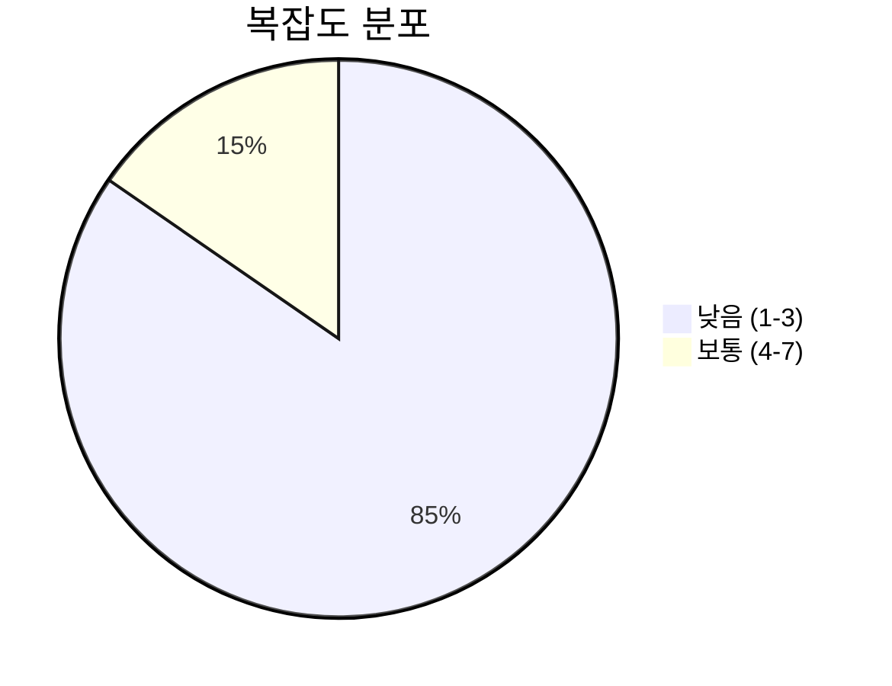
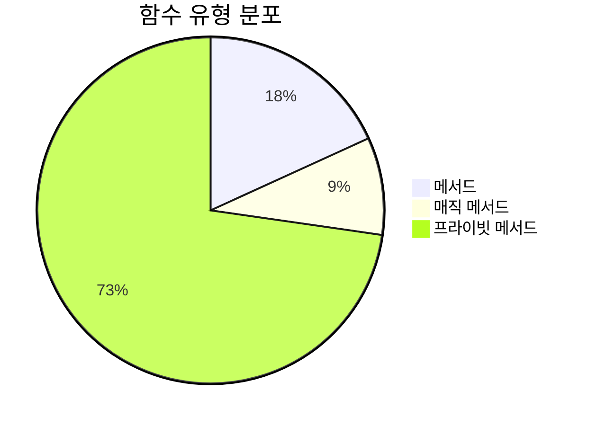
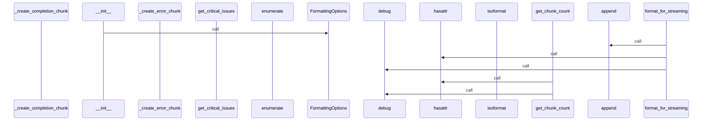
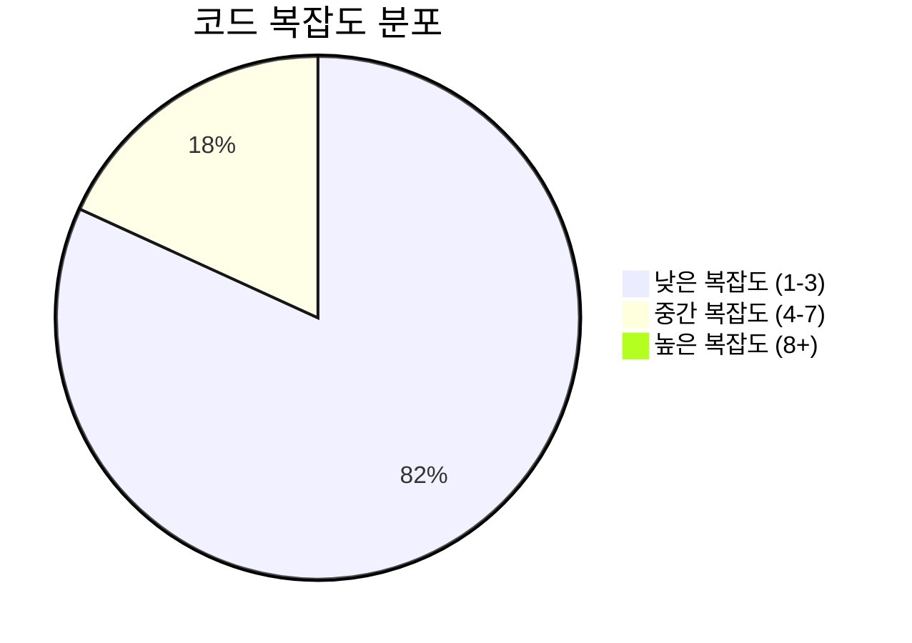

# 📄 streaming_formatter.py

> **파일 경로**: `rule_analyzer/formatters/streaming_formatter.py`  
> **생성일**: 2025-09-26  
> **Chunk 수**: 13개

---

## 📑 목차

### 🏗️ 클래스
- [`StreamingFormatter`](#class-streamingformatter) - 복잡도: 0


## 📋 파일 개요

| | |
|--|--|
| 📦 **의존성**: `typing` • `options` • `logging` | ⚡ **총 복잡도**: 21 |
| 📊 **총 토큰 수**: 2,540 |  |


## 🏗️ 클래스

### <a id="class-streamingformatter"></a>🎯 `StreamingFormatter`


> 📝 **클래스 설명**  
> 스트리밍 포맷터

분석 결과를 스트리밍 전송에 적합한 형태로 포맷팅합니다.

#### 📋 메서드 목록

| 메서드 | 타입 | 복잡도 | 설명 |
|--------|------|--------|------|
| `__init__` | magic | 1 | 스트리밍 포맷터 초기화 |
| `_create_basic_info_chunk` | private | 1 | 기본 정보 청크 생성 |
| `_create_completion_chunk` | private | 1 | 완료 청크 생성 |
| `_create_error_chunk` | private | 1 | 에러 청크 생성 |
| `_create_header_chunk` | private | 1 | 헤더 청크 생성 |
| `_create_issues_chunks` | private | 2 | 이슈 정보 청크들 생성 |
| `_create_performance_chunk` | private | 1 | 성능 메트릭 청크 생성 |
| `_create_quality_chunk` | private | 1 | 품질 메트릭 청크 생성 |
| `_create_structure_chunk` | private | 1 | 구조 정보 청크 생성 |
| `format_for_streaming` | public | 6 | 분석 결과를 스트리밍용 청크들로 포맷팅 |
| `get_chunk_count` | public | 5 | 예상 청크 개수 반환 |


#### 🔧 메서드 상세

##### `format_for_streaming`
| 속성 | 값 |
|------|----|
| ⚡ 복잡도 | 6 |
| 📊 토큰 수 | 393 |
| 📍 라인 범위 | 30-79 |
- **Signature**: `format_for_streaming(self, validation_result) -> List[Dict[str, Any]]`- **Parameters**: `self, validation_result`- **Returns**: `List[Dict[str, Any]]`
- **Calls**: `append`, `hasattr`, `debug`, `_create_header_chunk`, `_create_basic_info_chunk`, `extend`, `_create_completion_chunk`, `error`, `_create_issues_chunks`, `_create_structure_chunk`, `_create_performance_chunk`, `_create_quality_chunk`, `_create_error_chunk`, `len`, `str`---
##### `get_chunk_count`
| 속성 | 값 |
|------|----|
| ⚡ 복잡도 | 5 |
| 📊 토큰 수 | 393 |
| 📍 라인 범위 | 253-290 |
- **Signature**: `get_chunk_count(self, validation_result) -> int`- **Parameters**: `self, validation_result`- **Returns**: `int`
- **Calls**: `hasattr`, `debug`---
##### `_create_issues_chunks`
| 속성 | 값 |
|------|----|
| ⚡ 복잡도 | 2 |
| 📊 토큰 수 | 211 |
| 📍 라인 범위 | 120-147 |
- **Signature**: `_create_issues_chunks(self, issues) -> List[Dict[str, Any]]`- **Parameters**: `self, issues`- **Returns**: `List[Dict[str, Any]]`
- **Calls**: `enumerate`, `append`, `hasattr`, `isoformat`, `str`---
##### `__init__`
| 속성 | 값 |
|------|----|
| ⚡ 복잡도 | 1 |
| 📊 토큰 수 | 68 |
| 📍 라인 범위 | 20-28 |
- **Signature**: `__init__(self, options: Optional[FormattingOptions])`- **Parameters**: `self, options: Optional[FormattingOptions]`- **Returns**: `N/A`
- **Calls**: `getLogger`, `FormattingOptions`---
##### `_create_header_chunk`
| 속성 | 값 |
|------|----|
| ⚡ 복잡도 | 1 |
| 📊 토큰 수 | 127 |
| 📍 라인 범위 | 81-94 |
- **Signature**: `_create_header_chunk(self, validation_result) -> Dict[str, Any]`- **Parameters**: `self, validation_result`- **Returns**: `Dict[str, Any]`
- **Calls**: `getattr`, `str`---
##### `_create_basic_info_chunk`
| 속성 | 값 |
|------|----|
| ⚡ 복잡도 | 1 |
| 📊 토큰 수 | 261 |
| 📍 라인 범위 | 96-118 |
- **Signature**: `_create_basic_info_chunk(self, validation_result) -> Dict[str, Any]`- **Parameters**: `self, validation_result`- **Returns**: `Dict[str, Any]`
- **Calls**: `get_total_issues`, `str`, `hasattr`, `len`, `get_critical_issues`---
##### `_create_structure_chunk`
| 속성 | 값 |
|------|----|
| ⚡ 복잡도 | 1 |
| 📊 토큰 수 | 234 |
| 📍 라인 범위 | 149-172 |
- **Signature**: `_create_structure_chunk(self, structure) -> Dict[str, Any]`- **Parameters**: `self, structure`- **Returns**: `Dict[str, Any]`
- **Calls**: `str`, `hasattr`, `len`, `join`---
##### `_create_performance_chunk`
| 속성 | 값 |
|------|----|
| ⚡ 복잡도 | 1 |
| 📊 토큰 수 | 232 |
| 📍 라인 범위 | 174-196 |
- **Signature**: `_create_performance_chunk(self, performance) -> Dict[str, Any]`- **Parameters**: `self, performance`- **Returns**: `Dict[str, Any]`
- **Calls**: `str`, `hasattr`, `len`---
##### `_create_quality_chunk`
| 속성 | 값 |
|------|----|
| ⚡ 복잡도 | 1 |
| 📊 토큰 수 | 227 |
| 📍 라인 범위 | 198-218 |
- **Signature**: `_create_quality_chunk(self, quality) -> Dict[str, Any]`- **Parameters**: `self, quality`- **Returns**: `Dict[str, Any]`
- **Calls**: `str`---
##### `_create_completion_chunk`
| 속성 | 값 |
|------|----|
| ⚡ 복잡도 | 1 |
| 📊 토큰 수 | 166 |
| 📍 라인 범위 | 220-237 |
- **Signature**: `_create_completion_chunk(self, validation_result) -> Dict[str, Any]`- **Parameters**: `self, validation_result`- **Returns**: `Dict[str, Any]`
---
##### `_create_error_chunk`
| 속성 | 값 |
|------|----|
| ⚡ 복잡도 | 1 |
| 📊 토큰 수 | 101 |
| 📍 라인 범위 | 239-251 |
- **Signature**: `_create_error_chunk(self, error_message: str) -> Dict[str, Any]`- **Parameters**: `self, error_message: str`- **Returns**: `Dict[str, Any]`
---
<details>
<summary>🔍 코드 미리보기</summary>

```python
class StreamingFormatter:
    """
    스트리밍 포맷터

    분석 결과를 스트리밍 전송에 적합한 형태로 포맷팅합니다.
    """

    def __init__(self, options: Optional[FormattingOptions] = None):...
```

**Chunk 정보**
- 🆔 **ID**: `c36ca13c2b6c`
- 📍 **라인**: 13-23
- 📊 **토큰**: 70
- 🏷️ **태그**: `class`

</details>

---


## 📊 시각화 및 분석

### ⚡ 복잡도 분석



### 🔧 함수 유형 분석



### 🔗 호출 순서 (Sequence)




## 📈 퍼포먼스 메트릭스

### 📊 핵심 지표

| 🎯 메트릭 | 📊 값 | 🚦 상태 |
|-----------|-------|--------|
| **총 라인 수** | 272 | 🟡 보통 |
| **평균 복잡도** | 1.9 | 🟢 양호 |
| **최대 복잡도** | 6 | 🟢 양호 |
| **함수 밀도** | 84.6% | 🔴 주의 |


### 🎯 품질 점수




## 🧩 Chunk 요약

이 파일은 총 **13개의 chunk**로 구성되어 있으며, **2,540개의 토큰**을 포함합니다.

| 🧩 Chunk 타입 | 📊 개수 | ⚡ 평균 복잡도 | 📝 총 토큰 | 📈 비율 |
|---------------|--------|-------------|----------|--------|
| 📋 파일 개요 | 1 | 0.0 | 57 | 2.2% |
| 🏗️ 클래스 | 1 | 0.0 | 70 | 2.8% |
| 🔧 메서드 | 11 | 1.9 | 2,413 | 95.0% |

