# 📄 custom_templates.py

> **파일 경로**: `rule_analyzer/formatters/templates/custom_templates.py`  
> **생성일**: 2025-09-26  
> **Chunk 수**: 15개

---

## 📑 목차

### 🏗️ 클래스
- [`CustomTemplateManager`](#class-customtemplatemanager) - 복잡도: 0


## 📋 파일 개요

| | |
|--|--|
| 📦 **의존성**: `json` • `typing` • `re` • `logging` • `options` | ⚡ **총 복잡도**: 36 |
| 📊 **총 토큰 수**: 2,668 |  |


## 🏗️ 클래스

### <a id="class-customtemplatemanager"></a>🎯 `CustomTemplateManager`


> 📝 **클래스 설명**  
> 사용자 정의 템플릿 관리 클래스

JSON 형태의 사용자 정의 템플릿을 파싱하고 적용합니다.

#### 📋 메서드 목록

| 메서드 | 타입 | 복잡도 | 설명 |
|--------|------|--------|------|
| `__init__` | magic | 1 | 템플릿 관리자 초기화 |
| `_add_detailed_fields` | private | 3 | 상세 레벨에 맞게 필드 추가 |
| `_apply_template_variations` | private | 4 | 템플릿에 상세도와 언어별 변형 적용 |
| `_filter_simple_fields` | private | 1 | 간단 레벨에 맞게 필드 필터링 |
| `_translate_to_english` | private | 3 | 영어로 번역 (기본적인 번역만 지원) |
| `_validate_placeholders` | private | 3 | 플레이스홀더 유효성 검증 |
| `_validate_template_structure` | private | 7 | 템플릿 구조 유효성 검증 |
| `clear_custom_templates` | public | 1 | 모든 사용자 정의 템플릿 제거 |
| `get_custom_template` | public | 3 | 사용자 정의 템플릿 반환 |
| `get_template_info` | public | 2 | 템플릿 정보 반환 |
| `list_custom_templates` | public | 1 | 사용 가능한 사용자 정의 템플릿 목록 반환 |
| `load_custom_template` | public | 4 | 사용자 정의 템플릿 로드 |
| `remove_custom_template` | public | 3 | 사용자 정의 템플릿 제거 |


#### 🔧 메서드 상세

##### `_validate_template_structure`
| 속성 | 값 |
|------|----|
| ⚡ 복잡도 | 7 |
| 📊 토큰 수 | 308 |
| 📍 라인 범위 | 137-170 |
- **Signature**: `_validate_template_structure(self, template_data: Dict[str, Any]) -> bool`- **Parameters**: `self, template_data: Dict[str, Any]`- **Returns**: `bool`
- **Calls**: `items`, `error`, `isinstance`, `_validate_placeholders`, `type`---
##### `load_custom_template`
| 속성 | 값 |
|------|----|
| ⚡ 복잡도 | 4 |
| 📊 토큰 수 | 278 |
| 📍 라인 범위 | 27-57 |
- **Signature**: `load_custom_template(self, template_json: str, template_name: str) -> bool`- **Parameters**: `self, template_json: str, template_name: str`- **Returns**: `bool`
- **Calls**: `loads`, `info`, `_validate_template_structure`, `error`, `str`---
##### `_apply_template_variations`
| 속성 | 값 |
|------|----|
| ⚡ 복잡도 | 4 |
| 📊 토큰 수 | 232 |
| 📍 라인 범위 | 223-252 |
- **Signature**: `_apply_template_variations(self, base_template: Dict[str, str], detail_level: DetailLevel, language: Language) -> Dict[str, str]`- **Parameters**: `self, base_template: Dict[str, str], detail_level: DetailLevel, language: Language`- **Returns**: `Dict[str, str]`
- **Calls**: `copy`, `_filter_simple_fields`, `_translate_to_english`, `_add_detailed_fields`---
##### `get_custom_template`
| 속성 | 값 |
|------|----|
| ⚡ 복잡도 | 3 |
| 📊 토큰 수 | 267 |
| 📍 라인 범위 | 59-93 |
- **Signature**: `get_custom_template(self, template_name: str, detail_level: DetailLevel, language: Language) -> Optional[Dict[str, str]]`- **Parameters**: `self, template_name: str, detail_level: DetailLevel, language: Language`- **Returns**: `Optional[Dict[str, str]]`
- **Calls**: `_apply_template_variations`---
##### `remove_custom_template`
| 속성 | 값 |
|------|----|
| ⚡ 복잡도 | 3 |
| 📊 토큰 수 | 178 |
| 📍 라인 범위 | 104-129 |
- **Signature**: `remove_custom_template(self, template_name: str) -> bool`- **Parameters**: `self, template_name: str`- **Returns**: `bool`
- **Calls**: `info`, `keys`, `startswith`---
##### `_validate_placeholders`
| 속성 | 값 |
|------|----|
| ⚡ 복잡도 | 3 |
| 📊 토큰 수 | 308 |
| 📍 라인 범위 | 172-221 |
- **Signature**: `_validate_placeholders(self, template_string: str) -> bool`- **Parameters**: `self, template_string: str`- **Returns**: `bool`
- **Calls**: `findall`---
##### `_add_detailed_fields`
| 속성 | 값 |
|------|----|
| ⚡ 복잡도 | 3 |
| 📊 토큰 수 | 180 |
| 📍 라인 범위 | 267-288 |
- **Signature**: `_add_detailed_fields(self, template: Dict[str, str]) -> Dict[str, str]`- **Parameters**: `self, template: Dict[str, str]`- **Returns**: `Dict[str, str]`
- **Calls**: `items`---
##### `_translate_to_english`
| 속성 | 값 |
|------|----|
| ⚡ 복잡도 | 3 |
| 📊 토큰 수 | 289 |
| 📍 라인 범위 | 290-321 |
- **Signature**: `_translate_to_english(self, template: Dict[str, str]) -> Dict[str, str]`- **Parameters**: `self, template: Dict[str, str]`- **Returns**: `Dict[str, str]`
- **Calls**: `items`, `replace`---
##### `get_template_info`
| 속성 | 값 |
|------|----|
| ⚡ 복잡도 | 2 |
| 📊 토큰 수 | 162 |
| 📍 라인 범위 | 323-344 |
- **Signature**: `get_template_info(self, template_name: str) -> Optional[Dict[str, Any]]`- **Parameters**: `self, template_name: str`- **Returns**: `Optional[Dict[str, Any]]`
- **Calls**: `len`, `list`, `any`, `keys`, `dumps`, `values`---
##### `__init__`
| 속성 | 값 |
|------|----|
| ⚡ 복잡도 | 1 |
| 📊 토큰 수 | 62 |
| 📍 라인 범위 | 21-25 |
- **Signature**: `__init__(self)`- **Parameters**: `self`- **Returns**: `N/A`
- **Calls**: `getLogger`---
##### `list_custom_templates`
| 속성 | 값 |
|------|----|
| ⚡ 복잡도 | 1 |
| 📊 토큰 수 | 59 |
| 📍 라인 범위 | 95-102 |
- **Signature**: `list_custom_templates(self) -> List[str]`- **Parameters**: `self`- **Returns**: `List[str]`
- **Calls**: `list`, `keys`---
##### `clear_custom_templates`
| 속성 | 값 |
|------|----|
| ⚡ 복잡도 | 1 |
| 📊 토큰 수 | 68 |
| 📍 라인 범위 | 131-135 |
- **Signature**: `clear_custom_templates(self) -> None`- **Parameters**: `self`- **Returns**: `None`
- **Calls**: `clear`, `info`---
##### `_filter_simple_fields`
| 속성 | 값 |
|------|----|
| ⚡ 복잡도 | 1 |
| 📊 토큰 수 | 123 |
| 📍 라인 범위 | 254-265 |
- **Signature**: `_filter_simple_fields(self, template: Dict[str, str]) -> Dict[str, str]`- **Parameters**: `self, template: Dict[str, str]`- **Returns**: `Dict[str, str]`
---
<details>
<summary>🔍 코드 미리보기</summary>

```python
class CustomTemplateManager:
    """
    사용자 정의 템플릿 관리 클래스

    JSON 형태의 사용자 정의 템플릿을 파싱하고 적용합니다.
    """

    def __init__(self):...
```

**Chunk 정보**
- 🆔 **ID**: `3617b6c195fe`
- 📍 **라인**: 14-24
- 📊 **토큰**: 62
- 🏷️ **태그**: `class, manager`

</details>

---


## 📊 시각화 및 분석

### ⚡ 복잡도 분석

```mermaid
pie title 복잡도 분포
    "낮음 (1-3)" : 12
    "보통 (4-7)" : 3

```



### 🔧 함수 유형 분석

```mermaid
pie title 함수 유형 분포
    "메서드" : 6
    "매직 메서드" : 1
    "프라이빗 메서드" : 6

```



### 🔗 호출 순서 (Sequence)


## 📈 퍼포먼스 메트릭스

### 📊 핵심 지표

| 🎯 메트릭 | 📊 값 | 🚦 상태 |
|-----------|-------|--------|
| **총 라인 수** | 323 | 🟡 보통 |
| **평균 복잡도** | 2.8 | 🟢 양호 |
| **최대 복잡도** | 7 | 🟢 양호 |
| **함수 밀도** | 86.7% | 🔴 주의 |


### 🎯 품질 점수

```mermaid
pie title 코드 복잡도 분포
    "낮은 복잡도 (1-3)" : 10
    "중간 복잡도 (4-7)" : 3
    "높은 복잡도 (8+)" : 0

```




## 🧩 Chunk 요약

이 파일은 총 **15개의 chunk**로 구성되어 있으며, **2,668개의 토큰**을 포함합니다.

| 🧩 Chunk 타입 | 📊 개수 | ⚡ 평균 복잡도 | 📝 총 토큰 | 📈 비율 |
|---------------|--------|-------------|----------|--------|
| 📋 파일 개요 | 1 | 0.0 | 92 | 3.4% |
| 🏗️ 클래스 | 1 | 0.0 | 62 | 2.3% |
| 🔧 메서드 | 13 | 2.8 | 2,514 | 94.2% |

