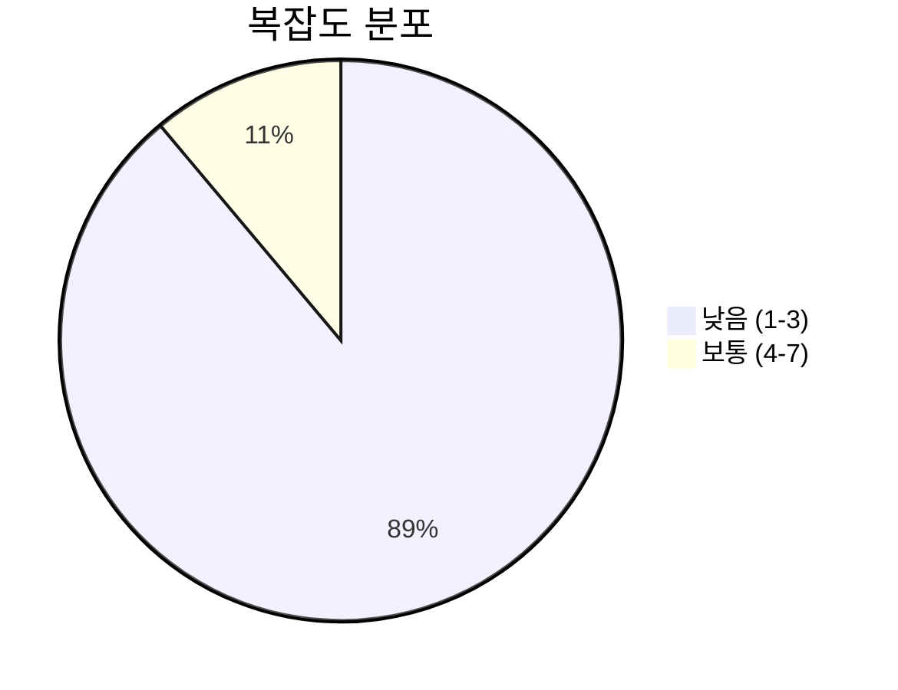
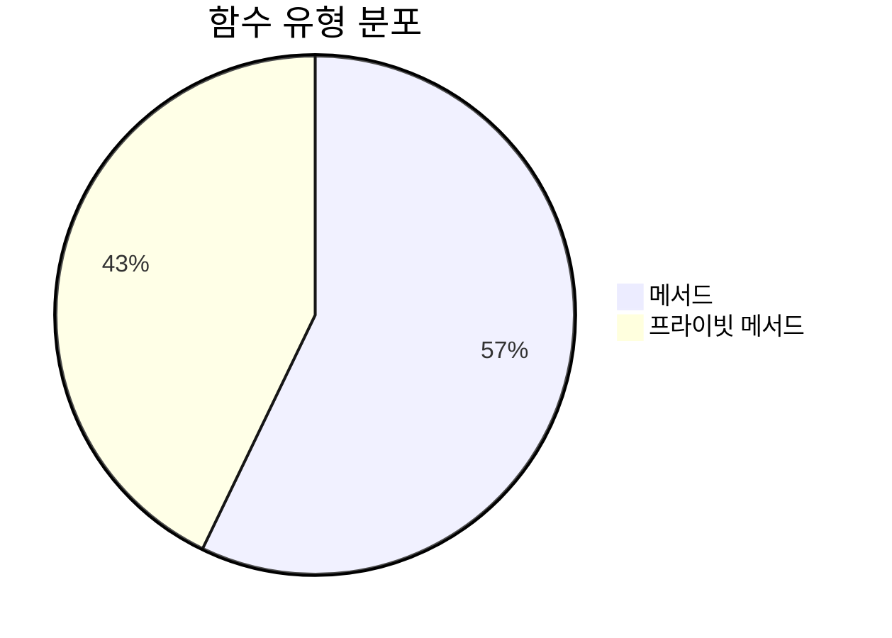
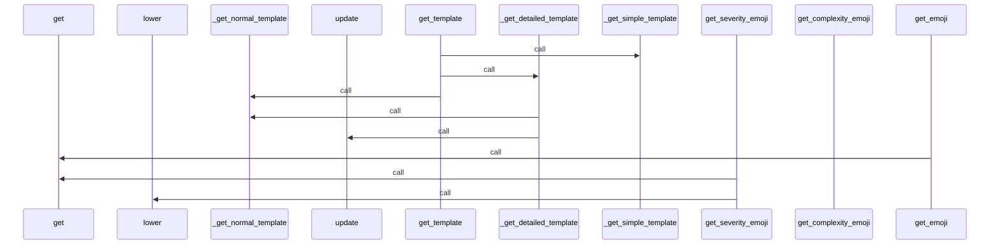
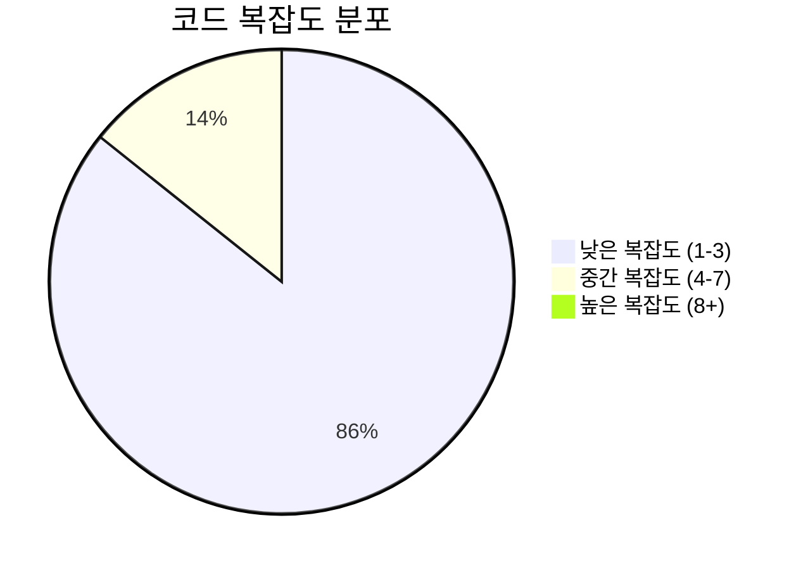

# 📄 english_templates.py

> **파일 경로**: `rule_analyzer/formatters/templates/english_templates.py`  
> **생성일**: 2025-10-01  
> **Chunk 수**: 9개

---

## 📑 목차

### 🏗️ 클래스
- [`EnglishTemplates`](#class-englishtemplates) - 복잡도: 0


## 📋 파일 개요

| | |
|--|--|
| 📦 **의존성**: `typing` • `options` | ⚡ **총 복잡도**: 15 |
| 📊 **총 토큰 수**: 1,376 |  |


## 🏗️ 클래스

### <a id="class-englishtemplates"></a>🎯 `EnglishTemplates`


> 📝 **클래스 설명**  
> English formatting templates class

Provides different templates based on detail level.

#### 📋 메서드 목록

| 메서드 | 타입 | 복잡도 | 설명 |
|--------|------|--------|------|
| `_get_detailed_template` | private | 1 | Detailed level template |
| `_get_normal_template` | private | 1 | Normal level template |
| `_get_simple_template` | private | 1 | Simple level template |
| `get_complexity_emoji` | public | 5 | Get emoji based on complexity score |
| `get_emoji` | public | 2 | Get emoji |
| `get_severity_emoji` | public | 2 | Get emoji based on severity |
| `get_template` | public | 3 | Get template based on detail level |


#### 🔧 메서드 상세

##### `get_complexity_emoji`
| 속성 | 값 |
|------|----|
| 🎨 데코레이터 | `classmethod` |
| ⚡ 복잡도 | 5 |
| 📊 토큰 수 | 143 |
| 📍 라인 범위 | 160-181 |
- **Signature**: `get_complexity_emoji(cls, score: int, include_emojis: bool) -> str`- **Parameters**: `cls, score: int, include_emojis: bool`- **Returns**: `str`
---
##### `get_template`
| 속성 | 값 |
|------|----|
| 🎨 데코레이터 | `classmethod` |
| ⚡ 복잡도 | 3 |
| 📊 토큰 수 | 97 |
| 📍 라인 범위 | 40-55 |
- **Signature**: `get_template(cls, detail_level: DetailLevel) -> Dict[str, str]`- **Parameters**: `cls, detail_level: DetailLevel`- **Returns**: `Dict[str, str]`
- **Calls**: `_get_simple_template`, `_get_detailed_template`, `_get_normal_template`---
##### `get_emoji`
| 속성 | 값 |
|------|----|
| 🎨 데코레이터 | `classmethod` |
| ⚡ 복잡도 | 2 |
| 📊 토큰 수 | 81 |
| 📍 라인 범위 | 120-134 |
- **Signature**: `get_emoji(cls, key: str, include_emojis: bool) -> str`- **Parameters**: `cls, key: str, include_emojis: bool`- **Returns**: `str`
- **Calls**: `get`---
##### `get_severity_emoji`
| 속성 | 값 |
|------|----|
| 🎨 데코레이터 | `classmethod` |
| ⚡ 복잡도 | 2 |
| 📊 토큰 수 | 134 |
| 📍 라인 범위 | 137-157 |
- **Signature**: `get_severity_emoji(cls, severity: str, include_emojis: bool) -> str`- **Parameters**: `cls, severity: str, include_emojis: bool`- **Returns**: `str`
- **Calls**: `get`, `lower`---
##### `_get_simple_template`
| 속성 | 값 |
|------|----|
| 🎨 데코레이터 | `classmethod` |
| ⚡ 복잡도 | 1 |
| 📊 토큰 수 | 85 |
| 📍 라인 범위 | 58-66 |
- **Signature**: `_get_simple_template(cls) -> Dict[str, str]`- **Parameters**: `cls`- **Returns**: `Dict[str, str]`
---
##### `_get_normal_template`
| 속성 | 값 |
|------|----|
| 🎨 데코레이터 | `classmethod` |
| ⚡ 복잡도 | 1 |
| 📊 토큰 수 | 226 |
| 📍 라인 범위 | 69-88 |
- **Signature**: `_get_normal_template(cls) -> Dict[str, str]`- **Parameters**: `cls`- **Returns**: `Dict[str, str]`
---
##### `_get_detailed_template`
| 속성 | 값 |
|------|----|
| 🎨 데코레이터 | `classmethod` |
| ⚡ 복잡도 | 1 |
| 📊 토큰 수 | 365 |
| 📍 라인 범위 | 91-117 |
- **Signature**: `_get_detailed_template(cls) -> Dict[str, str]`- **Parameters**: `cls`- **Returns**: `Dict[str, str]`
- **Calls**: `_get_normal_template`, `update`---
<details>
<summary>🔍 코드 미리보기</summary>

```python
class EnglishTemplates:
    """
    English formatting templates class

    Provides different templates based on detail level.
    """

    # Emoji mapping
    EMOJIS = {
        "valid": "✅",
        "invalid": "❌",
        "warning": "⚠️",
        "info": "ℹ️",
        "error": "🚨",
        "success": "🎯",
        "complexity": "📈",
        "performance": "⚡",
        "quality": "🏆",
        "structure": "🏗️",
        "issues": "🔍",
        "metrics": "📊",
        "summary": "📋",
        "timestamp": "🕒",
        "bullet": "•",
        "separator": "─",
    }

    @classmethod
    def get_template(cls, detail_level: DetailLevel) -> Dict[str, str]:...
```

**Chunk 정보**
- 🆔 **ID**: `363e927a0a3d`
- 📍 **라인**: 12-22
- 📊 **토큰**: 200
- 🏷️ **태그**: `class`

</details>

---


## 📊 시각화 및 분석

### ⚡ 복잡도 분석



### 🔧 함수 유형 분석



### 🔗 호출 순서 (Sequence)




## 📈 퍼포먼스 메트릭스

### 📊 핵심 지표

| 🎯 메트릭 | 📊 값 | 🚦 상태 |
|-----------|-------|--------|
| **총 라인 수** | 141 | 🟡 보통 |
| **평균 복잡도** | 2.1 | 🟢 양호 |
| **최대 복잡도** | 5 | 🟢 양호 |
| **함수 밀도** | 77.8% | 🔴 주의 |


### 🎯 품질 점수




## 🧩 Chunk 요약

이 파일은 총 **9개의 chunk**로 구성되어 있으며, **1,376개의 토큰**을 포함합니다.

| 🧩 Chunk 타입 | 📊 개수 | ⚡ 평균 복잡도 | 📝 총 토큰 | 📈 비율 |
|---------------|--------|-------------|----------|--------|
| 📋 파일 개요 | 1 | 0.0 | 45 | 3.3% |
| 🏗️ 클래스 | 1 | 0.0 | 200 | 14.5% |
| 🔧 메서드 | 7 | 2.1 | 1,131 | 82.2% |

