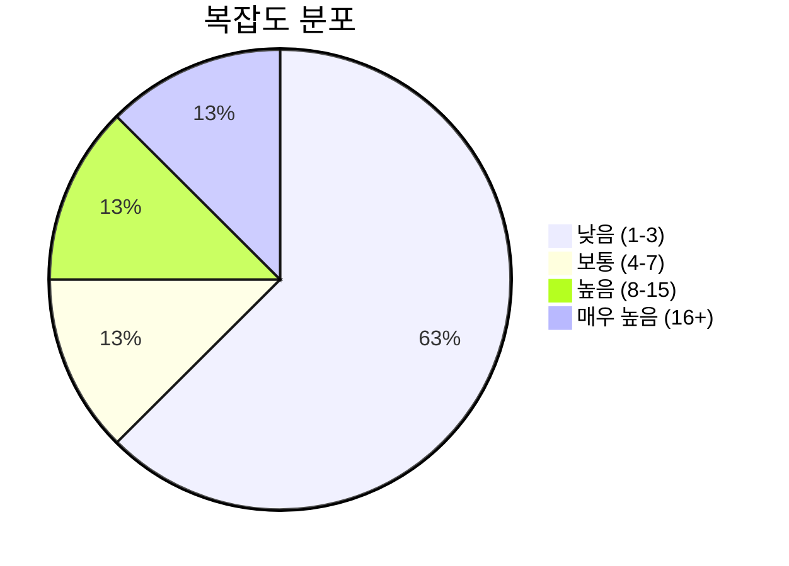
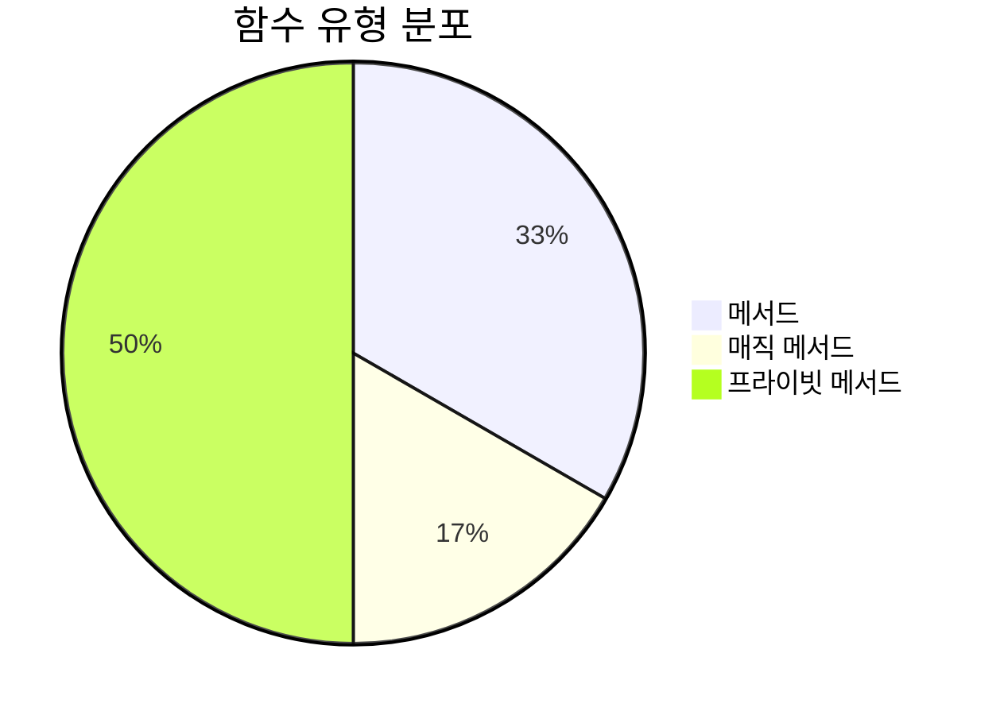
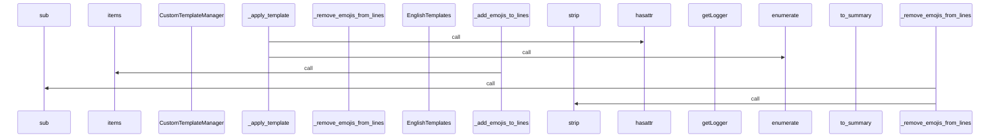
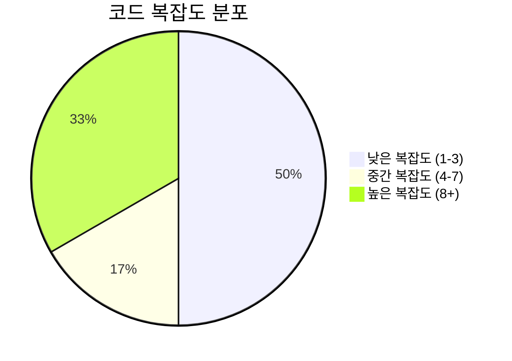

# 📄 text_formatter.py

> **파일 경로**: `rule_analyzer/formatters/text_formatter.py`  
> **생성일**: 2025-10-01  
> **Chunk 수**: 8개

---

## 📑 목차

### 🏗️ 클래스
- [`TextFormatter`](#class-textformatter) - 복잡도: 0


## 📋 파일 개요

| | |
|--|--|
| 📦 **의존성**: `typing` • `options` • `templates` • `re` • `logging` | ⚡ **총 복잡도**: 37 |
| 📊 **총 토큰 수**: 2,371 |  |


## 🏗️ 클래스

### <a id="class-textformatter"></a>🎯 `TextFormatter`


> 📝 **클래스 설명**  
> 텍스트 포맷터

ValidationResult를 읽기 쉬운 텍스트로 변환합니다.

#### 📋 메서드 목록

| 메서드 | 타입 | 복잡도 | 설명 |
|--------|------|--------|------|
| `__init__` | magic | 1 | 텍스트 포맷터 초기화 |
| `_add_emojis_to_lines` | private | 4 | 라인들에 이모지 추가 |
| `_apply_template` | private | 18 | 템플릿을 적용하여 텍스트 생성 |
| `_remove_emojis_from_lines` | private | 3 | 라인들에서 이모지 제거 |
| `format` | public | 8 | 분석 결과를 텍스트로 포맷팅 |
| `format_summary` | public | 3 | 분석 결과 요약 포맷팅 |


#### 🔧 메서드 상세

##### `_apply_template`
| 속성 | 값 |
|------|----|
| ⚡ 복잡도 | 18 |
| 📊 토큰 수 | 914 |
| 📍 라인 범위 | 83-193 |
- **Signature**: `_apply_template(self, template: Dict[str, str], validation_result) -> str`- **Parameters**: `self, template: Dict[str, str], validation_result`- **Returns**: `str`
- **Calls**: `join`, `format`, `append`, `hasattr`, `enumerate`, `getattr`, `_add_emojis_to_lines`, `_remove_emojis_from_lines`, `error`, `get_total_issues`, `str`---
##### `format`
| 속성 | 값 |
|------|----|
| ⚡ 복잡도 | 8 |
| 📊 토큰 수 | 369 |
| 📍 라인 범위 | 38-81 |
- **Signature**: `format(self, validation_result) -> str`- **Parameters**: `self, validation_result`- **Returns**: `str`
- **Calls**: `_apply_template`, `debug`, `_get_simple_template`, `get_template`, `error`, `_get_detailed_template`, `_get_normal_template`, `len`, `str`---
##### `_add_emojis_to_lines`
| 속성 | 값 |
|------|----|
| ⚡ 복잡도 | 4 |
| 📊 토큰 수 | 207 |
| 📍 라인 범위 | 195-223 |
- **Signature**: `_add_emojis_to_lines(self, lines: list) -> list`- **Parameters**: `self, lines: list`- **Returns**: `list`
- **Calls**: `items`, `append`, `replace`---
##### `_remove_emojis_from_lines`
| 속성 | 값 |
|------|----|
| ⚡ 복잡도 | 3 |
| 📊 토큰 수 | 232 |
| 📍 라인 범위 | 225-250 |
- **Signature**: `_remove_emojis_from_lines(self, lines: list) -> list`- **Parameters**: `self, lines: list`- **Returns**: `list`
- **Calls**: `sub`, `strip`, `append`---
##### `format_summary`
| 속성 | 값 |
|------|----|
| ⚡ 복잡도 | 3 |
| 📊 토큰 수 | 422 |
| 📍 라인 범위 | 252-294 |
- **Signature**: `format_summary(self, validation_result) -> str`- **Parameters**: `self, validation_result`- **Returns**: `str`
- **Calls**: `to_summary`, `error`, `str`---
##### `__init__`
| 속성 | 값 |
|------|----|
| ⚡ 복잡도 | 1 |
| 📊 토큰 수 | 109 |
| 📍 라인 범위 | 23-36 |
- **Signature**: `__init__(self, options: Optional[FormattingOptions])`- **Parameters**: `self, options: Optional[FormattingOptions]`- **Returns**: `N/A`
- **Calls**: `getLogger`, `KoreanTemplates`, `EnglishTemplates`, `CustomTemplateManager`, `FormattingOptions`---
<details>
<summary>🔍 코드 미리보기</summary>

```python
class TextFormatter:
    """
    텍스트 포맷터

    ValidationResult를 읽기 쉬운 텍스트로 변환합니다.
    """

    def __init__(self, options: Optional[FormattingOptions] = None):...
```

**Chunk 정보**
- 🆔 **ID**: `4637b89ace4d`
- 📍 **라인**: 16-26
- 📊 **토큰**: 52
- 🏷️ **태그**: `class`

</details>

---


## 📊 시각화 및 분석

### ⚡ 복잡도 분석



### 🔧 함수 유형 분석



### 🔗 호출 순서 (Sequence)




## 📈 퍼포먼스 메트릭스

### 📊 핵심 지표

| 🎯 메트릭 | 📊 값 | 🚦 상태 |
|-----------|-------|--------|
| **총 라인 수** | 278 | 🟡 보통 |
| **평균 복잡도** | 6.2 | 🟡 보통 |
| **최대 복잡도** | 18 | 🟡 보통 |
| **함수 밀도** | 75.0% | 🔴 주의 |


### 🎯 품질 점수




## 🧩 Chunk 요약

이 파일은 총 **8개의 chunk**로 구성되어 있으며, **2,371개의 토큰**을 포함합니다.

| 🧩 Chunk 타입 | 📊 개수 | ⚡ 평균 복잡도 | 📝 총 토큰 | 📈 비율 |
|---------------|--------|-------------|----------|--------|
| 📋 파일 개요 | 1 | 0.0 | 66 | 2.8% |
| 🏗️ 클래스 | 1 | 0.0 | 52 | 2.2% |
| 🔧 메서드 | 6 | 6.2 | 2,253 | 95.0% |

