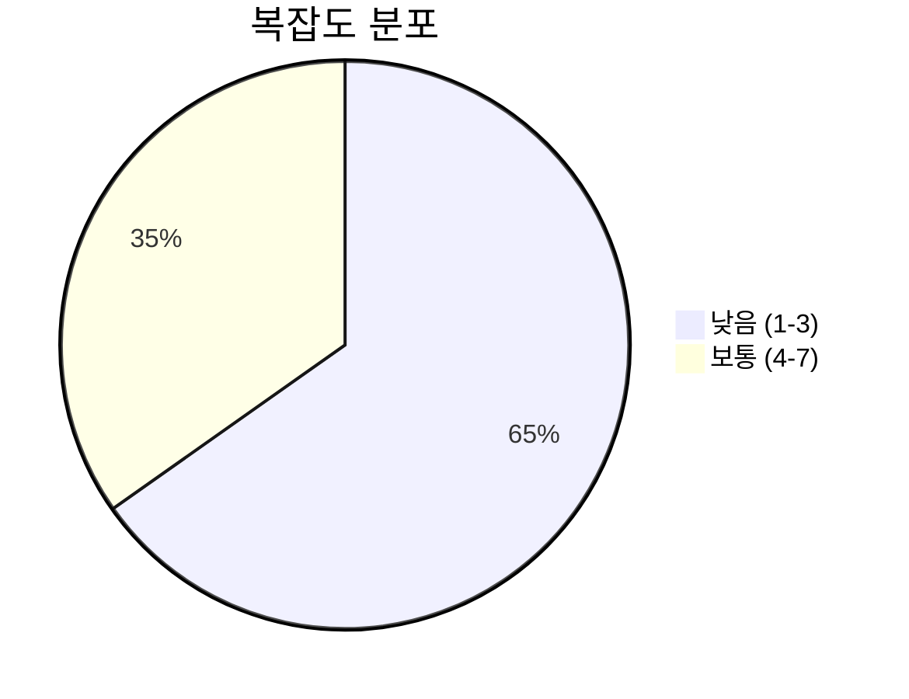
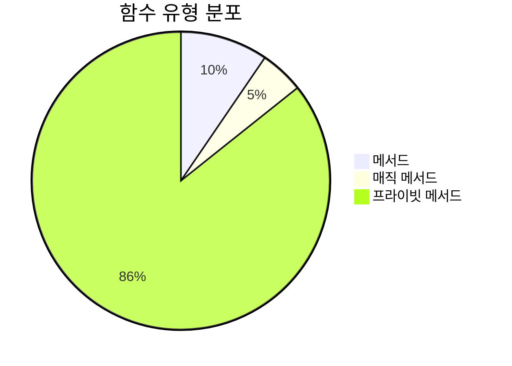
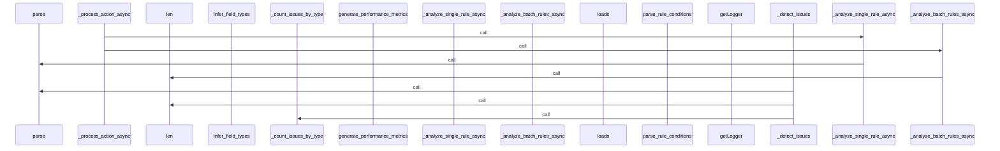
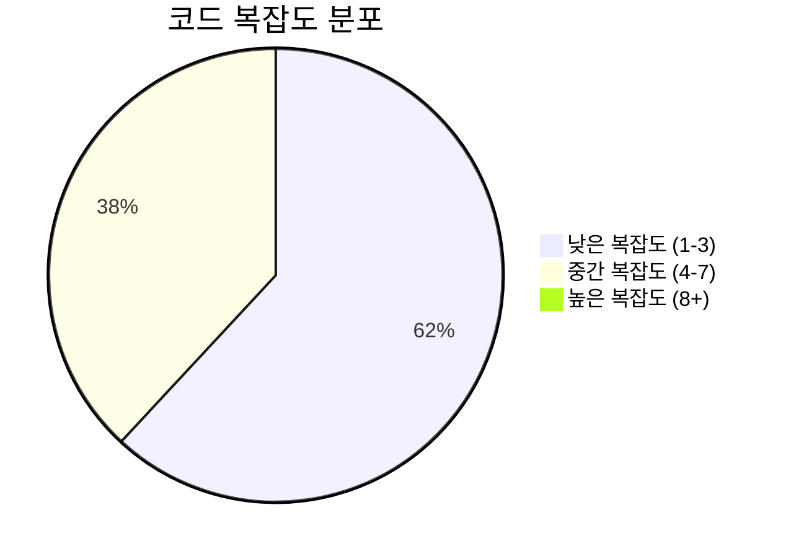

# 📄 json_processor.py

> **파일 경로**: `rule_analyzer/json_processor.py`  
> **생성일**: 2025-10-13  
> **Chunk 수**: 23개

---

## 📑 목차

### 🏗️ 클래스
- [`RuleJsonProcessor`](#class-rulejsonprocessor) - 복잡도: 0


## 📋 파일 개요

| | |
|--|--|
| 📦 **의존성**: `analyzers` • `time` • `json` • `typing` • `datetime` • `parser` 외 2개 | ⚡ **총 복잡도**: 64 |
| 📊 **총 토큰 수**: 6,821 | 🔄 **비동기 함수**: 8개 |


## 🏗️ 클래스

### <a id="class-rulejsonprocessor"></a>🎯 `RuleJsonProcessor`


> 📝 **클래스 설명**  
> JSON I/O 처리를 위한 메인 프로세서

지원하는 액션들:
- analyze_rule: 단일 룰 분석
- analyze_batch_rules: 배치 룰 분석
- detect_issues: 이슈 감지
- analyze_conditions: 조건 분석
- analyze_performance: 성능 분석
- validate_rule: 룰 검증

#### 📋 메서드 목록

| 메서드 | 타입 | 복잡도 | 설명 |
|--------|------|--------|------|
| `__init__` | magic | 1 | RuleJsonProcessor 초기화 |
| `_analyze_batch_rules` | private | 4 | 배치 룰 분석 |
| `_analyze_batch_rules_async` | async private | 4 | 배치 룰 분석 (비동기) |
| `_analyze_conditions` | private | 1 | 조건 분석 |
| `_analyze_performance` | private | 1 | 성능 분석 |
| `_analyze_single_rule` | private | 2 | 단일 룰 분석 |
| `_analyze_single_rule_async` | async private | 2 | 단일 룰 분석 (비동기) |
| `_count_issues_by_type` | private | 2 | 이슈 타입별 개수 계산 |
| `_create_error_response` | private | 1 | 에러 응답 생성 |
| `_detect_issues` | private | 1 | 이슈 감지 |
| `_detect_issues_async` | async private | 1 | 이슈 감지 (비동기) |
| `_process_action` | private | 7 | 액션별 동기 처리 |
| `_process_action_async` | async private | 7 | 액션별 비동기 처리 |
| `_process_rule_array` | private | 6 | 룰 배열 직접 처리 (기존 시스템과 동일한 형태) |
| `_process_rule_array_async` | async private | 6 | 룰 배열 직접 처리 (비동기, 기존 시스템과 동일한 형태) |
| `_process_wrapper_format` | private | 2 | 래퍼 형태 처리 (module, action 등 포함) |
| `_process_wrapper_format_async` | async private | 2 | 래퍼 형태 처리 (비동기, module, action 등 포함) |
| `_validate_rule` | private | 1 | 룰 검증 |
| `_validate_rule_async` | async private | 1 | 룰 검증 (비동기) |
| `process_json_input` | public | 6 | JSON 입력을 처리하여 JSON 출력을 반환 |
| `process_json_input_async` | async public | 6 | JSON 입력을 비동기로 처리하여 JSON 출력을 반환 |


#### 🔧 메서드 상세

##### `_process_action`
| 속성 | 값 |
|------|----|
| ⚡ 복잡도 | 7 |
| 📊 토큰 수 | 164 |
| 📍 라인 범위 | 420-437 |
- **Signature**: `_process_action(self, input_model: RuleJsonInput) -> Dict[str, Any]`- **Parameters**: `self, input_model: RuleJsonInput`- **Returns**: `Dict[str, Any]`
- **Calls**: `_analyze_single_rule`, `_analyze_batch_rules`, `_detect_issues`, `_analyze_conditions`, `_analyze_performance`, `_validate_rule`, `ValueError`- **Raises**: `ValueError`---
##### `_process_action_async`
| 속성 | 값 |
|------|----|
| ⚡ 복잡도 | 7 |
| 📊 토큰 수 | 174 |
| 📍 라인 범위 | 439-456 |
- **Signature**: `_process_action_async(self, input_model: RuleJsonInput) -> Dict[str, Any]`- **Parameters**: `self, input_model: RuleJsonInput`- **Returns**: `Dict[str, Any]`
- **Calls**: `_analyze_single_rule_async`, `_analyze_batch_rules_async`, `_detect_issues_async`, `_analyze_conditions`, `_analyze_performance`, `ValueError`, `_validate_rule_async`- **Raises**: `ValueError`---
##### `process_json_input`
| 속성 | 값 |
|------|----|
| ⚡ 복잡도 | 6 |
| 📊 토큰 수 | 476 |
| 📍 라인 범위 | 42-86 |
- **Signature**: `process_json_input(self, json_data: Union[str, dict, list]) -> RuleJsonOutput`- **Parameters**: `self, json_data: Union[str, dict, list]`- **Returns**: `RuleJsonOutput`
- **Calls**: `time`, `isinstance`, `loads`, `_process_rule_array`, `_create_error_response`, `int`, `_process_wrapper_format`, `str`---
##### `_process_rule_array`
| 속성 | 값 |
|------|----|
| ⚡ 복잡도 | 6 |
| 📊 토큰 수 | 762 |
| 📍 라인 범위 | 88-191 |
- **Signature**: `_process_rule_array(self, rule_array: List[Dict[str, Any]], start_time: float) -> RuleJsonOutput`- **Parameters**: `self, rule_array: List[Dict[str, Any]], start_time: float`- **Returns**: `RuleJsonOutput`
- **Calls**: `parse_multiple`, `int`, `RuleJsonOutput`, `len`, `analyze_rule_sync`, `to_json`, `_create_error_response`, `isoformat`, `append`, `time`, `error`, `now`, `str`, `sum`, `get`---
##### `process_json_input_async`
| 속성 | 값 |
|------|----|
| ⚡ 복잡도 | 6 |
| 📊 토큰 수 | 427 |
| 📍 라인 범위 | 234-280 |
- **Signature**: `process_json_input_async(self, json_data: Union[str, dict, list]) -> RuleJsonOutput`- **Parameters**: `self, json_data: Union[str, dict, list]`- **Returns**: `RuleJsonOutput`
- **Calls**: `time`, `isinstance`, `loads`, `_create_error_response`, `int`, `_process_rule_array_async`, `_process_wrapper_format_async`, `str`---
##### `_process_rule_array_async`
| 속성 | 값 |
|------|----|
| ⚡ 복잡도 | 6 |
| 📊 토큰 수 | 696 |
| 📍 라인 범위 | 282-381 |
- **Signature**: `_process_rule_array_async(self, rule_array: List[Dict[str, Any]], start_time: float) -> RuleJsonOutput`- **Parameters**: `self, rule_array: List[Dict[str, Any]], start_time: float`- **Returns**: `RuleJsonOutput`
- **Calls**: `parse_multiple`, `int`, `RuleJsonOutput`, `len`, `to_json`, `_create_error_response`, `analyze_rule`, `isoformat`, `append`, `time`, `error`, `now`, `str`, `sum`, `get`---
##### `_analyze_batch_rules`
| 속성 | 값 |
|------|----|
| ⚡ 복잡도 | 4 |
| 📊 토큰 수 | 581 |
| 📍 라인 범위 | 530-604 |
- **Signature**: `_analyze_batch_rules(self, data: Dict[str, Any]) -> Dict[str, Any]`- **Parameters**: `self, data: Dict[str, Any]`- **Returns**: `Dict[str, Any]`
- **Calls**: `get`, `parse_multiple`, `AnalysisOptions`, `len`, `analyze_rule_sync`, `append`, `error`, `sum`, `str`---
##### `_analyze_batch_rules_async`
| 속성 | 값 |
|------|----|
| ⚡ 복잡도 | 4 |
| 📊 토큰 수 | 588 |
| 📍 라인 범위 | 606-680 |
- **Signature**: `_analyze_batch_rules_async(self, data: Dict[str, Any]) -> Dict[str, Any]`- **Parameters**: `self, data: Dict[str, Any]`- **Returns**: `Dict[str, Any]`
- **Calls**: `get`, `parse_multiple`, `AnalysisOptions`, `len`, `append`, `analyze_rule`, `error`, `sum`, `str`---
##### `_process_wrapper_format`
| 속성 | 값 |
|------|----|
| ⚡ 복잡도 | 2 |
| 📊 토큰 수 | 325 |
| 📍 라인 범위 | 193-232 |
- **Signature**: `_process_wrapper_format(self, input_dict: Dict[str, Any], start_time: float) -> RuleJsonOutput`- **Parameters**: `self, input_dict: Dict[str, Any], start_time: float`- **Returns**: `RuleJsonOutput`
- **Calls**: `RuleJsonInput`, `_process_action`, `int`, `RuleJsonOutput`, `_create_error_response`, `isoformat`, `time`, `now`, `str`---
##### `_process_wrapper_format_async`
| 속성 | 값 |
|------|----|
| ⚡ 복잡도 | 2 |
| 📊 토큰 수 | 282 |
| 📍 라인 범위 | 383-418 |
- **Signature**: `_process_wrapper_format_async(self, input_dict: Dict[str, Any], start_time: float) -> RuleJsonOutput`- **Parameters**: `self, input_dict: Dict[str, Any], start_time: float`- **Returns**: `RuleJsonOutput`
- **Calls**: `RuleJsonInput`, `int`, `RuleJsonOutput`, `_process_action_async`, `_create_error_response`, `isoformat`, `time`, `now`, `str`---
##### `_analyze_single_rule`
| 속성 | 값 |
|------|----|
| ⚡ 복잡도 | 2 |
| 📊 토큰 수 | 299 |
| 📍 라인 범위 | 458-492 |
- **Signature**: `_analyze_single_rule(self, data: Dict[str, Any]) -> Dict[str, Any]`- **Parameters**: `self, data: Dict[str, Any]`- **Returns**: `Dict[str, Any]`
- **Calls**: `get`, `parse`, `analyze_rule_sync`, `to_json`, `isoformat`, `error`, `now`, `str`---
##### `_analyze_single_rule_async`
| 속성 | 값 |
|------|----|
| ⚡ 복잡도 | 2 |
| 📊 토큰 수 | 290 |
| 📍 라인 범위 | 494-528 |
- **Signature**: `_analyze_single_rule_async(self, data: Dict[str, Any]) -> Dict[str, Any]`- **Parameters**: `self, data: Dict[str, Any]`- **Returns**: `Dict[str, Any]`
- **Calls**: `get`, `parse`, `to_json`, `isoformat`, `analyze_rule`, `error`, `now`, `str`---
##### `_count_issues_by_type`
| 속성 | 값 |
|------|----|
| ⚡ 복잡도 | 2 |
| 📊 토큰 수 | 84 |
| 📍 라인 범위 | 818-824 |
- **Signature**: `_count_issues_by_type(self, issues: List) -> Dict[str, int]`- **Parameters**: `self, issues: List`- **Returns**: `Dict[str, int]`
- **Calls**: `getattr`, `get`---
##### `__init__`
| 속성 | 값 |
|------|----|
| ⚡ 복잡도 | 1 |
| 📊 토큰 수 | 39 |
| 📍 라인 범위 | 36-40 |
- **Signature**: `__init__(self)`- **Parameters**: `self`- **Returns**: `N/A`
- **Calls**: `getLogger`, `RuleParser`, `RuleAnalyzer`---
##### `_detect_issues`
| 속성 | 값 |
|------|----|
| ⚡ 복잡도 | 1 |
| 📊 토큰 수 | 218 |
| 📍 라인 범위 | 682-701 |
- **Signature**: `_detect_issues(self, data: Dict[str, Any]) -> Dict[str, Any]`- **Parameters**: `self, data: Dict[str, Any]`- **Returns**: `Dict[str, Any]`
- **Calls**: `get`, `parse`, `detect_all_issues_sync`, `len`, `_count_issues_by_type`, `to_json`---
##### `_detect_issues_async`
| 속성 | 값 |
|------|----|
| ⚡ 복잡도 | 1 |
| 📊 토큰 수 | 214 |
| 📍 라인 범위 | 703-722 |
- **Signature**: `_detect_issues_async(self, data: Dict[str, Any]) -> Dict[str, Any]`- **Parameters**: `self, data: Dict[str, Any]`- **Returns**: `Dict[str, Any]`
- **Calls**: `get`, `parse`, `detect_all_issues`, `len`, `_count_issues_by_type`, `to_json`---
##### `_analyze_conditions`
| 속성 | 값 |
|------|----|
| ⚡ 복잡도 | 1 |
| 📊 토큰 수 | 254 |
| 📍 라인 범위 | 724-751 |
- **Signature**: `_analyze_conditions(self, data: Dict[str, Any]) -> Dict[str, Any]`- **Parameters**: `self, data: Dict[str, Any]`- **Returns**: `Dict[str, Any]`
- **Calls**: `get`, `parse`, `parse_rule_conditions`, `infer_field_types`, `calculate_structure_metrics`, `dict`---
##### `_analyze_performance`
| 속성 | 값 |
|------|----|
| ⚡ 복잡도 | 1 |
| 📊 토큰 수 | 236 |
| 📍 라인 범위 | 753-778 |
- **Signature**: `_analyze_performance(self, data: Dict[str, Any]) -> Dict[str, Any]`- **Parameters**: `self, data: Dict[str, Any]`- **Returns**: `Dict[str, Any]`
- **Calls**: `get`, `parse`, `parse_rule_conditions`, `calculate_structure_metrics`, `generate_performance_metrics`, `dict`---
##### `_validate_rule`
| 속성 | 값 |
|------|----|
| ⚡ 복잡도 | 1 |
| 📊 토큰 수 | 181 |
| 📍 라인 범위 | 780-797 |
- **Signature**: `_validate_rule(self, data: Dict[str, Any]) -> Dict[str, Any]`- **Parameters**: `self, data: Dict[str, Any]`- **Returns**: `Dict[str, Any]`
- **Calls**: `get`, `parse`, `analyze_rule_sync`, `to_json`---
##### `_validate_rule_async`
| 속성 | 값 |
|------|----|
| ⚡ 복잡도 | 1 |
| 📊 토큰 수 | 186 |
| 📍 라인 범위 | 799-816 |
- **Signature**: `_validate_rule_async(self, data: Dict[str, Any]) -> Dict[str, Any]`- **Parameters**: `self, data: Dict[str, Any]`- **Returns**: `Dict[str, Any]`
- **Calls**: `get`, `parse`, `to_json`, `analyze_rule`---
##### `_create_error_response`
| 속성 | 값 |
|------|----|
| ⚡ 복잡도 | 1 |
| 📊 토큰 수 | 113 |
| 📍 라인 범위 | 826-837 |
- **Signature**: `_create_error_response(self, error_code: str, error_message: str, execution_time: int) -> RuleJsonOutput`- **Parameters**: `self, error_code: str, error_message: str, execution_time: int`- **Returns**: `RuleJsonOutput`
- **Calls**: `RuleJsonOutput`, `isoformat`, `now`---
<details>
<summary>🔍 코드 미리보기</summary>

```python
class RuleJsonProcessor:
    """
    JSON I/O 처리를 위한 메인 프로세서

    지원하는 액션들:
    - analyze_rule: 단일 룰 분석
    - analyze_batch_rules: 배치 룰 분석
    - detect_issues: 이슈 감지
    - analyze_conditions: 조건 분석
    - analyze_performance: 성능 분석
    - validate_rule: 룰 검증
    """

    def __init__(self):...
```

**Chunk 정보**
- 🆔 **ID**: `89a0210bbbaf`
- 📍 **라인**: 23-33
- 📊 **토큰**: 122
- 🏷️ **태그**: `class`

</details>

---


## 📊 시각화 및 분석

### ⚡ 복잡도 분석



### 🔧 함수 유형 분석



### 🔗 호출 순서 (Sequence)




## 📈 퍼포먼스 메트릭스

### 📊 핵심 지표

| 🎯 메트릭 | 📊 값 | 🚦 상태 |
|-----------|-------|--------|
| **총 라인 수** | 793 | 🔴 주의 |
| **평균 복잡도** | 3.0 | 🟡 보통 |
| **최대 복잡도** | 7 | 🟢 양호 |
| **함수 밀도** | 91.3% | 🔴 주의 |


### 🎯 품질 점수




## 🧩 Chunk 요약

이 파일은 총 **23개의 chunk**로 구성되어 있으며, **6,821개의 토큰**을 포함합니다.

| 🧩 Chunk 타입 | 📊 개수 | ⚡ 평균 복잡도 | 📝 총 토큰 | 📈 비율 |
|---------------|--------|-------------|----------|--------|
| 📋 파일 개요 | 1 | 0.0 | 110 | 1.6% |
| 🏗️ 클래스 | 1 | 0.0 | 122 | 1.8% |
| 🔧 메서드 | 21 | 3.0 | 6,589 | 96.6% |

