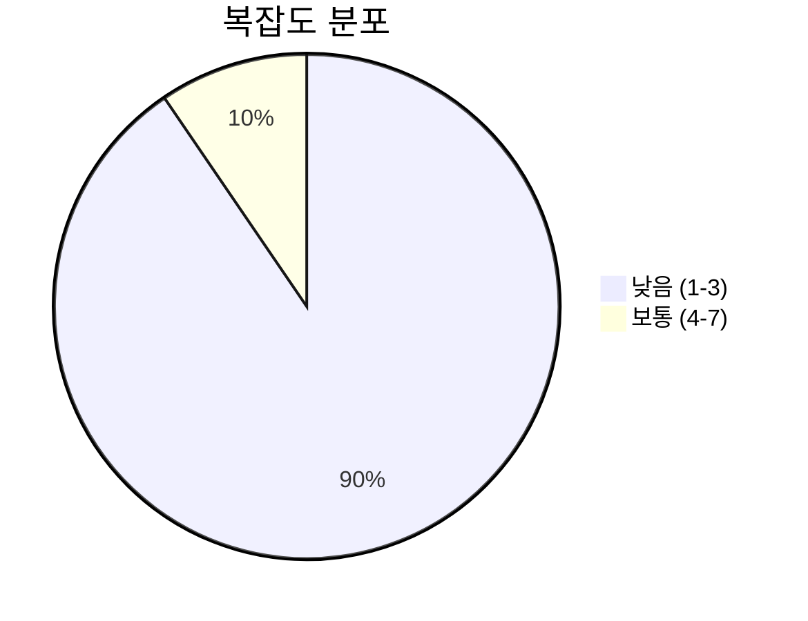
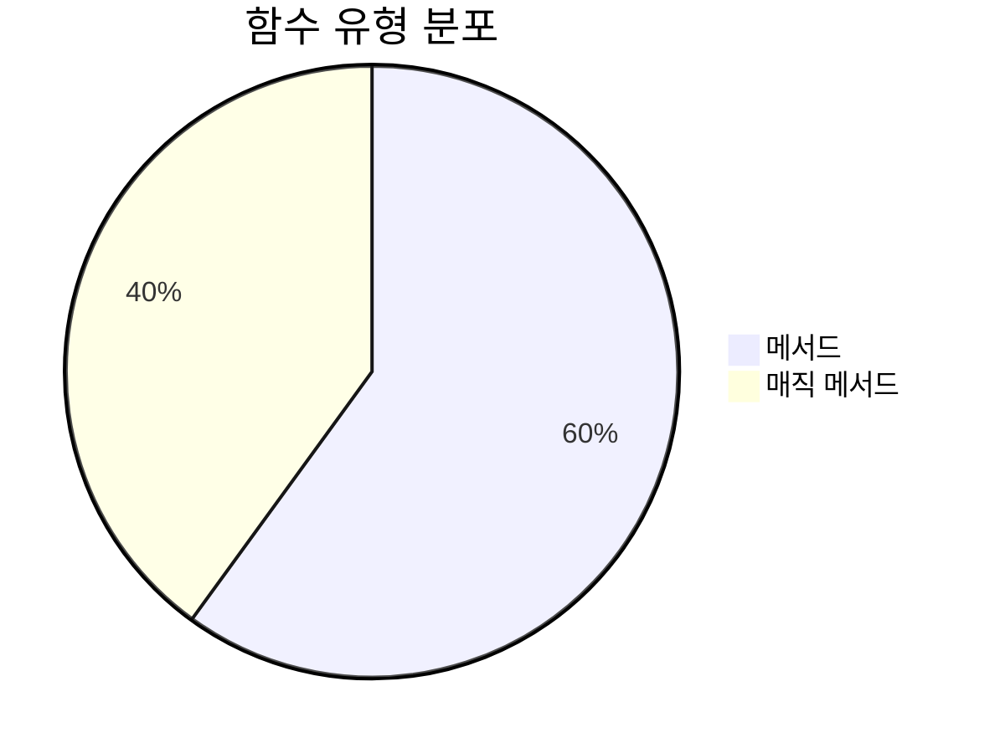
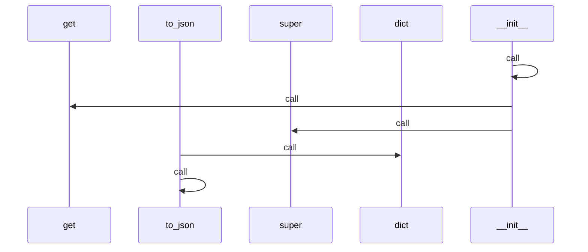
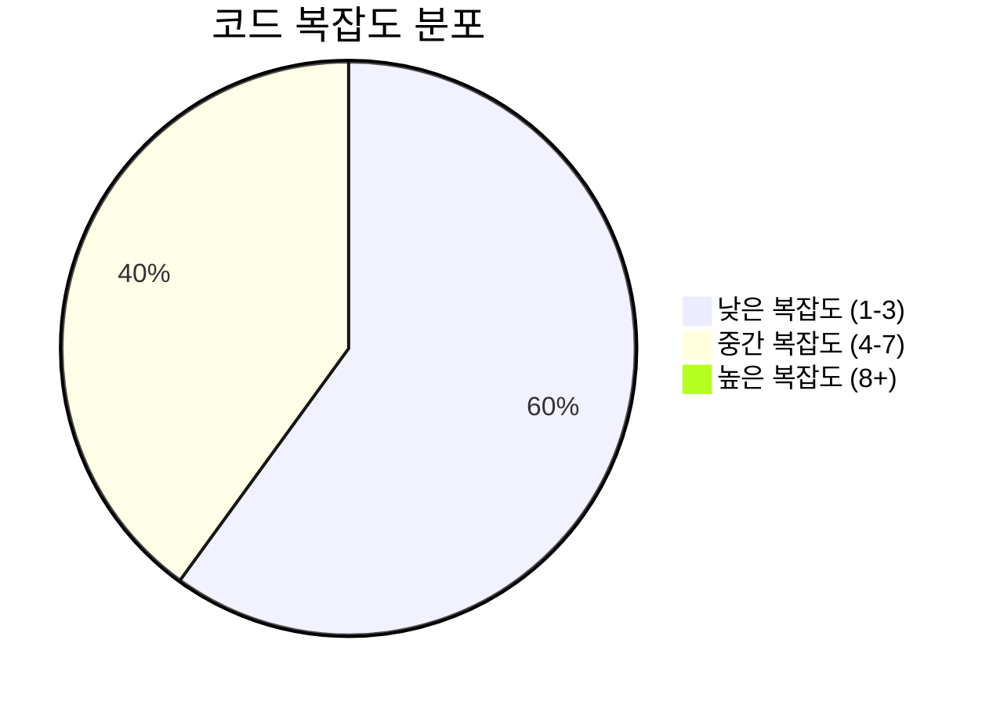

# 📄 models.py

> **파일 경로**: `rule_analyzer/models.py`  
> **생성일**: 2025-10-01  
> **Chunk 수**: 21개

---

## 📑 목차

### 🏗️ 클래스
- [`ConditionIssue`](#class-conditionissue) - 복잡도: 0
- [`RuleCondition`](#class-rulecondition) - 복잡도: 0
- [`ConditionTree`](#class-conditiontree) - 복잡도: 0
- [`Rule`](#class-rule) - 복잡도: 0
- [`FieldAnalysis`](#class-fieldanalysis) - 복잡도: 0
- [`LogicFlow`](#class-logicflow) - 복잡도: 0
- [`PerformanceMetrics`](#class-performancemetrics) - 복잡도: 0
- [`QualityMetrics`](#class-qualitymetrics) - 복잡도: 0
- [`ReportMetadata`](#class-reportmetadata) - 복잡도: 0
- [`StructureInfo`](#class-structureinfo) - 복잡도: 0
- [`ValidationResult`](#class-validationresult) - 복잡도: 0
- [`RuleJsonInput`](#class-rulejsoninput) - 복잡도: 0
- [`RuleJsonOutput`](#class-rulejsonoutput) - 복잡도: 0
- [`AnalysisOptions`](#class-analysisoptions) - 복잡도: 0
- [`BatchAnalysisResult`](#class-batchanalysisresult) - 복잡도: 0


## 📋 파일 개요

| | |
|--|--|
| 📦 **의존성**: `uuid` • `typing` • `datetime` • `pydantic` | ⚡ **총 복잡도**: 16 |
| 📊 **총 토큰 수**: 3,888 |  |


## 🏗️ 클래스

### <a id="class-conditionissue"></a>🎯 `ConditionIssue`

 

> 📝 **클래스 설명**  
> 룰 조건 이슈 모델 (순수 로직 분석)

| 속성 | 값 |
|------|----|
| 🧬 상속 | `BaseModel` |


#### 📋 메서드 목록

| 메서드 | 타입 | 복잡도 | 설명 |
|--------|------|--------|------|
| `to_json` | public | 1 | ConditionIssue를 JSON 딕셔너리로 변환 |


#### 🔧 메서드 상세

##### `to_json`
| 속성 | 값 |
|------|----|
| ⚡ 복잡도 | 1 |
| 📊 토큰 수 | 170 |
| 📍 라인 범위 | 22-38 |
- **Signature**: `to_json(self) -> Dict[str, Any]`- **Parameters**: `self`- **Returns**: `Dict[str, Any]`
---
<details>
<summary>🔍 코드 미리보기</summary>

```python
class ConditionIssue(BaseModel):
    """
    룰 조건 이슈 모델 (순수 로직 분석)
    """

    condUuid: Optional[str] = Field(None, description="조건 고유 ID")
    keyName: Optional[str] = Field(None, description="조건 키 이름")
    dispName: Optional[str] = Field(None, description="조건 표시 이름")
    issue_type: str
    severity: str
    location: str = ""
    explanation: str = ""
    suggestion: str = ""

    def to_json(self) -> Dict[str, Any]:...
```

**Chunk 정보**
- 🆔 **ID**: `7ddbad31ae53`
- 📍 **라인**: 8-18
- 📊 **토큰**: 140
- 🏷️ **태그**: `class, pydantic`

</details>

---

### <a id="class-rulecondition"></a>🎯 `RuleCondition`

 

> 📝 **클래스 설명**  
> 룰 조건 모델 (순수 로직 분석)

| 속성 | 값 |
|------|----|
| 🧬 상속 | `BaseModel` |


#### 📋 메서드 목록

| 메서드 | 타입 | 복잡도 | 설명 |
|--------|------|--------|------|
| `__init__` | magic | 6 |  |


#### 🔧 메서드 상세

##### `__init__`
| 속성 | 값 |
|------|----|
| ⚡ 복잡도 | 6 |
| 📊 토큰 수 | 145 |
| 📍 라인 범위 | 64-75 |
- **Signature**: `__init__(self, **data)`- **Parameters**: `self, **data`- **Returns**: `N/A`
- **Calls**: `__init__`, `get`, `super`---
<details>
<summary>🔍 코드 미리보기</summary>

```python
class RuleCondition(BaseModel):
    """
    룰 조건 모델 (순수 로직 분석)
    """

    condUuid: str = Field(
        default_factory=lambda: str(uuid4()), description="조건 고유 ID"
    )
    keyName: Optional[str] = Field(None, description="조건 키 이름")
    dispName: Optional[str] = Field(None, description="조건 표시 이름")
    operator: Optional[str] = Field(None, description="연산자")
    value: Optional[Any] = Field(None, description="조건 값")
    fieldDataType: Optional[str] = Field(
        None, description="필드 데이터 타입 (String, Number 등)"
    )
    logicType: Optional[str] = Field(None, description="논리 타입 (AND, OR)")
    condition: Optional[List["ConditionTreeItem"]] = Field(
        None, description="하위 조건들 (논리 연산자 블록)"
    )
    field: Optional[str] = None
    conditions: Optional[List["RuleCondition"]] = No...
```

**Chunk 정보**
- 🆔 **ID**: `9d59919f3271`
- 📍 **라인**: 41-51
- 📊 **토큰**: 271
- 🏷️ **태그**: `class, pydantic`

</details>

---

### <a id="class-conditiontree"></a>🎯 `ConditionTree`


> 📝 **클래스 설명**  
> 조건 트리 구조

| 속성 | 값 |
|------|----|
| 🧬 상속 | `BaseModel` |


<details>
<summary>🔍 코드 미리보기</summary>

```python
class ConditionTree(BaseModel):
    """
    조건 트리 구조
    """

    logicType: str = Field(..., description="논리 타입 (AND, OR)")
    condition: List[ConditionTreeItem] = Field(
        ..., description="조건 목록 또는 중첩된 조건 트리"
    )


class Rule(BaseModel):...
```

**Chunk 정보**
- 🆔 **ID**: `f144212500e4`
- 📍 **라인**: 81-91
- 📊 **토큰**: 88
- 🏷️ **태그**: `class, pydantic`

</details>

---

### <a id="class-rule"></a>🎯 `Rule`

 

> 📝 **클래스 설명**  
> 룰 모델 (순수 로직 분석)

| 속성 | 값 |
|------|----|
| 🧬 상속 | `BaseModel` |


#### 📋 메서드 목록

| 메서드 | 타입 | 복잡도 | 설명 |
|--------|------|--------|------|
| `__init__` | magic | 7 |  |
| `to_json` | public | 1 | Rule을 JSON 딕셔너리로 변환 |


#### 🔧 메서드 상세

##### `__init__`
| 속성 | 값 |
|------|----|
| ⚡ 복잡도 | 7 |
| 📊 토큰 수 | 184 |
| 📍 라인 범위 | 114-127 |
- **Signature**: `__init__(self, **data)`- **Parameters**: `self, **data`- **Returns**: `N/A`
- **Calls**: `__init__`, `super`---
##### `to_json`
| 속성 | 값 |
|------|----|
| ⚡ 복잡도 | 1 |
| 📊 토큰 수 | 185 |
| 📍 라인 범위 | 129-146 |
- **Signature**: `to_json(self) -> Dict[str, Any]`- **Parameters**: `self`- **Returns**: `Dict[str, Any]`
- **Calls**: `dict`---
<details>
<summary>🔍 코드 미리보기</summary>

```python
class Rule(BaseModel):
    """
    룰 모델 (순수 로직 분석)
    """

    ruleUuid: str = Field(
        default_factory=lambda: str(uuid4()), description="룰 고유 ID"
    )
    ruleName: str = Field(..., description="룰 이름")
    ruleMsg: str = Field(..., description="룰 메시지")
    conditionTree: Optional[ConditionTree] = Field(None, description="조건 트리")
    name: Optional[str] = None
    description: Optional[str] = None
    conditions: Optional[List[RuleCondition]] = None
    action: Optional[Dict[str, Any]] = None
    id: Optional[str] = None
    priority: int = Field(default=1, description="룰 실행 우선순위 (낮을수록 높음)")
    enabled: bool = Field(default=True, description="룰 활성화 여부")

    class Config:...
```

**Chunk 정보**
- 🆔 **ID**: `32cfb1add9cf`
- 📍 **라인**: 92-102
- 📊 **토큰**: 223
- 🏷️ **태그**: `class, pydantic`

</details>

---

### <a id="class-fieldanalysis"></a>🎯 `FieldAnalysis`


> 📝 **클래스 설명**  
> 필드별 상세 분석 결과 (순수 로직)

| 속성 | 값 |
|------|----|
| 🧬 상속 | `BaseModel` |


<details>
<summary>🔍 코드 미리보기</summary>

```python
class FieldAnalysis(BaseModel):
    """필드별 상세 분석 결과 (순수 로직)"""

    keyName: str = Field(..., description="조건 키 이름")
    field_type: str = Field(..., description="필드 타입 (string/number)")
    condition_count: int = Field(..., description="해당 필드의 조건 수")
    operators_used: List[str] = Field(..., description="사용된 연산자 목록")
    values_range: Optional[Dict[str, Any]] = Field(None, description="값 범위 정보")
    issues_count: int = Field(..., description="해당 필드의 이슈 수")
    complexity_score: int = Field(..., description="필드 복잡도 점수 (0-100)")
    condition_uuids: List[str] = Field(
        default_factory=list, description="해당 필드와 관련된 조건 UUID 목록"
    )


class LogicFlow(BaseModel):...
```

**Chunk 정보**
- 🆔 **ID**: `59ccdd8b4fdc`
- 📍 **라인**: 149-159
- 📊 **토큰**: 228
- 🏷️ **태그**: `class, pydantic`

</details>

---

### <a id="class-logicflow"></a>🎯 `LogicFlow`


> 📝 **클래스 설명**  
> 로직 플로우 분석 결과 (순수 로직)

| 속성 | 값 |
|------|----|
| 🧬 상속 | `BaseModel` |


<details>
<summary>🔍 코드 미리보기</summary>

```python
class LogicFlow(BaseModel):
    """로직 플로우 분석 결과 (순수 로직)"""

    logical_operators: Dict[str, int] = Field(..., description="논리 연산자 사용 빈도")
    nesting_levels: List[int] = Field(..., description="중첩 레벨 분포")
    branch_coverage: Dict[str, Any] = Field(..., description="분기 커버리지 정보")
    potential_dead_code: List[str] = Field(..., description="잠재적 데드 코드 목록")


class PerformanceMetrics(BaseModel):...
```

**Chunk 정보**
- 🆔 **ID**: `266f9579e67d`
- 📍 **라인**: 164-174
- 📊 **토큰**: 143
- 🏷️ **태그**: `class, pydantic`

</details>

---

### <a id="class-performancemetrics"></a>🎯 `PerformanceMetrics`


> 📝 **클래스 설명**  
> 성능 메트릭 (순수 로직)

| 속성 | 값 |
|------|----|
| 🧬 상속 | `BaseModel` |


<details>
<summary>🔍 코드 미리보기</summary>

```python
class PerformanceMetrics(BaseModel):
    """성능 메트릭 (순수 로직)"""

    estimated_execution_time_ms: float = Field(
        0.0, description="예상 실행 시간 (밀리초)"
    )
    memory_usage_estimate_kb: float = Field(0.0, description="예상 메모리 사용량 (KB)")
    complexity_rating: str = Field(
        "normal", description="복잡도 등급 (low/normal/high/critical)"
    )
    optimization_suggestions: List[str] = Field(
        default_factory=list, description="최적화 제안 목록"
    )
    bottleneck_conditions: List[str] = Field(
        default_factory=list, description="병목 조건 목록"
    )


class QualityMetrics(BaseModel):...
```

**Chunk 정보**
- 🆔 **ID**: `88949a3a31d6`
- 📍 **라인**: 173-183
- 📊 **토큰**: 183
- 🏷️ **태그**: `class, pydantic`

</details>

---

### <a id="class-qualitymetrics"></a>🎯 `QualityMetrics`


> 📝 **클래스 설명**  
> 품질 메트릭 (순수 로직)

| 속성 | 값 |
|------|----|
| 🧬 상속 | `BaseModel` |


<details>
<summary>🔍 코드 미리보기</summary>

```python
class QualityMetrics(BaseModel):
    """품질 메트릭 (순수 로직)"""

    maintainability_score: int = Field(100, ge=0, le=100, description="유지보수성 점수")
    readability_score: int = Field(100, ge=0, le=100, description="가독성 점수")
    completeness_score: int = Field(100, ge=0, le=100, description="완성도 점수")
    consistency_score: int = Field(100, ge=0, le=100, description="일관성 점수")
    overall_score: int = Field(100, ge=0, le=100, description="전체 품질 점수")


class ReportMetadata(BaseModel):...
```

**Chunk 정보**
- 🆔 **ID**: `751bc4a55d61`
- 📍 **라인**: 191-201
- 📊 **토큰**: 179
- 🏷️ **태그**: `class, pydantic`

</details>

---

### <a id="class-reportmetadata"></a>🎯 `ReportMetadata`


> 📝 **클래스 설명**  
> 리포트 메타데이터 (순수 로직)

| 속성 | 값 |
|------|----|
| 🧬 상속 | `BaseModel` |


<details>
<summary>🔍 코드 미리보기</summary>

```python
class ReportMetadata(BaseModel):
    """리포트 메타데이터 (순수 로직)"""

    analysis_timestamp: str = Field(..., description="분석 타임스탬프")
    ruleUuid: Optional[str] = Field(None, description="룰 고유 ID")
    ruleName: Optional[str] = Field(None, description="룰 이름")
    analysis_version: str = Field("1.0.1", description="분석 버전")
    total_analysis_time_ms: Optional[int] = Field(
        None, description="총 분석 시간 (밀리초)"
    )
    validation_model: Optional[str] = Field(None, description="검증 모델명")
    report_model: Optional[str] = Field(None, description="리포트 모델명")
    report_generated_by: Optional[str] = Field(None, description="리포트 생성자")
    report_generation_time_ms: Optional[int] = Field(
        None, description="리포트 생성 시간 (밀리초)"
    )
    total_processing_time_ms: Optional[int] = Field(
        N...
```

**Chunk 정보**
- 🆔 **ID**: `6db987165441`
- 📍 **라인**: 201-211
- 📊 **토큰**: 285
- 🏷️ **태그**: `class, pydantic`

</details>

---

### <a id="class-structureinfo"></a>🎯 `StructureInfo`


> 📝 **클래스 설명**  
> 구조 정보 (순수 로직)

| 속성 | 값 |
|------|----|
| 🧬 상속 | `BaseModel` |


<details>
<summary>🔍 코드 미리보기</summary>

```python
class StructureInfo(BaseModel):
    """구조 정보 (순수 로직)"""

    depth: int = Field(1, description="조건 트리 최대 깊이")
    condition_count: int = Field(0, description="전체 조건 수")
    condition_node_count: int = Field(
        0, description="전체 조건 노드 수 (논리 연산자 포함)"
    )
    field_condition_count: int = Field(0, description="실제 필드가 있는 비교 조건 수")
    unique_fields: List[str] = Field(
        default_factory=list, description="사용된 고유 필드 목록"
    )


class ValidationResult(BaseModel):...
```

**Chunk 정보**
- 🆔 **ID**: `8d7caeb76449`
- 📍 **라인**: 222-232
- 📊 **토큰**: 167
- 🏷️ **태그**: `class, pydantic`

</details>

---

### <a id="class-validationresult"></a>🎯 `ValidationResult`

 

> 📝 **클래스 설명**  
> 검증 결과 (순수 로직 분석)

| 속성 | 값 |
|------|----|
| 🧬 상속 | `BaseModel` |


#### 📋 메서드 목록

| 메서드 | 타입 | 복잡도 | 설명 |
|--------|------|--------|------|
| `to_json` | public | 1 | ValidationResult를 순수 로직 JSON 딕셔너리로 변환 |


#### 🔧 메서드 상세

##### `to_json`
| 속성 | 값 |
|------|----|
| ⚡ 복잡도 | 1 |
| 📊 토큰 수 | 297 |
| 📍 라인 범위 | 260-286 |
- **Signature**: `to_json(self) -> Dict[str, Any]`- **Parameters**: `self`- **Returns**: `Dict[str, Any]`
- **Calls**: `to_json`, `dict`---
<details>
<summary>🔍 코드 미리보기</summary>

```python
class ValidationResult(BaseModel):
    """검증 결과 (순수 로직 분석)"""

    is_valid: bool = Field(..., description="유효성 여부")
    summary: str = Field(..., description="요약 정보")
    issue_counts: Dict[str, int] = Field(
        default_factory=dict, description="이슈 타입별 개수"
    )
    issues: List[ConditionIssue] = Field(..., description="검출된 이슈 목록")
    structure: StructureInfo = Field(..., description="구조 정보")
    rule_summary: str = Field("", description="룰 요약")
    complexity_score: int = Field(0, description="복잡도 점수")
    field_analysis: List[FieldAnalysis] = Field(
        default_factory=list, description="필드별 분석 결과"
    )
    logic_flow: Optional[LogicFlow] = Field(None, description="로직 플로우 분석")
    performance_metrics: Optional[PerformanceMetrics] = Field(
        None, description="성능 메트릭"
 ...
```

**Chunk 정보**
- 🆔 **ID**: `c3e95c9377f6`
- 📍 **라인**: 236-246
- 📊 **토큰**: 321
- 🏷️ **태그**: `class, pydantic`

</details>

---

### <a id="class-rulejsoninput"></a>🎯 `RuleJsonInput`


> 📝 **클래스 설명**  
> JSON 입력을 위한 모델

| 속성 | 값 |
|------|----|
| 🧬 상속 | `BaseModel` |


<details>
<summary>🔍 코드 미리보기</summary>

```python
class RuleJsonInput(BaseModel):
    """JSON 입력을 위한 모델"""

    module: str = Field(default="raas-rule-analyzer", description="모듈명")
    action: str = Field(..., description="실행할 액션")
    version: str = Field(default="1.0.1", description="모듈 버전")
    data: Dict[str, Any] = Field(..., description="실제 데이터")
    options: Optional[Dict[str, Any]] = Field(
        default_factory=dict, description="추가 옵션"
    )


class RuleJsonOutput(BaseModel):...
```

**Chunk 정보**
- 🆔 **ID**: `bb0c4643a447`
- 📍 **라인**: 290-300
- 📊 **토큰**: 136
- 🏷️ **태그**: `class, pydantic`

</details>

---

### <a id="class-rulejsonoutput"></a>🎯 `RuleJsonOutput`


> 📝 **클래스 설명**  
> JSON 출력을 위한 모델

| 속성 | 값 |
|------|----|
| 🧬 상속 | `BaseModel` |


<details>
<summary>🔍 코드 미리보기</summary>

```python
class RuleJsonOutput(BaseModel):
    """JSON 출력을 위한 모델"""

    status: str = Field(..., description="실행 상태 (success/error)")
    module: str = Field(default="raas-rule-analyzer", description="모듈명")
    version: str = Field(default="1.0.1", description="모듈 버전")
    timestamp: str = Field(
        default_factory=lambda: datetime.now().isoformat(), description="타임스탬프"
    )
    result: Optional[Dict[str, Any]] = Field(None, description="실행 결과")
    metadata: Optional[Dict[str, Any]] = Field(
        default_factory=dict, description="메타데이터"
    )
    error: Optional[Dict[str, Any]] = Field(None, description="에러 정보")


class AnalysisOptions(BaseModel):...
```

**Chunk 정보**
- 🆔 **ID**: `bedb7e2628c2`
- 📍 **라인**: 302-312
- 📊 **토큰**: 188
- 🏷️ **태그**: `class, pydantic`

</details>

---

### <a id="class-analysisoptions"></a>🎯 `AnalysisOptions`


> 📝 **클래스 설명**  
> 분석 옵션 모델

| 속성 | 값 |
|------|----|
| 🧬 상속 | `BaseModel` |


<details>
<summary>🔍 코드 미리보기</summary>

```python
class AnalysisOptions(BaseModel):
    """분석 옵션 모델"""

    severity_filter: str = Field(default="all", description="심각도 필터")
    include_performance_metrics: bool = Field(
        default=True, description="성능 메트릭 포함 여부"
    )
    include_complexity_analysis: bool = Field(
        default=True, description="복잡도 분석 포함 여부"
    )


class BatchAnalysisResult(BaseModel):...
```

**Chunk 정보**
- 🆔 **ID**: `ce741cf1bb11`
- 📍 **라인**: 318-328
- 📊 **토큰**: 105
- 🏷️ **태그**: `class, pydantic`

</details>

---

### <a id="class-batchanalysisresult"></a>🎯 `BatchAnalysisResult`


> 📝 **클래스 설명**  
> 배치 분석 결과 모델

| 속성 | 값 |
|------|----|
| 🧬 상속 | `BaseModel` |


<details>
<summary>🔍 코드 미리보기</summary>

```python
class BatchAnalysisResult(BaseModel):
    """배치 분석 결과 모델"""

    total_rules: int = Field(..., description="총 룰 수")
    valid_rules: int = Field(..., description="유효한 룰 수")
    invalid_rules: int = Field(..., description="무효한 룰 수")
    total_issues: int = Field(..., description="총 이슈 수")
    analysis_results: List[Dict[str, Any]] = Field(
        default_factory=list, description="개별 분석 결과"
    )
    summary: Dict[str, Any] = Field(default_factory=dict, description="요약 정보")


RuleCondition.model_rebuild()
...
```

**Chunk 정보**
- 🆔 **ID**: `2f35ac15da9f`
- 📍 **라인**: 330-340
- 📊 **토큰**: 161
- 🏷️ **태그**: `class, pydantic`

</details>

---


## 📊 시각화 및 분석

### ⚡ 복잡도 분석



### 🔧 함수 유형 분석



### 🔗 호출 순서 (Sequence)




## 📈 퍼포먼스 메트릭스

### 📊 핵심 지표

| 🎯 메트릭 | 📊 값 | 🚦 상태 |
|-----------|-------|--------|
| **총 라인 수** | 253 | 🟡 보통 |
| **평균 복잡도** | 3.2 | 🟡 보통 |
| **최대 복잡도** | 7 | 🟢 양호 |
| **함수 밀도** | 23.8% | 🟡 보통 |


### 🎯 품질 점수




## 🧩 Chunk 요약

이 파일은 총 **21개의 chunk**로 구성되어 있으며, **3,888개의 토큰**을 포함합니다.

| 🧩 Chunk 타입 | 📊 개수 | ⚡ 평균 복잡도 | 📝 총 토큰 | 📈 비율 |
|---------------|--------|-------------|----------|--------|
| 📋 파일 개요 | 1 | 0.0 | 89 | 2.3% |
| 🏗️ 클래스 | 15 | 0.0 | 2,818 | 72.5% |
| 🔧 메서드 | 5 | 3.2 | 981 | 25.2% |

