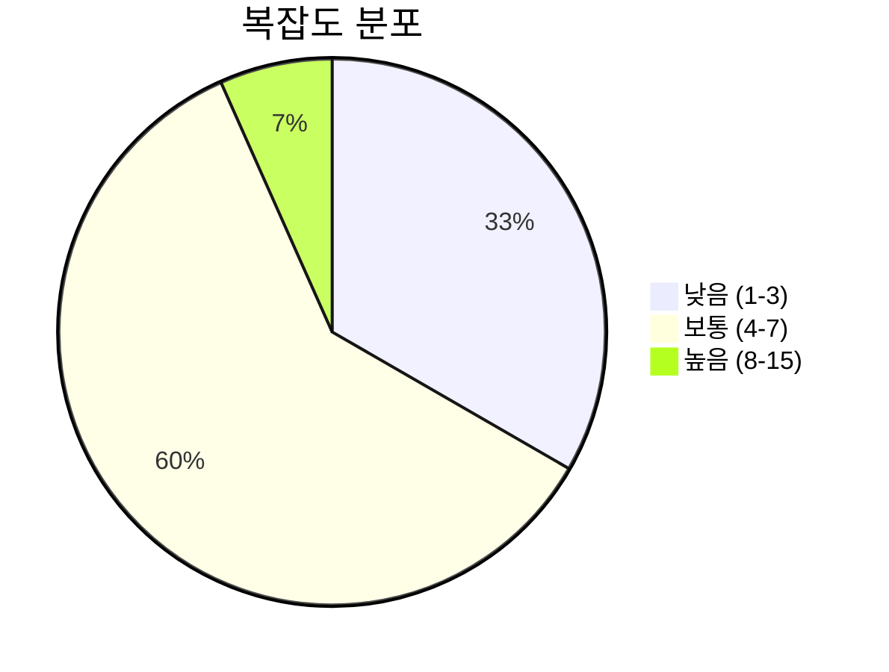
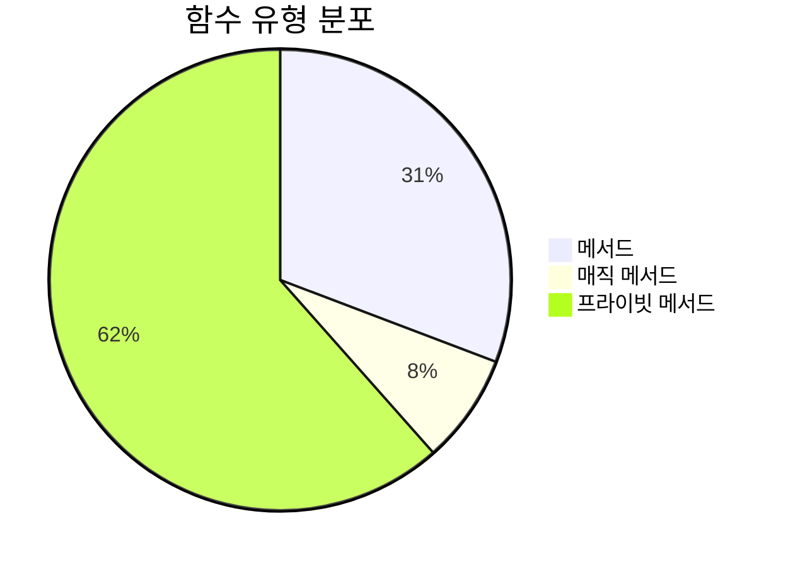
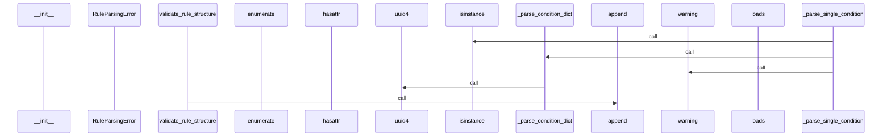
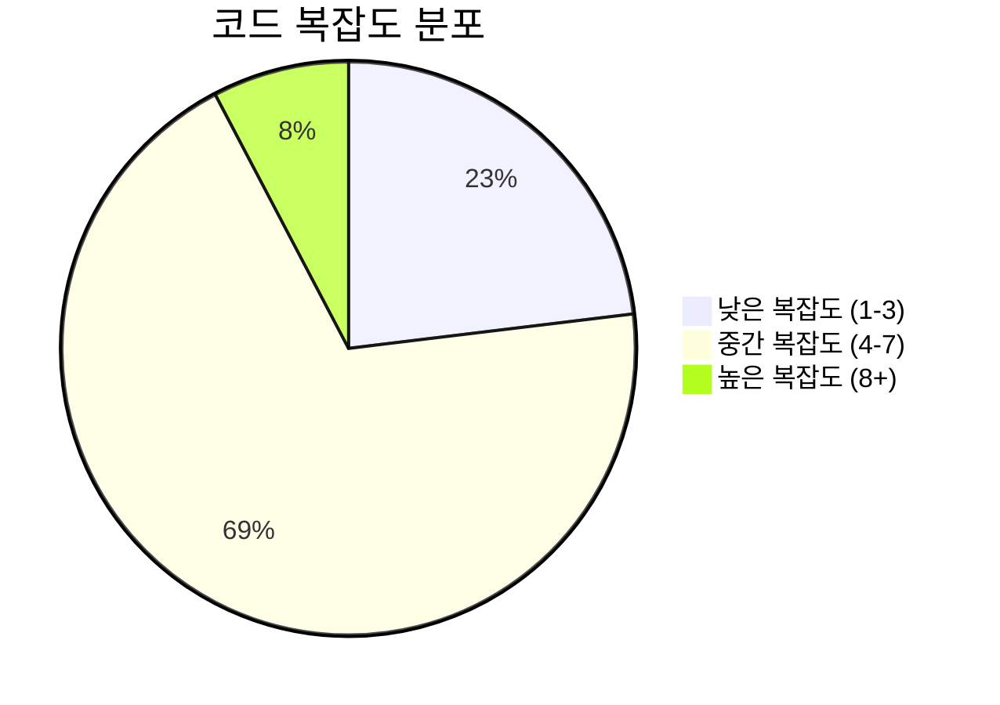

# 📄 parser.py

> **파일 경로**: `rule_analyzer/parser.py`  
> **생성일**: 2025-09-26  
> **Chunk 수**: 15개

---

## 📑 목차

### 🏗️ 클래스
- [`RuleParser`](#class-ruleparser) - 복잡도: 0


## 📋 파일 개요

| | |
|--|--|
| 📦 **의존성**: `json` • `typing` • `models` • `logging` • `exceptions` • `uuid` | ⚡ **총 복잡도**: 65 |
| 📊 **총 토큰 수**: 3,299 |  |


## 🏗️ 클래스

### <a id="class-ruleparser"></a>🎯 `RuleParser`


> 📝 **클래스 설명**  
> 다양한 형식의 룰 데이터를 파싱하는 클래스

지원하는 입력 형식:
- JSON 문자열
- Python 딕셔너리
- Rule 객체 (검증 및 정규화)

#### 📋 메서드 목록

| 메서드 | 타입 | 복잡도 | 설명 |
|--------|------|--------|------|
| `__init__` | magic | 1 | RuleParser 초기화 |
| `_parse_condition_dict` | private | 7 | 딕셔너리 형태의 조건 파싱 |
| `_parse_condition_object` | private | 6 | 객체 형태의 조건 파싱 |
| `_parse_condition_tree` | private | 6 | 조건 트리 파싱 |
| `_parse_conditions_list` | private | 5 | 조건 리스트 파싱 |
| `_parse_dict` | private | 6 | 딕셔너리 파싱 |
| `_parse_json_string` | private | 2 | JSON 문자열 파싱 |
| `_parse_single_condition` | private | 5 | 개별 조건 파싱 |
| `_validate_rule_object` | private | 4 | Rule 객체 검증 및 정규화 |
| `normalize_rule` | public | 5 | 룰 객체 정규화 |
| `parse` | public | 6 | 룰 데이터를 파싱하여 Rule 객체로 변환 |
| `parse_multiple` | public | 3 | 여러 룰 데이터를 일괄 파싱 |
| `validate_rule_structure` | public | 9 | 룰 구조 유효성 검사 |


#### 🔧 메서드 상세

##### `validate_rule_structure`
| 속성 | 값 |
|------|----|
| ⚡ 복잡도 | 9 |
| 📊 토큰 수 | 525 |
| 📍 라인 범위 | 302-355 |
- **Signature**: `validate_rule_structure(self, rule: Rule) -> Dict[str, Any]`- **Parameters**: `self, rule: Rule`- **Returns**: `Dict[str, Any]`
- **Calls**: `bool`, `append`, `len`, `str`, `join`---
##### `_parse_condition_dict`
| 속성 | 값 |
|------|----|
| ⚡ 복잡도 | 7 |
| 📊 토큰 수 | 354 |
| 📍 라인 범위 | 199-239 |
- **Signature**: `_parse_condition_dict(self, condition_dict: dict) -> RuleCondition`- **Parameters**: `self, condition_dict: dict`- **Returns**: `RuleCondition`
- **Calls**: `get`, `RuleCondition`, `_parse_conditions_list`, `str`, `uuid4`---
##### `parse`
| 속성 | 값 |
|------|----|
| ⚡ 복잡도 | 6 |
| 📊 토큰 수 | 326 |
| 📍 라인 범위 | 32-63 |
- **Signature**: `parse(self, rule_data: Union[str, dict, Rule]) -> Rule`- **Parameters**: `self, rule_data: Union[str, dict, Rule]`- **Returns**: `Rule`
- **Calls**: `isinstance`, `_parse_json_string`, `RuleParsingError`, `_parse_dict`, `_validate_rule_object`, `str`, `type`- **Raises**: `RuleParsingError`---
##### `_parse_dict`
| 속성 | 값 |
|------|----|
| ⚡ 복잡도 | 6 |
| 📊 토큰 수 | 272 |
| 📍 라인 범위 | 99-132 |
- **Signature**: `_parse_dict(self, rule_dict: dict) -> Rule`- **Parameters**: `self, rule_dict: dict`- **Returns**: `Rule`
- **Calls**: `Rule`, `RuleParsingError`, `_parse_condition_tree`, `_parse_conditions_list`, `isinstance`, `get`, `str`- **Raises**: `RuleParsingError`---
##### `_parse_condition_tree`
| 속성 | 값 |
|------|----|
| ⚡ 복잡도 | 6 |
| 📊 토큰 수 | 204 |
| 📍 라인 범위 | 134-161 |
- **Signature**: `_parse_condition_tree(self, tree_data: Any) -> Optional[ConditionTree]`- **Parameters**: `self, tree_data: Any`- **Returns**: `Optional[ConditionTree]`
- **Calls**: `isinstance`, `ConditionTree`, `warning`, `_parse_conditions_list`, `hasattr`, `get`, `getattr`, `str`---
##### `_parse_condition_object`
| 속성 | 값 |
|------|----|
| ⚡ 복잡도 | 6 |
| 📊 토큰 수 | 332 |
| 📍 라인 범위 | 241-274 |
- **Signature**: `_parse_condition_object(self, condition_obj: Any) -> RuleCondition`- **Parameters**: `self, condition_obj: Any`- **Returns**: `RuleCondition`
- **Calls**: `getattr`, `RuleCondition`, `hasattr`, `_parse_conditions_list`, `str`, `uuid4`---
##### `_parse_conditions_list`
| 속성 | 값 |
|------|----|
| ⚡ 복잡도 | 5 |
| 📊 토큰 수 | 109 |
| 📍 라인 범위 | 163-179 |
- **Signature**: `_parse_conditions_list(self, conditions_data: List[Any]) -> List[RuleCondition]`- **Parameters**: `self, conditions_data: List[Any]`- **Returns**: `List[RuleCondition]`
- **Calls**: `_parse_single_condition`, `append`, `warning`, `str`---
##### `_parse_single_condition`
| 속성 | 값 |
|------|----|
| ⚡ 복잡도 | 5 |
| 📊 토큰 수 | 127 |
| 📍 라인 범위 | 181-197 |
- **Signature**: `_parse_single_condition(self, condition_data: Any) -> Optional[RuleCondition]`- **Parameters**: `self, condition_data: Any`- **Returns**: `Optional[RuleCondition]`
- **Calls**: `isinstance`, `_parse_condition_dict`, `warning`, `_parse_condition_object`, `str`---
##### `normalize_rule`
| 속성 | 값 |
|------|----|
| ⚡ 복잡도 | 5 |
| 📊 토큰 수 | 283 |
| 📍 라인 범위 | 357-388 |
- **Signature**: `normalize_rule(self, rule: Rule) -> Rule`- **Parameters**: `self, rule: Rule`- **Returns**: `Rule`
- **Calls**: `str`, `warning`, `uuid4`---
##### `_validate_rule_object`
| 속성 | 값 |
|------|----|
| ⚡ 복잡도 | 4 |
| 📊 토큰 수 | 205 |
| 📍 라인 범위 | 276-300 |
- **Signature**: `_validate_rule_object(self, rule: Rule) -> Rule`- **Parameters**: `self, rule: Rule`- **Returns**: `Rule`
- **Calls**: `warning`, `RuleParsingError`, `hasattr`, `str`- **Raises**: `RuleParsingError`---
##### `parse_multiple`
| 속성 | 값 |
|------|----|
| ⚡ 복잡도 | 3 |
| 📊 토큰 수 | 263 |
| 📍 라인 범위 | 65-89 |
- **Signature**: `parse_multiple(self, rules_data: List[Union[str, dict, Rule]]) -> List[Rule]`- **Parameters**: `self, rules_data: List[Union[str, dict, Rule]]`- **Returns**: `List[Rule]`
- **Calls**: `enumerate`, `parse`, `append`, `error`, `str`---
##### `_parse_json_string`
| 속성 | 값 |
|------|----|
| ⚡ 복잡도 | 2 |
| 📊 토큰 수 | 79 |
| 📍 라인 범위 | 91-97 |
- **Signature**: `_parse_json_string(self, json_string: str) -> Rule`- **Parameters**: `self, json_string: str`- **Returns**: `Rule`
- **Calls**: `loads`, `_parse_dict`, `RuleParsingError`, `str`- **Raises**: `RuleParsingError`---
##### `__init__`
| 속성 | 값 |
|------|----|
| ⚡ 복잡도 | 1 |
| 📊 토큰 수 | 23 |
| 📍 라인 범위 | 28-30 |
- **Signature**: `__init__(self)`- **Parameters**: `self`- **Returns**: `N/A`
- **Calls**: `getLogger`---
<details>
<summary>🔍 코드 미리보기</summary>

```python
class RuleParser:
    """
    다양한 형식의 룰 데이터를 파싱하는 클래스

    지원하는 입력 형식:
    - JSON 문자열
    - Python 딕셔너리
    - Rule 객체 (검증 및 정규화)
    """

    def __init__(self):...
```

**Chunk 정보**
- 🆔 **ID**: `9b7d0cc6af26`
- 📍 **라인**: 18-28
- 📊 **토큰**: 77
- 🏷️ **태그**: `class`

</details>

---


## 📊 시각화 및 분석

### ⚡ 복잡도 분석



### 🔧 함수 유형 분석



### 🔗 호출 순서 (Sequence)




## 📈 퍼포먼스 메트릭스

### 📊 핵심 지표

| 🎯 메트릭 | 📊 값 | 🚦 상태 |
|-----------|-------|--------|
| **총 라인 수** | 360 | 🟡 보통 |
| **평균 복잡도** | 5.0 | 🟡 보통 |
| **최대 복잡도** | 9 | 🟢 양호 |
| **함수 밀도** | 86.7% | 🔴 주의 |


### 🎯 품질 점수




## 🧩 Chunk 요약

이 파일은 총 **15개의 chunk**로 구성되어 있으며, **3,299개의 토큰**을 포함합니다.

| 🧩 Chunk 타입 | 📊 개수 | ⚡ 평균 복잡도 | 📝 총 토큰 | 📈 비율 |
|---------------|--------|-------------|----------|--------|
| 📋 파일 개요 | 1 | 0.0 | 120 | 3.6% |
| 🏗️ 클래스 | 1 | 0.0 | 77 | 2.3% |
| 🔧 메서드 | 13 | 5.0 | 3,102 | 94.0% |

