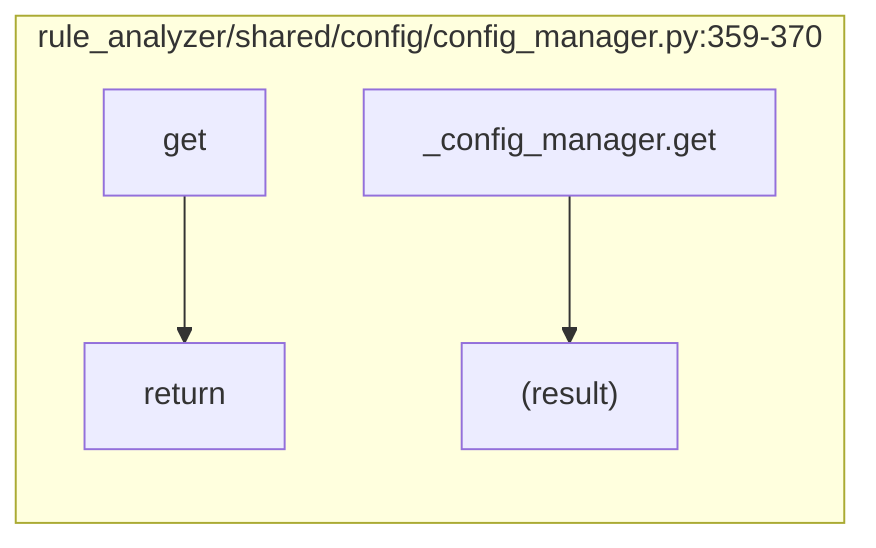
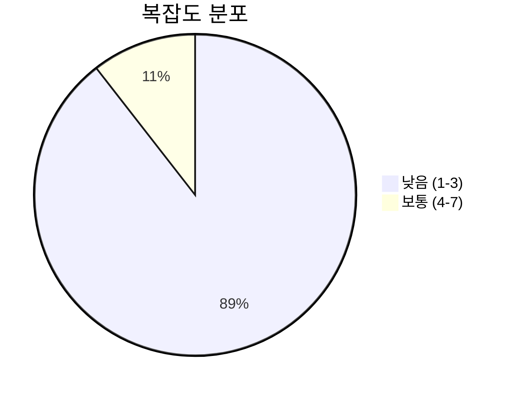
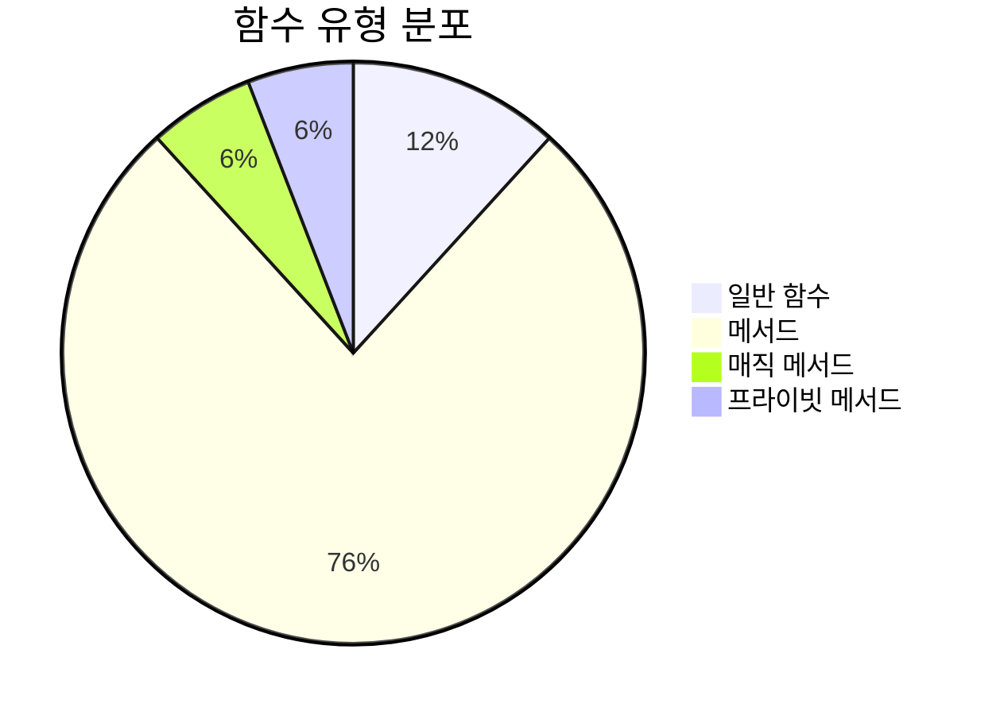
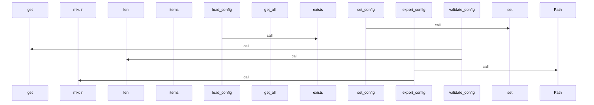
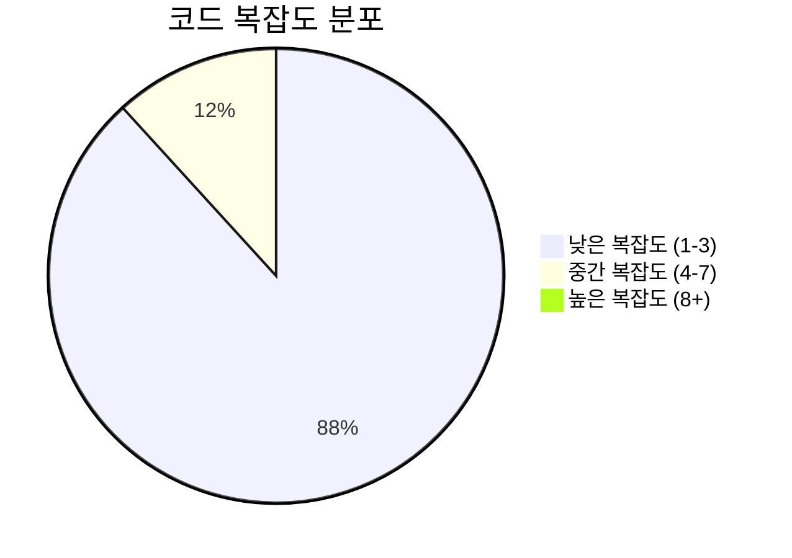

# 📄 config_manager.py

> **파일 경로**: `rule_analyzer/shared/config/config_manager.py`  
> **생성일**: 2025-10-01  
> **Chunk 수**: 19개

---

## 📑 목차

### 🏗️ 클래스
- [`ConfigManager`](#class-configmanager) - 복잡도: 0

### ⚙️ 함수
- [`get_config`](#function-get_config) - 복잡도: 1
- [`set_config`](#function-set_config) - 복잡도: 1


## 📋 파일 개요

| | |
|--|--|
| 📦 **의존성**: `pathlib` • `json` • `logging` • `typing` | ⚡ **총 복잡도**: 38 |
| 📊 **총 토큰 수**: 2,558 |  |


## 🏗️ 클래스

### <a id="class-configmanager"></a>🎯 `ConfigManager`


> 📝 **클래스 설명**  
> 설정 관리자 클래스

애플리케이션의 설정을 중앙에서 관리하고 접근할 수 있도록 합니다.

#### 📋 메서드 목록

| 메서드 | 타입 | 복잡도 | 설명 |
|--------|------|--------|------|
| `__init__` | magic | 2 | 설정 관리자 초기화 |
| `_merge_config` | private | 3 | 설정 병합 (재귀적) |
| `export_config` | public | 2 | 설정을 파일로 내보내기 |
| `get` | public | 3 | 설정 값 조회 |
| `get_all` | public | 1 | 모든 설정 반환 |
| `get_section` | public | 1 | 특정 섹션의 설정 반환 |
| `has_key` | public | 3 | 특정 키가 존재하는지 확인 |
| `has_section` | public | 1 | 특정 섹션이 존재하는지 확인 |
| `load_config` | public | 3 | 설정 파일 로드 |
| `reload` | public | 1 | 설정 파일 재로드 |
| `reset_to_default` | public | 2 | 기본 설정으로 초기화 |
| `save_config` | public | 2 | 설정 파일 저장 |
| `set` | public | 4 | 설정 값 설정 |
| `update` | public | 2 | 설정 딕셔너리로 일괄 업데이트 |
| `validate_config` | public | 6 | 설정 유효성 검증 |


#### 🔧 메서드 상세

##### `validate_config`
| 속성 | 값 |
|------|----|
| ⚡ 복잡도 | 6 |
| 📊 토큰 수 | 378 |
| 📍 라인 범위 | 263-302 |
- **Signature**: `validate_config(self) -> tuple[bool, list[str]]`- **Parameters**: `self`- **Returns**: `tuple[bool, list[str]]`
- **Calls**: `get`, `append`, `has_section`, `isinstance`, `len`---
##### `set`
| 속성 | 값 |
|------|----|
| ⚡ 복잡도 | 4 |
| 📊 토큰 수 | 205 |
| 📍 라인 범위 | 145-174 |
- **Signature**: `set(self, key: str, value: Any) -> bool`- **Parameters**: `self, key: str, value: Any`- **Returns**: `bool`
- **Calls**: `split`, `debug`, `error`, `str`---
##### `load_config`
| 속성 | 값 |
|------|----|
| ⚡ 복잡도 | 3 |
| 📊 토큰 수 | 174 |
| 📍 라인 범위 | 81-103 |
- **Signature**: `load_config(self) -> bool`- **Parameters**: `self`- **Returns**: `bool`
- **Calls**: `exists`, `save_config`, `info`, `error`, `open`, `load`, `_merge_config`, `str`---
##### `get`
| 속성 | 값 |
|------|----|
| ⚡ 복잡도 | 3 |
| 📊 토큰 수 | 112 |
| 📍 라인 범위 | 126-143 |
- **Signature**: `get(self, key: str, default: Any) -> Any`- **Parameters**: `self, key: str, default: Any`- **Returns**: `Any`
- **Calls**: `split`---
##### `has_key`
| 속성 | 값 |
|------|----|
| ⚡ 복잡도 | 3 |
| 📊 토큰 수 | 102 |
| 📍 라인 범위 | 245-261 |
- **Signature**: `has_key(self, key: str) -> bool`- **Parameters**: `self, key: str`- **Returns**: `bool`
- **Calls**: `split`---
##### `_merge_config`
| 속성 | 값 |
|------|----|
| ⚡ 복잡도 | 3 |
| 📊 토큰 수 | 105 |
| 📍 라인 범위 | 304-319 |
- **Signature**: `_merge_config(self, new_config: Dict[str, Any]) -> None`- **Parameters**: `self, new_config: Dict[str, Any]`- **Returns**: `None`
- **Calls**: `items`, `isinstance`, `_merge_config`---
##### `__init__`
| 속성 | 값 |
|------|----|
| ⚡ 복잡도 | 2 |
| 📊 토큰 수 | 414 |
| 📍 라인 범위 | 21-79 |
- **Signature**: `__init__(self, config_file: Optional[str])`- **Parameters**: `self, config_file: Optional[str]`- **Returns**: `N/A`
- **Calls**: `getLogger`, `copy`, `load_config`, `Path`, `mkdir`, `home`---
##### `save_config`
| 속성 | 값 |
|------|----|
| ⚡ 복잡도 | 2 |
| 📊 토큰 수 | 146 |
| 📍 라인 범위 | 105-124 |
- **Signature**: `save_config(self) -> bool`- **Parameters**: `self`- **Returns**: `bool`
- **Calls**: `mkdir`, `info`, `open`, `dump`, `error`, `str`---
##### `update`
| 속성 | 값 |
|------|----|
| ⚡ 복잡도 | 2 |
| 📊 토큰 수 | 148 |
| 📍 라인 범위 | 176-193 |
- **Signature**: `update(self, config_dict: Dict[str, Any]) -> bool`- **Parameters**: `self, config_dict: Dict[str, Any]`- **Returns**: `bool`
- **Calls**: `_merge_config`, `info`, `error`, `str`---
##### `reset_to_default`
| 속성 | 값 |
|------|----|
| ⚡ 복잡도 | 2 |
| 📊 토큰 수 | 104 |
| 📍 라인 범위 | 195-210 |
- **Signature**: `reset_to_default(self) -> bool`- **Parameters**: `self`- **Returns**: `bool`
- **Calls**: `copy`, `save_config`, `info`, `error`, `str`---
##### `export_config`
| 속성 | 값 |
|------|----|
| ⚡ 복잡도 | 2 |
| 📊 토큰 수 | 172 |
| 📍 라인 범위 | 330-352 |
- **Signature**: `export_config(self, export_file: str) -> bool`- **Parameters**: `self, export_file: str`- **Returns**: `bool`
- **Calls**: `Path`, `mkdir`, `info`, `open`, `dump`, `error`, `str`---
##### `get_all`
| 속성 | 값 |
|------|----|
| ⚡ 복잡도 | 1 |
| 📊 토큰 수 | 43 |
| 📍 라인 범위 | 212-219 |
- **Signature**: `get_all(self) -> Dict[str, Any]`- **Parameters**: `self`- **Returns**: `Dict[str, Any]`
- **Calls**: `copy`---
##### `get_section`
| 속성 | 값 |
|------|----|
| ⚡ 복잡도 | 1 |
| 📊 토큰 수 | 67 |
| 📍 라인 범위 | 221-231 |
- **Signature**: `get_section(self, section: str) -> Dict[str, Any]`- **Parameters**: `self, section: str`- **Returns**: `Dict[str, Any]`
- **Calls**: `get`---
##### `has_section`
| 속성 | 값 |
|------|----|
| ⚡ 복잡도 | 1 |
| 📊 토큰 수 | 63 |
| 📍 라인 범위 | 233-243 |
- **Signature**: `has_section(self, section: str) -> bool`- **Parameters**: `self, section: str`- **Returns**: `bool`
---
##### `reload`
| 속성 | 값 |
|------|----|
| ⚡ 복잡도 | 1 |
| 📊 토큰 수 | 40 |
| 📍 라인 범위 | 321-328 |
- **Signature**: `reload(self) -> bool`- **Parameters**: `self`- **Returns**: `bool`
- **Calls**: `load_config`---
<details>
<summary>🔍 코드 미리보기</summary>

```python
class ConfigManager:
    """
    설정 관리자 클래스

    애플리케이션의 설정을 중앙에서 관리하고 접근할 수 있도록 합니다.
    """

    def __init__(self, config_file: Optional[str] = None):...
```

**Chunk 정보**
- 🆔 **ID**: `3c2d143791fa`
- 📍 **라인**: 14-24
- 📊 **토큰**: 65
- 🏷️ **태그**: `class, manager`

</details>

---


## ⚙️ 함수

### <a id="function-get_config"></a>🔧 `get_config`


> 📖 **함수 설명**  
> 전역 설정 값 조회

Args:
    key: 설정 키
    default: 기본값

Returns:
    설정 값 또는 기본값

| 속성 | 값 |
|------|----|
| ⚡ 복잡도 | 1 |
| 📊 토큰 수 | 71 |
| 📍 라인 범위 | 359-370 |


#### 🧩 시그니처 상세

- **Signature**: `get_config(key: str, default: Any) -> Any`- **Parameters**: `key: str, default: Any`
- **Returns**: `Any`


#### 📞 Calls

`get`

#### 🧭 DATA FLOW



<details>
<summary>💻 코드 미리보기</summary>

```python
def get_config(key: str, default: Any = None) -> Any:
    """
    전역 설정 값 조회

    Args:
        key: 설정 키
        default: 기본값

    Returns:
        설정 값 또는 기본값
    """
    return _config_manager.get(key, default)...
```

**Chunk 메타데이터**
- 🆔 **ID**: `9b8a1b9086a7`
- 🏷️ **태그**: `getter`

</details>

---

### <a id="function-set_config"></a>🔧 `set_config`


> 📖 **함수 설명**  
> 전역 설정 값 설정

Args:
    key: 설정 키
    value: 설정 값

Returns:
    설정 성공 여부

| 속성 | 값 |
|------|----|
| ⚡ 복잡도 | 1 |
| 📊 토큰 수 | 63 |
| 📍 라인 범위 | 373-384 |


#### 🧩 시그니처 상세

- **Signature**: `set_config(key: str, value: Any) -> bool`- **Parameters**: `key: str, value: Any`
- **Returns**: `bool`


#### 📞 Calls

`set`

#### 🧭 DATA FLOW


<details>
<summary>💻 코드 미리보기</summary>

```python
def set_config(key: str, value: Any) -> bool:
    """
    전역 설정 값 설정

    Args:
        key: 설정 키
        value: 설정 값

    Returns:
        설정 성공 여부
    """
    return _config_manager.set(key, value)...
```

**Chunk 메타데이터**
- 🆔 **ID**: `72884c072f88`
- 🏷️ **태그**: `setter`

</details>

---


## 📊 시각화 및 분석

### ⚡ 복잡도 분석



### 🔧 함수 유형 분석



### 🔗 호출 순서 (Sequence)




## 📈 퍼포먼스 메트릭스

### 📊 핵심 지표

| 🎯 메트릭 | 📊 값 | 🚦 상태 |
|-----------|-------|--------|
| **총 라인 수** | 353 | 🟡 보통 |
| **평균 복잡도** | 2.2 | 🟢 양호 |
| **최대 복잡도** | 6 | 🟢 양호 |
| **함수 밀도** | 89.5% | 🔴 주의 |


### 🎯 품질 점수




## 🧩 Chunk 요약

이 파일은 총 **19개의 chunk**로 구성되어 있으며, **2,558개의 토큰**을 포함합니다.

| 🧩 Chunk 타입 | 📊 개수 | ⚡ 평균 복잡도 | 📝 총 토큰 | 📈 비율 |
|---------------|--------|-------------|----------|--------|
| 📋 파일 개요 | 1 | 0.0 | 86 | 3.4% |
| 🏗️ 클래스 | 1 | 0.0 | 65 | 2.5% |
| 🔧 메서드 | 15 | 2.4 | 2,273 | 88.9% |
| ⚙️ 함수 | 2 | 1.0 | 134 | 5.2% |

