# 📄 logging.py

> **파일 경로**: `rule_analyzer/shared/logging.py`  
> **생성일**: 2025-10-01  
> **Chunk 수**: 9개

---

## 📑 목차

### ⚙️ 함수
- [`setup_logging`](#function-setup_logging) - 복잡도: 7
- [`get_logger`](#function-get_logger) - 복잡도: 1
- [`set_log_level`](#function-set_log_level) - 복잡도: 3
- [`add_file_handler`](#function-add_file_handler) - 복잡도: 4
- [`remove_file_handler`](#function-remove_file_handler) - 복잡도: 5
- [`get_logging_config`](#function-get_logging_config) - 복잡도: 1
- [`_parse_size_string`](#function-_parse_size_string) - 복잡도: 6
- [`get_default_logger`](#function-get_default_logger) - 복잡도: 1


## 📋 파일 개요

| | |
|--|--|
| 📦 **의존성**: `pathlib` • `typing` • `config` • `logging` • `sys` | ⚡ **총 복잡도**: 28 |
| 📊 **총 토큰 수**: 1,716 |  |


## ⚙️ 함수

### <a id="function-setup_logging"></a>🔧 `setup_logging`


> 📖 **함수 설명**  
> 로깅 설정

Args:
    name: 로거 이름
    level: 로깅 레벨
    log_file: 로그 파일 경로
    format_string: 로그 포맷 문자열

Returns:
    설정된 로거

| 속성 | 값 |
|------|----|
| ⚡ 복잡도 | 7 |
| 📊 토큰 수 | 574 |
| 📍 라인 범위 | 16-92 |


#### 🧩 시그니처 상세

- **Signature**: `setup_logging(name: str, level: Optional[str], log_file: Optional[str], format_string: Optional[str]) -> Logger`- **Parameters**: `name: str, level: Optional[str], log_file: Optional[str], format_string: Optional[str]`
- **Returns**: `Logger`


#### 📞 Calls

`getattr`, `getLogger`, `setLevel`, `Formatter`, `StreamHandler`, `setFormatter`, `addHandler`, `info`, `get_config`, `upper`, `removeHandler`, `Path`, `mkdir`, `_parse_size_string`, `RotatingFileHandler`, `warning`, `str`

#### 🧭 DATA FLOW

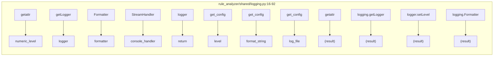

<details>
<summary>💻 코드 미리보기</summary>

```python
def setup_logging(
    name: str = "raas_rule_analyzer",
    level: Optional[str] = None,
    log_file: Optional[str] = None,
    format_string: Optional[str] = None,
) -> logging.Logger:
    """
    로깅 설정

    Args:
        name: 로거 이름
        level: 로깅 레벨
        log_file: 로그 파일 경로
        format_string: 로그 포맷 문자열

    Returns:
        설정된 로거
    """
    # 설정에서 기본값 가져오기
    if level is None:
        level = get_config("logging.level", "INFO")

    if format_string is None:
        format_string = get_config(
            "logging.format", "%(asctime)s - %(name)s - %(levelname)s - %(message)s"
        )

    if log_file is None:
        log_file = get_config("logging.file")

    # 로깅 레벨 변환
    numeric_level = getattr(logging, level.upper(), logging.INFO)

    # 로거 생성
    logger = logging.g...
```

**Chunk 메타데이터**
- 🆔 **ID**: `ded6220c76d1`
- 🏷️ **태그**: ``

</details>

---

### <a id="function-get_logger"></a>🔧 `get_logger`


> 📖 **함수 설명**  
> 로거 반환

Args:
    name: 로거 이름

Returns:
    로거 인스턴스

| 속성 | 값 |
|------|----|
| ⚡ 복잡도 | 1 |
| 📊 토큰 수 | 54 |
| 📍 라인 범위 | 95-105 |


#### 🧩 시그니처 상세

- **Signature**: `get_logger(name: str) -> Logger`- **Parameters**: `name: str`
- **Returns**: `Logger`


#### 📞 Calls

`getLogger`

#### 🧭 DATA FLOW

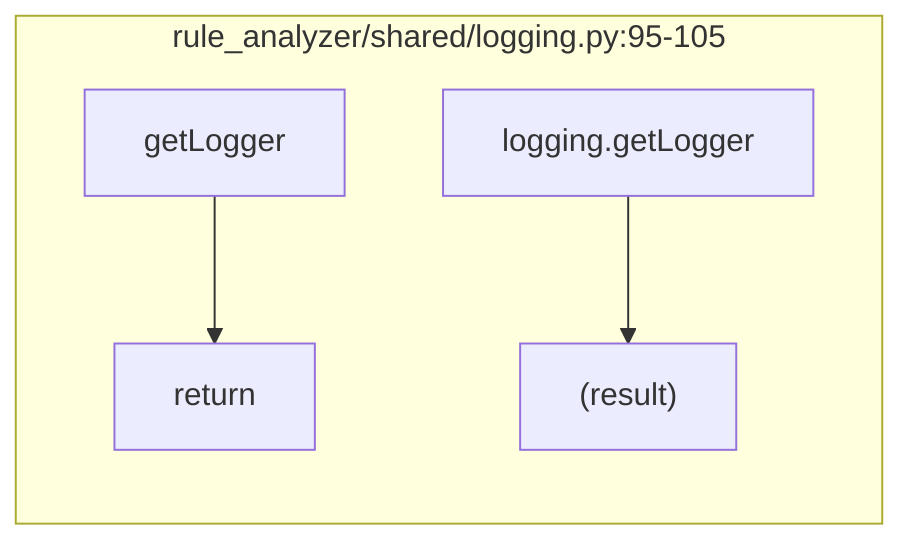

<details>
<summary>💻 코드 미리보기</summary>

```python
def get_logger(name: str = "raas_rule_analyzer") -> logging.Logger:
    """
    로거 반환

    Args:
        name: 로거 이름

    Returns:
        로거 인스턴스
    """
    return logging.getLogger(name)...
```

**Chunk 메타데이터**
- 🆔 **ID**: `8b0c008225e0`
- 🏷️ **태그**: `getter`

</details>

---

### <a id="function-set_log_level"></a>🔧 `set_log_level`


> 📖 **함수 설명**  
> 특정 로거의 레벨 설정

Args:
    name: 로거 이름
    level: 로깅 레벨

Returns:
    설정 성공 여부

| 속성 | 값 |
|------|----|
| ⚡ 복잡도 | 3 |
| 📊 토큰 수 | 143 |
| 📍 라인 범위 | 108-131 |


#### 🧩 시그니처 상세

- **Signature**: `set_log_level(name: str, level: str) -> bool`- **Parameters**: `name: str, level: str`
- **Returns**: `bool`


#### 📞 Calls

`getattr`, `getLogger`, `setLevel`, `upper`

#### 🧭 DATA FLOW

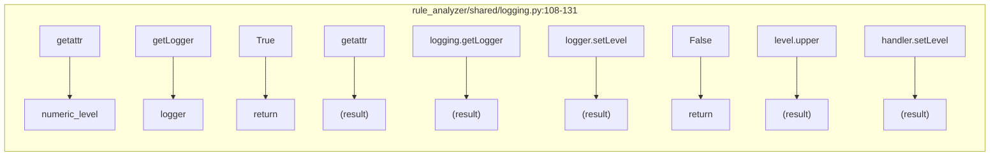

<details>
<summary>💻 코드 미리보기</summary>

```python
def set_log_level(name: str, level: str) -> bool:
    """
    특정 로거의 레벨 설정

    Args:
        name: 로거 이름
        level: 로깅 레벨

    Returns:
        설정 성공 여부
    """
    try:
        numeric_level = getattr(logging, level.upper(), logging.INFO)
        logger = logging.getLogger(name)
        logger.setLevel(numeric_level)

        # 모든 핸들러의 레벨도 업데이트
        for handler in logger.handlers:
            handler.setLevel(numeric_level)

        return True

    except Exception:
        return False...
```

**Chunk 메타데이터**
- 🆔 **ID**: `90c3e906f8f0`
- 🏷️ **태그**: `setter`

</details>

---

### <a id="function-add_file_handler"></a>🔧 `add_file_handler`


> 📖 **함수 설명**  
> 로거에 파일 핸들러 추가

Args:
    logger: 대상 로거
    log_file: 로그 파일 경로
    level: 로깅 레벨
    format_string: 로그 포맷 문자열

Returns:
    추가 성공 여부

| 속성 | 값 |
|------|----|
| ⚡ 복잡도 | 4 |
| 📊 토큰 수 | 290 |
| 📍 라인 범위 | 134-179 |


#### 🧩 시그니처 상세

- **Signature**: `add_file_handler(logger: Logger, log_file: str, level: Optional[str], format_string: Optional[str]) -> bool`- **Parameters**: `logger: Logger, log_file: str, level: Optional[str], format_string: Optional[str]`
- **Returns**: `bool`


#### 📞 Calls

`Path`, `mkdir`, `Formatter`, `FileHandler`, `setLevel`, `setFormatter`, `addHandler`, `get_config`, `getattr`, `upper`

#### 🧭 DATA FLOW

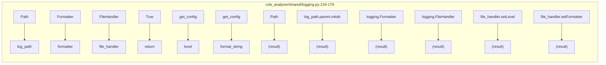

<details>
<summary>💻 코드 미리보기</summary>

```python
def add_file_handler(
    logger: logging.Logger,
    log_file: str,
    level: Optional[str] = None,
    format_string: Optional[str] = None,
) -> bool:
    """
    로거에 파일 핸들러 추가

    Args:
        logger: 대상 로거
        log_file: 로그 파일 경로
        level: 로깅 레벨
        format_string: 로그 포맷 문자열

    Returns:
        추가 성공 여부
    """
    try:
        if level is None:
            level = get_config("logging.level", "INFO")

        if format_string is None:
            format_string = get_config(
                "logging.format", "%(asctime)s - %(name)s - %(levelname)s - %(message)s"
            )

        # 로그 파일 경로 생성
        log_path = Path(log_file)
        log_path.parent.mkdir(parents=True, exist_ok=True)

        # 포맷터 생성
        formatter = logging.Formatter(format_string)

        # ...
```

**Chunk 메타데이터**
- 🆔 **ID**: `baac9c38eebe`
- 🏷️ **태그**: `processing`

</details>

---

### <a id="function-remove_file_handler"></a>🔧 `remove_file_handler`


> 📖 **함수 설명**  
> 로거에서 특정 파일 핸들러 제거

Args:
    logger: 대상 로거
    log_file: 제거할 로그 파일 경로

Returns:
    제거 성공 여부

| 속성 | 값 |
|------|----|
| ⚡ 복잡도 | 5 |
| 📊 토큰 수 | 158 |
| 📍 라인 범위 | 182-209 |


#### 🧩 시그니처 상세

- **Signature**: `remove_file_handler(logger: Logger, log_file: str) -> bool`- **Parameters**: `logger: Logger, log_file: str`
- **Returns**: `bool`


#### 📞 Calls

`removeHandler`, `close`, `len`, `isinstance`, `append`, `str`, `absolute`, `Path`

#### 🧭 DATA FLOW

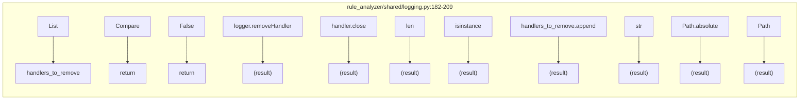

<details>
<summary>💻 코드 미리보기</summary>

```python
def remove_file_handler(logger: logging.Logger, log_file: str) -> bool:
    """
    로거에서 특정 파일 핸들러 제거

    Args:
        logger: 대상 로거
        log_file: 제거할 로그 파일 경로

    Returns:
        제거 성공 여부
    """
    try:
        handlers_to_remove = []

        for handler in logger.handlers:
            if isinstance(handler, logging.FileHandler) and handler.baseFilename == str(
                Path(log_file).absolute()
            ):
                handlers_to_remove.append(handler)

        for handler in handlers_to_remove:
            logger.removeHandler(handler)
            handler.close()

        return len(handlers_to_remove) > 0

    except Exception:
        return False...
```

**Chunk 메타데이터**
- 🆔 **ID**: `b050eb4ee2b5`
- 🏷️ **태그**: `processing, deletion`

</details>

---

### <a id="function-get_logging_config"></a>🔧 `get_logging_config`


> 📖 **함수 설명**  
> 현재 로깅 설정 반환

Returns:
    로깅 설정 딕셔너리

| 속성 | 값 |
|------|----|
| ⚡ 복잡도 | 1 |
| 📊 토큰 수 | 130 |
| 📍 라인 범위 | 212-227 |


#### 🧩 시그니처 상세

- **Signature**: `get_logging_config() -> Dict[str, Any]`- **Returns**: `Dict[str, Any]`


#### 📞 Calls

`get_config`

#### 🧭 DATA FLOW

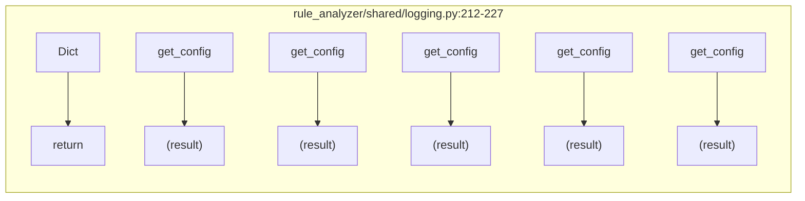

<details>
<summary>💻 코드 미리보기</summary>

```python
def get_logging_config() -> Dict[str, Any]:
    """
    현재 로깅 설정 반환

    Returns:
        로깅 설정 딕셔너리
    """
    return {
        "level": get_config("logging.level", "INFO"),
        "format": get_config(
            "logging.format", "%(asctime)s - %(name)s - %(levelname)s - %(message)s"
        ),
        "file": get_config("logging.file"),
        "max_size": get_config("logging.max_size", "10MB"),
        "backup_count": get_config("logging.backup_count", 5),
    }...
```

**Chunk 메타데이터**
- 🆔 **ID**: `be334258ab69`
- 🏷️ **태그**: `getter`

</details>

---

### <a id="function-_parse_size_string"></a>🔧 `_parse_size_string`


> 📖 **함수 설명**  
> 크기 문자열을 바이트로 변환

Args:
    size_string: 크기 문자열 (예: "10MB", "1GB")

Returns:
    바이트 수

| 속성 | 값 |
|------|----|
| ⚡ 복잡도 | 6 |
| 📊 토큰 수 | 222 |
| 📍 라인 범위 | 230-255 |


#### 🧩 시그니처 상세

- **Signature**: `_parse_size_string(size_string: str) -> int`- **Parameters**: `size_string: str`
- **Returns**: `int`


#### 📞 Calls

`strip`, `endswith`, `int`, `upper`, `float`

#### 🧭 DATA FLOW

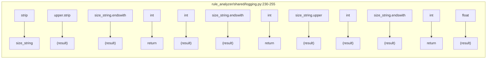

<details>
<summary>💻 코드 미리보기</summary>

```python
def _parse_size_string(size_string: str) -> int:
    """
    크기 문자열을 바이트로 변환

    Args:
        size_string: 크기 문자열 (예: "10MB", "1GB")

    Returns:
        바이트 수
    """
    size_string = size_string.upper().strip()

    if size_string.endswith('KB'):
        return int(float(size_string[:-2]) * 1024)
    elif size_string.endswith('MB'):
        return int(float(size_string[:-2]) * 1024 * 1024)
    elif size_string.endswith('GB'):
        return int(float(size_string[:-2]) * 1024 * 1024 * 1024)
    elif size_string.endswith('B'):
        return int(float(size_string[:-1]))
    else:
        # 숫자만 있는 경우 바이트로 간주
        try:
            return int(size_string)
        except ValueError:
            return 10 * 1024 * 1024  # 기본값: 10MB...
```

**Chunk 메타데이터**
- 🆔 **ID**: `396597fb1c5f`
- 🏷️ **태그**: ``

</details>

---

### <a id="function-get_default_logger"></a>🔧 `get_default_logger`


> 📖 **함수 설명**  
> 기본 로거 반환

Returns:
    기본 로거 인스턴스

| 속성 | 값 |
|------|----|
| ⚡ 복잡도 | 1 |
| 📊 토큰 수 | 40 |
| 📍 라인 범위 | 262-269 |


#### 🧩 시그니처 상세

- **Signature**: `get_default_logger() -> Logger`- **Returns**: `Logger`


#### 🧭 DATA FLOW

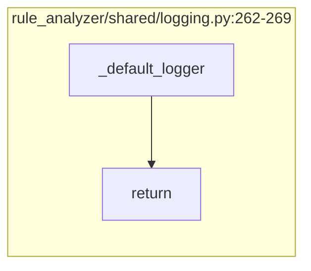

<details>
<summary>💻 코드 미리보기</summary>

```python
def get_default_logger() -> logging.Logger:
    """
    기본 로거 반환

    Returns:
        기본 로거 인스턴스
    """
    return _default_logger...
```

**Chunk 메타데이터**
- 🆔 **ID**: `cc191c8f514b`
- 🏷️ **태그**: `getter`

</details>

---


## 📊 시각화 및 분석

### ⚡ 복잡도 분석

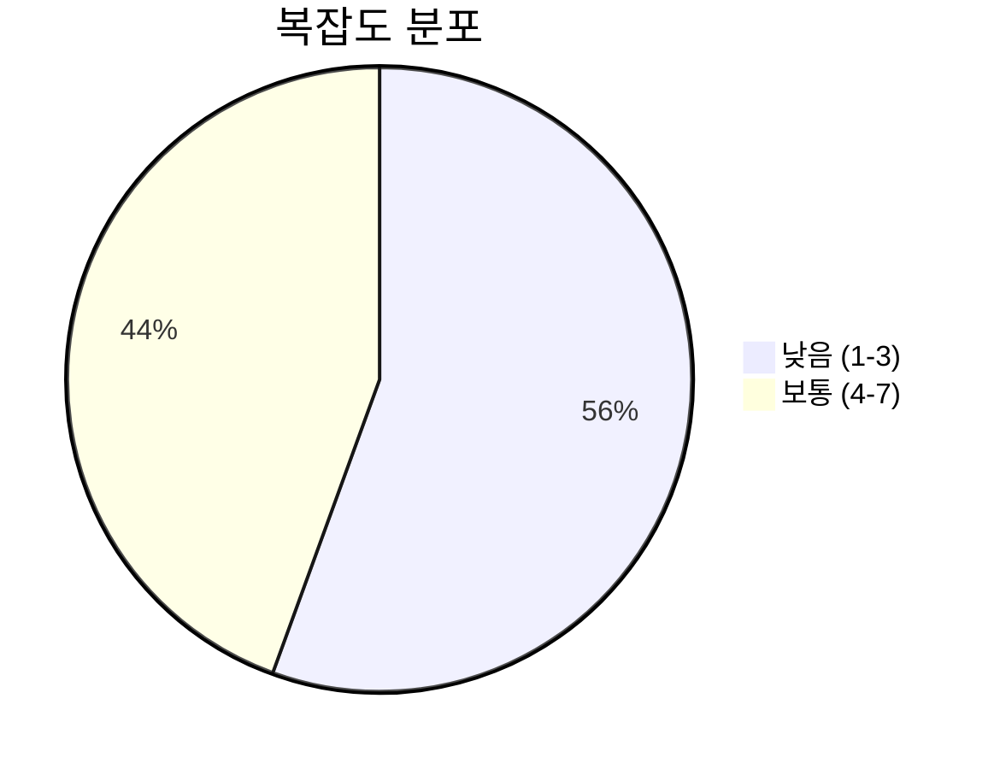

### 🔧 함수 유형 분석

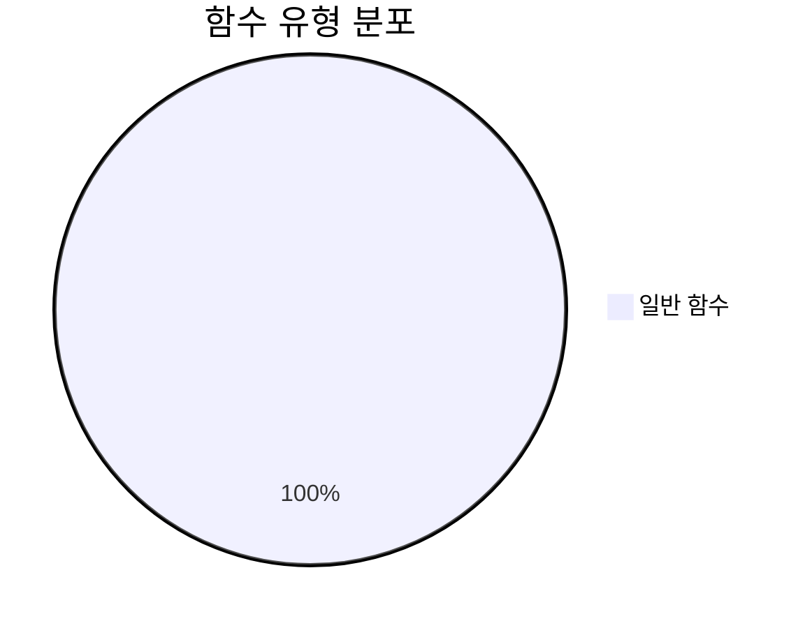

### 🔗 호출 순서 (Sequence)

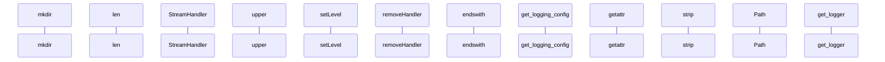


## 📈 퍼포먼스 메트릭스

### 📊 핵심 지표

| 🎯 메트릭 | 📊 값 | 🚦 상태 |
|-----------|-------|--------|
| **총 라인 수** | 236 | 🟡 보통 |
| **평균 복잡도** | 3.5 | 🟡 보통 |
| **최대 복잡도** | 7 | 🟢 양호 |
| **함수 밀도** | 88.9% | 🔴 주의 |


### 🎯 품질 점수

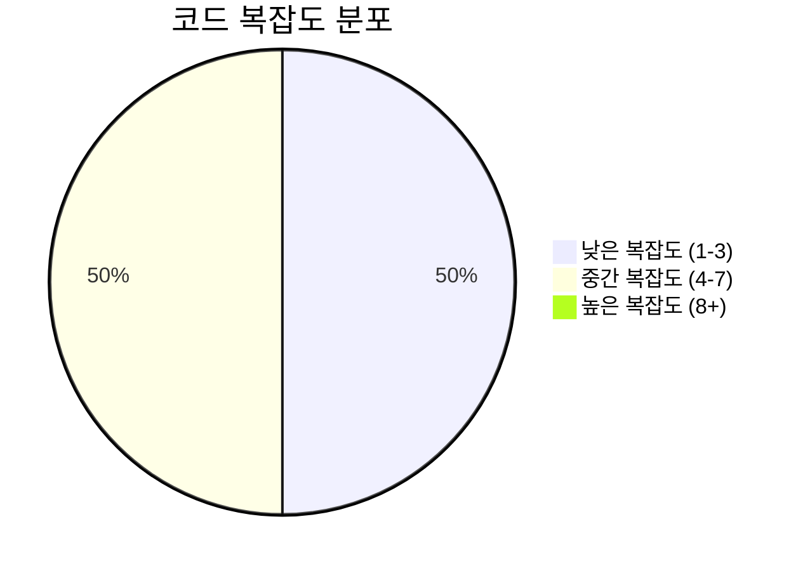


## 🧩 Chunk 요약

이 파일은 총 **9개의 chunk**로 구성되어 있으며, **1,716개의 토큰**을 포함합니다.

| 🧩 Chunk 타입 | 📊 개수 | ⚡ 평균 복잡도 | 📝 총 토큰 | 📈 비율 |
|---------------|--------|-------------|----------|--------|
| 📋 파일 개요 | 1 | 0.0 | 105 | 6.1% |
| ⚙️ 함수 | 8 | 3.5 | 1,611 | 93.9% |

