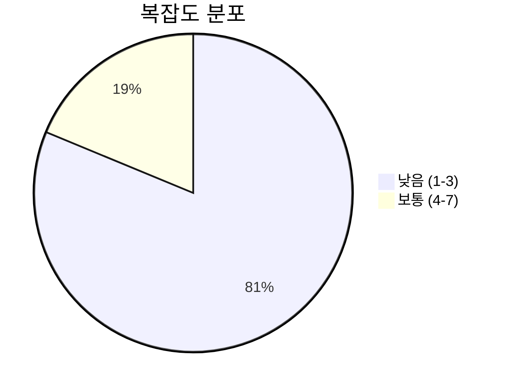
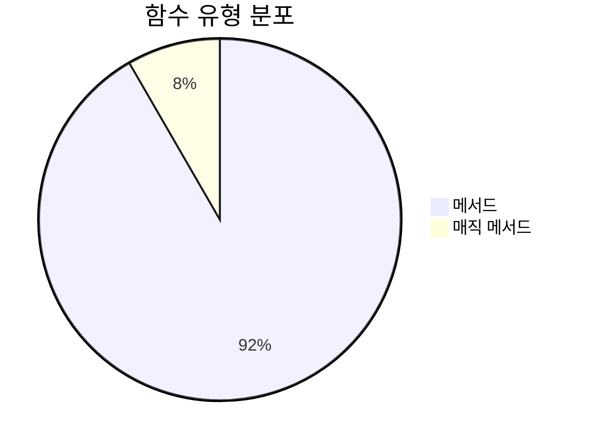
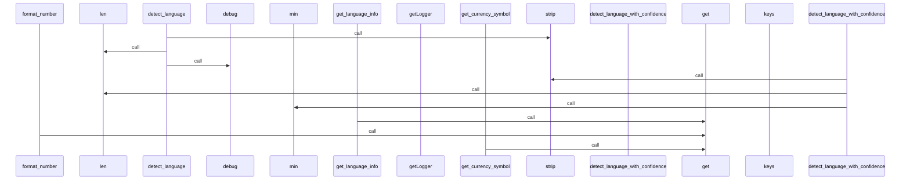
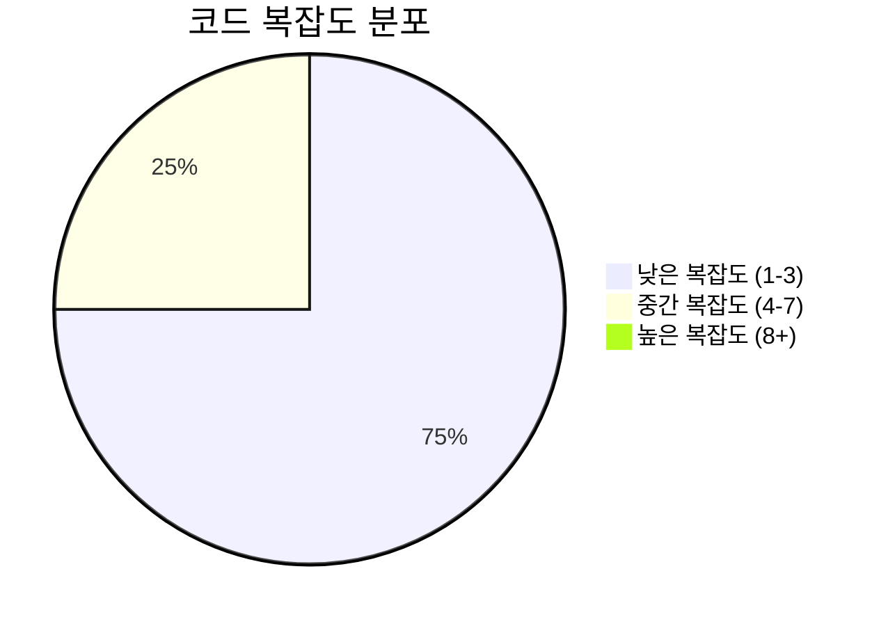

# 📄 language.py

> **파일 경로**: `rule_analyzer/shared/utils/language.py`  
> **생성일**: 2025-10-13  
> **Chunk 수**: 16개

---

## 📑 목차

### 🏗️ 클래스
- [`Language`](#class-language) - 복잡도: 0
- [`LanguageDetector`](#class-languagedetector) - 복잡도: 0
- [`LanguageSupport`](#class-languagesupport) - 복잡도: 0


## 📋 파일 개요

| | |
|--|--|
| 📦 **의존성**: `re` • `typing` • `enum` • `logging` | ⚡ **총 복잡도**: 28 |
| 📊 **총 토큰 수**: 2,624 |  |


## 🏗️ 클래스

### <a id="class-language"></a>🎯 `Language`


> 📝 **클래스 설명**  
> 지원 언어

| 속성 | 값 |
|------|----|
| 🧬 상속 | `Enum` |


<details>
<summary>🔍 코드 미리보기</summary>

```python
class Language(Enum):
    """지원 언어"""

    KOREAN = "ko"
    ENGLISH = "en"
    JAPANESE = "ja"
    CHINESE = "zh"
    UNKNOWN = "unknown"


class LanguageDetector:...
```

**Chunk 정보**
- 🆔 **ID**: `fd4ea2d3cc3d`
- 📍 **라인**: 13-23
- 📊 **토큰**: 54
- 🏷️ **태그**: `class, enum`

</details>

---

### <a id="class-languagedetector"></a>🎯 `LanguageDetector`


> 📝 **클래스 설명**  
> 언어 감지기

텍스트의 언어를 자동으로 감지합니다.

#### 📋 메서드 목록

| 메서드 | 타입 | 복잡도 | 설명 |
|--------|------|--------|------|
| `__init__` | magic | 1 | 언어 감지기 초기화 |
| `detect_language` | public | 6 | 텍스트의 언어 감지 |
| `detect_language_with_confidence` | public | 6 | 텍스트의 언어를 신뢰도와 함께 감지 |
| `get_language_statistics` | public | 5 | 텍스트의 언어별 통계 반환 |
| `is_likely_language` | public | 1 | 텍스트가 특정 언어일 가능성이 높은지 확인 |


#### 🔧 메서드 상세

##### `detect_language`
| 속성 | 값 |
|------|----|
| ⚡ 복잡도 | 6 |
| 📊 토큰 수 | 371 |
| 📍 라인 범위 | 64-113 |
- **Signature**: `detect_language(self, text: str) -> Language`- **Parameters**: `self, text: str`- **Returns**: `Language`
- **Calls**: `strip`, `len`, `items`, `max`, `debug`, `findall`---
##### `detect_language_with_confidence`
| 속성 | 값 |
|------|----|
| ⚡ 복잡도 | 6 |
| 📊 토큰 수 | 350 |
| 📍 라인 범위 | 115-160 |
- **Signature**: `detect_language_with_confidence(self, text: str) -> Tuple[Language, float]`- **Parameters**: `self, text: str`- **Returns**: `Tuple[Language, float]`
- **Calls**: `strip`, `len`, `items`, `max`, `min`, `findall`---
##### `get_language_statistics`
| 속성 | 값 |
|------|----|
| ⚡ 복잡도 | 5 |
| 📊 토큰 수 | 250 |
| 📍 라인 범위 | 176-212 |
- **Signature**: `get_language_statistics(self, text: str) -> Dict[Language, float]`- **Parameters**: `self, text: str`- **Returns**: `Dict[Language, float]`
- **Calls**: `strip`, `len`, `items`, `findall`---
##### `__init__`
| 속성 | 값 |
|------|----|
| ⚡ 복잡도 | 1 |
| 📊 토큰 수 | 324 |
| 📍 라인 범위 | 30-62 |
- **Signature**: `__init__(self)`- **Parameters**: `self`- **Returns**: `N/A`
- **Calls**: `getLogger`---
##### `is_likely_language`
| 속성 | 값 |
|------|----|
| ⚡ 복잡도 | 1 |
| 📊 토큰 수 | 96 |
| 📍 라인 범위 | 162-174 |
- **Signature**: `is_likely_language(self, text: str, language: Language) -> bool`- **Parameters**: `self, text: str, language: Language`- **Returns**: `bool`
- **Calls**: `detect_language`---
<details>
<summary>🔍 코드 미리보기</summary>

```python
class LanguageDetector:
    """
    언어 감지기

    텍스트의 언어를 자동으로 감지합니다.
    """

    def __init__(self):...
```

**Chunk 정보**
- 🆔 **ID**: `a2d1bfb2b16f`
- 📍 **라인**: 23-33
- 📊 **토큰**: 41
- 🏷️ **태그**: `class`

</details>

---

### <a id="class-languagesupport"></a>🎯 `LanguageSupport`


> 📝 **클래스 설명**  
> 언어별 지원 기능

다양한 언어에 대한 공통 기능을 제공합니다.

#### 📋 메서드 목록

| 메서드 | 타입 | 복잡도 | 설명 |
|--------|------|--------|------|
| `format_number` | public | 2 | 언어별 숫자 포맷팅 |
| `get_currency_symbol` | public | 1 | 언어별 통화 기호 반환 |
| `get_language_info` | public | 1 | 언어 정보 반환 |
| `get_language_name` | public | 2 | 언어 이름 반환 |
| `get_supported_languages` | public | 1 | 지원하는 언어 목록 반환 |
| `get_text_direction` | public | 1 | 텍스트 방향 반환 |
| `is_rtl_language` | public | 1 | 오른쪽에서 왼쪽으로 쓰는 언어인지 확인 |


#### 🔧 메서드 상세

##### `get_language_name`
| 속성 | 값 |
|------|----|
| 🎨 데코레이터 | `classmethod` |
| ⚡ 복잡도 | 2 |
| 📊 토큰 수 | 101 |
| 📍 라인 범위 | 294-310 |
- **Signature**: `get_language_name(cls, language: Language, native: bool) -> str`- **Parameters**: `cls, language: Language, native: bool`- **Returns**: `str`
- **Calls**: `get`---
##### `format_number`
| 속성 | 값 |
|------|----|
| 🎨 데코레이터 | `classmethod` |
| ⚡ 복잡도 | 2 |
| 📊 토큰 수 | 133 |
| 📍 라인 범위 | 313-330 |
- **Signature**: `format_number(cls, number: float, language: Language) -> str`- **Parameters**: `cls, number: float, language: Language`- **Returns**: `str`
- **Calls**: `get`---
##### `get_language_info`
| 속성 | 값 |
|------|----|
| 🎨 데코레이터 | `classmethod` |
| ⚡ 복잡도 | 1 |
| 📊 토큰 수 | 65 |
| 📍 라인 범위 | 271-281 |
- **Signature**: `get_language_info(cls, language: Language) -> Dict[str, str]`- **Parameters**: `cls, language: Language`- **Returns**: `Dict[str, str]`
- **Calls**: `get`---
##### `get_supported_languages`
| 속성 | 값 |
|------|----|
| 🎨 데코레이터 | `classmethod` |
| ⚡ 복잡도 | 1 |
| 📊 토큰 수 | 49 |
| 📍 라인 범위 | 284-291 |
- **Signature**: `get_supported_languages(cls) -> List[Language]`- **Parameters**: `cls`- **Returns**: `List[Language]`
- **Calls**: `list`, `keys`---
##### `get_currency_symbol`
| 속성 | 값 |
|------|----|
| 🎨 데코레이터 | `classmethod` |
| ⚡ 복잡도 | 1 |
| 📊 토큰 수 | 73 |
| 📍 라인 범위 | 333-344 |
- **Signature**: `get_currency_symbol(cls, language: Language) -> str`- **Parameters**: `cls, language: Language`- **Returns**: `str`
- **Calls**: `get`---
##### `is_rtl_language`
| 속성 | 값 |
|------|----|
| 🎨 데코레이터 | `classmethod` |
| ⚡ 복잡도 | 1 |
| 📊 토큰 수 | 87 |
| 📍 라인 범위 | 347-358 |
- **Signature**: `is_rtl_language(cls, language: Language) -> bool`- **Parameters**: `cls, language: Language`- **Returns**: `bool`
- **Calls**: `get`---
##### `get_text_direction`
| 속성 | 값 |
|------|----|
| 🎨 데코레이터 | `classmethod` |
| ⚡ 복잡도 | 1 |
| 📊 토큰 수 | 81 |
| 📍 라인 범위 | 361-372 |
- **Signature**: `get_text_direction(cls, language: Language) -> str`- **Parameters**: `cls, language: Language`- **Returns**: `str`
- **Calls**: `get`---
<details>
<summary>🔍 코드 미리보기</summary>

```python
class LanguageSupport:
    """
    언어별 지원 기능

    다양한 언어에 대한 공통 기능을 제공합니다.
    """

    # 언어별 기본 설정
    LANGUAGE_DEFAULTS = {
        Language.KOREAN: {
            "name": "한국어",
            "native_name": "한국어",
            "direction": "ltr",  # left-to-right
            "date_format": "%Y년 %m월 %d일",
            "time_format": "%H시 %M분",
            "number_format": "comma",  # 천 단위 쉼표
            "currency_symbol": "₩",
            "decimal_separator": ".",
            "thousands_separator": ",",
        },
        Language.ENGLISH: {
            "name": "English",
            "native_name": "English",
            "direction": "ltr",
            "date_format": "%B %d, %Y",
            "time_format": "%I:%M %p",
            "number_format": "comma",
            "currency_symbol": "$",
 ...
```

**Chunk 정보**
- 🆔 **ID**: `88bbec1d9168`
- 📍 **라인**: 215-225
- 📊 **토큰**: 461
- 🏷️ **태그**: `class`

</details>

---


## 📊 시각화 및 분석

### ⚡ 복잡도 분석



### 🔧 함수 유형 분석



### 🔗 호출 순서 (Sequence)




## 📈 퍼포먼스 메트릭스

### 📊 핵심 지표

| 🎯 메트릭 | 📊 값 | 🚦 상태 |
|-----------|-------|--------|
| **총 라인 수** | 302 | 🟡 보통 |
| **평균 복잡도** | 2.3 | 🟢 양호 |
| **최대 복잡도** | 6 | 🟢 양호 |
| **함수 밀도** | 75.0% | 🔴 주의 |


### 🎯 품질 점수




## 🧩 Chunk 요약

이 파일은 총 **16개의 chunk**로 구성되어 있으며, **2,624개의 토큰**을 포함합니다.

| 🧩 Chunk 타입 | 📊 개수 | ⚡ 평균 복잡도 | 📝 총 토큰 | 📈 비율 |
|---------------|--------|-------------|----------|--------|
| 📋 파일 개요 | 1 | 0.0 | 88 | 3.4% |
| 🏗️ 클래스 | 3 | 0.0 | 556 | 21.2% |
| 🔧 메서드 | 12 | 2.3 | 1,980 | 75.5% |

