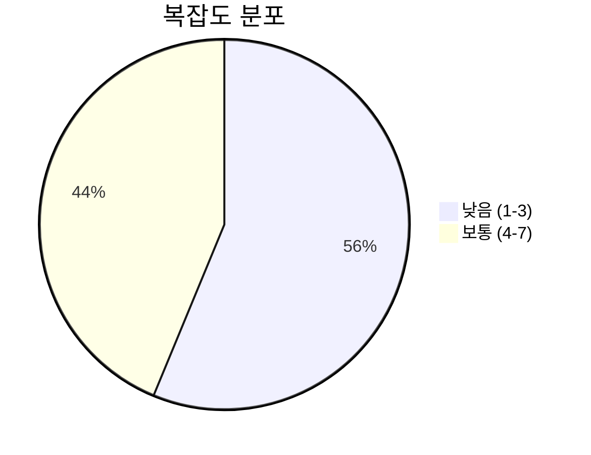
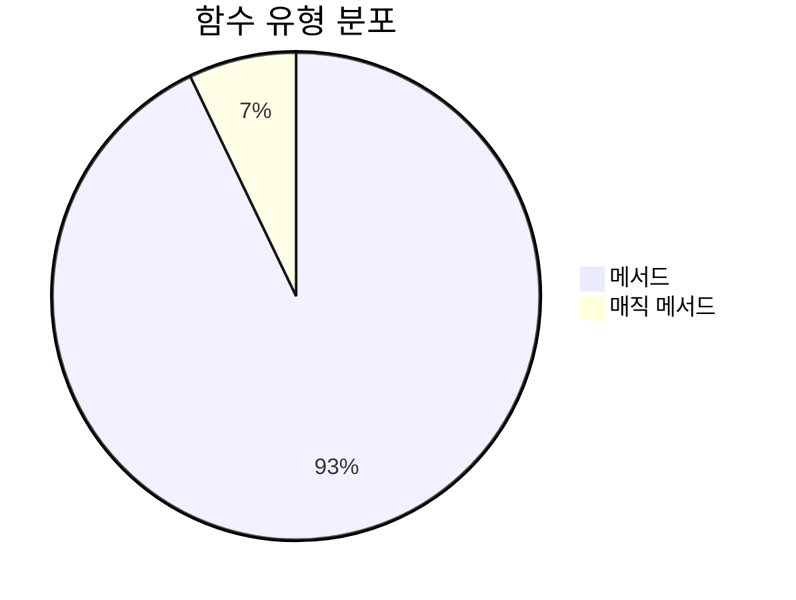
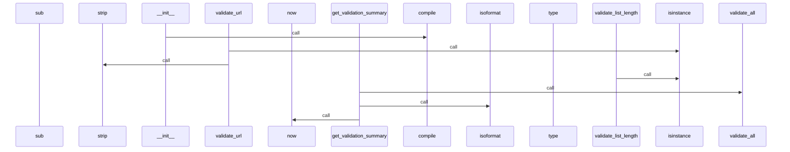
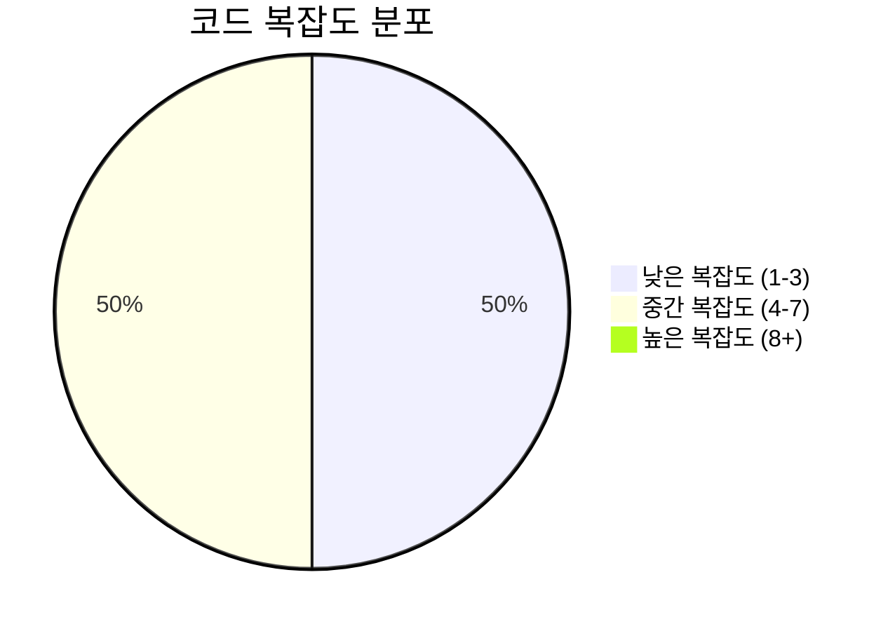

# 📄 validation.py

> **파일 경로**: `rule_analyzer/shared/utils/validation.py`  
> **생성일**: 2025-09-26  
> **Chunk 수**: 16개

---

## 📑 목차

### 🏗️ 클래스
- [`ValidationHelper`](#class-validationhelper) - 복잡도: 0


## 📋 파일 개요

| | |
|--|--|
| 📦 **의존성**: `re` • `typing` • `logging` • `datetime` | ⚡ **총 복잡도**: 46 |
| 📊 **총 토큰 수**: 3,060 |  |


## 🏗️ 클래스

### <a id="class-validationhelper"></a>🎯 `ValidationHelper`


> 📝 **클래스 설명**  
> 데이터 검증 도우미

다양한 데이터 타입의 유효성을 검증합니다.

#### 📋 메서드 목록

| 메서드 | 타입 | 복잡도 | 설명 |
|--------|------|--------|------|
| `__init__` | magic | 1 | 검증 도우미 초기화 |
| `get_validation_summary` | public | 1 | 검증 결과 요약 반환 |
| `validate_all` | public | 3 | 여러 검증 결과를 종합하여 최종 결과 반환 |
| `validate_date_format` | public | 3 | 날짜 형식 검증 |
| `validate_dict_keys` | public | 5 | 딕셔너리 키 검증 |
| `validate_email` | public | 2 | 이메일 주소 유효성 검증 |
| `validate_json_schema` | public | 7 | JSON 스키마 기반 검증 (간단한 구현) |
| `validate_list_length` | public | 4 | 리스트 길이 검증 |
| `validate_number_range` | public | 4 | 숫자 범위 검증 |
| `validate_phone` | public | 2 | 전화번호 유효성 검증 (한국) |
| `validate_regex` | public | 4 | 정규표현식 패턴 검증 |
| `validate_required` | public | 4 | 필수 값 검증 |
| `validate_string_length` | public | 4 | 문자열 길이 검증 |
| `validate_url` | public | 2 | URL 유효성 검증 |


#### 🔧 메서드 상세

##### `validate_json_schema`
| 속성 | 값 |
|------|----|
| ⚡ 복잡도 | 7 |
| 📊 토큰 수 | 390 |
| 📍 라인 범위 | 335-367 |
- **Signature**: `validate_json_schema(self, data: Any, schema: Dict[str, Any]) -> Tuple[bool, List[str]]`- **Parameters**: `self, data: Any, schema: Dict[str, Any]`- **Returns**: `Tuple[bool, List[str]]`
- **Calls**: `append`, `len`, `isinstance`, `type`---
##### `validate_dict_keys`
| 속성 | 값 |
|------|----|
| ⚡ 복잡도 | 5 |
| 📊 토큰 수 | 343 |
| 📍 라인 범위 | 220-262 |
- **Signature**: `validate_dict_keys(self, value: Dict, required_keys: List[str], optional_keys: Optional[List[str]], field_name: str) -> Tuple[bool, Optional[str]]`- **Parameters**: `self, value: Dict, required_keys: List[str], optional_keys: Optional[List[str]], field_name: str`- **Returns**: `Tuple[bool, Optional[str]]`
- **Calls**: `set`, `isinstance`, `update`, `keys`, `join`---
##### `validate_required`
| 속성 | 값 |
|------|----|
| ⚡ 복잡도 | 4 |
| 📊 토큰 수 | 192 |
| 📍 라인 범위 | 84-106 |
- **Signature**: `validate_required(self, value: Any, field_name: str) -> Tuple[bool, Optional[str]]`- **Parameters**: `self, value: Any, field_name: str`- **Returns**: `Tuple[bool, Optional[str]]`
- **Calls**: `isinstance`, `strip`, `len`---
##### `validate_string_length`
| 속성 | 값 |
|------|----|
| ⚡ 복잡도 | 4 |
| 📊 토큰 수 | 270 |
| 📍 라인 범위 | 108-144 |
- **Signature**: `validate_string_length(self, value: str, min_length: int, max_length: Optional[int], field_name: str) -> Tuple[bool, Optional[str]]`- **Parameters**: `self, value: str, min_length: int, max_length: Optional[int], field_name: str`- **Returns**: `Tuple[bool, Optional[str]]`
- **Calls**: `len`, `isinstance`---
##### `validate_number_range`
| 속성 | 값 |
|------|----|
| ⚡ 복잡도 | 4 |
| 📊 토큰 수 | 272 |
| 📍 라인 범위 | 146-180 |
- **Signature**: `validate_number_range(self, value: Union[int, float], min_value: Optional[Union[int, float]], max_value: Optional[Union[int, float]], field_name: str) -> Tuple[bool, Optional[str]]`- **Parameters**: `self, value: Union[int, float], min_value: Optional[Union[int, float]], max_value: Optional[Union[int, float]], field_name: str`- **Returns**: `Tuple[bool, Optional[str]]`
- **Calls**: `isinstance`---
##### `validate_list_length`
| 속성 | 값 |
|------|----|
| ⚡ 복잡도 | 4 |
| 📊 토큰 수 | 277 |
| 📍 라인 범위 | 182-218 |
- **Signature**: `validate_list_length(self, value: List, min_length: int, max_length: Optional[int], field_name: str) -> Tuple[bool, Optional[str]]`- **Parameters**: `self, value: List, min_length: int, max_length: Optional[int], field_name: str`- **Returns**: `Tuple[bool, Optional[str]]`
- **Calls**: `len`, `isinstance`---
##### `validate_regex`
| 속성 | 값 |
|------|----|
| ⚡ 복잡도 | 4 |
| 📊 토큰 수 | 218 |
| 📍 라인 범위 | 290-313 |
- **Signature**: `validate_regex(self, value: str, pattern: str, field_name: str) -> Tuple[bool, Optional[str]]`- **Parameters**: `self, value: str, pattern: str, field_name: str`- **Returns**: `Tuple[bool, Optional[str]]`
- **Calls**: `isinstance`, `match`, `str`---
##### `validate_date_format`
| 속성 | 값 |
|------|----|
| ⚡ 복잡도 | 3 |
| 📊 토큰 수 | 206 |
| 📍 라인 범위 | 264-288 |
- **Signature**: `validate_date_format(self, value: str, format_string: str, field_name: str) -> Tuple[bool, Optional[str]]`- **Parameters**: `self, value: str, format_string: str, field_name: str`- **Returns**: `Tuple[bool, Optional[str]]`
- **Calls**: `isinstance`, `strptime`---
##### `validate_all`
| 속성 | 값 |
|------|----|
| ⚡ 복잡도 | 3 |
| 📊 토큰 수 | 140 |
| 📍 라인 범위 | 315-333 |
- **Signature**: `validate_all(self, validations: List[Tuple[bool, Optional[str]]]) -> Tuple[bool, List[str]]`- **Parameters**: `self, validations: List[Tuple[bool, Optional[str]]]`- **Returns**: `Tuple[bool, List[str]]`
- **Calls**: `append`, `len`---
##### `validate_email`
| 속성 | 값 |
|------|----|
| ⚡ 복잡도 | 2 |
| 📊 토큰 수 | 85 |
| 📍 라인 범위 | 37-50 |
- **Signature**: `validate_email(self, email: str) -> bool`- **Parameters**: `self, email: str`- **Returns**: `bool`
- **Calls**: `bool`, `match`, `isinstance`, `strip`---
##### `validate_url`
| 속성 | 값 |
|------|----|
| ⚡ 복잡도 | 2 |
| 📊 토큰 수 | 77 |
| 📍 라인 범위 | 52-65 |
- **Signature**: `validate_url(self, url: str) -> bool`- **Parameters**: `self, url: str`- **Returns**: `bool`
- **Calls**: `bool`, `match`, `isinstance`, `strip`---
##### `validate_phone`
| 속성 | 값 |
|------|----|
| ⚡ 복잡도 | 2 |
| 📊 토큰 수 | 116 |
| 📍 라인 범위 | 67-82 |
- **Signature**: `validate_phone(self, phone: str) -> bool`- **Parameters**: `self, phone: str`- **Returns**: `bool`
- **Calls**: `sub`, `bool`, `match`, `isinstance`---
##### `__init__`
| 속성 | 값 |
|------|----|
| ⚡ 복잡도 | 1 |
| 📊 토큰 수 | 191 |
| 📍 라인 범위 | 20-35 |
- **Signature**: `__init__(self)`- **Parameters**: `self`- **Returns**: `N/A`
- **Calls**: `getLogger`, `compile`---
##### `get_validation_summary`
| 속성 | 값 |
|------|----|
| ⚡ 복잡도 | 1 |
| 📊 토큰 수 | 163 |
| 📍 라인 범위 | 369-392 |
- **Signature**: `get_validation_summary(self, field_name: str, value: Any, validations: List[Tuple[bool, Optional[str]]]) -> Dict[str, Any]`- **Parameters**: `self, field_name: str, value: Any, validations: List[Tuple[bool, Optional[str]]]`- **Returns**: `Dict[str, Any]`
- **Calls**: `validate_all`, `len`, `isoformat`, `now`---
<details>
<summary>🔍 코드 미리보기</summary>

```python
class ValidationHelper:
    """
    데이터 검증 도우미

    다양한 데이터 타입의 유효성을 검증합니다.
    """

    def __init__(self):...
```

**Chunk 정보**
- 🆔 **ID**: `a523357cbd33`
- 📍 **라인**: 13-23
- 📊 **토큰**: 46
- 🏷️ **태그**: `class`

</details>

---


## 📊 시각화 및 분석

### ⚡ 복잡도 분석



### 🔧 함수 유형 분석



### 🔗 호출 순서 (Sequence)




## 📈 퍼포먼스 메트릭스

### 📊 핵심 지표

| 🎯 메트릭 | 📊 값 | 🚦 상태 |
|-----------|-------|--------|
| **총 라인 수** | 371 | 🟡 보통 |
| **평균 복잡도** | 3.3 | 🟡 보통 |
| **최대 복잡도** | 7 | 🟢 양호 |
| **함수 밀도** | 87.5% | 🔴 주의 |


### 🎯 품질 점수




## 🧩 Chunk 요약

이 파일은 총 **16개의 chunk**로 구성되어 있으며, **3,060개의 토큰**을 포함합니다.

| 🧩 Chunk 타입 | 📊 개수 | ⚡ 평균 복잡도 | 📝 총 토큰 | 📈 비율 |
|---------------|--------|-------------|----------|--------|
| 📋 파일 개요 | 1 | 0.0 | 74 | 2.4% |
| 🏗️ 클래스 | 1 | 0.0 | 46 | 1.5% |
| 🔧 메서드 | 14 | 3.3 | 2,940 | 96.1% |

