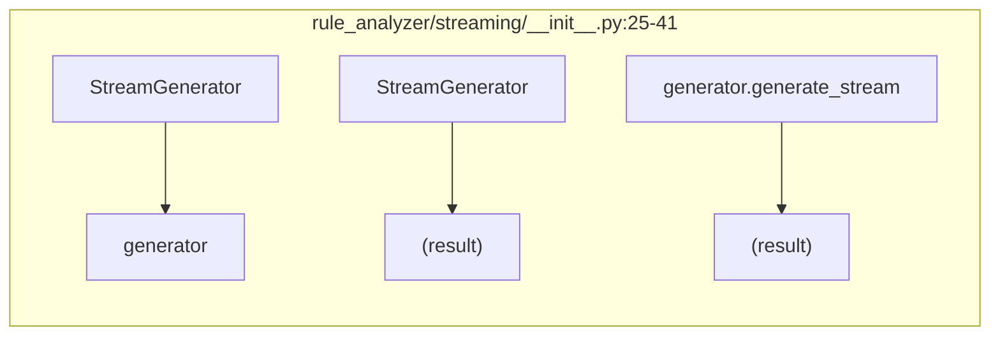
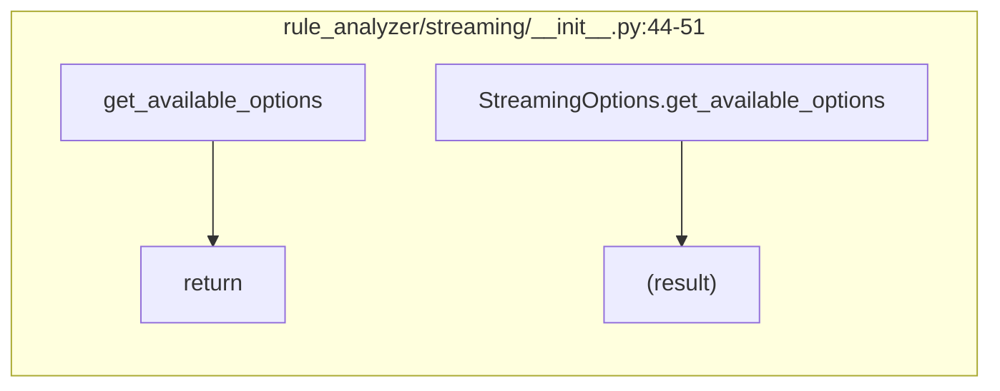
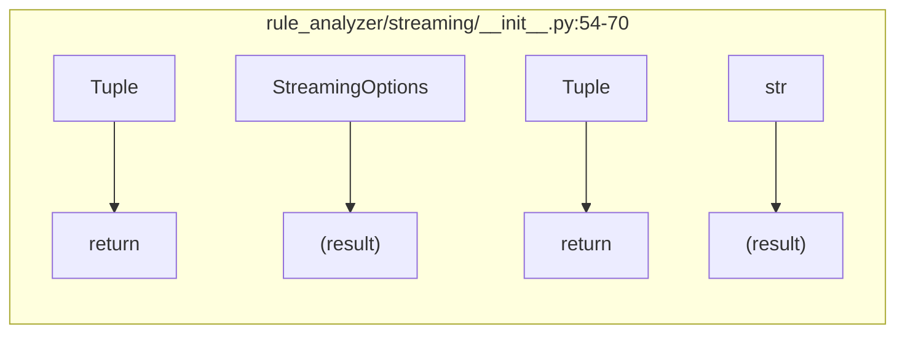
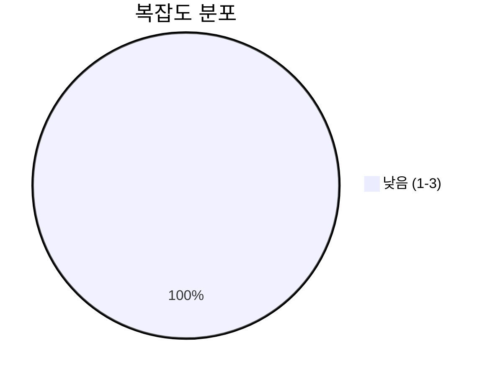
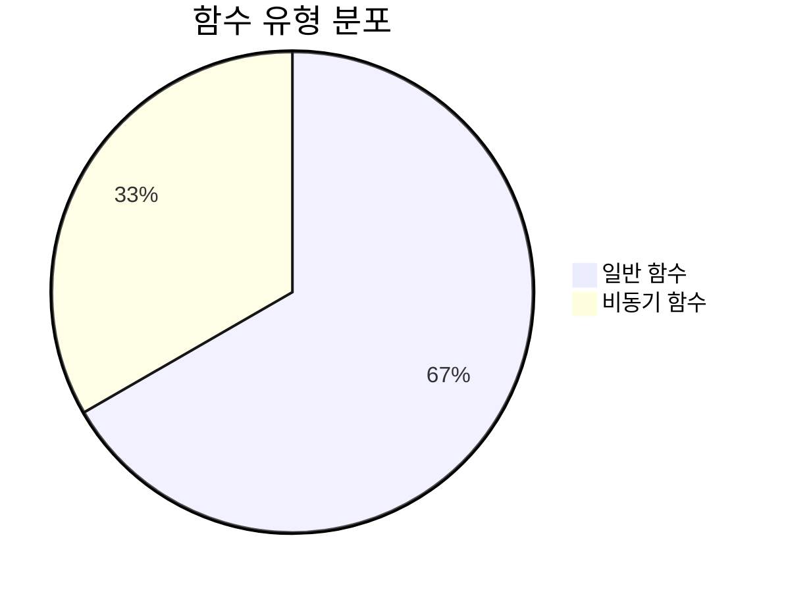
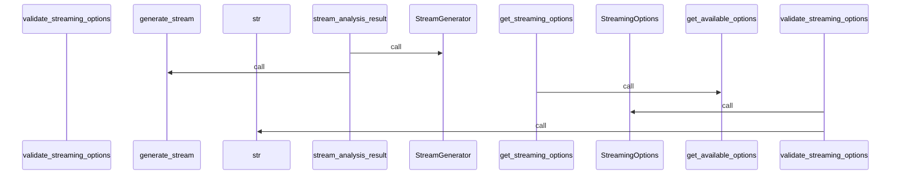
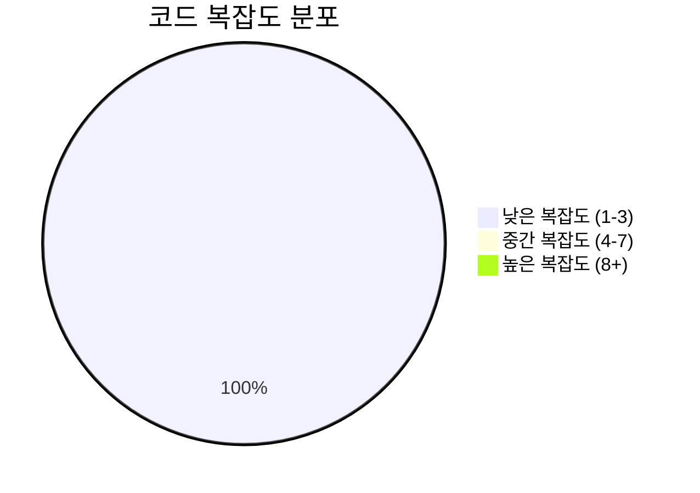

# 📄 __init__.py

> **파일 경로**: `rule_analyzer/streaming/__init__.py`  
> **생성일**: 2025-10-01  
> **Chunk 수**: 4개

---

## 📑 목차

### ⚙️ 함수
- [`stream_analysis_result`](#function-stream_analysis_result) 🔄 - 복잡도: 2
- [`get_streaming_options`](#function-get_streaming_options) - 복잡도: 1
- [`validate_streaming_options`](#function-validate_streaming_options) - 복잡도: 2


## 📋 파일 개요

| | |
|--|--|
| 📦 **의존성**: `stream_models` • `stream_manager` • `stream_generator` | ⚡ **총 복잡도**: 5 |
| 📊 **총 토큰 수**: 443 | 🔄 **비동기 함수**: 1개 |


## ⚙️ 함수

### <a id="function-stream_analysis_result"></a>🔧 `stream_analysis_result`

  

> 📖 **함수 설명**  
> 분석 결과를 스트리밍으로 전송

Args:
    validation_result: ValidationResult 객체
    options: 스트리밍 옵션
    chunk_delay: 청크 간 딜레이 (초)

Yields:
    StreamingChunk 객체들

| 속성 | 값 |
|------|----|
| ⚡ 복잡도 | 2 |
| 📊 토큰 수 | 122 |
| 📍 라인 범위 | 25-41 |


#### 🧩 시그니처 상세

- **Signature**: `stream_analysis_result(validation_result, options, chunk_delay: float)`- **Parameters**: `validation_result, options, chunk_delay: float`


#### 📞 Calls

`StreamGenerator`, `generate_stream`

#### 🧭 DATA FLOW



<details>
<summary>💻 코드 미리보기</summary>

```python
async def stream_analysis_result(
    validation_result, options=None, chunk_delay: float = 0.1
):
    """
    분석 결과를 스트리밍으로 전송

    Args:
        validation_result: ValidationResult 객체
        options: 스트리밍 옵션
        chunk_delay: 청크 간 딜레이 (초)

    Yields:
        StreamingChunk 객체들
    """
    generator = StreamGenerator(options or {})
    async for chunk in generator.generate_stream(validation_result, chunk_delay):
        yield chunk...
```

**Chunk 메타데이터**
- 🆔 **ID**: `d82f2f926339`
- 🏷️ **태그**: `async, generator`

</details>

---

### <a id="function-get_streaming_options"></a>🔧 `get_streaming_options`


> 📖 **함수 설명**  
> 사용 가능한 스트리밍 옵션 반환

Returns:
    스트리밍 옵션 정보 딕셔너리

| 속성 | 값 |
|------|----|
| ⚡ 복잡도 | 1 |
| 📊 토큰 수 | 58 |
| 📍 라인 범위 | 44-51 |


#### 🧩 시그니처 상세

- **Signature**: `get_streaming_options() -> dict`- **Returns**: `dict`


#### 📞 Calls

`get_available_options`

#### 🧭 DATA FLOW



<details>
<summary>💻 코드 미리보기</summary>

```python
def get_streaming_options() -> dict:
    """
    사용 가능한 스트리밍 옵션 반환

    Returns:
        스트리밍 옵션 정보 딕셔너리
    """
    return StreamingOptions.get_available_options()...
```

**Chunk 메타데이터**
- 🆔 **ID**: `7f0f648469ba`
- 🏷️ **태그**: `getter`

</details>

---

### <a id="function-validate_streaming_options"></a>🔧 `validate_streaming_options`


> 📖 **함수 설명**  
> 스트리밍 옵션 유효성 검증

Args:
    options: 검증할 옵션 딕셔너리

Returns:
    (유효성 여부, 에러 메시지 리스트)

| 속성 | 값 |
|------|----|
| ⚡ 복잡도 | 2 |
| 📊 토큰 수 | 118 |
| 📍 라인 범위 | 54-70 |


#### 🧩 시그니처 상세

- **Signature**: `validate_streaming_options(options: dict) -> tuple[bool, list[str]]`- **Parameters**: `options: dict`
- **Returns**: `tuple[bool, list[str]]`


#### 📞 Calls

`StreamingOptions`, `str`

#### 🧭 DATA FLOW



<details>
<summary>💻 코드 미리보기</summary>

```python
def validate_streaming_options(options: dict) -> tuple[bool, list[str]]:
    """
    스트리밍 옵션 유효성 검증

    Args:
        options: 검증할 옵션 딕셔너리

    Returns:
        (유효성 여부, 에러 메시지 리스트)
    """
    from .stream_models import StreamingOptions

    try:
        StreamingOptions(**options)
        return True, []
    except Exception as e:
        return False, [str(e)]...
```

**Chunk 메타데이터**
- 🆔 **ID**: `ec54bf5d3194`
- 🏷️ **태그**: `validation`

</details>

---


## 📊 시각화 및 분석

### ⚡ 복잡도 분석



### 🔧 함수 유형 분석



### 🔗 호출 순서 (Sequence)




## 📈 퍼포먼스 메트릭스

### 📊 핵심 지표

| 🎯 메트릭 | 📊 값 | 🚦 상태 |
|-----------|-------|--------|
| **총 라인 수** | 42 | 🟢 양호 |
| **평균 복잡도** | 1.7 | 🟢 양호 |
| **최대 복잡도** | 2 | 🟢 양호 |
| **함수 밀도** | 75.0% | 🔴 주의 |


### 🎯 품질 점수




## 🧩 Chunk 요약

이 파일은 총 **4개의 chunk**로 구성되어 있으며, **443개의 토큰**을 포함합니다.

| 🧩 Chunk 타입 | 📊 개수 | ⚡ 평균 복잡도 | 📝 총 토큰 | 📈 비율 |
|---------------|--------|-------------|----------|--------|
| 📋 파일 개요 | 1 | 0.0 | 145 | 32.7% |
| 🔄 비동기 함수 | 1 | 2.0 | 122 | 27.5% |
| ⚙️ 함수 | 2 | 1.5 | 176 | 39.7% |

