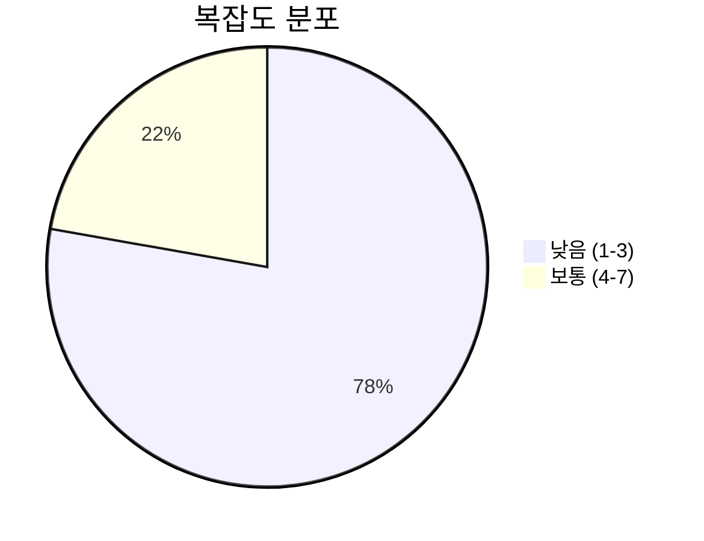
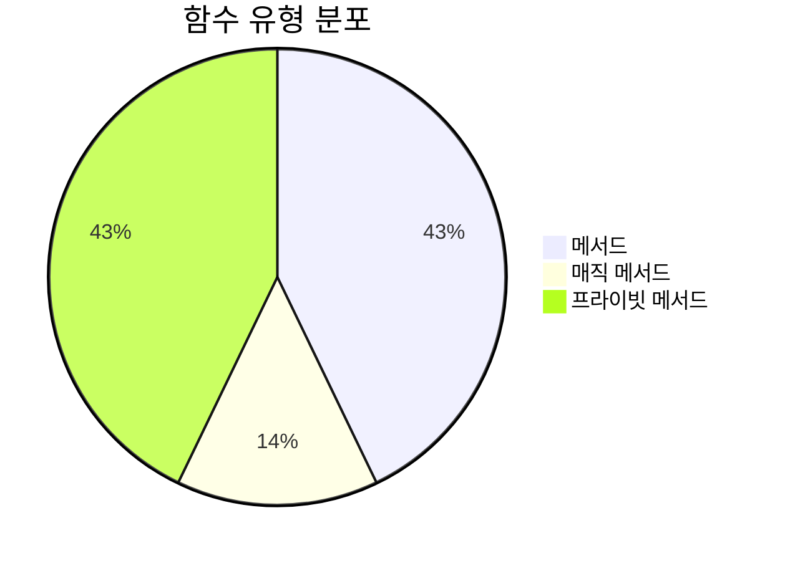
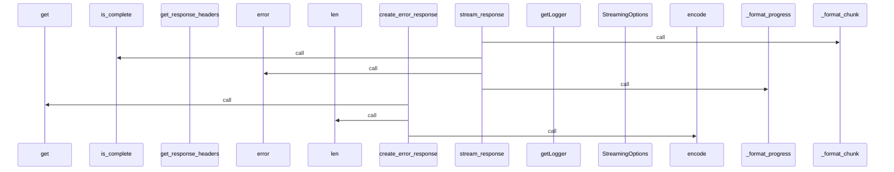
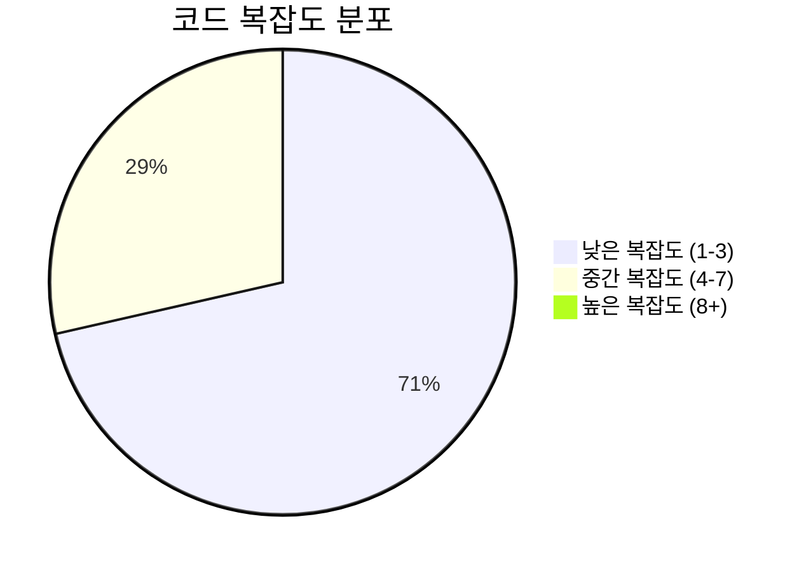

# 📄 http_streaming.py

> **파일 경로**: `rule_analyzer/streaming/protocols/http_streaming.py`  
> **생성일**: 2025-10-01  
> **Chunk 수**: 9개

---

## 📑 목차

### 🏗️ 클래스
- [`HTTPStreamingProtocol`](#class-httpstreamingprotocol) - 복잡도: 0


## 📋 파일 개요

| | |
|--|--|
| 📦 **의존성**: `logging` • `stream_models` • `typing` | ⚡ **총 복잡도**: 15 |
| 📊 **총 토큰 수**: 1,236 | 🔄 **비동기 함수**: 1개 |


## 🏗️ 클래스

### <a id="class-httpstreamingprotocol"></a>🎯 `HTTPStreamingProtocol`


> 📝 **클래스 설명**  
> HTTP Streaming 프로토콜 구현

HTTP 응답 스트리밍을 통해 분석 결과를 전송합니다.

#### 📋 메서드 목록

| 메서드 | 타입 | 복잡도 | 설명 |
|--------|------|--------|------|
| `__init__` | magic | 1 | HTTP Streaming 프로토콜 초기화 |
| `_format_chunk` | private | 5 | 청크를 HTTP 응답 형식으로 포맷팅 |
| `_format_error` | private | 1 | 에러 메시지 포맷팅 |
| `_format_progress` | private | 1 | 진행률 정보 포맷팅 |
| `create_error_response` | public | 1 | 에러 응답 생성 |
| `get_response_headers` | public | 1 | HTTP 응답 헤더 반환 |
| `stream_response` | async generator public | 5 | HTTP 응답 스트리밍 |


#### 🔧 메서드 상세

##### `stream_response`
| 속성 | 값 |
|------|----|
| ⚡ 복잡도 | 5 |
| 📊 토큰 수 | 409 |
| 📍 라인 범위 | 31-79 |
- **Signature**: `stream_response(self, chunks: AsyncGenerator[StreamingChunk, None]) -> AsyncGenerator[str, None]`- **Parameters**: `self, chunks: AsyncGenerator[StreamingChunk, None]`- **Returns**: `AsyncGenerator[str, None]`
- **Calls**: `_format_chunk`, `is_complete`, `error`, `_format_error`, `_format_progress`, `str`, `len`, `encode`---
##### `_format_chunk`
| 속성 | 값 |
|------|----|
| ⚡ 복잡도 | 5 |
| 📊 토큰 수 | 170 |
| 📍 라인 범위 | 81-104 |
- **Signature**: `_format_chunk(self, chunk: StreamingChunk) -> str`- **Parameters**: `self, chunk: StreamingChunk`- **Returns**: `str`
- **Calls**: `get_progress_percentage`---
##### `__init__`
| 속성 | 값 |
|------|----|
| ⚡ 복잡도 | 1 |
| 📊 토큰 수 | 69 |
| 📍 라인 범위 | 21-29 |
- **Signature**: `__init__(self, options: Optional[StreamingOptions])`- **Parameters**: `self, options: Optional[StreamingOptions]`- **Returns**: `N/A`
- **Calls**: `getLogger`, `StreamingOptions`---
##### `_format_progress`
| 속성 | 값 |
|------|----|
| ⚡ 복잡도 | 1 |
| 📊 토큰 수 | 84 |
| 📍 라인 범위 | 106-117 |
- **Signature**: `_format_progress(self, chunk: StreamingChunk) -> str`- **Parameters**: `self, chunk: StreamingChunk`- **Returns**: `str`
- **Calls**: `get_progress_percentage`---
##### `_format_error`
| 속성 | 값 |
|------|----|
| ⚡ 복잡도 | 1 |
| 📊 토큰 수 | 64 |
| 📍 라인 범위 | 119-129 |
- **Signature**: `_format_error(self, error_message: str) -> str`- **Parameters**: `self, error_message: str`- **Returns**: `str`
---
##### `get_response_headers`
| 속성 | 값 |
|------|----|
| ⚡ 복잡도 | 1 |
| 📊 토큰 수 | 111 |
| 📍 라인 범위 | 131-144 |
- **Signature**: `get_response_headers(self) -> Dict[str, str]`- **Parameters**: `self`- **Returns**: `Dict[str, str]`
---
##### `create_error_response`
| 속성 | 값 |
|------|----|
| ⚡ 복잡도 | 1 |
| 📊 토큰 수 | 189 |
| 📍 라인 범위 | 146-171 |
- **Signature**: `create_error_response(self, status_code: int, error_message: str) -> str`- **Parameters**: `self, status_code: int, error_message: str`- **Returns**: `str`
- **Calls**: `get`, `format`, `len`, `encode`---
<details>
<summary>🔍 코드 미리보기</summary>

```python
class HTTPStreamingProtocol:
    """
    HTTP Streaming 프로토콜 구현

    HTTP 응답 스트리밍을 통해 분석 결과를 전송합니다.
    """

    def __init__(self, options: Optional[StreamingOptions] = None):...
```

**Chunk 정보**
- 🆔 **ID**: `dcbf2c868a4e`
- 📍 **라인**: 14-24
- 📊 **토큰**: 68
- 🏷️ **태그**: `class`

</details>

---


## 📊 시각화 및 분석

### ⚡ 복잡도 분석



### 🔧 함수 유형 분석



### 🔗 호출 순서 (Sequence)




## 📈 퍼포먼스 메트릭스

### 📊 핵심 지표

| 🎯 메트릭 | 📊 값 | 🚦 상태 |
|-----------|-------|--------|
| **총 라인 수** | 156 | 🟡 보통 |
| **평균 복잡도** | 2.1 | 🟢 양호 |
| **최대 복잡도** | 5 | 🟢 양호 |
| **함수 밀도** | 77.8% | 🔴 주의 |


### 🎯 품질 점수




## 🧩 Chunk 요약

이 파일은 총 **9개의 chunk**로 구성되어 있으며, **1,236개의 토큰**을 포함합니다.

| 🧩 Chunk 타입 | 📊 개수 | ⚡ 평균 복잡도 | 📝 총 토큰 | 📈 비율 |
|---------------|--------|-------------|----------|--------|
| 📋 파일 개요 | 1 | 0.0 | 72 | 5.8% |
| 🏗️ 클래스 | 1 | 0.0 | 68 | 5.5% |
| 🔧 메서드 | 7 | 2.1 | 1,096 | 88.7% |

