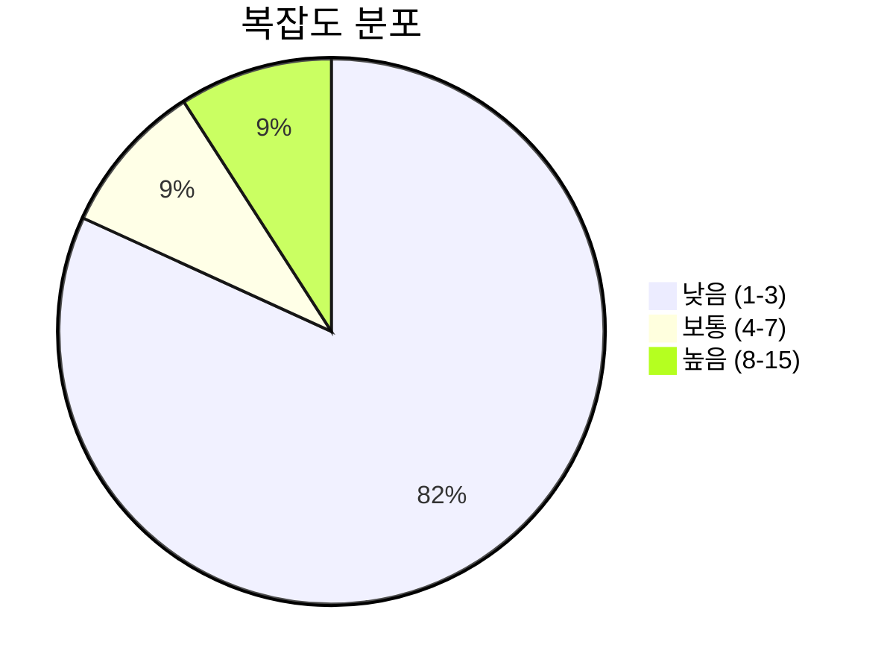
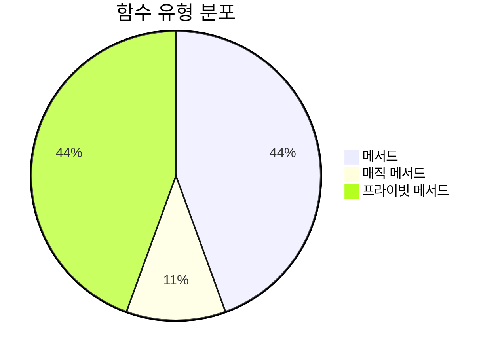
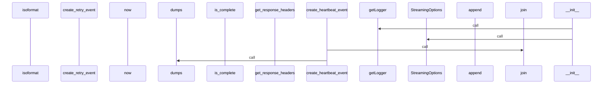
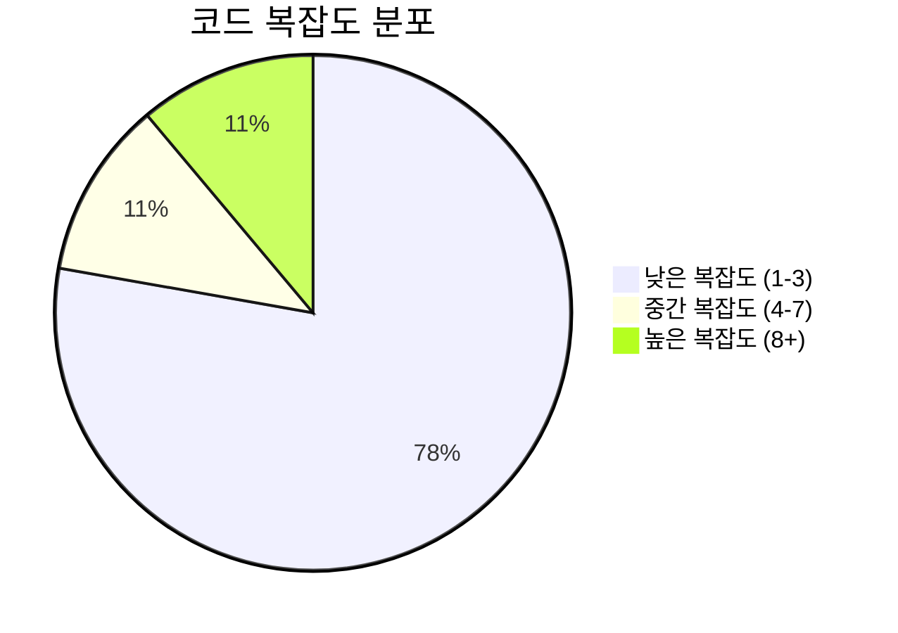

# 📄 sse.py

> **파일 경로**: `rule_analyzer/streaming/protocols/sse.py`  
> **생성일**: 2025-10-01  
> **Chunk 수**: 11개

---

## 📑 목차

### 🏗️ 클래스
- [`SSEProtocol`](#class-sseprotocol) - 복잡도: 0


## 📋 파일 개요

| | |
|--|--|
| 📦 **의존성**: `typing` • `logging` • `json` • `stream_models` • `datetime` | ⚡ **총 복잡도**: 22 |
| 📊 **총 토큰 수**: 1,665 | 🔄 **비동기 함수**: 1개 |


## 🏗️ 클래스

### <a id="class-sseprotocol"></a>🎯 `SSEProtocol`


> 📝 **클래스 설명**  
> Server-Sent Events (SSE) 프로토콜 구현

SSE를 통해 분석 결과를 실시간으로 전송합니다.

#### 📋 메서드 목록

| 메서드 | 타입 | 복잡도 | 설명 |
|--------|------|--------|------|
| `__init__` | magic | 1 | SSE 프로토콜 초기화 |
| `_format_error_event` | private | 1 | 에러 이벤트 포맷팅 |
| `_format_progress_event` | private | 1 | 진행률 이벤트 포맷팅 |
| `_format_sse_event` | private | 7 | 청크를 SSE 이벤트 형식으로 포맷팅 |
| `_get_current_timestamp` | private | 1 | 현재 타임스탬프 반환 |
| `create_heartbeat_event` | public | 1 | 하트비트 이벤트 생성 |
| `create_retry_event` | public | 1 | 재연결 지연 이벤트 생성 |
| `get_response_headers` | public | 1 | SSE 응답 헤더 반환 |
| `stream_events` | async generator public | 8 | SSE 이벤트 스트리밍 |


#### 🔧 메서드 상세

##### `stream_events`
| 속성 | 값 |
|------|----|
| ⚡ 복잡도 | 8 |
| 📊 토큰 수 | 437 |
| 📍 라인 범위 | 31-84 |
- **Signature**: `stream_events(self, chunks: AsyncGenerator[StreamingChunk, None]) -> AsyncGenerator[str, None]`- **Parameters**: `self, chunks: AsyncGenerator[StreamingChunk, None]`- **Returns**: `AsyncGenerator[str, None]`
- **Calls**: `_format_sse_event`, `is_complete`, `error`, `_format_error_event`, `_format_progress_event`, `str`---
##### `_format_sse_event`
| 속성 | 값 |
|------|----|
| ⚡ 복잡도 | 7 |
| 📊 토큰 수 | 346 |
| 📍 라인 범위 | 86-132 |
- **Signature**: `_format_sse_event(self, chunk: StreamingChunk) -> list[str]`- **Parameters**: `self, chunk: StreamingChunk`- **Returns**: `list[str]`
- **Calls**: `append`, `str`, `dumps`---
##### `__init__`
| 속성 | 값 |
|------|----|
| ⚡ 복잡도 | 1 |
| 📊 토큰 수 | 68 |
| 📍 라인 범위 | 21-29 |
- **Signature**: `__init__(self, options: Optional[StreamingOptions])`- **Parameters**: `self, options: Optional[StreamingOptions]`- **Returns**: `N/A`
- **Calls**: `getLogger`, `StreamingOptions`---
##### `_format_progress_event`
| 속성 | 값 |
|------|----|
| ⚡ 복잡도 | 1 |
| 📊 토큰 수 | 172 |
| 📍 라인 범위 | 134-159 |
- **Signature**: `_format_progress_event(self, chunk: StreamingChunk) -> list[str]`- **Parameters**: `self, chunk: StreamingChunk`- **Returns**: `list[str]`
- **Calls**: `append`, `get_progress_percentage`, `dumps`---
##### `_format_error_event`
| 속성 | 값 |
|------|----|
| ⚡ 복잡도 | 1 |
| 📊 토큰 수 | 137 |
| 📍 라인 범위 | 161-183 |
- **Signature**: `_format_error_event(self, error_message: str) -> list[str]`- **Parameters**: `self, error_message: str`- **Returns**: `list[str]`
- **Calls**: `append`, `_get_current_timestamp`, `dumps`---
##### `_get_current_timestamp`
| 속성 | 값 |
|------|----|
| ⚡ 복잡도 | 1 |
| 📊 토큰 수 | 39 |
| 📍 라인 범위 | 185-189 |
- **Signature**: `_get_current_timestamp(self) -> str`- **Parameters**: `self`- **Returns**: `str`
- **Calls**: `isoformat`, `now`---
##### `get_response_headers`
| 속성 | 값 |
|------|----|
| ⚡ 복잡도 | 1 |
| 📊 토큰 수 | 118 |
| 📍 라인 범위 | 191-205 |
- **Signature**: `get_response_headers(self) -> Dict[str, str]`- **Parameters**: `self`- **Returns**: `Dict[str, str]`
---
##### `create_heartbeat_event`
| 속성 | 값 |
|------|----|
| ⚡ 복잡도 | 1 |
| 📊 토큰 수 | 109 |
| 📍 라인 범위 | 207-225 |
- **Signature**: `create_heartbeat_event(self) -> str`- **Parameters**: `self`- **Returns**: `str`
- **Calls**: `join`, `_get_current_timestamp`, `dumps`---
##### `create_retry_event`
| 속성 | 값 |
|------|----|
| ⚡ 복잡도 | 1 |
| 📊 토큰 수 | 93 |
| 📍 라인 범위 | 227-237 |
- **Signature**: `create_retry_event(self, retry_ms: int) -> str`- **Parameters**: `self, retry_ms: int`- **Returns**: `str`
---
<details>
<summary>🔍 코드 미리보기</summary>

```python
class SSEProtocol:
    """
    Server-Sent Events (SSE) 프로토콜 구현

    SSE를 통해 분석 결과를 실시간으로 전송합니다.
    """

    def __init__(self, options: Optional[StreamingOptions] = None):...
```

**Chunk 정보**
- 🆔 **ID**: `ee9626545eef`
- 📍 **라인**: 14-24
- 📊 **토큰**: 68
- 🏷️ **태그**: `class`

</details>

---


## 📊 시각화 및 분석

### ⚡ 복잡도 분석



### 🔧 함수 유형 분석



### 🔗 호출 순서 (Sequence)




## 📈 퍼포먼스 메트릭스

### 📊 핵심 지표

| 🎯 메트릭 | 📊 값 | 🚦 상태 |
|-----------|-------|--------|
| **총 라인 수** | 220 | 🟡 보통 |
| **평균 복잡도** | 2.4 | 🟢 양호 |
| **최대 복잡도** | 8 | 🟢 양호 |
| **함수 밀도** | 81.8% | 🔴 주의 |


### 🎯 품질 점수




## 🧩 Chunk 요약

이 파일은 총 **11개의 chunk**로 구성되어 있으며, **1,665개의 토큰**을 포함합니다.

| 🧩 Chunk 타입 | 📊 개수 | ⚡ 평균 복잡도 | 📝 총 토큰 | 📈 비율 |
|---------------|--------|-------------|----------|--------|
| 📋 파일 개요 | 1 | 0.0 | 78 | 4.7% |
| 🏗️ 클래스 | 1 | 0.0 | 68 | 4.1% |
| 🔧 메서드 | 9 | 2.4 | 1,519 | 91.2% |

