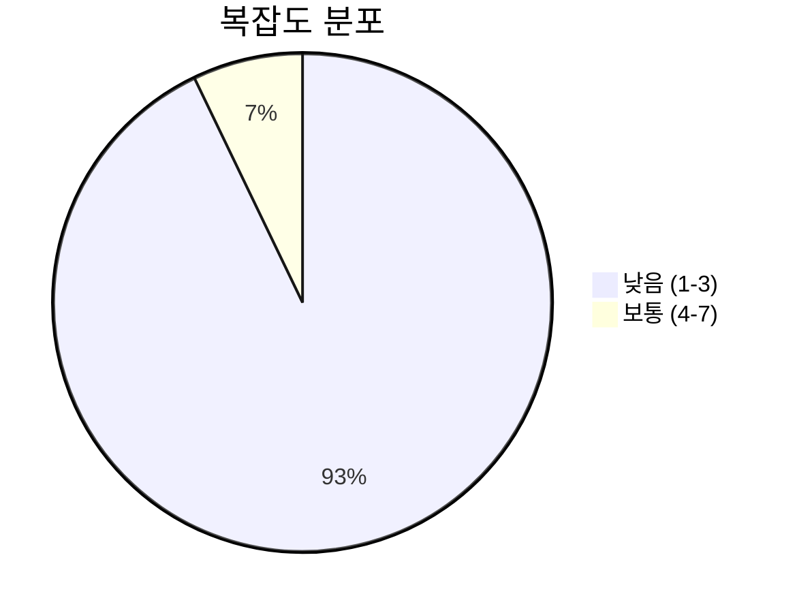
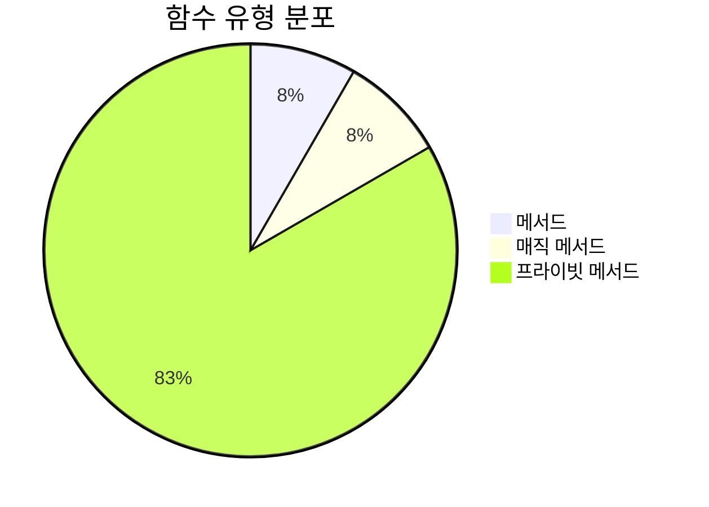
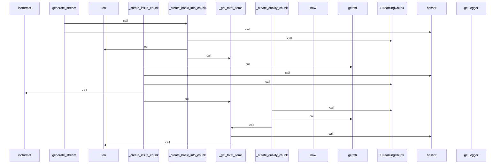
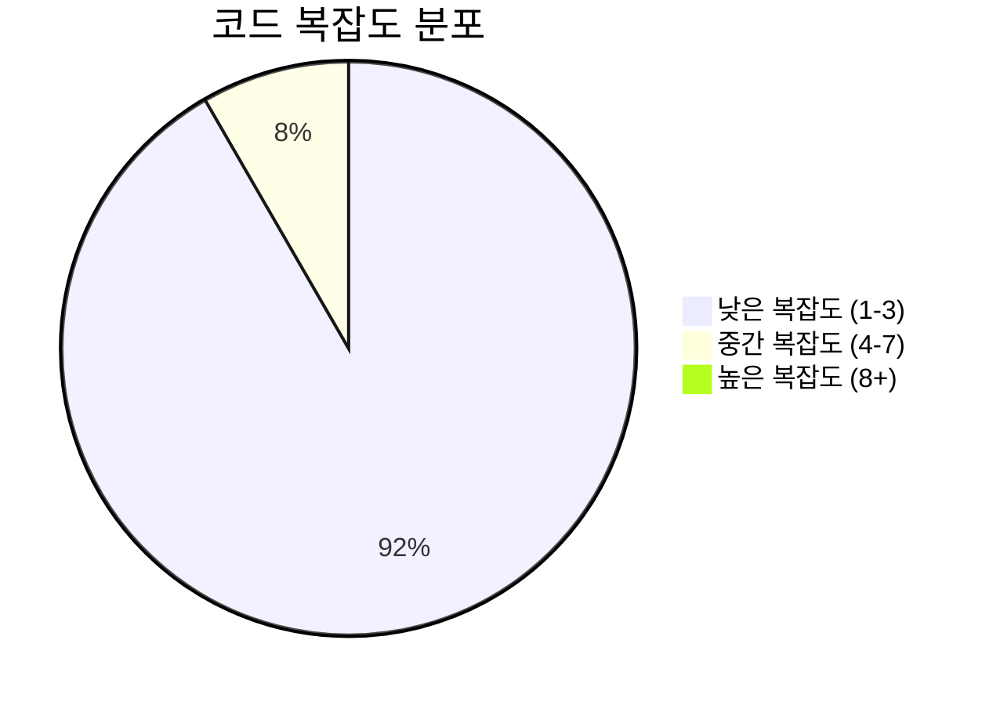

# 📄 stream_generator.py

> **파일 경로**: `rule_analyzer/streaming/stream_generator.py`  
> **생성일**: 2025-10-01  
> **Chunk 수**: 14개

---

## 📑 목차

### 🏗️ 클래스
- [`StreamGenerator`](#class-streamgenerator) - 복잡도: 0


## 📋 파일 개요

| | |
|--|--|
| 📦 **의존성**: `typing` • `utils` • `asyncio` • `logging` • `stream_models` • `datetime` 외 1개 | ⚡ **총 복잡도**: 23 |
| 📊 **총 토큰 수**: 2,805 | 🔄 **비동기 함수**: 1개 |


## 🏗️ 클래스

### <a id="class-streamgenerator"></a>🎯 `StreamGenerator`


> 📝 **클래스 설명**  
> 스트리밍 생성기

ValidationResult를 스트리밍 청크로 변환하여 전송합니다.

#### 📋 메서드 목록

| 메서드 | 타입 | 복잡도 | 설명 |
|--------|------|--------|------|
| `__init__` | magic | 1 | 스트리밍 생성기 초기화 |
| `_create_basic_info_chunk` | private | 1 | 기본 정보 청크 생성 |
| `_create_completion_chunk` | private | 1 | 완료 청크 생성 |
| `_create_error_chunk` | private | 1 | 에러 청크 생성 |
| `_create_header_chunk` | private | 2 | 헤더 청크 생성 |
| `_create_issue_chunk` | private | 2 | 이슈 정보 청크 생성 |
| `_create_performance_chunk` | private | 2 | 성능 메트릭 청크 생성 |
| `_create_quality_chunk` | private | 1 | 품질 메트릭 청크 생성 |
| `_create_structure_chunk` | private | 1 | 구조 정보 청크 생성 |
| `_get_timestamp` | private | 1 | 현재 타임스탬프 반환 |
| `_get_total_items` | private | 3 | 총 아이템 개수 반환 |
| `generate_stream` | async generator public | 7 | 분석 결과를 스트리밍 청크로 생성 |


#### 🔧 메서드 상세

##### `generate_stream`
| 속성 | 값 |
|------|----|
| ⚡ 복잡도 | 7 |
| 📊 토큰 수 | 501 |
| 📍 라인 범위 | 54-120 |
- **Signature**: `generate_stream(self, validation_result, chunk_delay: float) -> AsyncGenerator[StreamingChunk, None]`- **Parameters**: `self, validation_result, chunk_delay: float`- **Returns**: `AsyncGenerator[StreamingChunk, None]`
- **Calls**: `info`, `_create_header_chunk`, `_create_basic_info_chunk`, `hasattr`, `_create_completion_chunk`, `sleep`, `enumerate`, `_create_structure_chunk`, `_create_performance_chunk`, `_create_quality_chunk`, `error`, `_create_error_chunk`, `_create_issue_chunk`, `str`---
##### `_get_total_items`
| 속성 | 값 |
|------|----|
| ⚡ 복잡도 | 3 |
| 📊 토큰 수 | 105 |
| 📍 라인 범위 | 336-346 |
- **Signature**: `_get_total_items(self, validation_result) -> int`- **Parameters**: `self, validation_result`- **Returns**: `int`
- **Calls**: `hasattr`, `len`---
##### `_create_header_chunk`
| 속성 | 값 |
|------|----|
| ⚡ 복잡도 | 2 |
| 📊 토큰 수 | 192 |
| 📍 라인 범위 | 122-143 |
- **Signature**: `_create_header_chunk(self, validation_result) -> StreamingChunk`- **Parameters**: `self, validation_result`- **Returns**: `StreamingChunk`
- **Calls**: `getattr`, `StreamingChunk`, `_get_timestamp`, `_get_total_items`---
##### `_create_issue_chunk`
| 속성 | 값 |
|------|----|
| ⚡ 복잡도 | 2 |
| 📊 토큰 수 | 295 |
| 📍 라인 범위 | 170-196 |
- **Signature**: `_create_issue_chunk(self, issue, index: int) -> StreamingChunk`- **Parameters**: `self, issue, index: int`- **Returns**: `StreamingChunk`
- **Calls**: `getattr`, `hasattr`, `StreamingChunk`, `isoformat`, `_get_total_items`---
##### `_create_performance_chunk`
| 속성 | 값 |
|------|----|
| ⚡ 복잡도 | 2 |
| 📊 토큰 수 | 317 |
| 📍 라인 범위 | 223-256 |
- **Signature**: `_create_performance_chunk(self, performance) -> StreamingChunk`- **Parameters**: `self, performance`- **Returns**: `StreamingChunk`
- **Calls**: `getattr`, `StreamingChunk`, `len`, `_get_timestamp`, `_get_total_items`---
##### `__init__`
| 속성 | 값 |
|------|----|
| ⚡ 복잡도 | 1 |
| 📊 토큰 수 | 75 |
| 📍 라인 범위 | 43-52 |
- **Signature**: `__init__(self, options: Optional[StreamingOptions])`- **Parameters**: `self, options: Optional[StreamingOptions]`- **Returns**: `N/A`
- **Calls**: `getLogger`, `ProgressTracker`, `StreamingOptions`---
##### `_create_basic_info_chunk`
| 속성 | 값 |
|------|----|
| ⚡ 복잡도 | 1 |
| 📊 토큰 수 | 245 |
| 📍 라인 범위 | 145-168 |
- **Signature**: `_create_basic_info_chunk(self, validation_result) -> StreamingChunk`- **Parameters**: `self, validation_result`- **Returns**: `StreamingChunk`
- **Calls**: `StreamingChunk`, `get_total_issues`, `len`, `_get_timestamp`, `_get_total_items`, `get_critical_issues`---
##### `_create_structure_chunk`
| 속성 | 값 |
|------|----|
| ⚡ 복잡도 | 1 |
| 📊 토큰 수 | 270 |
| 📍 라인 범위 | 198-221 |
- **Signature**: `_create_structure_chunk(self, structure) -> StreamingChunk`- **Parameters**: `self, structure`- **Returns**: `StreamingChunk`
- **Calls**: `StreamingChunk`, `getattr`, `_get_timestamp`, `_get_total_items`, `join`, `len`---
##### `_create_quality_chunk`
| 속성 | 값 |
|------|----|
| ⚡ 복잡도 | 1 |
| 📊 토큰 수 | 297 |
| 📍 라인 범위 | 258-282 |
- **Signature**: `_create_quality_chunk(self, quality) -> StreamingChunk`- **Parameters**: `self, quality`- **Returns**: `StreamingChunk`
- **Calls**: `StreamingChunk`, `getattr`, `_get_timestamp`, `_get_total_items`---
##### `_create_completion_chunk`
| 속성 | 값 |
|------|----|
| ⚡ 복잡도 | 1 |
| 📊 토큰 수 | 241 |
| 📍 라인 범위 | 284-317 |
- **Signature**: `_create_completion_chunk(self, validation_result) -> StreamingChunk`- **Parameters**: `self, validation_result`- **Returns**: `StreamingChunk`
- **Calls**: `getattr`, `StreamingChunk`, `_get_total_items`---
##### `_create_error_chunk`
| 속성 | 값 |
|------|----|
| ⚡ 복잡도 | 1 |
| 📊 토큰 수 | 103 |
| 📍 라인 범위 | 319-328 |
- **Signature**: `_create_error_chunk(self, error_message: str) -> StreamingChunk`- **Parameters**: `self, error_message: str`- **Returns**: `StreamingChunk`
- **Calls**: `StreamingChunk`, `_get_timestamp`---
##### `_get_timestamp`
| 속성 | 값 |
|------|----|
| ⚡ 복잡도 | 1 |
| 📊 토큰 수 | 38 |
| 📍 라인 범위 | 330-334 |
- **Signature**: `_get_timestamp(self) -> str`- **Parameters**: `self`- **Returns**: `str`
- **Calls**: `isoformat`, `now`---
<details>
<summary>🔍 코드 미리보기</summary>

```python
class StreamGenerator:
    """
    스트리밍 생성기

    ValidationResult를 스트리밍 청크로 변환하여 전송합니다.
    """

    def __init__(self, options: Optional[StreamingOptions] = None):...
```

**Chunk 정보**
- 🆔 **ID**: `da6e26294383`
- 📍 **라인**: 36-46
- 📊 **토큰**: 56
- 🏷️ **태그**: `class`

</details>

---


## 📊 시각화 및 분석

### ⚡ 복잡도 분석



### 🔧 함수 유형 분석



### 🔗 호출 순서 (Sequence)




## 📈 퍼포먼스 메트릭스

### 📊 핵심 지표

| 🎯 메트릭 | 📊 값 | 🚦 상태 |
|-----------|-------|--------|
| **총 라인 수** | 304 | 🟡 보통 |
| **평균 복잡도** | 1.9 | 🟢 양호 |
| **최대 복잡도** | 7 | 🟢 양호 |
| **함수 밀도** | 85.7% | 🔴 주의 |


### 🎯 품질 점수




## 🧩 Chunk 요약

이 파일은 총 **14개의 chunk**로 구성되어 있으며, **2,805개의 토큰**을 포함합니다.

| 🧩 Chunk 타입 | 📊 개수 | ⚡ 평균 복잡도 | 📝 총 토큰 | 📈 비율 |
|---------------|--------|-------------|----------|--------|
| 📋 파일 개요 | 1 | 0.0 | 70 | 2.5% |
| 🏗️ 클래스 | 1 | 0.0 | 56 | 2.0% |
| 🔧 메서드 | 12 | 1.9 | 2,679 | 95.5% |

