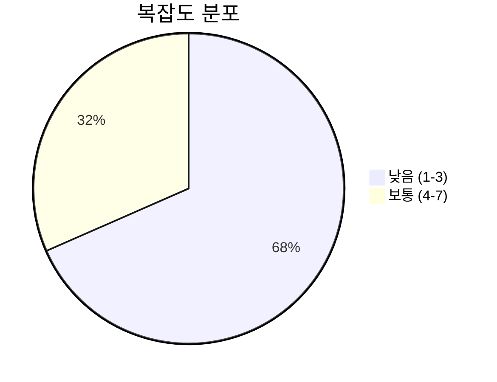
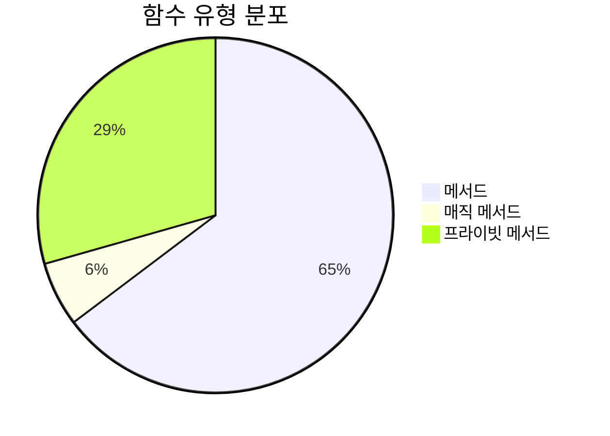
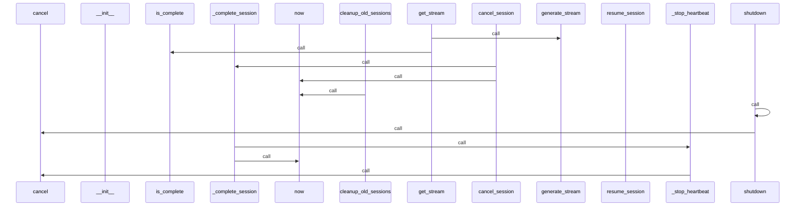
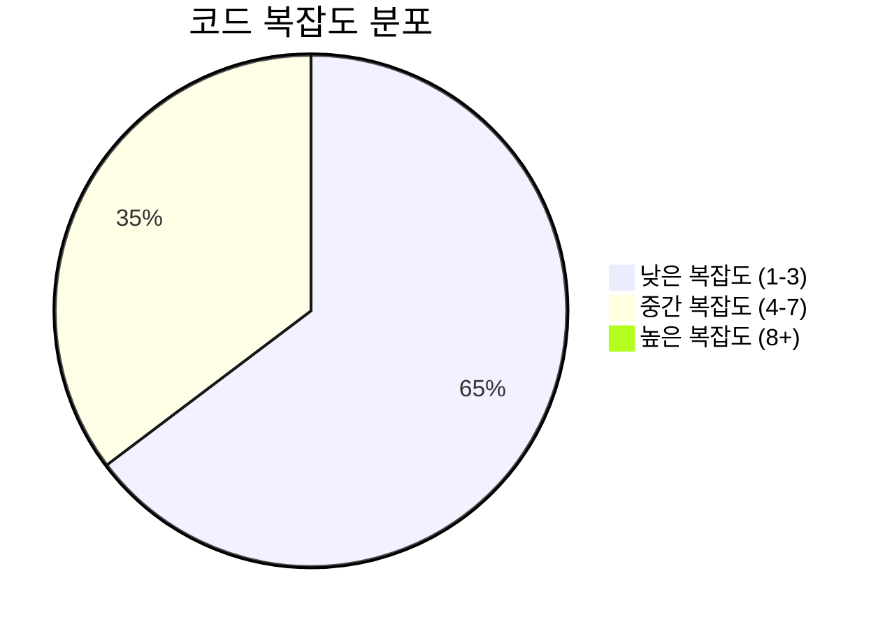

# 📄 stream_manager.py

> **파일 경로**: `rule_analyzer/streaming/stream_manager.py`  
> **생성일**: 2025-09-26  
> **Chunk 수**: 19개

---

## 📑 목차

### 🏗️ 클래스
- [`StreamManager`](#class-streammanager) - 복잡도: 0


## 📋 파일 개요

| | |
|--|--|
| 📦 **의존성**: `concurrent` • `stream_models` • `typing` • `asyncio` • `stream_generator` • `logging` 외 2개 | ⚡ **총 복잡도**: 50 |
| 📊 **총 토큰 수**: 2,851 | 🔄 **비동기 함수**: 12개 |


## 🏗️ 클래스

### <a id="class-streammanager"></a>🎯 `StreamManager`


> 📝 **클래스 설명**  
> 스트리밍 세션 관리자

여러 스트리밍 세션을 동시에 관리하고 모니터링합니다.

#### 📋 메서드 목록

| 메서드 | 타입 | 복잡도 | 설명 |
|--------|------|--------|------|
| `__init__` | magic | 1 | 스트림 관리자 초기화 |
| `_complete_session` | async private | 5 | 세션 완료 처리 |
| `_get_validation_result_for_session` | private | 1 | 세션의 ValidationResult 객체 반환 |
| `_heartbeat_loop` | async private | 5 | 하트비트 루프 |
| `_start_heartbeat` | async private | 2 | 하트비트 태스크 시작 |
| `_stop_heartbeat` | async private | 3 | 하트비트 태스크 중지 |
| `cancel_session` | async public | 2 | 세션 취소 |
| `cleanup_old_sessions` | async public | 6 | 오래된 완료 세션 정리 |
| `get_session_count` | public | 1 | 세션 수 통계 반환 |
| `get_session_status` | async public | 3 | 세션 상태 반환 |
| `get_stream` | async generator public | 5 | 스트리밍 데이터 반환 |
| `list_active_sessions` | public | 1 | 활성 세션 목록 반환 |
| `list_completed_sessions` | public | 1 | 완료된 세션 목록 반환 |
| `pause_session` | async public | 3 | 세션 일시정지 |
| `resume_session` | async public | 3 | 세션 재개 |
| `shutdown` | async public | 4 | 스트림 관리자 종료 |
| `start_streaming` | async public | 4 | 새로운 스트리밍 세션 시작 |


#### 🔧 메서드 상세

##### `cleanup_old_sessions`
| 속성 | 값 |
|------|----|
| ⚡ 복잡도 | 6 |
| 📊 토큰 수 | 200 |
| 📍 라인 범위 | 270-296 |
- **Signature**: `cleanup_old_sessions(self, max_age_hours: int) -> int`- **Parameters**: `self, max_age_hours: int`- **Returns**: `int`
- **Calls**: `items`, `len`, `now`, `timedelta`, `info`, `fromisoformat`, `append`---
##### `get_stream`
| 속성 | 값 |
|------|----|
| ⚡ 복잡도 | 5 |
| 📊 토큰 수 | 303 |
| 📍 라인 범위 | 109-150 |
- **Signature**: `get_stream(self, session_id: str) -> AsyncGenerator[StreamingChunk, None]`- **Parameters**: `self, session_id: str`- **Returns**: `AsyncGenerator[StreamingChunk, None]`
- **Calls**: `ValueError`, `generate_stream`, `update_progress`, `is_complete`, `error`, `mark_error`, `str`, `_complete_session`- **Raises**: `ValueError`---
##### `_complete_session`
| 속성 | 값 |
|------|----|
| ⚡ 복잡도 | 5 |
| 📊 토큰 수 | 287 |
| 📍 라인 범위 | 319-351 |
- **Signature**: `_complete_session(self, session_id: str) -> None`- **Parameters**: `self, session_id: str`- **Returns**: `None`
- **Calls**: `info`, `isoformat`, `len`, `_stop_heartbeat`, `now`---
##### `_heartbeat_loop`
| 속성 | 값 |
|------|----|
| ⚡ 복잡도 | 5 |
| 📊 토큰 수 | 162 |
| 📍 라인 범위 | 370-388 |
- **Signature**: `_heartbeat_loop(self) -> None`- **Parameters**: `self`- **Returns**: `None`
- **Calls**: `len`, `debug`, `sleep`, `error`, `str`---
##### `start_streaming`
| 속성 | 값 |
|------|----|
| ⚡ 복잡도 | 4 |
| 📊 토큰 수 | 376 |
| 📍 라인 범위 | 56-107 |
- **Signature**: `start_streaming(self, validation_result, options: Optional[Dict[str, Any]], session_id: Optional[str]) -> str`- **Parameters**: `self, validation_result, options: Optional[Dict[str, Any]], session_id: Optional[str]`- **Returns**: `str`
- **Calls**: `StreamGenerator`, `StreamingSession`, `info`, `len`, `RuntimeError`, `str`, `uuid4`, `isoformat`, `_start_heartbeat`, `now`- **Raises**: `RuntimeError`---
##### `shutdown`
| 속성 | 값 |
|------|----|
| ⚡ 복잡도 | 4 |
| 📊 토큰 수 | 153 |
| 📍 라인 범위 | 298-317 |
- **Signature**: `shutdown(self) -> None`- **Parameters**: `self`- **Returns**: `None`
- **Calls**: `info`, `list`, `shutdown`, `cancel`, `keys`, `cancel_session`---
##### `pause_session`
| 속성 | 값 |
|------|----|
| ⚡ 복잡도 | 3 |
| 📊 토큰 수 | 123 |
| 📍 라인 범위 | 152-171 |
- **Signature**: `pause_session(self, session_id: str) -> bool`- **Parameters**: `self, session_id: str`- **Returns**: `bool`
- **Calls**: `info`---
##### `resume_session`
| 속성 | 값 |
|------|----|
| ⚡ 복잡도 | 3 |
| 📊 토큰 수 | 120 |
| 📍 라인 범위 | 173-192 |
- **Signature**: `resume_session(self, session_id: str) -> bool`- **Parameters**: `self, session_id: str`- **Returns**: `bool`
- **Calls**: `info`---
##### `get_session_status`
| 속성 | 값 |
|------|----|
| ⚡ 복잡도 | 3 |
| 📊 토큰 수 | 135 |
| 📍 라인 범위 | 216-234 |
- **Signature**: `get_session_status(self, session_id: str) -> Optional[Dict[str, Any]]`- **Parameters**: `self, session_id: str`- **Returns**: `Optional[Dict[str, Any]]`
- **Calls**: `to_summary`---
##### `_stop_heartbeat`
| 속성 | 값 |
|------|----|
| ⚡ 복잡도 | 3 |
| 📊 토큰 수 | 90 |
| 📍 라인 범위 | 359-368 |
- **Signature**: `_stop_heartbeat(self) -> None`- **Parameters**: `self`- **Returns**: `None`
- **Calls**: `cancel`, `debug`, `done`---
##### `cancel_session`
| 속성 | 값 |
|------|----|
| ⚡ 복잡도 | 2 |
| 📊 토큰 수 | 125 |
| 📍 라인 범위 | 194-214 |
- **Signature**: `cancel_session(self, session_id: str) -> bool`- **Parameters**: `self, session_id: str`- **Returns**: `bool`
- **Calls**: `isoformat`, `info`, `_complete_session`, `now`---
##### `_start_heartbeat`
| 속성 | 값 |
|------|----|
| ⚡ 복잡도 | 2 |
| 📊 토큰 수 | 68 |
| 📍 라인 범위 | 353-357 |
- **Signature**: `_start_heartbeat(self) -> None`- **Parameters**: `self`- **Returns**: `None`
- **Calls**: `done`, `create_task`, `debug`, `_heartbeat_loop`---
##### `__init__`
| 속성 | 값 |
|------|----|
| ⚡ 복잡도 | 1 |
| 📊 토큰 수 | 219 |
| 📍 라인 범위 | 29-54 |
- **Signature**: `__init__(self, max_concurrent_sessions: int)`- **Parameters**: `self, max_concurrent_sessions: int`- **Returns**: `N/A`
- **Calls**: `getLogger`, `ThreadPoolExecutor`---
##### `list_active_sessions`
| 속성 | 값 |
|------|----|
| ⚡ 복잡도 | 1 |
| 📊 토큰 수 | 59 |
| 📍 라인 범위 | 236-243 |
- **Signature**: `list_active_sessions(self) -> List[Dict[str, Any]]`- **Parameters**: `self`- **Returns**: `List[Dict[str, Any]]`
- **Calls**: `to_summary`, `values`---
##### `list_completed_sessions`
| 속성 | 값 |
|------|----|
| ⚡ 복잡도 | 1 |
| 📊 토큰 수 | 61 |
| 📍 라인 범위 | 245-252 |
- **Signature**: `list_completed_sessions(self) -> List[Dict[str, Any]]`- **Parameters**: `self`- **Returns**: `List[Dict[str, Any]]`
- **Calls**: `to_summary`, `values`---
##### `get_session_count`
| 속성 | 값 |
|------|----|
| ⚡ 복잡도 | 1 |
| 📊 토큰 수 | 113 |
| 📍 라인 범위 | 254-268 |
- **Signature**: `get_session_count(self) -> Dict[str, int]`- **Parameters**: `self`- **Returns**: `Dict[str, int]`
- **Calls**: `len`---
##### `_get_validation_result_for_session`
| 속성 | 값 |
|------|----|
| ⚡ 복잡도 | 1 |
| 📊 토큰 수 | 97 |
| 📍 라인 범위 | 390-402 |
- **Signature**: `_get_validation_result_for_session(self, session_id: str)`- **Parameters**: `self, session_id: str`- **Returns**: `N/A`
---
<details>
<summary>🔍 코드 미리보기</summary>

```python
class StreamManager:
    """
    스트리밍 세션 관리자

    여러 스트리밍 세션을 동시에 관리하고 모니터링합니다.
    """

    def __init__(self, max_concurrent_sessions: int = 10):...
```

**Chunk 정보**
- 🆔 **ID**: `64d1912a3cb5`
- 📍 **라인**: 22-32
- 📊 **토큰**: 67
- 🏷️ **태그**: `class, manager`

</details>

---


## 📊 시각화 및 분석

### ⚡ 복잡도 분석



### 🔧 함수 유형 분석



### 🔗 호출 순서 (Sequence)




## 📈 퍼포먼스 메트릭스

### 📊 핵심 지표

| 🎯 메트릭 | 📊 값 | 🚦 상태 |
|-----------|-------|--------|
| **총 라인 수** | 369 | 🟡 보통 |
| **평균 복잡도** | 2.9 | 🟢 양호 |
| **최대 복잡도** | 6 | 🟢 양호 |
| **함수 밀도** | 89.5% | 🔴 주의 |


### 🎯 품질 점수




## 🧩 Chunk 요약

이 파일은 총 **19개의 chunk**로 구성되어 있으며, **2,851개의 토큰**을 포함합니다.

| 🧩 Chunk 타입 | 📊 개수 | ⚡ 평균 복잡도 | 📝 총 토큰 | 📈 비율 |
|---------------|--------|-------------|----------|--------|
| 📋 파일 개요 | 1 | 0.0 | 93 | 3.3% |
| 🏗️ 클래스 | 1 | 0.0 | 67 | 2.4% |
| 🔧 메서드 | 17 | 2.9 | 2,691 | 94.4% |

