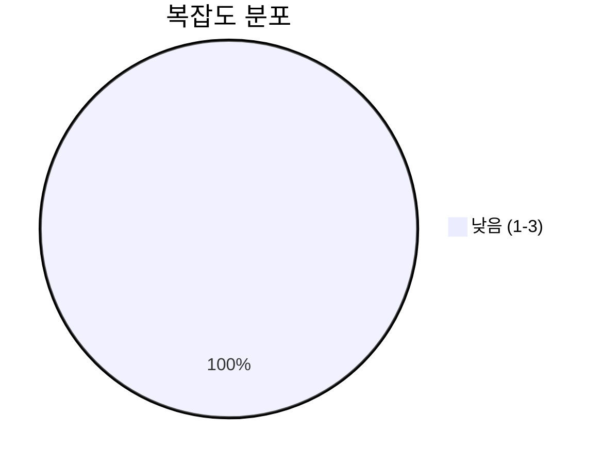
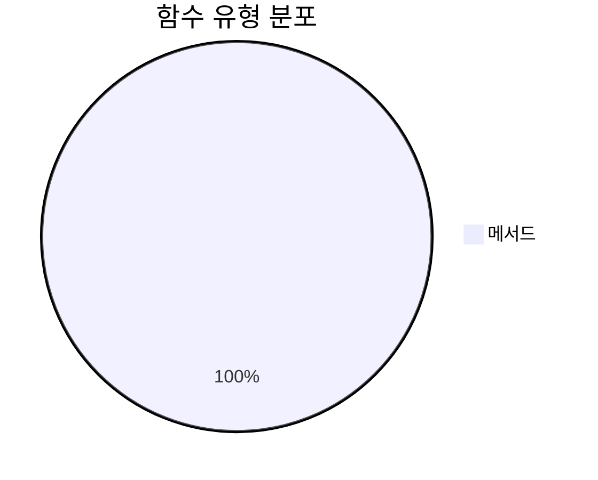
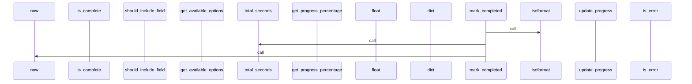
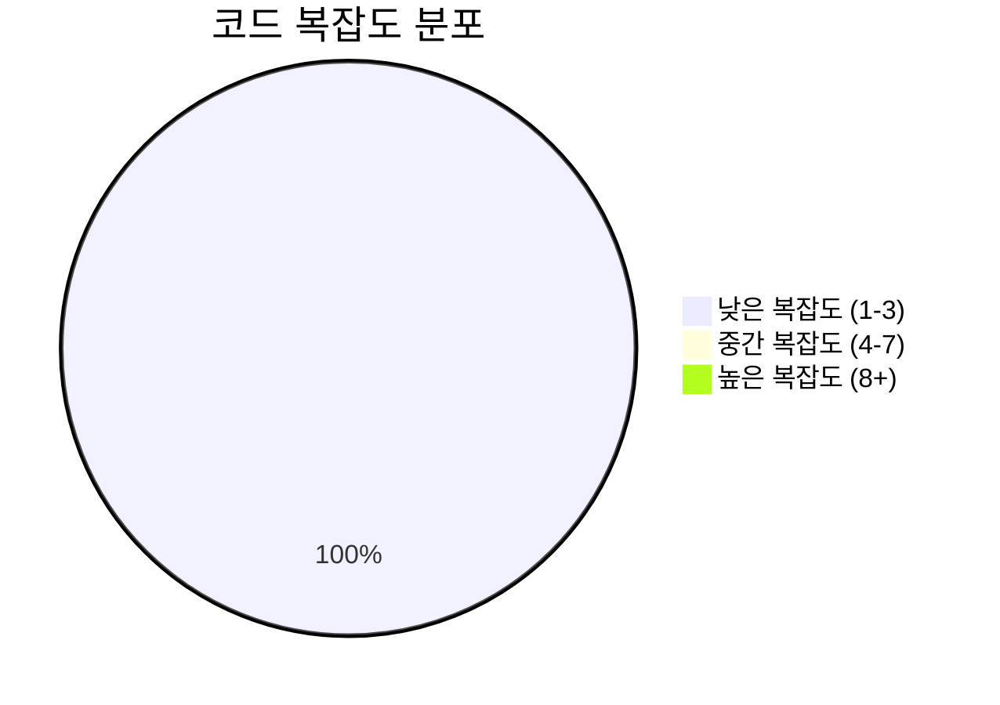

# 📄 stream_models.py

> **파일 경로**: `rule_analyzer/streaming/stream_models.py`  
> **생성일**: 2025-09-26  
> **Chunk 수**: 21개

---

## 📑 목차

### 🏗️ 클래스
- [`ChunkType`](#class-chunktype) - 복잡도: 0
- [`StreamingStatus`](#class-streamingstatus) - 복잡도: 0
- [`StreamingChunk`](#class-streamingchunk) - 복잡도: 0
- [`StreamingOptions`](#class-streamingoptions) - 복잡도: 0
- [`StreamingSession`](#class-streamingsession) - 복잡도: 0


## 📋 파일 개요

| | |
|--|--|
| 📦 **의존성**: `typing` • `pydantic` • `enum` • `datetime` | ⚡ **총 복잡도**: 19 |
| 📊 **총 토큰 수**: 2,704 |  |


## 🏗️ 클래스

### <a id="class-chunktype"></a>🎯 `ChunkType`


> 📝 **클래스 설명**  
> 스트리밍 청크 타입

| 속성 | 값 |
|------|----|
| 🧬 상속 | `str → Enum` |


<details>
<summary>🔍 코드 미리보기</summary>

```python
class ChunkType(str, Enum):
    """스트리밍 청크 타입"""

    ANALYSIS_TEXT = "analysis_text"  # 분석 텍스트
    ANALYSIS_PROGRESS = "analysis_progress"  # 진행률 업데이트
    ANALYSIS_COMPLETE = "analysis_complete"  # 분석 완료
    ANALYSIS_ERROR = "analysis_error"  # 분석 에러
    METADATA = "metadata"  # 메타데이터
    HEARTBEAT = "heartbeat"  # 연결 유지 신호


class StreamingStatus(str, Enum):...
```

**Chunk 정보**
- 🆔 **ID**: `4c1b6e8fcc08`
- 📍 **라인**: 14-24
- 📊 **토큰**: 141
- 🏷️ **태그**: `class, enum`

</details>

---

### <a id="class-streamingstatus"></a>🎯 `StreamingStatus`


> 📝 **클래스 설명**  
> 스트리밍 상태

| 속성 | 값 |
|------|----|
| 🧬 상속 | `str → Enum` |


<details>
<summary>🔍 코드 미리보기</summary>

```python
class StreamingStatus(str, Enum):
    """스트리밍 상태"""

    INITIALIZING = "initializing"  # 초기화 중
    STREAMING = "streaming"  # 스트리밍 중
    PAUSED = "paused"  # 일시정지
    COMPLETED = "completed"  # 완료
    ERROR = "error"  # 에러
    CANCELLED = "cancelled"  # 취소됨


class StreamingChunk(BaseModel):...
```

**Chunk 정보**
- 🆔 **ID**: `414fc4d38932`
- 📍 **라인**: 25-35
- 📊 **토큰**: 109
- 🏷️ **태그**: `class, enum`

</details>

---

### <a id="class-streamingchunk"></a>🎯 `StreamingChunk`

 

> 📝 **클래스 설명**  
> 스트리밍 청크 모델

스트리밍으로 전송되는 각 데이터 단위를 나타냅니다.

| 속성 | 값 |
|------|----|
| 🧬 상속 | `BaseModel` |


#### 📋 메서드 목록

| 메서드 | 타입 | 복잡도 | 설명 |
|--------|------|--------|------|
| `get_progress_percentage` | public | 1 | 진행률을 퍼센트로 반환 |
| `is_complete` | public | 1 | 분석 완료 여부 확인 |
| `is_error` | public | 1 | 에러 여부 확인 |
| `is_progress_update` | public | 1 | 진행률 업데이트 여부 확인 |
| `to_dict` | public | 1 | 딕셔너리로 변환 |


#### 🔧 메서드 상세

##### `is_complete`
| 속성 | 값 |
|------|----|
| ⚡ 복잡도 | 1 |
| 📊 토큰 수 | 32 |
| 📍 라인 범위 | 76-78 |
- **Signature**: `is_complete(self) -> bool`- **Parameters**: `self`- **Returns**: `bool`
---
##### `is_error`
| 속성 | 값 |
|------|----|
| ⚡ 복잡도 | 1 |
| 📊 토큰 수 | 28 |
| 📍 라인 범위 | 80-82 |
- **Signature**: `is_error(self) -> bool`- **Parameters**: `self`- **Returns**: `bool`
---
##### `is_progress_update`
| 속성 | 값 |
|------|----|
| ⚡ 복잡도 | 1 |
| 📊 토큰 수 | 37 |
| 📍 라인 범위 | 84-86 |
- **Signature**: `is_progress_update(self) -> bool`- **Parameters**: `self`- **Returns**: `bool`
---
##### `get_progress_percentage`
| 속성 | 값 |
|------|----|
| ⚡ 복잡도 | 1 |
| 📊 토큰 수 | 36 |
| 📍 라인 범위 | 88-90 |
- **Signature**: `get_progress_percentage(self) -> int`- **Parameters**: `self`- **Returns**: `int`
- **Calls**: `int`---
##### `to_dict`
| 속성 | 값 |
|------|----|
| ⚡ 복잡도 | 1 |
| 📊 토큰 수 | 30 |
| 📍 라인 범위 | 92-94 |
- **Signature**: `to_dict(self) -> Dict[str, Any]`- **Parameters**: `self`- **Returns**: `Dict[str, Any]`
- **Calls**: `dict`---
<details>
<summary>🔍 코드 미리보기</summary>

```python
class StreamingChunk(BaseModel):
    """
    스트리밍 청크 모델

    스트리밍으로 전송되는 각 데이터 단위를 나타냅니다.
    """

    # 기본 정보
    type: ChunkType = Field(..., description="청크 타입")
    content: str = Field(..., description="실제 텍스트 내용")
    timestamp: str = Field(
        default_factory=lambda: datetime.now().isoformat(), description="타임스탬프"
    )

    # 진행률 정보
    progress: float = Field(
        default=0.0, ge=0.0, le=1.0, description="진행률 (0.0 ~ 1.0)"
    )

    # 메타데이터
    chunk_index: Optional[int] = Field(default=None, description="청크 인덱스 (순서)")

    total_chunks: Optional[int] = Field(default=None, description="전체 청크 수")

    # 추가 정보
    metadata: Optional[Dict[str, Any]] = Field(
        default_factory=dict, description="추가 메타데이터"
    )

    # 에러 정보 (에러 타입인 경우)
    error_code: Optional[str] = Fi...
```

**Chunk 정보**
- 🆔 **ID**: `273d892fb4b0`
- 📍 **라인**: 36-46
- 📊 **토큰**: 330
- 🏷️ **태그**: `class, pydantic`

</details>

---

### <a id="class-streamingoptions"></a>🎯 `StreamingOptions`

 

> 📝 **클래스 설명**  
> 스트리밍 옵션 모델

스트리밍 동작을 제어하는 옵션들을 정의합니다.

| 속성 | 값 |
|------|----|
| 🧬 상속 | `BaseModel` |


#### 📋 메서드 목록

| 메서드 | 타입 | 복잡도 | 설명 |
|--------|------|--------|------|
| `get_available_options` | public | 1 | 사용 가능한 스트리밍 옵션 정보 반환 |
| `get_effective_chunk_delay` | public | 3 | 실제 적용될 청크 딜레이 반환 |
| `should_include_field` | public | 1 | 특정 필드를 포함해야 하는지 확인 |


#### 🔧 메서드 상세

##### `get_effective_chunk_delay`
| 속성 | 값 |
|------|----|
| ⚡ 복잡도 | 3 |
| 📊 토큰 수 | 127 |
| 📍 라인 범위 | 183-196 |
- **Signature**: `get_effective_chunk_delay(self) -> float`- **Parameters**: `self`- **Returns**: `float`
- **Calls**: `isinstance`, `float`---
##### `get_available_options`
| 속성 | 값 |
|------|----|
| 🎨 데코레이터 | `classmethod` |
| ⚡ 복잡도 | 1 |
| 📊 토큰 수 | 325 |
| 📍 라인 범위 | 146-181 |
- **Signature**: `get_available_options(cls) -> Dict[str, Any]`- **Parameters**: `cls`- **Returns**: `Dict[str, Any]`
---
##### `should_include_field`
| 속성 | 값 |
|------|----|
| ⚡ 복잡도 | 1 |
| 📊 토큰 수 | 89 |
| 📍 라인 범위 | 198-213 |
- **Signature**: `should_include_field(self, field_name: str) -> bool`- **Parameters**: `self, field_name: str`- **Returns**: `bool`
- **Calls**: `get`---
<details>
<summary>🔍 코드 미리보기</summary>

```python
class StreamingOptions(BaseModel):
    """
    스트리밍 옵션 모델

    스트리밍 동작을 제어하는 옵션들을 정의합니다.
    """

    # 기본 스트리밍 옵션
    chunk_delay: float = Field(
        default=0.1, ge=0.01, le=2.0, description="청크 간 딜레이 (초)"
    )

    max_chunk_size: int = Field(
        default=1000, ge=100, le=10000, description="최대 청크 크기 (문자)"
    )

    include_progress: bool = Field(default=True, description="진행률 포함 여부")

    include_metadata: bool = Field(default=True, description="메타데이터 포함 여부")

    # 고급 옵션
    enable_heartbeat: bool = Field(default=True, description="하트비트 활성화 여부")

    heartbeat_interval: float = Field(
        default=30.0, ge=5.0, le=300.0, description="하트비트 간격 (초)"
    )

    # 에러 처리 옵션
    retry_on_error: bool = Field(default=True, description="에러 시 재시도 여부")

    max_retries: int = Field(d...
```

**Chunk 정보**
- 🆔 **ID**: `c947933c68bb`
- 📍 **라인**: 97-107
- 📊 **토큰**: 438
- 🏷️ **태그**: `class, pydantic`

</details>

---

### <a id="class-streamingsession"></a>🎯 `StreamingSession`

 

> 📝 **클래스 설명**  
> 스트리밍 세션 모델

스트리밍 세션의 상태와 정보를 관리합니다.

| 속성 | 값 |
|------|----|
| 🧬 상속 | `BaseModel` |


#### 📋 메서드 목록

| 메서드 | 타입 | 복잡도 | 설명 |
|--------|------|--------|------|
| `get_progress_percentage` | public | 1 | 진행률을 퍼센트로 반환 |
| `is_active` | public | 1 | 세션이 활성 상태인지 확인 |
| `is_completed` | public | 1 | 세션이 완료되었는지 확인 |
| `mark_completed` | public | 2 | 세션을 완료 상태로 표시 |
| `mark_error` | public | 1 | 세션을 에러 상태로 표시 |
| `to_summary` | public | 1 | 세션 요약 정보 반환 |
| `update_progress` | public | 2 | 진행률 업데이트 |


#### 🔧 메서드 상세

##### `update_progress`
| 속성 | 값 |
|------|----|
| ⚡ 복잡도 | 2 |
| 📊 토큰 수 | 110 |
| 📍 라인 범위 | 277-290 |
- **Signature**: `update_progress(self, sent_chunks: int, total_chunks: int) -> None`- **Parameters**: `self, sent_chunks: int, total_chunks: int`- **Returns**: `None`
---
##### `mark_completed`
| 속성 | 값 |
|------|----|
| ⚡ 복잡도 | 2 |
| 📊 토큰 수 | 89 |
| 📍 라인 범위 | 292-299 |
- **Signature**: `mark_completed(self) -> None`- **Parameters**: `self`- **Returns**: `None`
- **Calls**: `isoformat`, `fromisoformat`, `total_seconds`, `now`---
##### `is_active`
| 속성 | 값 |
|------|----|
| ⚡ 복잡도 | 1 |
| 📊 토큰 수 | 42 |
| 📍 라인 범위 | 261-263 |
- **Signature**: `is_active(self) -> bool`- **Parameters**: `self`- **Returns**: `bool`
---
##### `is_completed`
| 속성 | 값 |
|------|----|
| ⚡ 복잡도 | 1 |
| 📊 토큰 수 | 50 |
| 📍 라인 범위 | 265-271 |
- **Signature**: `is_completed(self) -> bool`- **Parameters**: `self`- **Returns**: `bool`
---
##### `get_progress_percentage`
| 속성 | 값 |
|------|----|
| ⚡ 복잡도 | 1 |
| 📊 토큰 수 | 37 |
| 📍 라인 범위 | 273-275 |
- **Signature**: `get_progress_percentage(self) -> int`- **Parameters**: `self`- **Returns**: `int`
- **Calls**: `int`---
##### `mark_error`
| 속성 | 값 |
|------|----|
| ⚡ 복잡도 | 1 |
| 📊 토큰 수 | 80 |
| 📍 라인 범위 | 301-311 |
- **Signature**: `mark_error(self, error_message: str) -> None`- **Parameters**: `self, error_message: str`- **Returns**: `None`
- **Calls**: `isoformat`, `now`---
##### `to_summary`
| 속성 | 값 |
|------|----|
| ⚡ 복잡도 | 1 |
| 📊 토큰 수 | 109 |
| 📍 라인 범위 | 313-328 |
- **Signature**: `to_summary(self) -> Dict[str, Any]`- **Parameters**: `self`- **Returns**: `Dict[str, Any]`
- **Calls**: `get_progress_percentage`---
<details>
<summary>🔍 코드 미리보기</summary>

```python
class StreamingSession(BaseModel):
    """
    스트리밍 세션 모델

    스트리밍 세션의 상태와 정보를 관리합니다.
    """

    # 세션 정보
    session_id: str = Field(..., description="세션 고유 ID")
    created_at: str = Field(
        default_factory=lambda: datetime.now().isoformat(), description="생성 시간"
    )

    # 상태 정보
    status: StreamingStatus = Field(
        default=StreamingStatus.INITIALIZING, description="스트리밍 상태"
    )

    # 진행 정보
    total_chunks: int = Field(default=0, description="전체 청크 수")
    sent_chunks: int = Field(default=0, description="전송된 청크 수")
    current_progress: float = Field(default=0.0, description="현재 진행률")

    # 성능 정보
    start_time: Optional[str] = Field(default=None, description="시작 시간")
    end_time: Optional[str] = Field(default=None, description="종료 시간")
    total_duration: Optiona...
```

**Chunk 정보**
- 🆔 **ID**: `de514ed1a734`
- 📍 **라인**: 216-226
- 📊 **토큰**: 377
- 🏷️ **태그**: `class, pydantic`

</details>

---


## 📊 시각화 및 분석

### ⚡ 복잡도 분석



### 🔧 함수 유형 분석



### 🔗 호출 순서 (Sequence)




## 📈 퍼포먼스 메트릭스

### 📊 핵심 지표

| 🎯 메트릭 | 📊 값 | 🚦 상태 |
|-----------|-------|--------|
| **총 라인 수** | 198 | 🟡 보통 |
| **평균 복잡도** | 1.3 | 🟢 양호 |
| **최대 복잡도** | 3 | 🟢 양호 |
| **함수 밀도** | 71.4% | 🔴 주의 |


### 🎯 품질 점수




## 🧩 Chunk 요약

이 파일은 총 **21개의 chunk**로 구성되어 있으며, **2,704개의 토큰**을 포함합니다.

| 🧩 Chunk 타입 | 📊 개수 | ⚡ 평균 복잡도 | 📝 총 토큰 | 📈 비율 |
|---------------|--------|-------------|----------|--------|
| 📋 파일 개요 | 1 | 0.0 | 88 | 3.3% |
| 🏗️ 클래스 | 5 | 0.0 | 1,395 | 51.6% |
| 🔧 메서드 | 15 | 1.3 | 1,221 | 45.2% |

