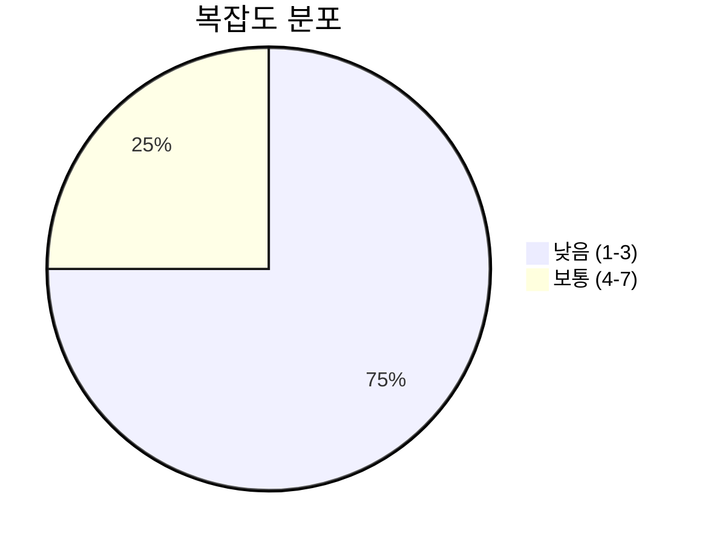
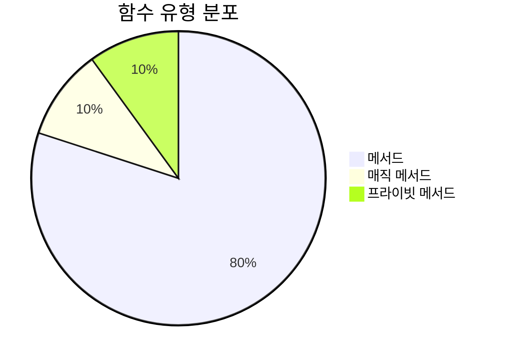
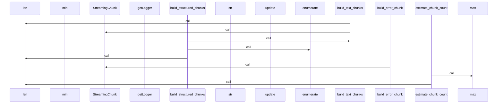
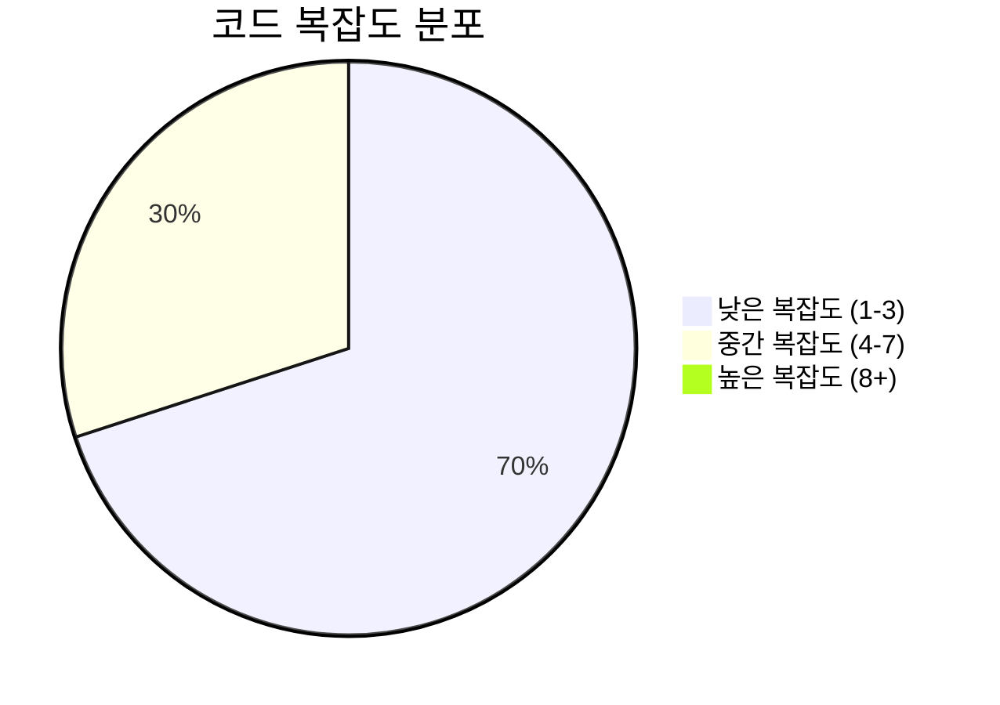

# 📄 chunk_builder.py

> **파일 경로**: `rule_analyzer/streaming/utils/chunk_builder.py`  
> **생성일**: 2025-10-13  
> **Chunk 수**: 12개

---

## 📑 목차

### 🏗️ 클래스
- [`ChunkBuilder`](#class-chunkbuilder) - 복잡도: 0


## 📋 파일 개요

| | |
|--|--|
| 📦 **의존성**: `stream_models` • `typing` • `logging` | ⚡ **총 복잡도**: 33 |
| 📊 **총 토큰 수**: 2,052 |  |


## 🏗️ 클래스

### <a id="class-chunkbuilder"></a>🎯 `ChunkBuilder`


> 📝 **클래스 설명**  
> 스트리밍 청크 구성 유틸리티

텍스트 데이터를 적절한 크기의 청크로 분할하고 구성합니다.

#### 📋 메서드 목록

| 메서드 | 타입 | 복잡도 | 설명 |
|--------|------|--------|------|
| `__init__` | magic | 1 | 청크 빌더 초기화 |
| `_dict_to_text` | private | 7 | 딕셔너리를 텍스트로 변환 |
| `build_completion_chunk` | public | 2 | 완료 청크 생성 |
| `build_error_chunk` | public | 1 | 에러 청크 생성 |
| `build_progress_chunk` | public | 2 | 진행률 청크 생성 |
| `build_structured_chunks` | public | 2 | 구조화된 데이터를 청크로 변환 |
| `build_text_chunks` | public | 7 | 텍스트를 청크로 분할 |
| `estimate_chunk_count` | public | 2 | 텍스트의 예상 청크 수 계산 |
| `merge_small_chunks` | public | 7 | 작은 청크들을 병합 |
| `optimize_chunk_size` | public | 2 | 최적의 청크 크기 계산 |


#### 🔧 메서드 상세

##### `build_text_chunks`
| 속성 | 값 |
|------|----|
| ⚡ 복잡도 | 7 |
| 📊 토큰 수 | 430 |
| 📍 라인 범위 | 30-93 |
- **Signature**: `build_text_chunks(self, text: str, chunk_type: ChunkType, metadata: Optional[Dict[str, Any]]) -> List[StreamingChunk]`- **Parameters**: `self, text: str, chunk_type: ChunkType, metadata: Optional[Dict[str, Any]]`- **Returns**: `List[StreamingChunk]`
- **Calls**: `split`, `len`, `StreamingChunk`, `append`, `join`---
##### `merge_small_chunks`
| 속성 | 값 |
|------|----|
| ⚡ 복잡도 | 7 |
| 📊 토큰 수 | 301 |
| 📍 라인 범위 | 191-231 |
- **Signature**: `merge_small_chunks(self, chunks: List[StreamingChunk], min_chunk_size: int) -> List[StreamingChunk]`- **Parameters**: `self, chunks: List[StreamingChunk], min_chunk_size: int`- **Returns**: `List[StreamingChunk]`
- **Calls**: `append`, `len`, `update`---
##### `_dict_to_text`
| 속성 | 값 |
|------|----|
| ⚡ 복잡도 | 7 |
| 📊 토큰 수 | 244 |
| 📍 라인 범위 | 233-264 |
- **Signature**: `_dict_to_text(self, data: Dict[str, Any], indent: int) -> str`- **Parameters**: `self, data: Dict[str, Any], indent: int`- **Returns**: `str`
- **Calls**: `items`, `join`, `isinstance`, `str`, `append`, `_dict_to_text`---
##### `build_structured_chunks`
| 속성 | 값 |
|------|----|
| ⚡ 복잡도 | 2 |
| 📊 토큰 수 | 187 |
| 📍 라인 범위 | 95-122 |
- **Signature**: `build_structured_chunks(self, data: Dict[str, Any], chunk_type: ChunkType) -> List[StreamingChunk]`- **Parameters**: `self, data: Dict[str, Any], chunk_type: ChunkType`- **Returns**: `List[StreamingChunk]`
- **Calls**: `_dict_to_text`, `build_text_chunks`, `enumerate`, `len`, `append`---
##### `build_progress_chunk`
| 속성 | 값 |
|------|----|
| ⚡ 복잡도 | 2 |
| 📊 토큰 수 | 145 |
| 📍 라인 범위 | 124-143 |
- **Signature**: `build_progress_chunk(self, progress: float, message: str) -> StreamingChunk`- **Parameters**: `self, progress: float, message: str`- **Returns**: `StreamingChunk`
- **Calls**: `StreamingChunk`, `int`---
##### `build_completion_chunk`
| 속성 | 값 |
|------|----|
| ⚡ 복잡도 | 2 |
| 📊 토큰 수 | 152 |
| 📍 라인 범위 | 145-168 |
- **Signature**: `build_completion_chunk(self, total_chunks: int, final_result: Optional[Dict[str, Any]]) -> StreamingChunk`- **Parameters**: `self, total_chunks: int, final_result: Optional[Dict[str, Any]]`- **Returns**: `StreamingChunk`
- **Calls**: `StreamingChunk`---
##### `estimate_chunk_count`
| 속성 | 값 |
|------|----|
| ⚡ 복잡도 | 2 |
| 📊 토큰 수 | 93 |
| 📍 라인 범위 | 266-279 |
- **Signature**: `estimate_chunk_count(self, text: str) -> int`- **Parameters**: `self, text: str`- **Returns**: `int`
- **Calls**: `max`, `len`---
##### `optimize_chunk_size`
| 속성 | 값 |
|------|----|
| ⚡ 복잡도 | 2 |
| 📊 토큰 수 | 155 |
| 📍 라인 범위 | 281-301 |
- **Signature**: `optimize_chunk_size(self, text_length: int, target_chunks: int) -> int`- **Parameters**: `self, text_length: int, target_chunks: int`- **Returns**: `int`
- **Calls**: `max`, `min`---
##### `__init__`
| 속성 | 값 |
|------|----|
| ⚡ 복잡도 | 1 |
| 📊 토큰 수 | 71 |
| 📍 라인 범위 | 20-28 |
- **Signature**: `__init__(self, max_chunk_size: int)`- **Parameters**: `self, max_chunk_size: int`- **Returns**: `N/A`
- **Calls**: `getLogger`---
##### `build_error_chunk`
| 속성 | 값 |
|------|----|
| ⚡ 복잡도 | 1 |
| 📊 토큰 수 | 122 |
| 📍 라인 범위 | 170-189 |
- **Signature**: `build_error_chunk(self, error_message: str, error_code: Optional[str]) -> StreamingChunk`- **Parameters**: `self, error_message: str, error_code: Optional[str]`- **Returns**: `StreamingChunk`
- **Calls**: `StreamingChunk`---
<details>
<summary>🔍 코드 미리보기</summary>

```python
class ChunkBuilder:
    """
    스트리밍 청크 구성 유틸리티

    텍스트 데이터를 적절한 크기의 청크로 분할하고 구성합니다.
    """

    def __init__(self, max_chunk_size: int = 1000):...
```

**Chunk 정보**
- 🆔 **ID**: `3db237f9ca86`
- 📍 **라인**: 13-23
- 📊 **토큰**: 74
- 🏷️ **태그**: `class`

</details>

---


## 📊 시각화 및 분석

### ⚡ 복잡도 분석



### 🔧 함수 유형 분석



### 🔗 호출 순서 (Sequence)




## 📈 퍼포먼스 메트릭스

### 📊 핵심 지표

| 🎯 메트릭 | 📊 값 | 🚦 상태 |
|-----------|-------|--------|
| **총 라인 수** | 284 | 🟡 보통 |
| **평균 복잡도** | 3.3 | 🟡 보통 |
| **최대 복잡도** | 7 | 🟢 양호 |
| **함수 밀도** | 83.3% | 🔴 주의 |


### 🎯 품질 점수




## 🧩 Chunk 요약

이 파일은 총 **12개의 chunk**로 구성되어 있으며, **2,052개의 토큰**을 포함합니다.

| 🧩 Chunk 타입 | 📊 개수 | ⚡ 평균 복잡도 | 📝 총 토큰 | 📈 비율 |
|---------------|--------|-------------|----------|--------|
| 📋 파일 개요 | 1 | 0.0 | 78 | 3.8% |
| 🏗️ 클래스 | 1 | 0.0 | 74 | 3.6% |
| 🔧 메서드 | 10 | 3.3 | 1,900 | 92.6% |

