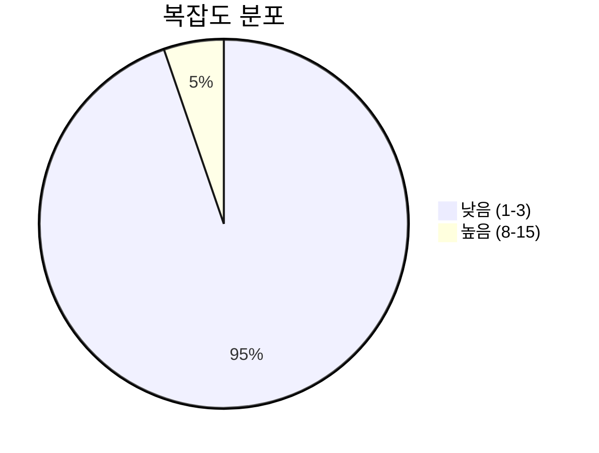
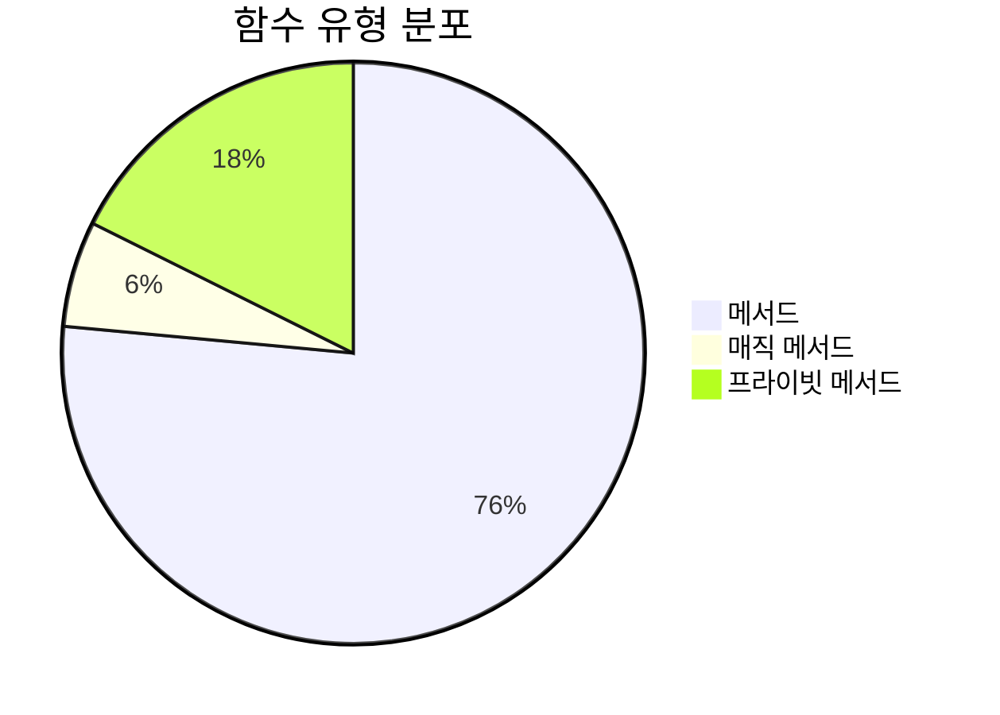
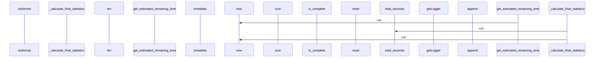
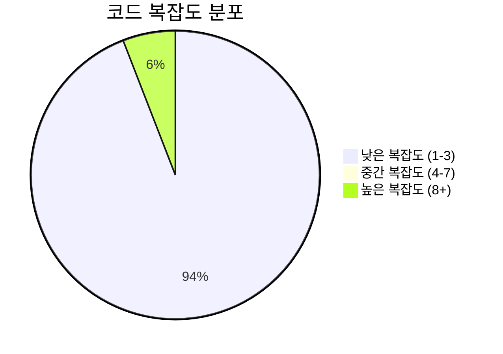

# 📄 progress_tracker.py

> **파일 경로**: `rule_analyzer/streaming/utils/progress_tracker.py`  
> **생성일**: 2025-10-01  
> **Chunk 수**: 19개

---

## 📑 목차

### 🏗️ 클래스
- [`ProgressTracker`](#class-progresstracker) - 복잡도: 0


## 📋 파일 개요

| | |
|--|--|
| 📦 **의존성**: `logging` • `stream_models` • `typing` • `datetime` | ⚡ **총 복잡도**: 34 |
| 📊 **총 토큰 수**: 2,417 |  |


## 🏗️ 클래스

### <a id="class-progresstracker"></a>🎯 `ProgressTracker`


> 📝 **클래스 설명**  
> 스트리밍 진행률 추적 유틸리티

스트리밍 진행 상황을 실시간으로 추적하고 통계를 제공합니다.

#### 📋 메서드 목록

| 메서드 | 타입 | 복잡도 | 설명 |
|--------|------|--------|------|
| `__init__` | magic | 1 | 진행률 추적기 초기화 |
| `_calculate_final_statistics` | private | 3 | 최종 통계 계산 |
| `_get_average_processing_time` | private | 2 | 평균 처리 시간 반환 |
| `_update_estimated_completion_time` | private | 3 | 예상 완료 시간 업데이트 |
| `get_current_progress` | public | 1 | 현재 진행률 반환 |
| `get_elapsed_time` | public | 2 | 경과 시간 반환 |
| `get_estimated_completion_time` | public | 1 | 예상 완료 시간 반환 |
| `get_estimated_remaining_time` | public | 2 | 예상 남은 시간 반환 |
| `get_processed_chunks` | public | 1 | 처리된 청크 수 반환 |
| `get_processing_speed` | public | 3 | 처리 속도 반환 (청크/초) |
| `get_progress_history` | public | 1 | 진행률 히스토리 반환 |
| `get_progress_percentage` | public | 1 | 현재 진행률을 퍼센트로 반환 |
| `get_progress_summary` | public | 1 | 진행률 요약 정보 반환 |
| `get_remaining_chunks` | public | 2 | 남은 청크 수 반환 |
| `reset` | public | 1 | 진행률 추적기 초기화 |
| `start_tracking` | public | 1 | 진행률 추적 시작 |
| `update_progress` | public | 8 | 진행률 업데이트 |


#### 🔧 메서드 상세

##### `update_progress`
| 속성 | 값 |
|------|----|
| ⚡ 복잡도 | 8 |
| 📊 토큰 수 | 503 |
| 📍 라인 범위 | 75-137 |
- **Signature**: `update_progress(self, chunk: StreamingChunk, auto_calculate_total: bool) -> None`- **Parameters**: `self, chunk: StreamingChunk, auto_calculate_total: bool`- **Returns**: `None`
- **Calls**: `now`, `append`, `is_complete`, `is_error`, `_update_estimated_completion_time`, `debug`, `warning`, `total_seconds`, `_calculate_final_statistics`, `isoformat`, `len`, `get_progress_percentage`---
##### `get_processing_speed`
| 속성 | 값 |
|------|----|
| ⚡ 복잡도 | 3 |
| 📊 토큰 수 | 122 |
| 📍 라인 범위 | 210-227 |
- **Signature**: `get_processing_speed(self) -> Optional[float]`- **Parameters**: `self`- **Returns**: `Optional[float]`
- **Calls**: `sum`, `len`---
##### `_calculate_final_statistics`
| 속성 | 값 |
|------|----|
| ⚡ 복잡도 | 3 |
| 📊 토큰 수 | 149 |
| 📍 라인 범위 | 292-306 |
- **Signature**: `_calculate_final_statistics(self) -> None`- **Parameters**: `self`- **Returns**: `None`
- **Calls**: `total_seconds`, `now`, `info`---
##### `_update_estimated_completion_time`
| 속성 | 값 |
|------|----|
| ⚡ 복잡도 | 3 |
| 📊 토큰 수 | 147 |
| 📍 라인 범위 | 308-323 |
- **Signature**: `_update_estimated_completion_time(self) -> None`- **Parameters**: `self`- **Returns**: `None`
- **Calls**: `total_seconds`, `now`, `timedelta`---
##### `get_remaining_chunks`
| 속성 | 값 |
|------|----|
| ⚡ 복잡도 | 2 |
| 📊 토큰 수 | 65 |
| 📍 라인 범위 | 166-175 |
- **Signature**: `get_remaining_chunks(self) -> int`- **Parameters**: `self`- **Returns**: `int`
- **Calls**: `max`---
##### `get_elapsed_time`
| 속성 | 값 |
|------|----|
| ⚡ 복잡도 | 2 |
| 📊 토큰 수 | 58 |
| 📍 라인 범위 | 177-187 |
- **Signature**: `get_elapsed_time(self) -> Optional[timedelta]`- **Parameters**: `self`- **Returns**: `Optional[timedelta]`
- **Calls**: `now`---
##### `get_estimated_remaining_time`
| 속성 | 값 |
|------|----|
| ⚡ 복잡도 | 2 |
| 📊 토큰 수 | 70 |
| 📍 라인 범위 | 198-208 |
- **Signature**: `get_estimated_remaining_time(self) -> Optional[timedelta]`- **Parameters**: `self`- **Returns**: `Optional[timedelta]`
- **Calls**: `now`---
##### `_get_average_processing_time`
| 속성 | 값 |
|------|----|
| ⚡ 복잡도 | 2 |
| 📊 토큰 수 | 52 |
| 📍 라인 범위 | 325-330 |
- **Signature**: `_get_average_processing_time(self) -> Optional[float]`- **Parameters**: `self`- **Returns**: `Optional[float]`
- **Calls**: `sum`, `len`---
##### `__init__`
| 속성 | 값 |
|------|----|
| ⚡ 복잡도 | 1 |
| 📊 토큰 수 | 216 |
| 📍 라인 범위 | 22-46 |
- **Signature**: `__init__(self)`- **Parameters**: `self`- **Returns**: `N/A`
- **Calls**: `getLogger`---
##### `start_tracking`
| 속성 | 값 |
|------|----|
| ⚡ 복잡도 | 1 |
| 📊 토큰 수 | 203 |
| 📍 라인 범위 | 48-73 |
- **Signature**: `start_tracking(self, total_chunks: int) -> None`- **Parameters**: `self, total_chunks: int`- **Returns**: `None`
- **Calls**: `now`, `info`, `isoformat`---
##### `get_current_progress`
| 속성 | 값 |
|------|----|
| ⚡ 복잡도 | 1 |
| 📊 토큰 수 | 50 |
| 📍 라인 범위 | 139-146 |
- **Signature**: `get_current_progress(self) -> float`- **Parameters**: `self`- **Returns**: `float`
---
##### `get_progress_percentage`
| 속성 | 값 |
|------|----|
| ⚡ 복잡도 | 1 |
| 📊 토큰 수 | 65 |
| 📍 라인 범위 | 148-155 |
- **Signature**: `get_progress_percentage(self) -> int`- **Parameters**: `self`- **Returns**: `int`
- **Calls**: `int`---
##### `get_processed_chunks`
| 속성 | 값 |
|------|----|
| ⚡ 복잡도 | 1 |
| 📊 토큰 수 | 40 |
| 📍 라인 범위 | 157-164 |
- **Signature**: `get_processed_chunks(self) -> int`- **Parameters**: `self`- **Returns**: `int`
---
##### `get_estimated_completion_time`
| 속성 | 값 |
|------|----|
| ⚡ 복잡도 | 1 |
| 📊 토큰 수 | 52 |
| 📍 라인 범위 | 189-196 |
- **Signature**: `get_estimated_completion_time(self) -> Optional[datetime]`- **Parameters**: `self`- **Returns**: `Optional[datetime]`
---
##### `get_progress_summary`
| 속성 | 값 |
|------|----|
| ⚡ 복잡도 | 1 |
| 📊 토큰 수 | 272 |
| 📍 라인 범위 | 229-264 |
- **Signature**: `get_progress_summary(self) -> Dict[str, Any]`- **Parameters**: `self`- **Returns**: `Dict[str, Any]`
- **Calls**: `get_elapsed_time`, `get_estimated_completion_time`, `get_estimated_remaining_time`, `get_processing_speed`, `get_progress_percentage`, `get_remaining_chunks`, `_get_average_processing_time`, `total_seconds`, `isoformat`---
##### `get_progress_history`
| 속성 | 값 |
|------|----|
| ⚡ 복잡도 | 1 |
| 📊 토큰 수 | 63 |
| 📍 라인 범위 | 266-273 |
- **Signature**: `get_progress_history(self) -> List[Dict[str, Any]]`- **Parameters**: `self`- **Returns**: `List[Dict[str, Any]]`
- **Calls**: `copy`---
##### `reset`
| 속성 | 값 |
|------|----|
| ⚡ 복잡도 | 1 |
| 📊 토큰 수 | 132 |
| 📍 라인 범위 | 275-290 |
- **Signature**: `reset(self) -> None`- **Parameters**: `self`- **Returns**: `None`
- **Calls**: `info`---
<details>
<summary>🔍 코드 미리보기</summary>

```python
class ProgressTracker:
    """
    스트리밍 진행률 추적 유틸리티

    스트리밍 진행 상황을 실시간으로 추적하고 통계를 제공합니다.
    """

    def __init__(self):...
```

**Chunk 정보**
- 🆔 **ID**: `1d7ed745cc88`
- 📍 **라인**: 15-25
- 📊 **토큰**: 72
- 🏷️ **태그**: `class`

</details>

---


## 📊 시각화 및 분석

### ⚡ 복잡도 분석



### 🔧 함수 유형 분석



### 🔗 호출 순서 (Sequence)




## 📈 퍼포먼스 메트릭스

### 📊 핵심 지표

| 🎯 메트릭 | 📊 값 | 🚦 상태 |
|-----------|-------|--------|
| **총 라인 수** | 304 | 🟡 보통 |
| **평균 복잡도** | 2.0 | 🟢 양호 |
| **최대 복잡도** | 8 | 🟢 양호 |
| **함수 밀도** | 89.5% | 🔴 주의 |


### 🎯 품질 점수




## 🧩 Chunk 요약

이 파일은 총 **19개의 chunk**로 구성되어 있으며, **2,417개의 토큰**을 포함합니다.

| 🧩 Chunk 타입 | 📊 개수 | ⚡ 평균 복잡도 | 📝 총 토큰 | 📈 비율 |
|---------------|--------|-------------|----------|--------|
| 📋 파일 개요 | 1 | 0.0 | 86 | 3.6% |
| 🏗️ 클래스 | 1 | 0.0 | 72 | 3.0% |
| 🔧 메서드 | 17 | 2.0 | 2,259 | 93.5% |

